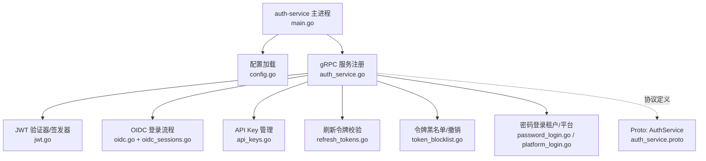
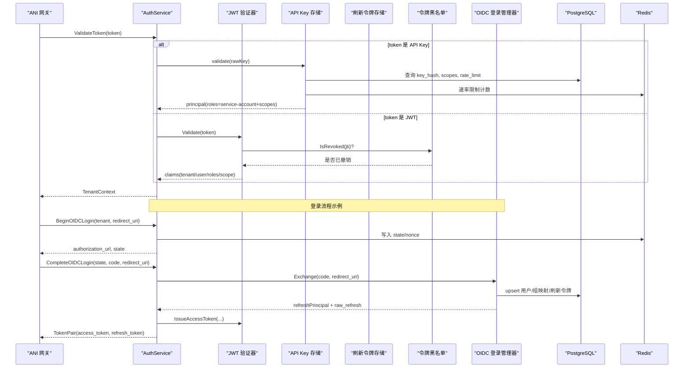
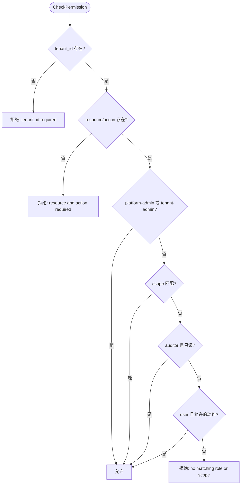
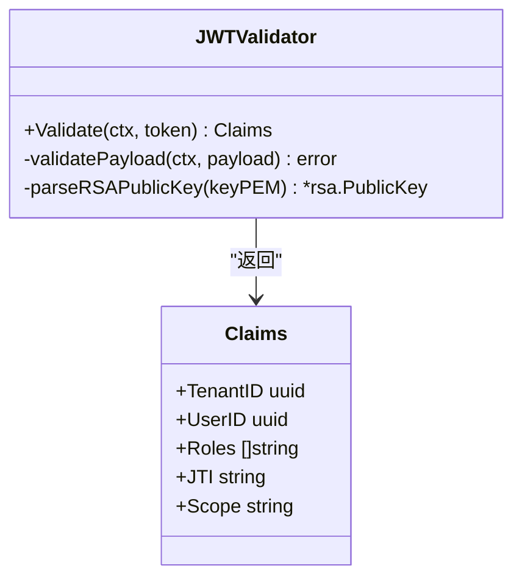
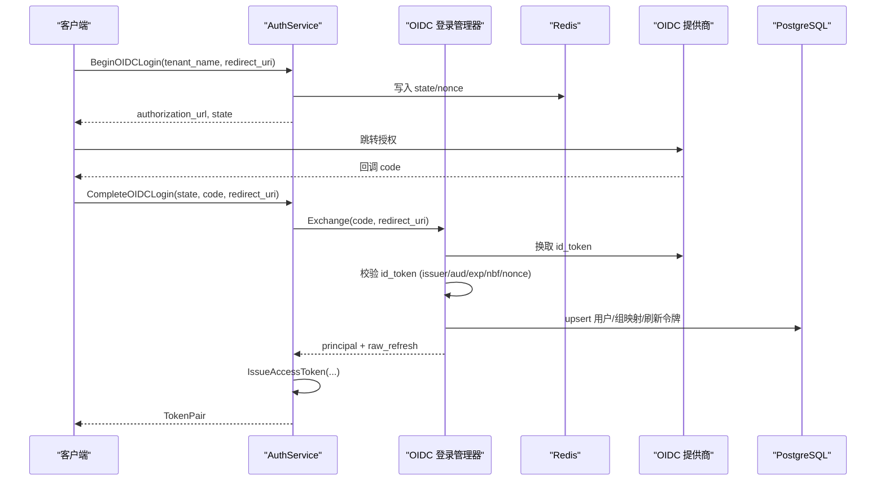
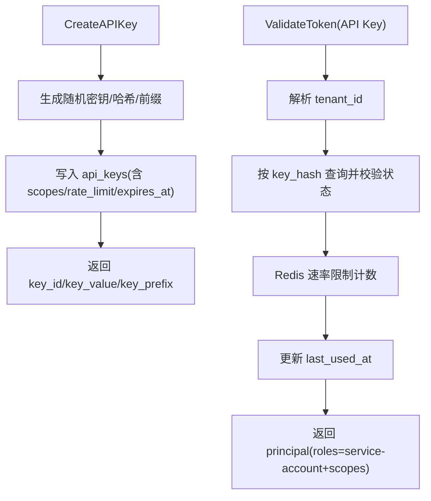
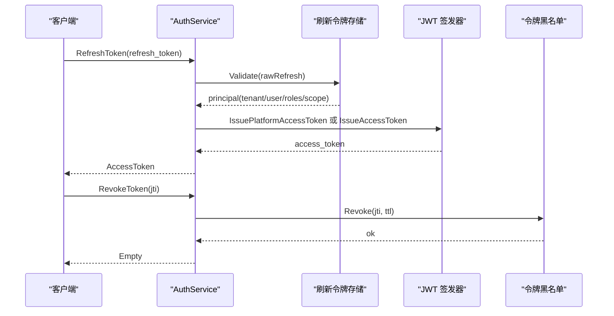
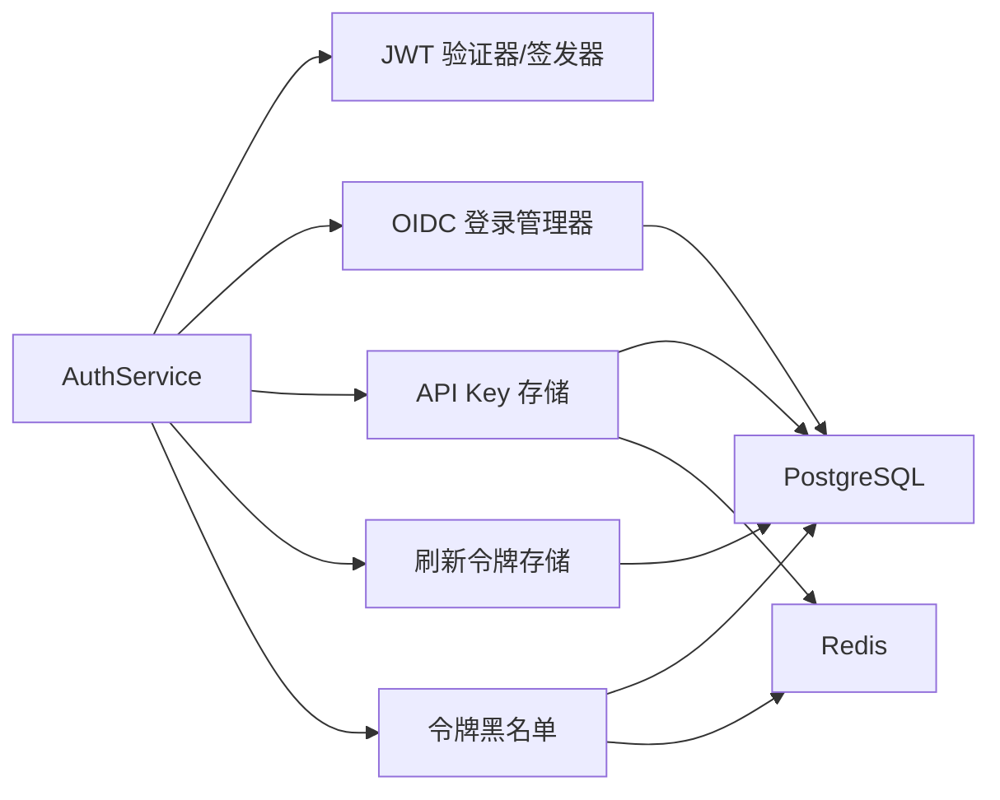

# 认证授权服务

<cite>
**本文引用的文件**
- [services/auth-service/main.go](file://services/auth-service/main.go)
- [services/auth-service/internal/config/config.go](file://services/auth-service/internal/config/config.go)
- [services/auth-service/internal/service/auth_service.go](file://services/auth-service/internal/service/auth_service.go)
- [services/auth-service/internal/service/jwt.go](file://services/auth-service/internal/service/jwt.go)
- [services/auth-service/internal/service/oidc.go](file://services/auth-service/internal/service/oidc.go)
- [services/auth-service/internal/service/api_keys.go](file://services/auth-service/internal/service/api_keys.go)
- [services/auth-service/internal/service/token_blocklist.go](file://services/auth-service/internal/service/token_blocklist.go)
- [services/auth-service/internal/service/refresh_tokens.go](file://services/auth-service/internal/service/refresh_tokens.go)
- [services/auth-service/internal/service/password_login.go](file://services/auth-service/internal/service/password_login.go)
- [services/auth-service/internal/service/platform_login.go](file://services/auth-service/internal/service/platform_login.go)
- [services/auth-service/internal/service/oidc_sessions.go](file://services/auth-service/internal/service/oidc_sessions.go)
- [api/proto/auth/v1/auth_service.proto](file://api/proto/auth/v1/auth_service.proto)
</cite>

## 目录
1. [简介](#简介)
2. [项目结构](#项目结构)
3. [核心组件](#核心组件)
4. [架构总览](#架构总览)
5. [详细组件分析](#详细组件分析)
6. [依赖关系分析](#依赖关系分析)
7. [性能考虑](#性能考虑)
8. [故障排查指南](#故障排查指南)
9. [结论](#结论)
10. [附录：API 与安全最佳实践](#附录api-与安全最佳实践)

## 简介
本文件面向 ANI 平台的认证授权服务，系统性说明多租户认证、JWT Token 管理、OIDC 集成、API Key 管理、RBAC 权限控制、会话与刷新令牌机制、令牌撤销与黑名单管理等安全能力。文档同时给出配置项、扩展点、外部身份提供商集成方式、典型 API 调用流程与安全最佳实践，帮助读者快速理解并正确使用该服务。

## 项目结构
认证授权服务以 gRPC 形式对外暴露能力，入口为 auth-service 的 main.go；内部按职责拆分为配置、服务编排、JWT、OIDC、API Key、刷新令牌、令牌黑名单等模块；协议定义位于 proto 文件。

**图表来源**
- [services/auth-service/main.go:9-31](file://services/auth-service/main.go#L9-L31)
- [services/auth-service/internal/config/config.go:10-53](file://services/auth-service/internal/config/config.go#L10-L53)
- [services/auth-service/internal/service/auth_service.go:21-57](file://services/auth-service/internal/service/auth_service.go#L21-L57)
- [api/proto/auth/v1/auth_service.proto:11-30](file://api/proto/auth/v1/auth_service.proto#L11-L30)

**章节来源**
- [services/auth-service/main.go:9-31](file://services/auth-service/main.go#L9-L31)
- [services/auth-service/internal/config/config.go:10-53](file://services/auth-service/internal/config/config.go#L10-L53)
- [api/proto/auth/v1/auth_service.proto:11-30](file://api/proto/auth/v1/auth_service.proto#L11-L30)

## 核心组件
- 服务编排层：AuthService 聚合 JWT、OIDC、API Key、刷新令牌、黑名单、密码登录等子管理器，统一对外提供 gRPC 接口。
- JWT 子系统：负责访问令牌的签发与校验，支持 RS256 签名、颁发者校验、过期时间、JTI 黑名单检查。
- OIDC 子系统：实现 Authorization Code 流程、state/nonce 安全存储、ID Token 校验（静态公钥或 JWKS）、组到角色映射、会话创建与刷新令牌持久化。
- API Key 子系统：生成、哈希存储、限流、作用域校验、列出与吊销。
- 刷新令牌子系统：基于数据库的刷新令牌校验与续期，区分平台与租户 scope。
- 令牌黑名单：Redis 缓存 + PostgreSQL 持久化的可撤销令牌集合。
- 密码登录：租户本地用户与平台管理员两种登录路径，均返回 TokenPair。

**章节来源**
- [services/auth-service/internal/service/auth_service.go:21-57](file://services/auth-service/internal/service/auth_service.go#L21-L57)
- [services/auth-service/internal/service/jwt.go:21-51](file://services/auth-service/internal/service/jwt.go#L21-L51)
- [services/auth-service/internal/service/oidc.go:28-77](file://services/auth-service/internal/service/oidc.go#L28-L77)
- [services/auth-service/internal/service/api_keys.go:31-44](file://services/auth-service/internal/service/api_keys.go#L31-L44)
- [services/auth-service/internal/service/refresh_tokens.go:19-38](file://services/auth-service/internal/service/refresh_tokens.go#L19-L38)
- [services/auth-service/internal/service/token_blocklist.go:14-27](file://services/auth-service/internal/service/token_blocklist.go#L14-L27)
- [services/auth-service/internal/service/password_login.go:16-30](file://services/auth-service/internal/service/password_login.go#L16-L30)
- [services/auth-service/internal/service/platform_login.go:15-35](file://services/auth-service/internal/service/platform_login.go#L15-L35)

## 架构总览
下图展示请求从网关进入后，如何经由 AuthService 路由至各子系统进行鉴权与授权，以及关键数据流向。

**图表来源**
- [services/auth-service/internal/service/auth_service.go:123-159](file://services/auth-service/internal/service/auth_service.go#L123-L159)
- [services/auth-service/internal/service/jwt.go:96-170](file://services/auth-service/internal/service/jwt.go#L96-L170)
- [services/auth-service/internal/service/token_blocklist.go:29-55](file://services/auth-service/internal/service/token_blocklist.go#L29-L55)
- [services/auth-service/internal/service/api_keys.go:223-269](file://services/auth-service/internal/service/api_keys.go#L223-L269)
- [services/auth-service/internal/service/oidc.go:101-195](file://services/auth-service/internal/service/oidc.go#L101-L195)
- [services/auth-service/internal/service/oidc_sessions.go:30-101](file://services/auth-service/internal/service/oidc_sessions.go#L30-L101)

## 详细组件分析

### 服务编排与 RBAC
- 统一入口：AuthService 将不同认证路径（密码登录、OIDC、API Key、刷新令牌）与授权逻辑（CheckPermission）集中管理。
- RBAC 决策：
  - 平台/租户管理员直接放行。
  - 基于 role/scope 匹配资源与动作。
  - 审计员仅允许读操作。
  - 普通用户仅允许受限动作。
- 作用域匹配规则支持通配符与显式 scope 前缀。

**图表来源**
- [services/auth-service/internal/service/auth_service.go:161-187](file://services/auth-service/internal/service/auth_service.go#L161-L187)
- [services/auth-service/internal/service/auth_service.go:232-242](file://services/auth-service/internal/service/auth_service.go#L232-L242)
- [services/auth-service/internal/service/auth_service.go:261-277](file://services/auth-service/internal/service/auth_service.go#L261-L277)

**章节来源**
- [services/auth-service/internal/service/auth_service.go:161-187](file://services/auth-service/internal/service/auth_service.go#L161-L187)
- [services/auth-service/internal/service/auth_service.go:232-242](file://services/auth-service/internal/service/auth_service.go#L232-L242)
- [services/auth-service/internal/service/auth_service.go:261-277](file://services/auth-service/internal/service/auth_service.go#L261-L277)

### JWT 令牌管理
- 签发：使用 RSA 私钥签发 RS256 访问令牌，包含租户 ID、用户 ID、角色、作用域、JTI 等声明。
- 校验：解析头部与载荷，校验签名、颁发者、过期时间、nbf/iat，并检查 JTI 是否在黑名单中。
- 平台令牌：无租户 ID，作用域为 platform；租户令牌必须携带有效租户 ID。

**图表来源**
- [services/auth-service/internal/service/jwt.go:38-51](file://services/auth-service/internal/service/jwt.go#L38-L51)
- [services/auth-service/internal/service/jwt.go:96-170](file://services/auth-service/internal/service/jwt.go#L96-L170)
- [services/auth-service/internal/service/jwt.go:172-196](file://services/auth-service/internal/service/jwt.go#L172-L196)

**章节来源**
- [services/auth-service/internal/service/jwt.go:21-51](file://services/auth-service/internal/service/jwt.go#L21-L51)
- [services/auth-service/internal/service/jwt.go:96-170](file://services/auth-service/internal/service/jwt.go#L96-L170)

### OIDC 集成与会话管理
- 开始登录：生成 state 与 nonce，存入缓存，构造授权 URL。
- 完成登录：校验 state/redirect_uri，交换 code 获取 id_token，校验签名、issuer、audience、时间戳与 nonce，创建会话并持久化刷新令牌。
- 组到角色映射：通过 JSON 配置将 OIDC groups 映射为系统角色，默认角色为 user。
- 会话创建：upsert 用户、授予角色、插入刷新令牌，返回 principal 与原始刷新令牌。

**图表来源**
- [services/auth-service/internal/service/oidc.go:101-195](file://services/auth-service/internal/service/oidc.go#L101-L195)
- [services/auth-service/internal/service/oidc.go:270-312](file://services/auth-service/internal/service/oidc.go#L270-L312)
- [services/auth-service/internal/service/oidc.go:446-503](file://services/auth-service/internal/service/oidc.go#L446-L503)
- [services/auth-service/internal/service/oidc_sessions.go:30-101](file://services/auth-service/internal/service/oidc_sessions.go#L30-L101)

**章节来源**
- [services/auth-service/internal/service/oidc.go:28-77](file://services/auth-service/internal/service/oidc.go#L28-L77)
- [services/auth-service/internal/service/oidc.go:101-195](file://services/auth-service/internal/service/oidc.go#L101-L195)
- [services/auth-service/internal/service/oidc.go:333-367](file://services/auth-service/internal/service/oidc.go#L333-L367)
- [services/auth-service/internal/service/oidc.go:446-503](file://services/auth-service/internal/service/oidc.go#L446-L503)
- [services/auth-service/internal/service/oidc_sessions.go:30-101](file://services/auth-service/internal/service/oidc_sessions.go#L30-L101)

### API Key 管理
- 创建：生成随机密钥，计算哈希与可见前缀，设置作用域与速率限制，写入数据库。
- 校验：解析租户 ID，查找哈希记录，执行速率限制，更新最后使用时间。
- 列表/吊销：按租户维度查询与标记吊销。
- 作用域规范：支持 scope:resource:action 格式，去重与合法性校验。

**图表来源**
- [services/auth-service/internal/service/api_keys.go:46-119](file://services/auth-service/internal/service/api_keys.go#L46-L119)
- [services/auth-service/internal/service/api_keys.go:223-269](file://services/auth-service/internal/service/api_keys.go#L223-L269)
- [services/auth-service/internal/service/api_keys.go:306-318](file://services/auth-service/internal/service/api_keys.go#L306-L318)
- [services/auth-service/internal/service/api_keys.go:320-351](file://services/auth-service/internal/service/api_keys.go#L320-L351)
- [services/auth-service/internal/service/api_keys.go:353-409](file://services/auth-service/internal/service/api_keys.go#L353-L409)

**章节来源**
- [services/auth-service/internal/service/api_keys.go:46-119](file://services/auth-service/internal/service/api_keys.go#L46-L119)
- [services/auth-service/internal/service/api_keys.go:223-269](file://services/auth-service/internal/service/api_keys.go#L223-L269)
- [services/auth-service/internal/service/api_keys.go:306-318](file://services/auth-service/internal/service/api_keys.go#L306-L318)
- [services/auth-service/internal/service/api_keys.go:320-351](file://services/auth-service/internal/service/api_keys.go#L320-L351)
- [services/auth-service/internal/service/api_keys.go:353-409](file://services/auth-service/internal/service/api_keys.go#L353-L409)

### 刷新令牌与令牌撤销
- 刷新令牌：
  - 登录成功后持久化刷新令牌（哈希存储），支持租户与平台两类。
  - RefreshToken RPC 校验原始刷新令牌，根据 tenant_id 推断 scope，签发新的访问令牌。
- 令牌撤销与黑名单：
  - RevokeToken 将 jti 加入黑名单（Redis 缓存 + PostgreSQL 持久化）。
  - JWT 校验时检查 JTI 是否被撤销。

**图表来源**
- [services/auth-service/internal/service/auth_service.go:81-121](file://services/auth-service/internal/service/auth_service.go#L81-L121)
- [services/auth-service/internal/service/refresh_tokens.go:40-76](file://services/auth-service/internal/service/refresh_tokens.go#L40-L76)
- [services/auth-service/internal/service/token_blocklist.go:29-55](file://services/auth-service/internal/service/token_blocklist.go#L29-L55)

**章节来源**
- [services/auth-service/internal/service/auth_service.go:81-121](file://services/auth-service/internal/service/auth_service.go#L81-L121)
- [services/auth-service/internal/service/refresh_tokens.go:40-76](file://services/auth-service/internal/service/refresh_tokens.go#L40-L76)
- [services/auth-service/internal/service/token_blocklist.go:29-55](file://services/auth-service/internal/service/token_blocklist.go#L29-L55)

### 密码登录（租户与平台）
- 租户密码登录：校验租户、用户名、密码，加载角色，先签发访问令牌再持久化刷新令牌。
- 平台管理员登录：校验平台账号与密码，签发平台访问令牌并持久化刷新令牌。
- 安全要点：用户名禁止命名空间前缀；状态非 active 拒绝；密码使用 bcrypt 校验。

**章节来源**
- [services/auth-service/internal/service/password_login.go:32-92](file://services/auth-service/internal/service/password_login.go#L32-L92)
- [services/auth-service/internal/service/platform_login.go:37-88](file://services/auth-service/internal/service/platform_login.go#L37-L88)

## 依赖关系分析
- 外部依赖：
  - PostgreSQL：存储用户、角色、刷新令牌、API Key、令牌黑名单等。
  - Redis：缓存 OIDC state、令牌黑名单、API Key 速率限制。
  - NATS：服务间消息（由 bootstrap 注入，当前认证流程未直接依赖）。
- 内部耦合：
  - AuthService 强依赖各子管理器，但通过接口抽象降低耦合。
  - OIDC 与 JWT 共享 RS256 校验逻辑与时间处理。
  - 刷新令牌与黑名单在登录与撤销路径中协同工作。

**图表来源**
- [services/auth-service/internal/service/auth_service.go:21-57](file://services/auth-service/internal/service/auth_service.go#L21-L57)
- [services/auth-service/internal/service/token_blocklist.go:19-27](file://services/auth-service/internal/service/token_blocklist.go#L19-L27)
- [services/auth-service/internal/service/api_keys.go:31-44](file://services/auth-service/internal/service/api_keys.go#L31-L44)
- [services/auth-service/internal/service/refresh_tokens.go:32-38](file://services/auth-service/internal/service/refresh_tokens.go#L32-L38)

**章节来源**
- [services/auth-service/internal/service/auth_service.go:21-57](file://services/auth-service/internal/service/auth_service.go#L21-L57)
- [services/auth-service/internal/service/token_blocklist.go:19-27](file://services/auth-service/internal/service/token_blocklist.go#L19-L27)
- [services/auth-service/internal/service/api_keys.go:31-44](file://services/auth-service/internal/service/api_keys.go#L31-L44)
- [services/auth-service/internal/service/refresh_tokens.go:32-38](file://services/auth-service/internal/service/refresh_tokens.go#L32-L38)

## 性能考虑
- 令牌校验路径优先命中 Redis 黑名单缓存，减少数据库压力。
- OIDC JWKS 结果缓存，避免频繁拉取远端密钥集。
- API Key 速率限制使用 Redis 原子递增，毫秒级判定。
- 登录流程先签发访问令牌再进行数据库写操作，避免孤儿刷新令牌。
- 刷新令牌与黑名单采用哈希存储与 TTL 策略，降低存储膨胀风险。

[本节为通用性能建议，不直接分析具体文件]

## 故障排查指南
- 常见错误码与原因：
  - Unauthenticated：无效 JWT、无效 API Key、无效 OIDC state/code、刷新令牌无效。
  - InvalidArgument：缺少必要参数（如 tenant_name、username、password、jti、resource/action）。
  - FailedPrecondition：功能未配置（如 JWT 验证器、OIDC 登录、刷新令牌流、令牌撤销缓存）。
  - ResourceExhausted：API Key 速率限制超限。
  - Internal：签发访问令牌失败、黑名单写入失败等。
- 定位建议：
  - 检查环境变量配置是否完整（JWT/OIDC/数据库/缓存）。
  - 确认 OIDC 回调地址合法且与注册一致。
  - 核对 API Key 的作用域与速率限制配置。
  - 查看 Redis 与 PostgreSQL 的连接与权限。

**章节来源**
- [services/auth-service/internal/service/auth_service.go:59-121](file://services/auth-service/internal/service/auth_service.go#L59-L121)
- [services/auth-service/internal/service/auth_service.go:123-159](file://services/auth-service/internal/service/auth_service.go#L123-L159)
- [services/auth-service/internal/service/oidc.go:101-195](file://services/auth-service/internal/service/oidc.go#L101-L195)
- [services/auth-service/internal/service/api_keys.go:223-269](file://services/auth-service/internal/service/api_keys.go#L223-L269)

## 结论
认证授权服务通过模块化设计实现了多租户认证、JWT 生命周期管理、OIDC 集成、API Key 管理与 RBAC 权限控制，并提供刷新令牌与令牌撤销等安全特性。借助 Redis 与 PostgreSQL 的组合，系统在可用性与一致性之间取得平衡。生产部署时应严格配置 JWT/OIDC 参数、合理设置速率限制与作用域，并定期审计令牌与 API Key 的使用情况。

[本节为总结性内容，不直接分析具体文件]

## 附录：API 与安全最佳实践

### 主要 API 概览（gRPC）
- 登录与 OIDC：
  - Login：租户密码登录，返回 TokenPair。
  - PlatformPasswordLogin：平台管理员密码登录，返回 TokenPair。
  - BeginOIDCLogin：发起 OIDC 授权，返回授权 URL 与 state。
  - CompleteOIDCLogin：完成 OIDC 授权码交换，返回 TokenPair。
- 令牌管理：
  - RefreshToken：使用刷新令牌换取新的访问令牌。
  - RevokeToken：撤销指定 jti 的令牌。
- 鉴权辅助：
  - ValidateToken：网关中间件调用，返回租户上下文。
  - CheckPermission：RBAC 中间件调用，判断是否允许。
- API Key：
  - CreateAPIKey/ListAPIKeys/RevokeAPIKey：创建、列出、吊销 API Key。

**章节来源**
- [api/proto/auth/v1/auth_service.proto:11-30](file://api/proto/auth/v1/auth_service.proto#L11-L30)
- [api/proto/auth/v1/auth_service.proto:32-138](file://api/proto/auth/v1/auth_service.proto#L32-L138)

### 配置选项（环境变量）
- 基础连接：
  - DATABASE_URL、NATS_URL、REDIS_URL、GRPC_PORT、HEALTH_PORT、SERVICE_NAME
- JWT：
  - AUTH_JWT_PUBLIC_KEY_PEM / AUTH_JWT_PUBLIC_KEY_FILE
  - AUTH_JWT_PRIVATE_KEY_PEM / AUTH_JWT_PRIVATE_KEY_FILE
  - AUTH_JWT_ISSUER
- OIDC：
  - AUTH_OIDC_ISSUER_URL / AUTH_OIDC_AUTH_URL / AUTH_OIDC_TOKEN_URL / AUTH_OIDC_JWKS_URL
  - AUTH_OIDC_CLIENT_ID / AUTH_OIDC_CLIENT_SECRET
  - AUTH_OIDC_PUBLIC_KEY_PEM / AUTH_OIDC_PUBLIC_KEY_FILE
  - AUTH_OIDC_GROUP_ROLE_MAP_JSON

**章节来源**
- [services/auth-service/internal/config/config.go:10-53](file://services/auth-service/internal/config/config.go#L10-L53)

### 安全最佳实践
- 使用强私钥与合理的 TTL，定期轮换密钥。
- 严格校验 OIDC 回调地址与 state/nonce，防止 CSRF 与重放攻击。
- 最小权限原则：API Key 作用域精确到资源与动作；RBAC 使用最小必要角色。
- 启用令牌撤销与黑名单，及时处置泄露令牌。
- 对敏感配置（密钥、客户端密钥）进行机密管理，避免明文落地。
- 监控与审计：关注登录失败、速率限制、令牌撤销与 API Key 使用频率。

[本节为通用安全建议，不直接分析具体文件]