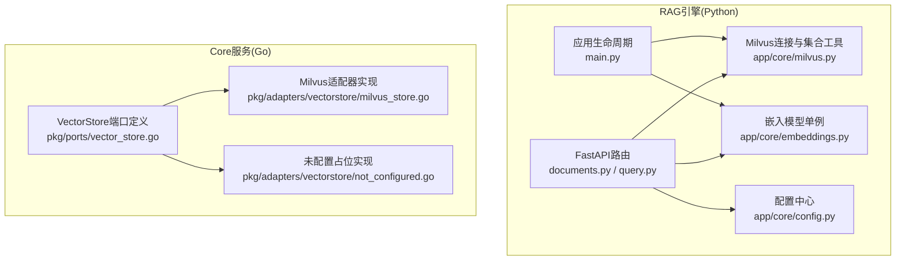
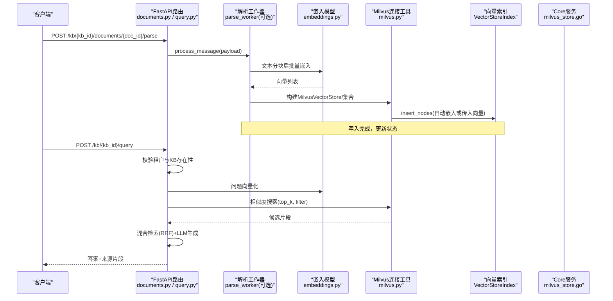
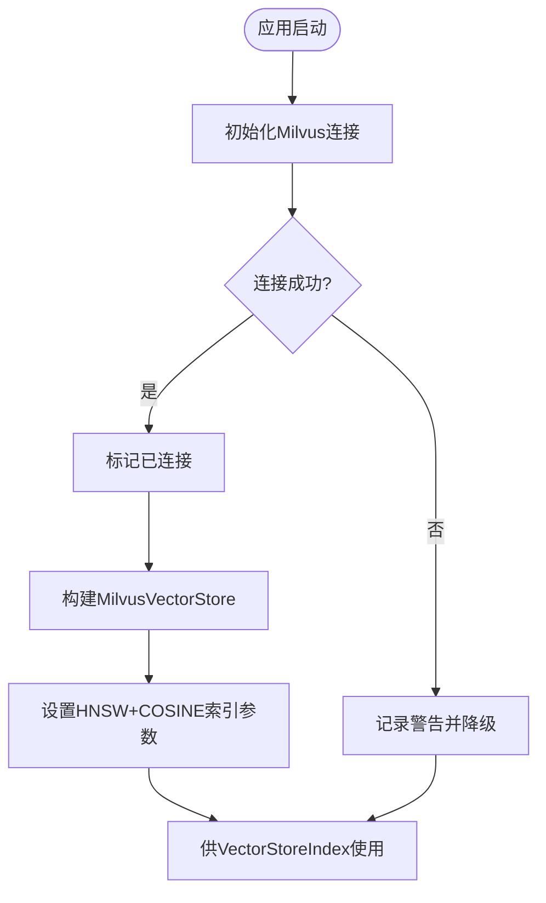
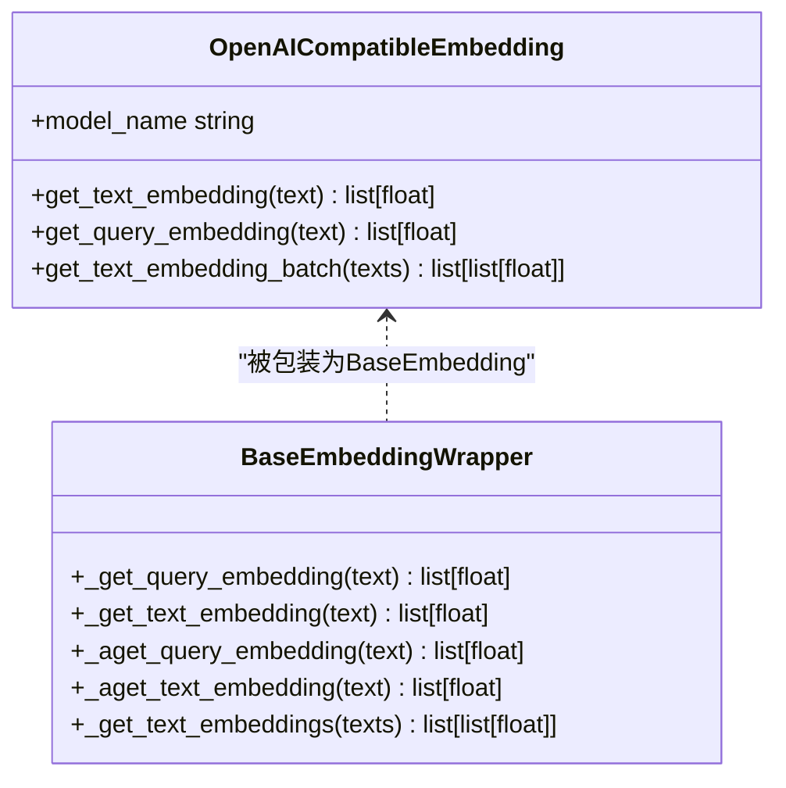
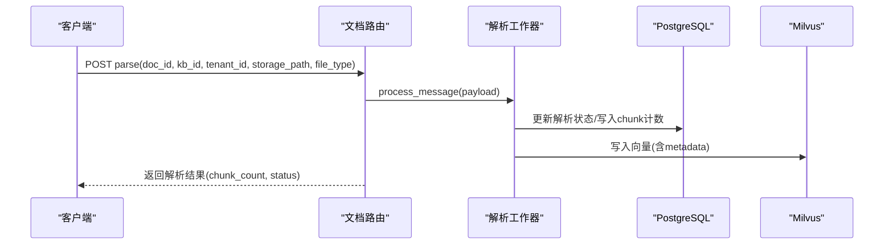
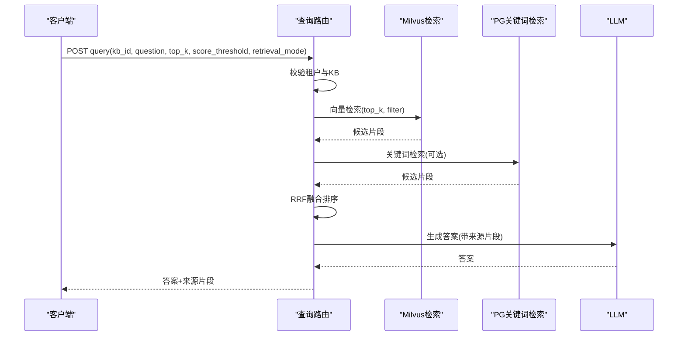
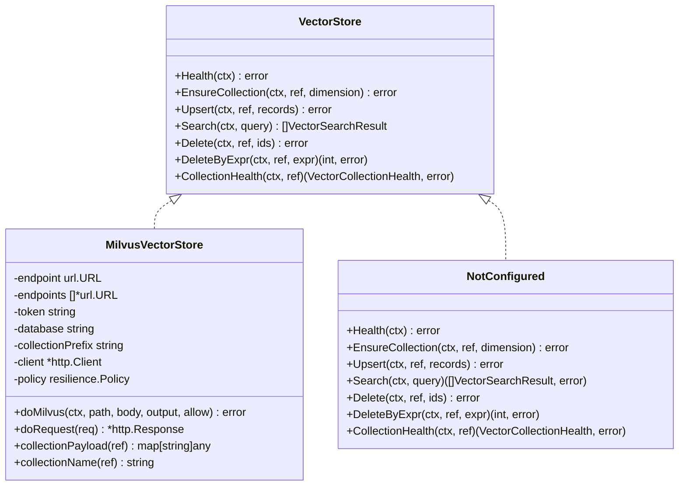
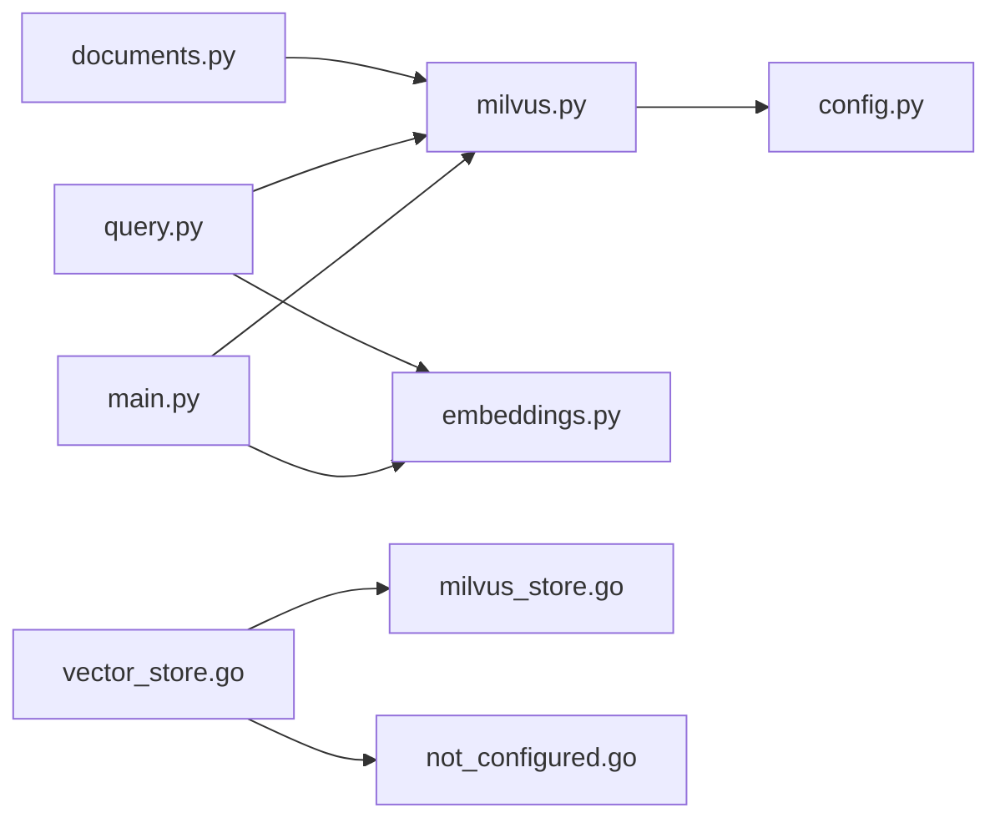

# 向量存储适配器

<cite>
**本文引用的文件**
- [milvus.py](file://repo/ai/rag-engine/app/core/milvus.py)
- [embeddings.py](file://repo/ai/rag-engine/app/core/embeddings.py)
- [config.py](file://repo/ai/rag-engine/app/core/config.py)
- [documents.py](file://repo/ai/rag-engine/app/routers/documents.py)
- [query.py](file://repo/ai/rag-engine/app/routers/query.py)
- [main.py](file://repo/ai/rag-engine/main.py)
- [vector_store.go](file://repo/pkg/ports/vector_store.go)
- [milvus_store.go](file://repo/pkg/adapters/vectorstore/milvus_store.go)
- [not_configured.go](file://repo/pkg/adapters/vectorstore/not_configured.go)
</cite>

## 目录
1. [简介](#简介)
2. [项目结构](#项目结构)
3. [核心组件](#核心组件)
4. [架构总览](#架构总览)
5. [详细组件分析](#详细组件分析)
6. [依赖关系分析](#依赖关系分析)
7. [性能考量](#性能考量)
8. [故障排查指南](#故障排查指南)
9. [结论](#结论)
10. [附录](#附录)

## 简介
本文件面向“向量存储适配器”，聚焦 Milvus 向量数据库在 RAG（检索增强生成）场景中的适配与使用。内容涵盖：
- 集合管理、向量索引创建、相似度搜索、元数据过滤
- 向量数据的导入导出、批量操作与性能优化策略
- RAG 工作流：文档分块、向量化、检索排序与答案生成
- 运维管理与故障处理建议

本项目包含两套实现：
- Python 侧的 RAG Engine：通过 LlamaIndex 直接对接 Milvus，提供文档解析、索引、查询等能力
- Go 侧的 Core 服务：通过 HTTP 调用 Milvus 向量数据库接口，暴露统一的 VectorStore 端口抽象

## 项目结构
RAG Engine（Python）负责文档解析、向量化与检索；Core（Go）通过统一端口抽象对上层业务屏蔽底层向量库差异。两者共同构成向量存储适配体系。

图表来源
- [documents.py:28-90](file://repo/ai/rag-engine/app/routers/documents.py#L28-L90)
- [query.py:112-166](file://repo/ai/rag-engine/app/routers/query.py#L112-L166)
- [milvus.py:36-187](file://repo/ai/rag-engine/app/core/milvus.py#L36-L187)
- [embeddings.py:50-203](file://repo/ai/rag-engine/app/core/embeddings.py#L50-L203)
- [config.py:5-102](file://repo/ai/rag-engine/app/core/config.py#L5-L102)
- [main.py:38-145](file://repo/ai/rag-engine/main.py#L38-L145)
- [vector_store.go:157-191](file://repo/pkg/ports/vector_store.go#L157-L191)
- [milvus_store.go:26-46](file://repo/pkg/adapters/vectorstore/milvus_store.go#L26-L46)
- [not_configured.go:9-40](file://repo/pkg/adapters/vectorstore/not_configured.go#L9-L40)

章节来源
- [documents.py:28-115](file://repo/ai/rag-engine/app/routers/documents.py#L28-L115)
- [query.py:1-167](file://repo/ai/rag-engine/app/routers/query.py#L1-L167)
- [milvus.py:1-187](file://repo/ai/rag-engine/app/core/milvus.py#L1-L187)
- [embeddings.py:1-203](file://repo/ai/rag-engine/app/core/embeddings.py#L1-L203)
- [config.py:1-102](file://repo/ai/rag-engine/app/core/config.py#L1-L102)
- [main.py:1-160](file://repo/ai/rag-engine/main.py#L1-L160)
- [vector_store.go:1-191](file://repo/pkg/ports/vector_store.go#L1-L191)
- [milvus_store.go:1-504](file://repo/pkg/adapters/vectorstore/milvus_store.go#L1-L504)
- [not_configured.go:1-40](file://repo/pkg/adapters/vectorstore/not_configured.go#L1-L40)

## 核心组件
- Milvus 连接与集合工具（Python）
  - 启动时建立默认连接，失败则降级并记录告警
  - 根据知识库 ID 生成稳定集合名（去除连字符）
  - 构建 LlamaIndex MilvusVectorStore，指定 HNSW + COSINE 索引参数
  - 封装 VectorStoreIndex.from_vector_store，统一嵌入与检索路径
- 嵌入模型（Python）
  - 通过 OpenAI 兼容 /v1/embeddings 远程获取向量
  - 提供批处理与异步包装，避免阻塞事件循环
  - 保证写入与查询共用同一模型端点，确保一致性
- 配置（Python）
  - Milvus 地址、端口、嵌入模型、维度、PG/NATS/MinIO 等
  - 支持从环境变量覆盖默认值
- 文档路由（Python）
  - 同步解析接口：下载→解析→分块→嵌入→写入 Milvus
  - 删除文档索引：按 doc_id 表达式删除
- 查询路由（Python）
  - 混合检索：向量检索（Milvus）+ 关键词检索（pg_trgm）→ RRF → LLM 生成
  - 支持阈值过滤、会话上下文、多租户校验
- Core 端口与 Milvus 适配器（Go）
  - 统一 VectorStore 接口：健康检查、集合创建、Upsert、Search、Delete、表达式删除、集合健康
  - Milvus 适配器通过 HTTP 调用 Milvus 向量数据库 API，支持多端点与重试
  - 未配置占位实现返回“未配置”错误

章节来源
- [milvus.py:36-187](file://repo/ai/rag-engine/app/core/milvus.py#L36-L187)
- [embeddings.py:50-203](file://repo/ai/rag-engine/app/core/embeddings.py#L50-L203)
- [config.py:5-102](file://repo/ai/rag-engine/app/core/config.py#L5-L102)
- [documents.py:28-115](file://repo/ai/rag-engine/app/routers/documents.py#L28-L115)
- [query.py:112-166](file://repo/ai/rag-engine/app/routers/query.py#L112-L166)
- [vector_store.go:157-191](file://repo/pkg/ports/vector_store.go#L157-L191)
- [milvus_store.go:69-178](file://repo/pkg/adapters/vectorstore/milvus_store.go#L69-L178)
- [not_configured.go:9-40](file://repo/pkg/adapters/vectorstore/not_configured.go#L9-L40)

## 架构总览
RAG 引擎通过 FastAPI 暴露 REST 接口，内部组合文档解析、向量化与检索逻辑；Core 服务通过统一端口抽象对外提供向量存储能力，底层由 Milvus 适配器实现。

图表来源
- [documents.py:28-90](file://repo/ai/rag-engine/app/routers/documents.py#L28-L90)
- [query.py:112-166](file://repo/ai/rag-engine/app/routers/query.py#L112-L166)
- [milvus.py:111-187](file://repo/ai/rag-engine/app/core/milvus.py#L111-L187)
- [embeddings.py:147-203](file://repo/ai/rag-engine/app/core/embeddings.py#L147-L203)

## 详细组件分析

### Milvus 连接与集合管理（Python）
- 启动连接：在应用生命周期中初始化 Milvus 连接，设置超时与降级策略
- 集合命名：基于知识库 ID 生成稳定集合名，符合 Milvus 命名规范
- 索引参数：HNSW 索引，余弦相似度，M=16，efConstruction=200
- 客户端获取：提供低层 MilvusClient 用于管理操作（如删除），不可用时返回 None 以降级

图表来源
- [milvus.py:36-107](file://repo/ai/rag-engine/app/core/milvus.py#L36-L107)
- [milvus.py:111-153](file://repo/ai/rag-engine/app/core/milvus.py#L111-L153)

章节来源
- [milvus.py:36-187](file://repo/ai/rag-engine/app/core/milvus.py#L36-L187)

### 嵌入模型与向量化（Python）
- 远程嵌入：通过 OpenAI 兼容 /v1/embeddings 获取向量，支持自定义模型名
- 批处理与异步：批量请求与异步包装，避免阻塞事件循环
- 统一性：写入与查询共用同一模型端点，确保向量空间一致

图表来源
- [embeddings.py:50-144](file://repo/ai/rag-engine/app/core/embeddings.py#L50-L144)
- [embeddings.py:147-203](file://repo/ai/rag-engine/app/core/embeddings.py#L147-L203)

章节来源
- [embeddings.py:50-203](file://repo/ai/rag-engine/app/core/embeddings.py#L50-L203)

### 文档解析与索引（Python）
- 同步解析接口：接收文档信息，执行下载→解析→分块→嵌入→写入流程
- 幂等性：相同 doc_id 重复调用安全，避免重复解析
- 删除索引：按 doc_id 表达式删除对应向量

图表来源
- [documents.py:28-90](file://repo/ai/rag-engine/app/routers/documents.py#L28-L90)
- [documents.py:93-115](file://repo/ai/rag-engine/app/routers/documents.py#L93-L115)

章节来源
- [documents.py:28-115](file://repo/ai/rag-engine/app/routers/documents.py#L28-L115)

### 查询与检索（Python）
- 混合检索：向量检索（Milvus）+ 关键词检索（pg_trgm）→ RRF 融合排序
- 阈值控制：低于阈值的片段不进入 LLM，避免幻觉
- 多租户与安全：校验 KB 存在性与租户隔离

图表来源
- [query.py:112-166](file://repo/ai/rag-engine/app/routers/query.py#L112-L166)

章节来源
- [query.py:112-166](file://repo/ai/rag-engine/app/routers/query.py#L112-L166)

### Core 向量存储端口与 Milvus 适配器（Go）
- 端口定义：统一 VectorStore 接口，包括健康检查、集合创建、Upsert、Search、Delete、表达式删除、集合健康
- Milvus 适配器：通过 HTTP 调用 Milvus 向量数据库 API，支持多端点、重试与错误映射
- 未配置占位：当未配置时返回“未配置”错误，便于上层优雅降级

图表来源
- [vector_store.go:157-191](file://repo/pkg/ports/vector_store.go#L157-L191)
- [milvus_store.go:26-46](file://repo/pkg/adapters/vectorstore/milvus_store.go#L26-L46)
- [not_configured.go:9-40](file://repo/pkg/adapters/vectorstore/not_configured.go#L9-L40)

章节来源
- [vector_store.go:157-191](file://repo/pkg/ports/vector_store.go#L157-L191)
- [milvus_store.go:69-178](file://repo/pkg/adapters/vectorstore/milvus_store.go#L69-L178)
- [not_configured.go:9-40](file://repo/pkg/adapters/vectorstore/not_configured.go#L9-L40)

## 依赖关系分析
- RAG Engine 依赖：
  - FastAPI 路由：documents.py、query.py
  - Milvus 连接与集合工具：milvus.py
  - 嵌入模型：embeddings.py
  - 配置：config.py
  - 应用生命周期：main.py
- Core 服务依赖：
  - 端口定义：vector_store.go
  - Milvus 适配器：milvus_store.go
  - 未配置占位：not_configured.go

图表来源
- [documents.py:28-115](file://repo/ai/rag-engine/app/routers/documents.py#L28-L115)
- [query.py:112-166](file://repo/ai/rag-engine/app/routers/query.py#L112-L166)
- [milvus.py:36-187](file://repo/ai/rag-engine/app/core/milvus.py#L36-L187)
- [embeddings.py:147-203](file://repo/ai/rag-engine/app/core/embeddings.py#L147-L203)
- [config.py:5-102](file://repo/ai/rag-engine/app/core/config.py#L5-L102)
- [main.py:38-145](file://repo/ai/rag-engine/main.py#L38-L145)
- [vector_store.go:157-191](file://repo/pkg/ports/vector_store.go#L157-L191)
- [milvus_store.go:69-178](file://repo/pkg/adapters/vectorstore/milvus_store.go#L69-L178)
- [not_configured.go:9-40](file://repo/pkg/adapters/vectorstore/not_configured.go#L9-L40)

章节来源
- [documents.py:28-115](file://repo/ai/rag-engine/app/routers/documents.py#L28-L115)
- [query.py:112-166](file://repo/ai/rag-engine/app/routers/query.py#L112-L166)
- [milvus.py:36-187](file://repo/ai/rag-engine/app/core/milvus.py#L36-L187)
- [embeddings.py:147-203](file://repo/ai/rag-engine/app/core/embeddings.py#L147-L203)
- [config.py:5-102](file://repo/ai/rag-engine/app/core/config.py#L5-L102)
- [main.py:38-145](file://repo/ai/rag-engine/main.py#L38-L145)
- [vector_store.go:157-191](file://repo/pkg/ports/vector_store.go#L157-L191)
- [milvus_store.go:69-178](file://repo/pkg/adapters/vectorstore/milvus_store.go#L69-L178)
- [not_configured.go:9-40](file://repo/pkg/adapters/vectorstore/not_configured.go#L9-L40)

## 性能考量
- 索引选择与参数
  - HNSW 索引，余弦相似度，M=16，efConstruction=200，适合高维向量快速近似最近邻搜索
- 批处理与异步
  - 嵌入模型支持批量请求，减少网络往返
  - 异步包装避免阻塞事件循环，提升并发吞吐
- 连接与重试
  - Milvus 连接设置超时，失败时降级并记录告警
  - Core 适配器支持多端点与可重试策略，提高可用性
- 阈值过滤
  - 查询时设置分数阈值，避免低相关片段进入 LLM，降低噪声与成本
- 资源隔离
  - 多租户通过集合前缀与租户 ID 隔离，避免冲突

[本节为通用性能指导，不直接分析具体文件]

## 故障排查指南
- Milvus 连接失败
  - 现象：启动日志出现连接失败警告，后续操作降级
  - 处理：检查 host/port 配置，确认网络可达与服务状态
- 集合不存在
  - 现象：删除或描述集合时报 not found
  - 处理：先创建集合，再执行写入；或忽略不存在情况继续
- 嵌入模型不可用
  - 现象：调用嵌入接口报错或超时
  - 处理：检查 embedding_api_base、embedding_model、embedding_api_key 配置
- 查询无结果
  - 现象：返回空结果或提示无相关内容
  - 处理：调整 top_k、score_threshold，检查检索模式与过滤条件
- Core 适配器未配置
  - 现象：返回“未配置”错误
  - 处理：配置 Endpoint/Endpoints、Token、Database、CollectionPrefix 等

章节来源
- [milvus.py:36-107](file://repo/ai/rag-engine/app/core/milvus.py#L36-L107)
- [milvus_store.go:159-178](file://repo/pkg/adapters/vectorstore/milvus_store.go#L159-L178)
- [not_configured.go:9-40](file://repo/pkg/adapters/vectorstore/not_configured.go#L9-L40)
- [query.py:112-166](file://repo/ai/rag-engine/app/routers/query.py#L112-L166)

## 结论
本适配器通过 Python RAG Engine 与 Go Core 服务协同，提供了完整的向量存储能力：集合管理、索引创建、相似度搜索、元数据过滤、文档解析与检索、以及统一的端口抽象。结合 HNSW 索引、批处理与异步机制、阈值过滤与多端点重试，满足 RAG 场景下的高性能与高可用需求。运维层面提供健康检查与降级策略，便于故障定位与恢复。

[本节为总结性内容，不直接分析具体文件]

## 附录
- 关键配置项说明
  - Milvus：host、port、address（可合并）、timeout
  - 嵌入模型：model、api_base、api_key、dim
  - PostgreSQL：pg_dsn/database_url
  - NATS：nats_url、nats_parse_subject
  - MinIO：endpoint、access_key、secret_key、bucket、secure
- RAG 工作流要点
  - 文档分块：按段落/页面切分，保留页码与文件名等元数据
  - 向量化：统一远程嵌入端点，确保写入与查询一致性
  - 检索排序：向量检索 + 关键词检索 → RRF 融合 → 阈值过滤 → LLM 生成
- 运维建议
  - 监控 Milvus 健康与集合状态
  - 定期重建索引以优化检索效果
  - 合理设置超时与重试，避免级联故障

[本节为补充信息，不直接分析具体文件]