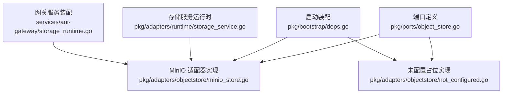
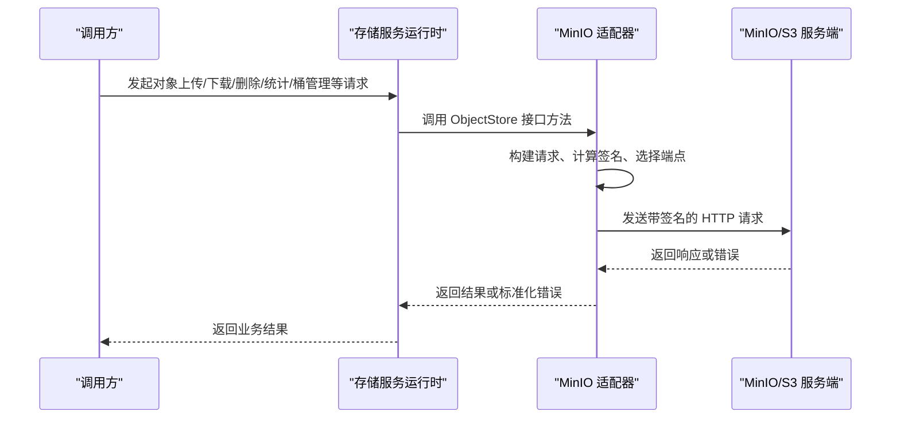
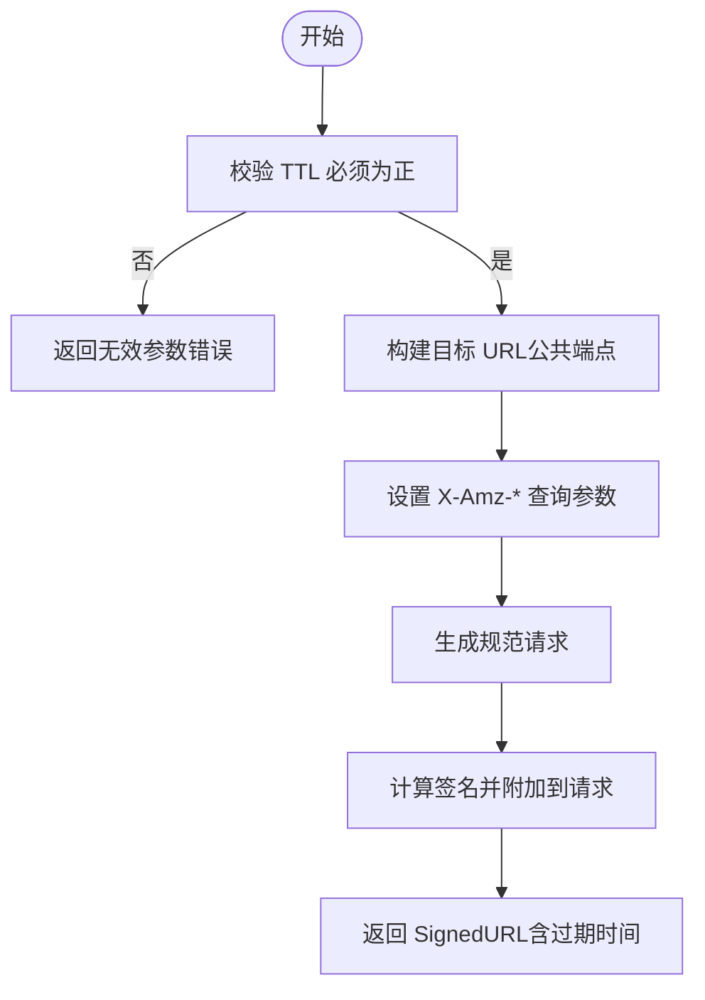
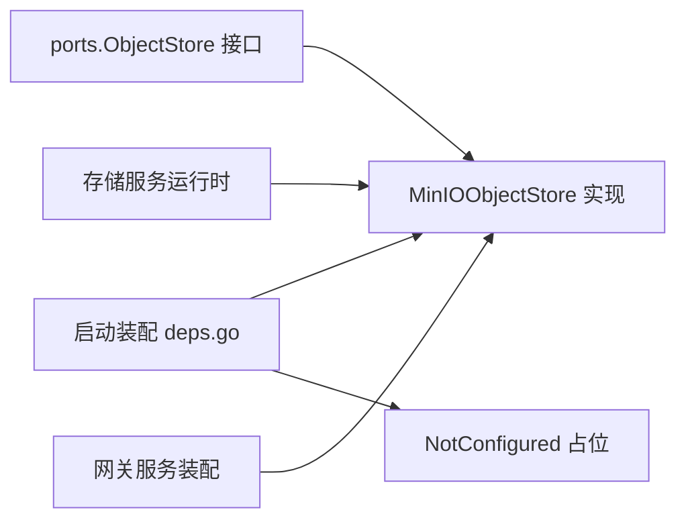
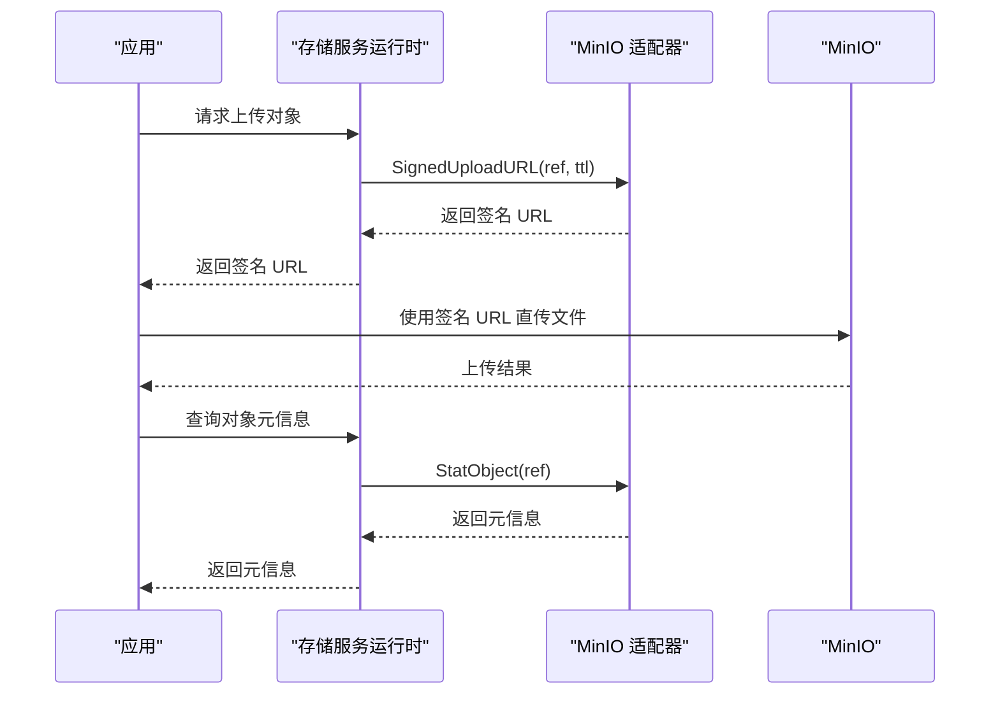

# 对象存储适配器

<cite>
**本文引用的文件**
- [minio_store.go](file://repo/pkg/adapters/objectstore/minio_store.go)
- [object_store.go](file://repo/pkg/ports/object_store.go)
- [not_configured.go](file://repo/pkg/adapters/objectstore/not_configured.go)
- [deps.go](file://repo/pkg/bootstrap/deps.go)
- [storage_service.go](file://repo/pkg/adapters/runtime/storage_service.go)
- [storage_runtime.go](file://repo/services/ani-gateway/storage_runtime.go)
</cite>

## 目录
1. [简介](#简介)
2. [项目结构](#项目结构)
3. [核心组件](#核心组件)
4. [架构总览](#架构总览)
5. [详细组件分析](#详细组件分析)
6. [依赖关系分析](#依赖关系分析)
7. [性能与高并发优化](#性能与高并发优化)
8. [故障排查指南](#故障排查指南)
9. [结论](#结论)
10. [附录：使用示例与最佳实践](#附录使用示例与最佳实践)

## 简介
本文件面向“对象存储适配器”的完整实现与使用，聚焦 MinIO 适配器的连接配置、桶管理、文件上传下载、权限控制（签名 URL）、错误处理机制与性能优化策略。文档同时说明该适配器如何与存储服务运行时集成，以及在高并发场景下的最佳实践。

## 项目结构
围绕对象存储的核心代码分布在以下位置：
- 端口定义：统一接口与数据模型
- 适配器实现：MinIO 的具体实现与未配置占位
- 启动装配：根据配置选择并实例化具体适配器
- 服务集成：存储服务运行时注入并使用对象存储能力

图表来源
- [object_store.go:47-56](file://repo/pkg/ports/object_store.go#L47-L56)
- [minio_store.go:46-105](file://repo/pkg/adapters/objectstore/minio_store.go#L46-L105)
- [not_configured.go:11-45](file://repo/pkg/adapters/objectstore/not_configured.go#L11-L45)
- [deps.go:380-399](file://repo/pkg/bootstrap/deps.go#L380-L399)
- [storage_service.go:18-75](file://repo/pkg/adapters/runtime/storage_service.go#L18-L75)
- [storage_runtime.go:89-108](file://repo/services/ani-gateway/storage_runtime.go#L89-L108)

章节来源
- [object_store.go:47-56](file://repo/pkg/ports/object_store.go#L47-L56)
- [minio_store.go:46-105](file://repo/pkg/adapters/objectstore/minio_store.go#L46-L105)
- [not_configured.go:11-45](file://repo/pkg/adapters/objectstore/not_configured.go#L11-L45)
- [deps.go:380-399](file://repo/pkg/bootstrap/deps.go#L380-L399)
- [storage_service.go:18-75](file://repo/pkg/adapters/runtime/storage_service.go#L18-L75)
- [storage_runtime.go:89-108](file://repo/services/ani-gateway/storage_runtime.go#L89-L108)

## 核心组件
- 端口接口 ObjectStore：定义健康检查、桶存在性保证、对象读写、元信息获取、签名上传/下载 URL 等能力。
- MinIOObjectStore：基于 HTTP + AWS SigV4 签名的 MinIO/S3 兼容实现，支持多端点重试、公共端点生成签名 URL、请求超时与幂等时间源注入。
- NotConfigured：当未配置对象存储时返回“未配置”错误的占位实现。
- 启动装配 objectStoreAdapter：根据配置 provider 选择 MinIO 或未配置实现。
- 存储服务运行时 LocalStorageService：通过选项注入 ports.ObjectStore，并在对象相关操作中调用其能力。
- 网关服务 storage_runtime：在运行期构造 MinIO 适配器并注入到存储服务。

章节来源
- [object_store.go:9-56](file://repo/pkg/ports/object_store.go#L9-L56)
- [minio_store.go:31-105](file://repo/pkg/adapters/objectstore/minio_store.go#L31-L105)
- [not_configured.go:11-45](file://repo/pkg/adapters/objectstore/not_configured.go#L11-L45)
- [deps.go:380-399](file://repo/pkg/bootstrap/deps.go#L380-L399)
- [storage_service.go:18-75](file://repo/pkg/adapters/runtime/storage_service.go#L18-L75)
- [storage_runtime.go:89-108](file://repo/services/ani-gateway/storage_runtime.go#L89-L108)

## 架构总览
MinIO 适配器通过统一的 ports.ObjectStore 接口被上层服务使用。启动阶段根据配置创建具体实现；运行时由存储服务将适配器注入后，执行对象操作。

图表来源
- [storage_service.go:18-75](file://repo/pkg/adapters/runtime/storage_service.go#L18-L75)
- [minio_store.go:107-272](file://repo/pkg/adapters/objectstore/minio_store.go#L107-L272)
- [deps.go:380-399](file://repo/pkg/bootstrap/deps.go#L380-L399)

## 详细组件分析

### 接口与数据模型（ports.ObjectStore）
- 接口能力
  - Health：健康检查
  - EnsureBucket：确保桶存在
  - PutObject/GetObject/DeleteObject/StatObject：对象级 CRUD
  - SignedUploadURL/SignedDownloadURL：生成带签名的上传/下载 URL（用于直传/直下）
- 关键数据结构
  - BucketClass：预定义的桶类别（如 model/dataset/kb-docs/branding）
  - ObjectRef：包含租户 ID、桶类别、对象键、版本
  - ObjectMetadata：内容类型、大小、校验和、更新时间
  - SignedURL：URL、过期时间、可选头部
  - PutObjectInput：上传输入体、大小、内容类型、校验和

章节来源
- [object_store.go:9-56](file://repo/pkg/ports/object_store.go#L9-L56)

### MinIO 适配器实现（MinIOObjectStore）
- 配置项（MinIOObjectStoreConfig）
  - Endpoint/Endpoints：主端点与备用端点列表
  - PublicEndpoint：用于生成对外签名 URL 的公开端点
  - AccessKeyID/SecretAccessKey/SessionToken：鉴权凭据
  - Region：区域（默认 us-east-1）
  - Secure：是否 HTTPS
  - BucketPrefix：桶名前缀
  - HTTPClient/RequestTimeout：HTTP 客户端与请求超时
  - Now：可注入的时间源（便于测试）
- 核心行为
  - 健康检查：对根路径发起 GET 并校验状态码
  - 桶管理：HEAD 探测是否存在，不存在则 PUT 创建，冲突或已存在视为成功
  - 对象上传：读取 body 计算 SHA-256，PUT 对象并返回元信息
  - 对象下载/删除/统计：GET/DELETE/HEAD 并映射为标准错误
  - 签名 URL：按 AWS SigV4 规则生成带过期时间的上传/下载链接，使用无签名负载哈希以支持大文件直传
  - 多端点重试：对网络错误或特定 HTTP 状态码（如 429、5xx）自动切换到下一个端点
  - 安全签名：构造规范请求、计算签名、设置 Authorization 头
  - 元信息解析：从响应头提取 Last-Modified、Content-Type、ETag、Content-Length
- 错误映射
  - NotFound/Conflict/Invalid/FailedPrecondition 等标准错误
  - 非预期 HTTP 状态封装为失败前置条件错误
- 端点解析与校验
  - 强制 http/https 协议、不允许路径、去重、合并主备端点

图表来源
- [minio_store.go:266-313](file://repo/pkg/adapters/objectstore/minio_store.go#L266-L313)
- [minio_store.go:391-444](file://repo/pkg/adapters/objectstore/minio_store.go#L391-L444)

章节来源
- [minio_store.go:31-105](file://repo/pkg/adapters/objectstore/minio_store.go#L31-L105)
- [minio_store.go:107-272](file://repo/pkg/adapters/objectstore/minio_store.go#L107-L272)
- [minio_store.go:315-444](file://repo/pkg/adapters/objectstore/minio_store.go#L315-L444)
- [minio_store.go:446-500](file://repo/pkg/adapters/objectstore/minio_store.go#L446-L500)
- [minio_store.go:502-581](file://repo/pkg/adapters/objectstore/minio_store.go#L502-L581)

### 未配置占位（NotConfigured）
- 所有方法直接返回“未配置”错误，便于在未启用对象存储时快速失败且不影响其他功能。

章节来源
- [not_configured.go:11-45](file://repo/pkg/adapters/objectstore/not_configured.go#L11-L45)

### 启动装配（objectStoreAdapter）
- 根据配置中的 ObjectStoreProvider 决定返回 NotConfigured 或 MinIO 适配器
- 将配置项映射到 MinIOObjectStoreConfig

章节来源
- [deps.go:380-399](file://repo/pkg/bootstrap/deps.go#L380-L399)

### 与服务运行时集成（LocalStorageService）
- 通过 WithStorageObjectStore 注入 ports.ObjectStore
- 存储服务在对象相关流程中调用该接口完成实际的对象存取

章节来源
- [storage_service.go:18-75](file://repo/pkg/adapters/runtime/storage_service.go#L18-L75)

### 网关服务装配（storage_runtime）
- 当配置 ObjectStoreProvider 为 minio 时，构造 MinIO 适配器并注入到存储服务
- 支持自定义 HTTP 客户端与请求超时

章节来源
- [storage_runtime.go:89-108](file://repo/services/ani-gateway/storage_runtime.go#L89-L108)

## 依赖关系分析
- 耦合与内聚
  - 适配器仅依赖 ports 接口，保持高内聚低耦合
  - 通过启动装配解耦配置与实现
  - 运行时通过选项注入适配器，避免全局单例耦合
- 外部依赖
  - HTTP 客户端与 TLS（可通过配置注入）
  - 时间源（可注入以便测试）
  - 韧性策略（重试、超时）

图表来源
- [object_store.go:47-56](file://repo/pkg/ports/object_store.go#L47-L56)
- [minio_store.go:46-105](file://repo/pkg/adapters/objectstore/minio_store.go#L46-L105)
- [deps.go:380-399](file://repo/pkg/bootstrap/deps.go#L380-L399)
- [storage_service.go:18-75](file://repo/pkg/adapters/runtime/storage_service.go#L18-L75)
- [storage_runtime.go:89-108](file://repo/services/ani-gateway/storage_runtime.go#L89-L108)

章节来源
- [object_store.go:47-56](file://repo/pkg/ports/object_store.go#L47-L56)
- [minio_store.go:46-105](file://repo/pkg/adapters/objectstore/minio_store.go#L46-L105)
- [deps.go:380-399](file://repo/pkg/bootstrap/deps.go#L380-L399)
- [storage_service.go:18-75](file://repo/pkg/adapters/runtime/storage_service.go#L18-L75)
- [storage_runtime.go:89-108](file://repo/services/ani-gateway/storage_runtime.go#L89-L108)

## 性能与高并发优化
- 多端点与重试
  - 支持主端点+多个备用端点，遇到 429/5xx 或网络错误自动切换并重试，提升可用性
- 请求超时与韧性策略
  - 通过 RequestTimeout 与韧性策略限制单次请求耗时，防止雪崩
- 直传直下（SignedURL）
  - 使用无签名负载哈希的预签名 URL，允许客户端直连 MinIO，降低应用服务器带宽压力
- 内存与 I/O
  - 上传时将 Body 读入内存再计算校验和，适合中小文件；超大文件建议优先使用 SignedUploadURL 直传
- 并发安全
  - 适配器内部无共享可变状态，线程安全；存储服务侧有独立并发控制
- 连接复用
  - 通过注入 HTTPClient 可复用连接池，减少握手开销

[本节为通用指导，不直接分析具体文件]

## 故障排查指南
- 常见错误与定位
  - 未配置：所有方法返回“未配置”，检查 ObjectStoreProvider 与相关配置项
  - 参数无效：缺少必填字段（如 AccessKeyID/SecretAccessKey、TenantID/ObjectKey、TTL 必须为正）
  - 端点非法：协议必须为 http/https、不允许路径、主机名缺失
  - 权限不足：401/403 会映射为失败前置条件错误
  - 资源不存在：404 映射为“未找到”
- 诊断步骤
  - 确认端点可达与健康检查通过
  - 核对凭据、区域、桶前缀与桶类别命名是否符合 S3 兼容
  - 检查签名 URL 是否使用正确的公共端点与过期时间
  - 观察重试行为：若频繁 429/5xx，考虑调整后端容量或限流策略

章节来源
- [minio_store.go:75-83](file://repo/pkg/adapters/objectstore/minio_store.go#L75-L83)
- [minio_store.go:266-280](file://repo/pkg/adapters/objectstore/minio_store.go#L266-L280)
- [minio_store.go:454-483](file://repo/pkg/adapters/objectstore/minio_store.go#L454-L483)
- [minio_store.go:502-581](file://repo/pkg/adapters/objectstore/minio_store.go#L502-L581)

## 结论
MinIO 对象存储适配器以清晰的接口抽象实现了健壮的 S3 兼容访问能力，具备多端点容错、签名直传、严格错误映射与可插拔配置等特性。配合存储服务运行时，可在高并发场景下提供稳定高效的对象存取能力。

[本节为总结性内容，不直接分析具体文件]

## 附录：使用示例与最佳实践

### 配置与装配
- 在启动装配中设置 ObjectStoreProvider 为 minio，并提供 Endpoint/Endpoints、PublicEndpoint、AccessKeyID、SecretAccessKey、Region、Secure、BucketPrefix 等参数
- 如需自定义 HTTP 客户端或请求超时，可在网关服务装配处注入

章节来源
- [deps.go:380-399](file://repo/pkg/bootstrap/deps.go#L380-L399)
- [storage_runtime.go:89-108](file://repo/services/ani-gateway/storage_runtime.go#L89-L108)

### 典型操作流程（序列图）

图表来源
- [minio_store.go:266-313](file://repo/pkg/adapters/objectstore/minio_store.go#L266-L313)
- [minio_store.go:243-264](file://repo/pkg/adapters/objectstore/minio_store.go#L243-L264)
- [storage_service.go:18-75](file://repo/pkg/adapters/runtime/storage_service.go#L18-L75)

### 常见场景要点
- 文件上传下载
  - 小文件：可直接调用 PutObject/GetObject
  - 大文件：优先使用 SignedUploadURL/SignedDownloadURL 进行直传/直下
- 批量操作
  - 结合客户端并发与适配器多端点重试，注意控制并发度以避免触发 429
- 断点续传
  - 适配器未内置分片/续传逻辑；建议在客户端实现分片上传，并通过 SignedUploadURL 逐片上传
- 权限控制
  - 使用 SignedURL 的过期时间与只读/只写方法控制临时访问权限
- 与 PostgreSQL 元数据存储的集成
  - 适配器本身不直接访问数据库；存储服务运行时可选择性地与持久化存储（如 PostgreSQL）集成以记录对象/桶等资源元数据。适配器专注于对象存取，元数据一致性由上层服务保证

[本节为使用指导，不直接分析具体文件]