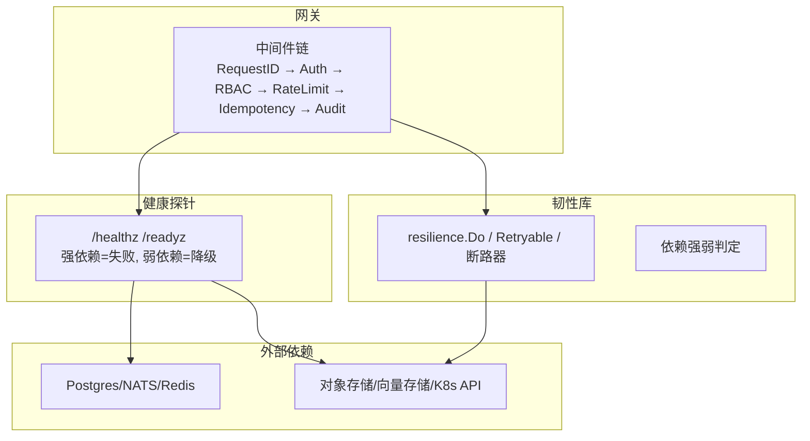
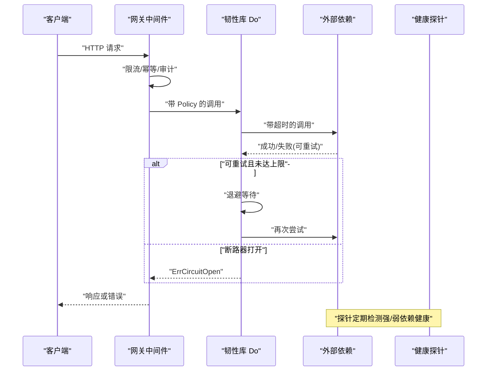
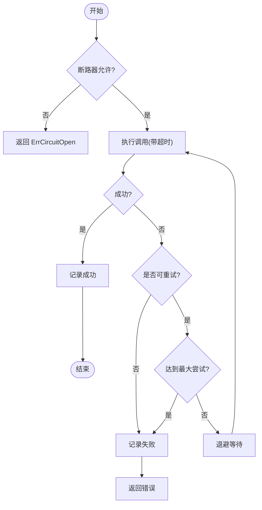
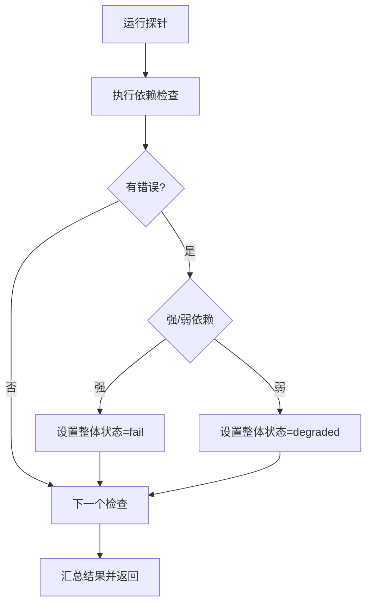
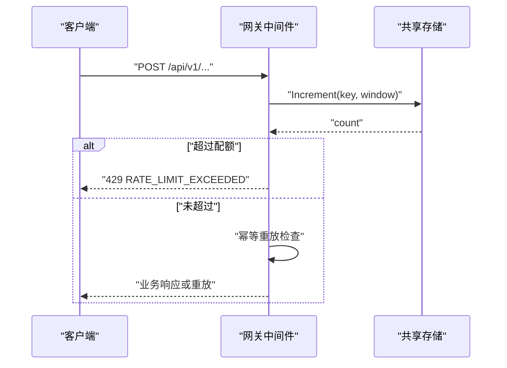

# 弹性模式

<cite>
**本文引用的文件**
- [resilience.go](file://repo/pkg/adapters/resilience/resilience.go)
- [degradation.go](file://repo/pkg/adapters/resilience/degradation.go)
- [resilience_test.go](file://repo/pkg/adapters/resilience/resilience_test.go)
- [probes.go](file://repo/pkg/bootstrap/probes.go)
- [ratelimit.go](file://repo/services/ani-gateway/internal/middleware/ratelimit.go)
- [chain.go](file://repo/services/ani-gateway/internal/middleware/chain.go)
- [sprint14-core-resilience-plan.md](file://repo/development-records/sprint14-core-resilience-plan.md)
- [r-p0-1-gateway-rate-limit.md](file://repo/development-records/r-p0-1-gateway-rate-limit.md)
- [r-sprint14-resilience-live-gate.md](file://repo/development-records/r-sprint14-resilience-live-gate.md)
</cite>

## 目录
1. [简介](#简介)
2. [项目结构](#项目结构)
3. [核心组件](#核心组件)
4. [架构总览](#架构总览)
5. [详细组件分析](#详细组件分析)
6. [依赖关系分析](#依赖关系分析)
7. [性能与容量规划](#性能与容量规划)
8. [故障排查指南](#故障排查指南)
9. [结论](#结论)
10. [附录：配置与测试清单](#附录配置与测试清单)

## 简介
本文件系统性梳理 ANI 平台在“弹性模式”方面的设计模式与实现策略，覆盖熔断器、降级、限流、重试、超时、健康探测与多端点故障转移等关键能力。目标是帮助读者理解如何在微服务架构中构建健壮性，处理外部依赖故障、网络异常与服务不可用等场景，并提供可操作的弹性配置最佳实践与故障模拟/弹性测试方法。

## 项目结构
本次弹性能力主要分布在以下位置：
- 通用韧性库：pkg/adapters/resilience（重试、退避、断路器、错误分类、依赖强弱）
- 健康与降级：pkg/bootstrap/probes.go（readyz/healthz 探针，强/弱依赖判定）
- 网关中间件：services/ani-gateway/internal/middleware（限流、幂等重放、审计、认证鉴权链）
- 计划与门禁：development-records（Sprint14 弹性计划、各批次落地记录、真实环境 live gate）

图表来源
- [chain.go:1-22](file://repo/services/ani-gateway/internal/middleware/chain.go#L1-L22)
- [resilience.go:13-22](file://repo/pkg/adapters/resilience/resilience.go#L13-L22)
- [probes.go:102-136](file://repo/pkg/bootstrap/probes.go#L102-L136)

章节来源
- [chain.go:1-22](file://repo/services/ani-gateway/internal/middleware/chain.go#L1-L22)
- [resilience.go:13-22](file://repo/pkg/adapters/resilience/resilience.go#L13-L22)
- [probes.go:102-136](file://repo/pkg/bootstrap/probes.go#L102-L136)

## 核心组件
- 重试与退避：基于指数退避+抖动，仅对瞬时错误重试，受调用级超时保护。
- 熔断器：按命名键维护滚动窗口失败率，超过阈值进入 open；冷却后 half-open 探测。
- 错误分类：区分可重试（网络错误、超时、429、5xx）与不可重试（业务 4xx）。
- 依赖强弱：强依赖失败返回 503 fail；弱依赖失败返回 200 degraded。
- 健康探针：统一 /healthz 与 /readyz，聚合各依赖健康状态并输出延迟与错误信息。
- 网关限流：按租户+方法+路由类窗口计数，超限返回 429。
- 幂等重放： mutating 请求去重与响应回放，避免重复副作用。
- 多端点故障转移：后端 endpoint 列表或 LB/VIP，失败时尝试下一个。

章节来源
- [resilience.go:56-133](file://repo/pkg/adapters/resilience/resilience.go#L56-L133)
- [resilience.go:166-222](file://repo/pkg/adapters/resilience/resilience.go#L166-L222)
- [degradation.go:1-22](file://repo/pkg/adapters/resilience/degradation.go#L1-L22)
- [probes.go:102-136](file://repo/pkg/bootstrap/probes.go#L102-L136)
- [ratelimit.go:14-56](file://repo/services/ani-gateway/internal/middleware/ratelimit.go#L14-L56)
- [sprint14-core-resilience-plan.md:203-233](file://repo/development-records/sprint14-core-resilience-plan.md#L203-L233)

## 架构总览
ANI 的弹性架构以“网关中间件 + 韧性库 + 健康探针”为核心，贯穿请求生命周期：
- 请求进入网关，依次经过限流、幂等重放、审计等中间件。
- 业务调用外部依赖前，通过 resilience.Do 注入超时、重试与断路器。
- 健康探针周期性探测强/弱依赖，对外暴露 readyz 状态，指导流量调度与告警。
- 多端点故障转移在后端层提供额外韧性，结合断路器快速隔离故障节点。

图表来源
- [chain.go:1-22](file://repo/services/ani-gateway/internal/middleware/chain.go#L1-L22)
- [resilience.go:89-133](file://repo/pkg/adapters/resilience/resilience.go#L89-L133)
- [probes.go:102-136](file://repo/pkg/bootstrap/probes.go#L102-L136)

## 详细组件分析

### 重试、退避与熔断器
- 重试策略：仅当错误被分类为可重试时才重试，遵循 MaxAttempts 与 BaseBackoff/MaxBackoff 的指数退避。
- 熔断器：按 BreakerName 命名键共享，统计滚动窗口内请求数与失败比，达到 FailureRatio 且 MinRequests 满足则 open；CooldownPeriod 后进入 half-open 探测。
- 超时保护：每次尝试通过 Timeout 注入 deadline，防止长尾阻塞。

图表来源
- [resilience.go:89-133](file://repo/pkg/adapters/resilience/resilience.go#L89-L133)
- [resilience.go:166-222](file://repo/pkg/adapters/resilience/resilience.go#L166-L222)

章节来源
- [resilience.go:56-133](file://repo/pkg/adapters/resilience/resilience.go#L56-L133)
- [resilience.go:166-222](file://repo/pkg/adapters/resilience/resilience.go#L166-L222)
- [resilience_test.go:88-138](file://repo/pkg/adapters/resilience/resilience_test.go#L88-L138)

### 健康探针与优雅降级
- 强依赖（如 Postgres/NATS/Redis/Kubernetes API）失败：readyz 返回 HTTP 503 且 status=fail。
- 弱依赖（如 object-store/vector-store）失败：readyz 返回 HTTP 200 且 status=degraded。
- 探针结果包含每个检查项的延迟与错误信息，便于定位问题。

图表来源
- [probes.go:102-136](file://repo/pkg/bootstrap/probes.go#L102-L136)
- [degradation.go:1-22](file://repo/pkg/adapters/resilience/degradation.go#L1-L22)

章节来源
- [probes.go:102-136](file://repo/pkg/bootstrap/probes.go#L102-L136)
- [degradation.go:1-22](file://repo/pkg/adapters/resilience/degradation.go#L1-L22)

### 网关限流与幂等重放
- 限流：基于共享 store 的 per-tenant + method + route-class 窗口计数，默认 100 次/秒，可通过环境变量覆盖；超限返回 429 RATE_LIMIT_EXCEEDED。
- 幂等重放：对 mutating 请求写入 processing 哨兵，完成后缓存响应并重放首次响应；并发重复请求返回 409 IDEMPOTENCY_IN_PROGRESS。
- 中间件顺序：RequestID → Auth → RBAC → RateLimit → Idempotency → Audit → Route。

图表来源
- [ratelimit.go:14-56](file://repo/services/ani-gateway/internal/middleware/ratelimit.go#L14-L56)
- [chain.go:1-22](file://repo/services/ani-gateway/internal/middleware/chain.go#L1-L22)

章节来源
- [ratelimit.go:14-56](file://repo/services/ani-gateway/internal/middleware/ratelimit.go#L14-L56)
- [chain.go:1-22](file://repo/services/ani-gateway/internal/middleware/chain.go#L1-L22)
- [r-p0-1-gateway-rate-limit.md:1-67](file://repo/development-records/r-p0-1-gateway-rate-limit.md#L1-L67)

### 多端点故障转移与后端 HA
- Redis bootstrap/gateway 支持 UniversalClient、Sentinel/Cluster 配置。
- MinIO/Milvus adapter 接受 endpoint 列表或 LB/VIP，在网络错误、429、5xx 时尝试下一个 endpoint。
- 控制器主从切换由 metadata-backed lease 完成，删除 primary pod 后 follower 接管。

章节来源
- [sprint14-core-resilience-plan.md:473-486](file://repo/development-records/sprint14-core-resilience-plan.md#L473-L486)
- [r-sprint14-resilience-live-gate.md:1-52](file://repo/development-records/r-sprint14-resilience-live-gate.md#L1-L52)

## 依赖关系分析
- 耦合度：resilience 包作为通用能力被网关与适配器复用；probes 依赖 resilience 的依赖强弱定义。
- 直接依赖：
  - 网关中间件依赖 resilience 的超时与重试策略。
  - 健康探针依赖各端口 Health() 接口，按名称映射到强/弱依赖。
- 间接依赖：
  - 多端点故障转移依赖于后端 SDK 的 endpoint 列表与负载均衡能力。
- 潜在循环：无直接循环依赖；resilience 不反向依赖网关或探针。

图表来源
- [chain.go:1-22](file://repo/services/ani-gateway/internal/middleware/chain.go#L1-L22)
- [probes.go:102-136](file://repo/pkg/bootstrap/probes.go#L102-L136)
- [resilience.go:89-133](file://repo/pkg/adapters/resilience/resilience.go#L89-L133)

章节来源
- [chain.go:1-22](file://repo/services/ani-gateway/internal/middleware/chain.go#L1-L22)
- [probes.go:102-136](file://repo/pkg/bootstrap/probes.go#L102-L136)
- [resilience.go:89-133](file://repo/pkg/adapters/resilience/resilience.go#L89-L133)

## 性能与容量规划
- 重试与退避：合理设置 MaxAttempts 与 BaseBackoff/MaxBackoff，避免雪崩；对高 QPS 路径谨慎启用重试。
- 熔断器：FailureRatio 与 MinRequests 需根据业务容忍度调优；CooldownPeriod 控制探测频率。
- 限流：按租户维度隔离，窗口大小与阈值依据峰值与 SLA 设定；使用共享 store 保证分布式一致性。
- 健康探针：强依赖失败应尽快下线流量；弱依赖降级时应保留核心功能。
- 多端点故障转移：优先选择就近/低延迟 endpoint；结合断路器快速隔离故障节点。

[本节为通用指导，无需特定文件引用]

## 故障排查指南
- 常见问题定位：
  - 限流触发：检查租户、方法、路由类 key 与窗口计数；确认环境变量配置。
  - 重试过多：检查错误分类是否正确；确认操作是否幂等。
  - 断路器频繁打开：观察失败比例与样本量；调整 FailureRatio/MinRequests。
  - 健康探针失败：查看具体依赖的错误信息与延迟；区分强/弱依赖。
- 验证命令与门禁：
  - 本地逻辑门：make validate-gateway-ratelimit、make validate-readyz-dataplane-live-gate、make validate-resilience-faultinjection-live-gate。
  - 真实环境门：make validate-sprint14-resilience-live-gate，配合隔离 fixture 执行 backend kill、weak dependency degraded、controller failover。

章节来源
- [r-p0-1-gateway-rate-limit.md:1-67](file://repo/development-records/r-p0-1-gateway-rate-limit.md#L1-L67)
- [r-sprint14-resilience-live-gate.md:1-52](file://repo/development-records/r-sprint14-resilience-live-gate.md#L1-L52)
- [sprint14-core-resilience-plan.md:473-486](file://repo/development-records/sprint14-core-resilience-plan.md#L473-L486)

## 结论
ANI 平台的弹性模式以“重试+退避+熔断”为核心，辅以“限流、幂等、健康探针、多端点故障转移”，形成端到端的健壮性保障。通过强/弱依赖划分与 readyz 语义，系统可在部分依赖失效时保持可用或优雅降级。结合真实环境 live gate 与隔离 fixture，确保弹性能力在生产场景中可验证、可复跑、可观测。

[本节为总结，无需特定文件引用]

## 附录：配置与测试清单
- 超时与重试配置建议：
  - Timeout：为每次调用设置合理超时，避免长尾阻塞。
  - MaxAttempts：幂等操作可设置 2-3 次；非幂等写不重试。
  - BaseBackoff/MaxBackoff：指数退避起始值与上限，避免拥塞。
  - BreakerName/FailureRatio/MinRequests/CooldownPeriod：按依赖稳定性调优。
- 限流配置：
  - GATEWAY_RATE_LIMIT_REQUESTS：每窗口最大请求数。
  - GATEWAY_RATE_LIMIT_WINDOW：窗口时长。
- 健康探针：
  - 强依赖：Postgres/NATS/Redis/Kubernetes API。
  - 弱依赖：object-store/vector-store。
- 弹性测试方法：
  - 本地单元测试：覆盖重试成功、断路打开、错误分类。
  - 真实环境 live gate：backend kill、weak dependency degraded、controller failover。

章节来源
- [resilience_test.go:11-138](file://repo/pkg/adapters/resilience/resilience_test.go#L11-L138)
- [ratelimit.go:58-72](file://repo/services/ani-gateway/internal/middleware/ratelimit.go#L58-L72)
- [probes.go:144-218](file://repo/pkg/bootstrap/probes.go#L144-L218)
- [sprint14-core-resilience-plan.md:473-486](file://repo/development-records/sprint14-core-resilience-plan.md#L473-L486)
- [r-sprint14-resilience-live-gate.md:1-52](file://repo/development-records/r-sprint14-resilience-live-gate.md#L1-L52)