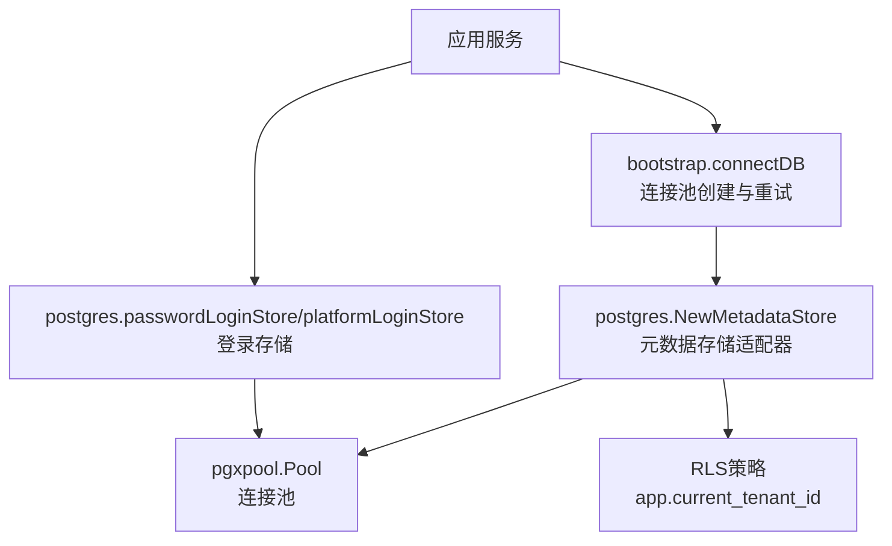
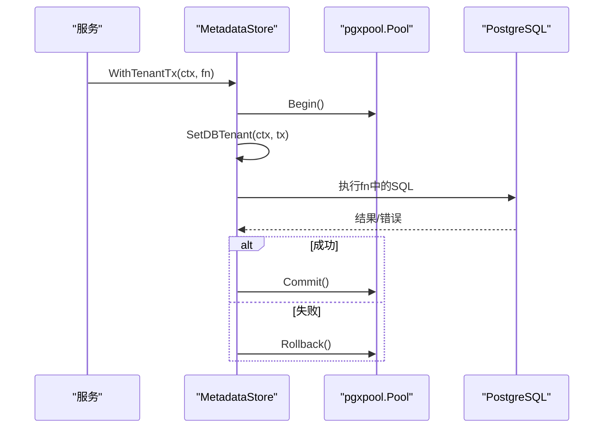
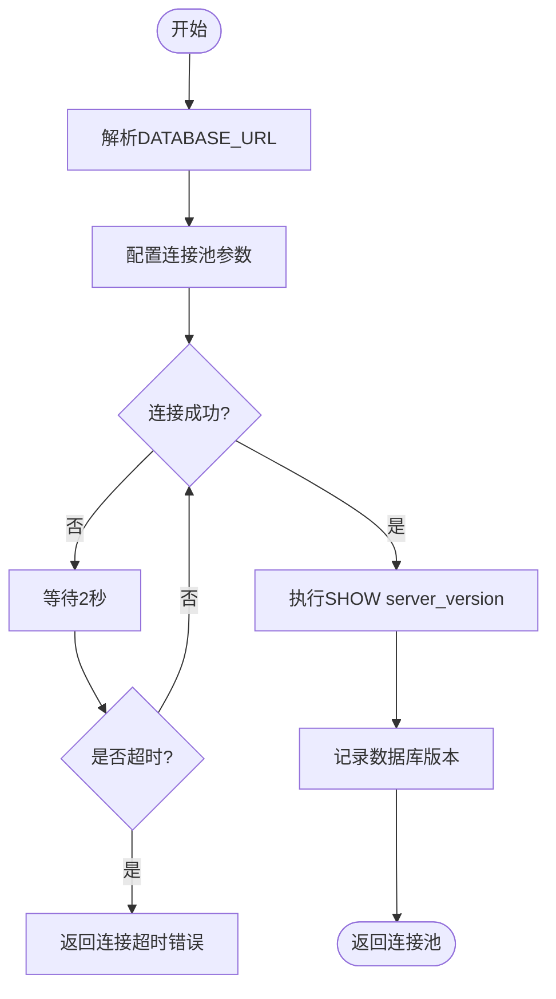
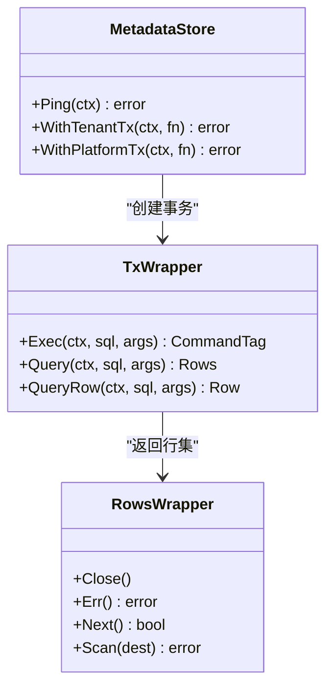
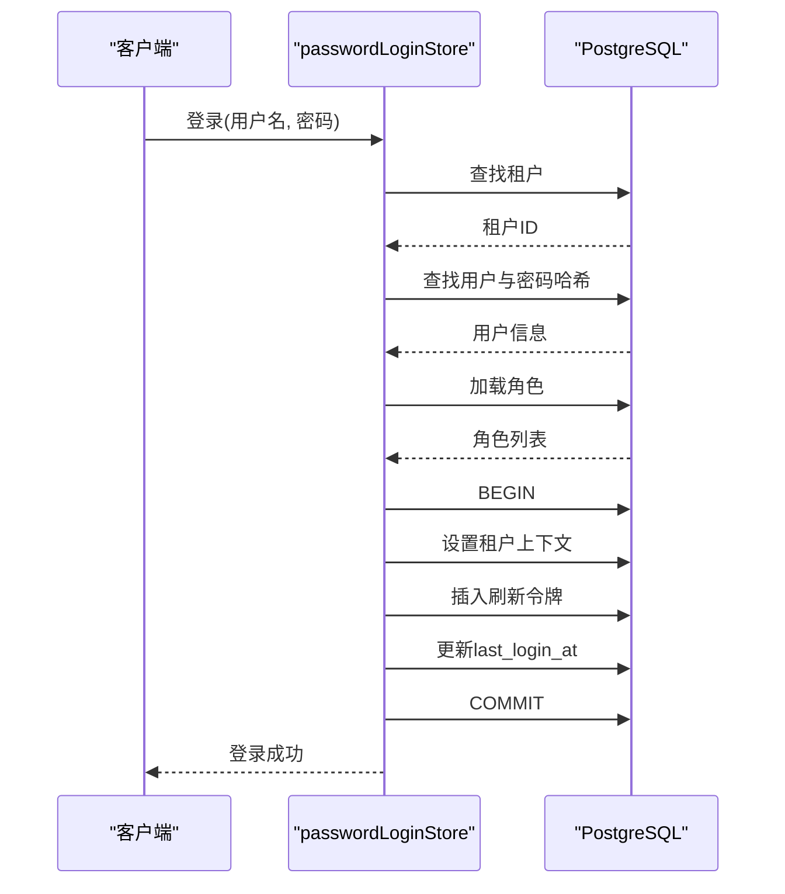
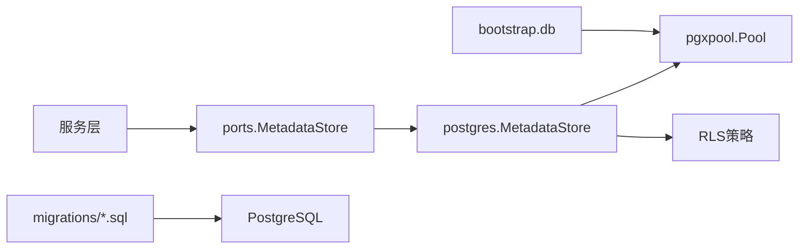

# 数据库适配器

<cite>
**本文引用的文件**
- [db.go](file://repo/pkg/bootstrap/db.go)
- [metadata_store.go](file://repo/pkg/adapters/postgres/metadata_store.go)
- [password_login.go](file://repo/pkg/adapters/postgres/password_login.go)
- [metadata.go](file://repo/pkg/ports/metadata.go)
- [20260501_001_init_schema.sql](file://repo/deploy/migrations/20260501_001_init_schema.sql)
- [20260502_003_permissions_schema.sql](file://repo/deploy/migrations/20260502_003_permissions_schema.sql)
- [20260707_014_platform_refresh_tokens.sql](file://repo/deploy/migrations/20260707_014_platform_refresh_tokens.sql)
</cite>

## 目录
1. [简介](#简介)
2. [项目结构](#项目结构)
3. [核心组件](#核心组件)
4. [架构总览](#架构总览)
5. [详细组件分析](#详细组件分析)
6. [依赖关系分析](#依赖关系分析)
7. [性能考量](#性能考量)
8. [故障排查指南](#故障排查指南)
9. [结论](#结论)
10. [附录：SQL操作示例与最佳实践](#附录sql操作示例与最佳实践)

## 简介
本文件面向PostgreSQL元数据存储适配器的实现，覆盖连接池配置、事务管理、查询优化、连接重试机制、数据模型设计、索引策略、备份恢复方案、迁移管理、性能监控与故障排查，并提供批量插入、分页查询、复杂关联查询等最佳实践。该适配器基于pgx/pgxpool构建，通过统一的端口接口（ports）屏蔽底层数据库差异，确保服务层以租户隔离和平台级事务为边界进行数据访问。

## 项目结构
- 启动阶段负责建立并调优数据库连接池，包含超时与重试逻辑，随后构造PostgreSQL元数据存储适配器实例。
- 适配器封装了租户级与平台级事务的开启、提交与回滚，并通过行级安全（RLS）强制租户隔离。
- 登录相关存储直接基于连接池执行SQL，避免在认证前使用租户上下文。
- 迁移脚本集中管理数据库模式演进，包括权限、角色、表结构与RLS策略。

图表来源
- [db.go:14-64](file://repo/pkg/bootstrap/db.go#L14-L64)
- [metadata_store.go:13-60](file://repo/pkg/adapters/postgres/metadata_store.go#L13-L60)
- [password_login.go:16-132](file://repo/pkg/adapters/postgres/password_login.go#L16-L132)

章节来源
- [db.go:14-64](file://repo/pkg/bootstrap/db.go#L14-L64)
- [metadata_store.go:13-60](file://repo/pkg/adapters/postgres/metadata_store.go#L13-L60)
- [password_login.go:16-132](file://repo/pkg/adapters/postgres/password_login.go#L16-L132)

## 核心组件
- 连接池与重试：在启动时解析DATABASE_URL，设置连接池大小、生命周期、空闲时间与健康检查周期；提供带超时的重试循环，直到数据库可用或超时。
- 元数据存储适配器：提供Ping能力与两种事务封装：
  - WithTenantTx：在事务中设置当前租户上下文，用于租户隔离的元数据操作。
  - WithPlatformTx：平台级事务，不设置租户上下文。
- 登录存储：
  - passwordLoginStore：租户用户登录流程，查找租户、用户、角色，并在单事务内写入刷新令牌并更新最后登录时间。
  - platformLoginStore：平台管理员登录流程，支持tenant_id为NULL的刷新令牌。

章节来源
- [db.go:14-64](file://repo/pkg/bootstrap/db.go#L14-L64)
- [metadata_store.go:13-105](file://repo/pkg/adapters/postgres/metadata_store.go#L13-L105)
- [password_login.go:16-213](file://repo/pkg/adapters/postgres/password_login.go#L16-L213)

## 架构总览
系统采用“端口-适配器”模式：服务层依赖ports定义的MetadataStore接口，由PostgreSQL适配器实现。连接池在启动阶段统一创建，适配器通过事务包装保证一致性，并使用PG的RLS强制多租户隔离。

图表来源
- [metadata_store.go:27-60](file://repo/pkg/adapters/postgres/metadata_store.go#L27-L60)
- [metadata.go:20-33](file://repo/pkg/ports/metadata.go#L20-L33)

章节来源
- [metadata_store.go:27-60](file://repo/pkg/adapters/postgres/metadata_store.go#L27-L60)
- [metadata.go:20-33](file://repo/pkg/ports/metadata.go#L20-L33)

## 详细组件分析

### 连接池与重试机制
- 连接池参数：最大连接数、最小连接数、连接生命周期、空闲超时与健康检查周期均显式配置，提升稳定性与资源利用率。
- 重试策略：启动时以固定间隔重试连接，直至数据库可用或达到超时限制；连接成功后读取服务器版本并记录日志。
- 健康检查：通过Ping验证连接可用性，便于探针与优雅关闭。

图表来源
- [db.go:14-52](file://repo/pkg/bootstrap/db.go#L14-L52)

章节来源
- [db.go:14-52](file://repo/pkg/bootstrap/db.go#L14-L52)

### 元数据存储适配器（租户与平台事务）
- 租户事务：在事务开始时设置当前租户ID，确保后续SQL受RLS约束，实现强隔离。
- 平台事务：不设置租户上下文，适用于平台级资源操作。
- 事务包装：统一处理Begin/Commit/Rollback，简化调用方错误处理。
- 抽象行集：对pgx.Rows进行轻量封装，暴露Close/Err/Next/Scan，保持接口一致性。

图表来源
- [metadata_store.go:13-105](file://repo/pkg/adapters/postgres/metadata_store.go#L13-L105)
- [metadata.go:5-33](file://repo/pkg/ports/metadata.go#L5-L33)

章节来源
- [metadata_store.go:13-105](file://repo/pkg/adapters/postgres/metadata_store.go#L13-L105)
- [metadata.go:5-33](file://repo/pkg/ports/metadata.go#L5-L33)

### 登录存储（租户与平台）
- 租户登录：
  - LookupTenant：按名称查找活跃租户。
  - LookupUser：按租户与用户名查找用户，校验密码哈希与状态。
  - LoadRoles：加载用户角色，默认赋予基础角色。
  - FinalizeLogin：在单事务内设置租户上下文、插入刷新令牌、更新最后登录时间。
- 平台登录：
  - LookupUser：仅允许平台管理员（无租户ID且具备平台角色）。
  - LoadRoles：加载平台角色，默认赋予平台管理员角色。
  - FinalizeLogin：插入tenant_id为NULL的刷新令牌并更新最后登录时间。

图表来源
- [password_login.go:30-121](file://repo/pkg/adapters/postgres/password_login.go#L30-L121)

章节来源
- [password_login.go:30-121](file://repo/pkg/adapters/postgres/password_login.go#L30-L121)

### 数据模型设计与索引策略
- 多租户隔离：所有关键表启用RLS，通过current_setting('app.current_tenant_id')过滤数据，确保跨租户访问隔离。
- 核心实体：
  - 租户与用户：tenants、users、roles、user_roles，支撑RBAC与租户管理。
  - API密钥与令牌：api_keys、jwt_blocklist、refresh_tokens，支持鉴权与会话管理。
  - 模型与服务：models、model_versions、model_import_tasks、inference_services，支撑模型管理与推理服务部署。
  - 审计与计量：audit_logs、inference_audit_logs、metering_records，支持可观测性与计费。
  - 异步任务与事件：async_tasks、outbox_events，保障可靠消息与幂等执行。
- 索引策略：
  - 高频查询列建立索引，如租户ID、状态、时间戳等。
  - 分区表：审计日志与推理审计日志按月分区，降低大表扫描成本。
  - 条件索引：针对运行中任务的租约过期、死信队列等场景建立条件索引，提升特定查询效率。

章节来源
- [20260501_001_init_schema.sql:32-658](file://repo/deploy/migrations/20260501_001_init_schema.sql#L32-L658)

### 权限与角色
- 权限JSONB约束：通过迁移脚本定义并校验permissions的结构，确保资源、动作与作用域符合规范。
- 内置角色：platform-admin、tenant-admin、user、auditor，预置权限集合，便于快速授权。

章节来源
- [20260502_003_permissions_schema.sql:1-77](file://repo/deploy/migrations/20260502_003_permissions_schema.sql#L1-L77)

### 刷新令牌与平台管理员支持
- 允许refresh_tokens.tenant_id为NULL，以支持平台管理员刷新令牌。
- 调整RLS策略，使tenant_id为NULL的行直接放行，同时保持租户隔离不变。

章节来源
- [20260707_014_platform_refresh_tokens.sql:1-44](file://repo/deploy/migrations/20260707_014_platform_refresh_tokens.sql#L1-L44)

## 依赖关系分析
- 服务层依赖ports.MetadataStore接口，解耦具体数据库实现。
- PostgreSQL适配器依赖pgx/pgxpool，提供连接与事务能力。
- 启动模块负责连接池创建与重试，注入适配器实例。
- 迁移脚本维护数据库模式与权限策略，确保环境一致性。

图表来源
- [metadata.go:20-33](file://repo/pkg/ports/metadata.go#L20-L33)
- [metadata_store.go:13-60](file://repo/pkg/adapters/postgres/metadata_store.go#L13-L60)
- [db.go:14-64](file://repo/pkg/bootstrap/db.go#L14-L64)
- [20260501_001_init_schema.sql:525-627](file://repo/deploy/migrations/20260501_001_init_schema.sql#L525-L627)

章节来源
- [metadata.go:20-33](file://repo/pkg/ports/metadata.go#L20-L33)
- [metadata_store.go:13-60](file://repo/pkg/adapters/postgres/metadata_store.go#L13-L60)
- [db.go:14-64](file://repo/pkg/bootstrap/db.go#L14-L64)
- [20260501_001_init_schema.sql:525-627](file://repo/deploy/migrations/20260501_001_init_schema.sql#L525-L627)

## 性能考量
- 连接池调优：合理设置MaxConns、MinConns、MaxConnLifetime、MaxConnIdleTime与HealthCheckPeriod，平衡并发与资源占用。
- 查询优化：
  - 使用条件索引减少扫描范围，如running任务与死信队列。
  - 分区表降低大表查询成本，结合时间范围过滤。
  - 避免SELECT *，仅选择必要字段，减少网络与内存开销。
- 事务粒度：尽量缩小事务范围，减少锁持有时间，提高吞吐。
- 批量操作：使用批量插入与批量更新减少往返次数，提升写入性能。
- 监控指标：关注连接池使用率、慢查询、锁等待与错误率，结合PG统计视图与外部监控工具。

[本节为通用指导，不直接分析具体文件]

## 故障排查指南
- 连接失败：
  - 检查DATABASE_URL格式与网络连通性。
  - 查看启动日志中的重试信息与错误原因。
  - 确认数据库版本兼容性与权限配置。
- 事务异常：
  - 检查RLS策略是否正确设置app.current_tenant_id。
  - 确认事务内SQL未违反唯一约束或外键约束。
  - 分析错误堆栈定位具体SQL与参数。
- 性能问题：
  - 使用EXPLAIN ANALYZE分析慢查询。
  - 检查索引是否命中，必要时添加或调整索引。
  - 观察连接池使用情况，避免连接泄漏。
- 登录失败：
  - 核对用户状态与密码哈希是否存在。
  - 检查角色分配与权限策略。
  - 确认刷新令牌插入与最后登录更新时间的事务完整性。

章节来源
- [db.go:14-64](file://repo/pkg/bootstrap/db.go#L14-L64)
- [metadata_store.go:27-60](file://repo/pkg/adapters/postgres/metadata_store.go#L27-L60)
- [password_login.go:30-121](file://repo/pkg/adapters/postgres/password_login.go#L30-L121)

## 结论
PostgreSQL元数据存储适配器通过连接池调优、事务封装与RLS策略，提供了稳定、安全、可扩展的多租户数据访问能力。配合完善的迁移脚本与索引策略，能够满足高并发与大数据量场景的需求。建议在生产环境中持续监控连接池、查询性能与错误率，并结合业务特点优化SQL与索引。

[本节为总结性内容，不直接分析具体文件]

## 附录：SQL操作示例与最佳实践
以下示例基于现有表结构与索引策略，展示常见操作的最佳实践。请根据实际业务需求调整参数与条件。

- 批量插入
  - 目标：向inference_audit_logs或audit_logs批量写入审计记录。
  - 建议：使用INSERT ... VALUES (...) , (...) 或使用COPY命令提升写入性能。
  - 注意：遵循分区表的时间范围，避免跨分区插入。

- 分页查询
  - 目标：分页获取workload_instances或inference_services列表。
  - 建议：使用LIMIT与OFFSET或基于游标的分页（如WHERE id > last_id LIMIT N）。
  - 注意：利用tenant_id与状态列的复合索引加速过滤。

- 复杂关联查询
  - 目标：查询用户的角色与权限。
  - 建议：JOIN user_roles与roles表，过滤tenant_id与作用域。
  - 注意：避免N+1查询，使用单次JOIN获取完整信息。

- 事务内操作
  - 目标：登录流程中的租户查找、用户验证、角色加载与刷新令牌插入。
  - 建议：使用WithTenantTx或手动BEGIN/COMMIT包裹，确保一致性。
  - 注意：设置正确的租户上下文，避免RLS拒绝写入。

- 监控与诊断
  - 目标：识别慢查询与热点表。
  - 建议：启用pg_stat_statements，定期导出慢查询报告。
  - 注意：结合连接池监控与PG统计视图，定位瓶颈。

[本节为概念性指导，不直接引用具体代码文件]