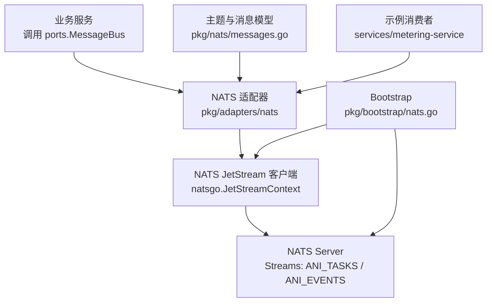
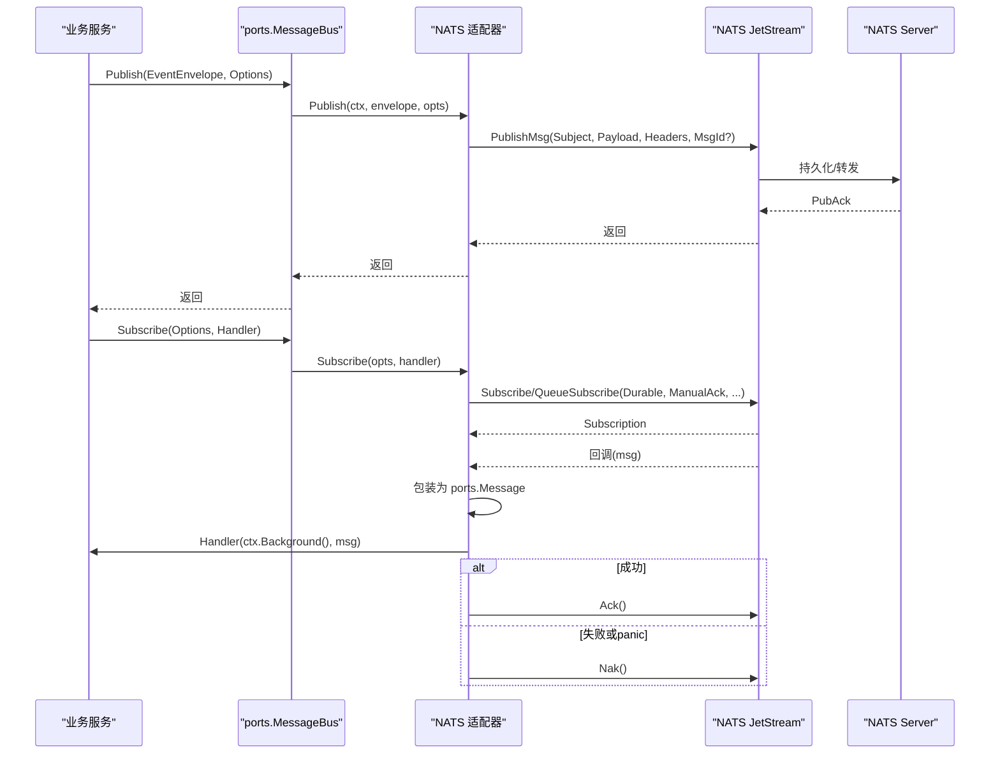
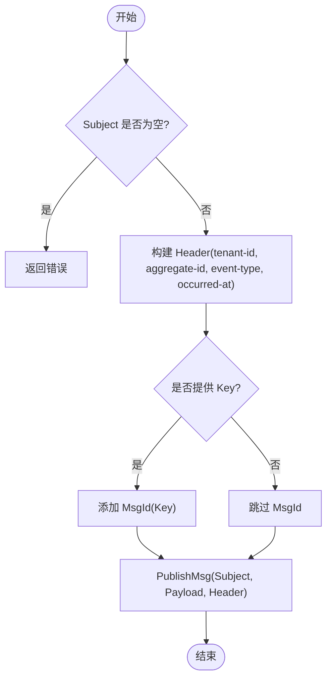
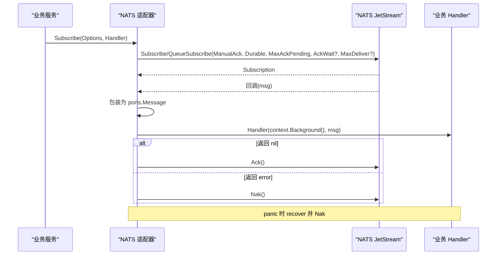
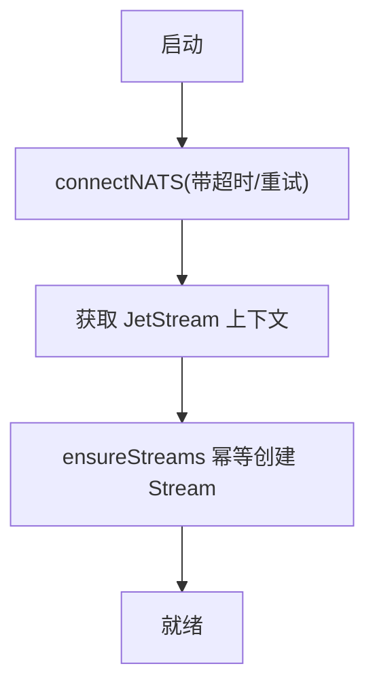
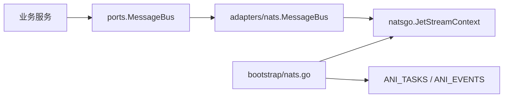

# 消息总线适配器

<cite>
**本文引用的文件**
- [repo/pkg/adapters/nats/message_bus.go](file://repo/pkg/adapters/nats/message_bus.go)
- [repo/pkg/adapters/nats/jetstream_iface.go](file://repo/pkg/adapters/nats/jetstream_iface.go)
- [repo/pkg/ports/message_bus.go](file://repo/pkg/ports/message_bus.go)
- [repo/pkg/bootstrap/nats.go](file://repo/pkg/bootstrap/nats.go)
- [repo/pkg/bootstrap/deps.go](file://repo/pkg/bootstrap/deps.go)
- [repo/pkg/nats/messages.go](file://repo/pkg/nats/messages.go)
- [repo/services/metering-service/internal/consumer.go](file://repo/services/metering-service/internal/consumer.go)
</cite>

## 目录
1. [简介](#简介)
2. [项目结构](#项目结构)
3. [核心组件](#核心组件)
4. [架构总览](#架构总览)
5. [详细组件分析](#详细组件分析)
6. [依赖关系分析](#依赖关系分析)
7. [性能与可靠性](#性能与可靠性)
8. [故障排查指南](#故障排查指南)
9. [结论](#结论)
10. [附录](#附录)

## 简介
本文件围绕 NATS JetStream 消息总线适配器的实现，系统说明连接管理、发布/订阅、流式处理、持久化配置、可靠性保证（至少一次）、顺序性控制、死信与重试、消息去重机制，以及事件驱动架构下的异步任务处理、服务间通信和数据同步实践。文档同时提供监控、调试与故障排查建议，帮助读者在生产环境中稳定使用消息总线。

## 项目结构
- 端口契约：定义 MessageBus、Message、SubscribeOptions、EventEnvelope 等接口与数据结构，屏蔽底层实现差异。
- NATS 适配器：基于 NATS JetStream 实现 MessageBus，封装发布、订阅、确认/拒绝、队列/消费者组、超时与最大投递次数等能力。
- 启动装配：负责 NATS 连接、JetStream 初始化、核心 Stream 创建与策略配置。
- 主题与消息模型：集中维护 NATS Subject 常量与业务消息体结构，统一发布/消费约定。
- 示例消费者：展示如何订阅事件、解析 Header、幂等与顺序控制、错误处理与 Ack/Nak 语义。

图表来源
- [repo/pkg/adapters/nats/message_bus.go:32-162](file://repo/pkg/adapters/nats/message_bus.go#L32-L162)
- [repo/pkg/bootstrap/nats.go:12-95](file://repo/pkg/bootstrap/nats.go#L12-L95)
- [repo/pkg/nats/messages.go:18-27](file://repo/pkg/nats/messages.go#L18-L27)
- [repo/services/metering-service/internal/consumer.go:39-139](file://repo/services/metering-service/internal/consumer.go#L39-L139)

章节来源
- [repo/pkg/ports/message_bus.go:8-66](file://repo/pkg/ports/message_bus.go#L8-L66)
- [repo/pkg/adapters/nats/message_bus.go:32-162](file://repo/pkg/adapters/nats/message_bus.go#L32-L162)
- [repo/pkg/bootstrap/nats.go:12-95](file://repo/pkg/bootstrap/nats.go#L12-L95)
- [repo/pkg/nats/messages.go:18-27](file://repo/pkg/nats/messages.go#L18-L27)

## 核心组件
- 端口契约（ports）
  - EventEnvelope：携带租户、聚合根、事件类型、负载与发生时间。
  - PublishOptions：指定 Subject 与可选 Key（用于消息去重）。
  - Message：只读消息视图，暴露 Subject/Data/Headers；不暴露 Ack/Nak，由适配器统一决策。
  - MessageHandler：返回 nil 表示成功（Ack），返回 error 表示失败（Nak），panic 时适配器兜底 Nak。
  - SubscribeOptions：Subject、Consumer（Durable）、Queue（队列组）、MaxInflight、AckWait、MaxDeliver。
  - MessageBus：Publish/Subscribe 两个方法。

- NATS 适配器（adapters/nats）
  - Publish：将 EventEnvelope 元数据写入 NATS Header，支持通过 Key 设置 MsgId 实现去重。
  - Subscribe：手动确认模式，支持 Durable Consumer、队列组、并发限制、AckWait、MaxDeliver；自动根据 handler 返回值执行 Ack/Nak，并捕获 panic 兜底。
  - jetStream 内部接口：仅暴露适配器所需方法，便于单测替换为 fake。

- 启动装配（bootstrap/nats）
  - connectNATS：带超时与重试的 NATS 连接，启用 JetStream。
  - ensureStreams：幂等创建 ANI_TASKS（WorkQueuePolicy）与 ANI_EVENTS（InterestPolicy）Stream，设置存储、保留策略与副本数。

- 主题与消息模型（nats/messages）
  - 主题命名规范：ani.tasks.* 用于任务（点对点），ani.events.* 用于事件（广播）。
  - 预定义主题常量与消息体结构，供各服务统一使用。

章节来源
- [repo/pkg/ports/message_bus.go:8-66](file://repo/pkg/ports/message_bus.go#L8-L66)
- [repo/pkg/adapters/nats/message_bus.go:32-162](file://repo/pkg/adapters/nats/message_bus.go#L32-L162)
- [repo/pkg/adapters/nats/jetstream_iface.go:7-23](file://repo/pkg/adapters/nats/jetstream_iface.go#L7-L23)
- [repo/pkg/bootstrap/nats.go:12-95](file://repo/pkg/bootstrap/nats.go#L12-L95)
- [repo/pkg/nats/messages.go:18-27](file://repo/pkg/nats/messages.go#L18-L27)

## 架构总览
NATS 适配器位于业务服务与 NATS JetStream 之间，向上暴露统一的 ports.MessageBus 接口，向下封装 JetStream 细节。启动阶段确保连接可用并创建必要的 Stream；运行时负责发布事件到主题、订阅主题并执行业务回调，统一处理确认/拒绝与异常。

图表来源
- [repo/pkg/adapters/nats/message_bus.go:32-162](file://repo/pkg/adapters/nats/message_bus.go#L32-L162)
- [repo/pkg/bootstrap/nats.go:12-95](file://repo/pkg/bootstrap/nats.go#L12-L95)

## 详细组件分析

### 发布流程（Publish）
- 输入校验：必须提供 Subject。
- 元数据注入：将 EventEnvelope 的租户、聚合根、事件类型、发生时间写入 NATS Header，便于消费侧重建上下文。
- 去重键：若提供 Key，则作为 MsgId 传入，利用 NATS 的幂等特性避免重复处理。
- 发布：通过 JetStream 发布消息，返回错误时向上抛出。

图表来源
- [repo/pkg/adapters/nats/message_bus.go:32-57](file://repo/pkg/adapters/nats/message_bus.go#L32-L57)

章节来源
- [repo/pkg/adapters/nats/message_bus.go:32-57](file://repo/pkg/adapters/nats/message_bus.go#L32-L57)

### 订阅流程（Subscribe）
- 参数校验：必须提供 Subject。
- 订阅选项：
  - ManualAck：交由适配器根据 handler 返回值统一确认。
  - Durable：可选 Consumer 名称，进程重启后从上次进度继续。
  - MaxAckPending：限制并发处理数量，防止背压。
  - Queue：可选队列组，实现负载均衡。
  - AckWait/MaxDeliver：可选，控制超时重投与最大投递次数。
- 回调封装：
  - 将 natsgo.Msg 包装为 ports.Message，暴露 Subject/Data/Headers。
  - 每条消息使用独立 context.Background()，避免订阅上下文取消影响正在处理的消息。
  - 捕获 panic，记录日志并触发 Nak。
  - 根据 handler 返回值决定 Ack/Nak。
- 返回 Subscription，支持 Drain 优雅关闭。

图表来源
- [repo/pkg/adapters/nats/message_bus.go:59-162](file://repo/pkg/adapters/nats/message_bus.go#L59-L162)

章节来源
- [repo/pkg/adapters/nats/message_bus.go:59-162](file://repo/pkg/adapters/nats/message_bus.go#L59-L162)

### 连接管理与流式配置
- 连接：带超时与重试，启用 JetStream，失败时记录警告并重试。
- 流式：
  - ANI_TASKS：WorkQueuePolicy，首个消费者 Ack 后即删除，适合点对点任务。
  - ANI_EVENTS：InterestPolicy，只要还有订阅者未消费就保留，适合事件广播。
  - 存储：FileStorage，保留时长与副本数可配置。

图表来源
- [repo/pkg/bootstrap/nats.go:12-95](file://repo/pkg/bootstrap/nats.go#L12-L95)

章节来源
- [repo/pkg/bootstrap/nats.go:12-95](file://repo/pkg/bootstrap/nats.go#L12-L95)

### 主题与消息模型
- 主题命名：
  - ani.tasks.{domain}.{action}：任务消息，WorkQueue 语义。
  - ani.events.task.{id}.{event}：任务生命周期事件，Interest 语义。
- 预定义主题常量与消息体结构，确保发布/消费双方一致。

章节来源
- [repo/pkg/nats/messages.go:1-27](file://repo/pkg/nats/messages.go#L1-L27)
- [repo/pkg/nats/messages.go:29-134](file://repo/pkg/nats/messages.go#L29-L134)

### 示例消费者（顺序与幂等）
- 从 Header 读取租户 ID，与 payload 中的 tenant_id 校验一致性。
- 毒消息处理：解析失败记 Error 日志后返回 nil（Ack 跳过，不重投）。
- 乱序过滤：基于 seenSeq 丢弃过期事件，保证顺序。
- 路由与处理：不同状态路由到对应动作，失败返回 error（Nak 重投），成功推进 seenSeq。

章节来源
- [repo/services/metering-service/internal/consumer.go:39-139](file://repo/services/metering-service/internal/consumer.go#L39-L139)

## 依赖关系分析
- 适配器依赖 NATS JetStream 客户端，通过内部接口解耦，便于测试替换。
- Bootstrap 在应用启动时完成连接与 Stream 初始化，并将 JetStream 上下文注入到适配器。
- 业务服务通过 ports.MessageBus 抽象与 NATS 解耦，可切换其他实现。

图表来源
- [repo/pkg/adapters/nats/jetstream_iface.go:7-23](file://repo/pkg/adapters/nats/jetstream_iface.go#L7-L23)
- [repo/pkg/bootstrap/nats.go:12-95](file://repo/pkg/bootstrap/nats.go#L12-L95)
- [repo/pkg/bootstrap/deps.go:250-270](file://repo/pkg/bootstrap/deps.go#L250-L270)

章节来源
- [repo/pkg/bootstrap/deps.go:250-270](file://repo/pkg/bootstrap/deps.go#L250-L270)

## 性能与可靠性
- 可靠性（至少一次）
  - ManualAck + AckWait + MaxDeliver：确保失败消息可重投，直至达到最大投递次数。
  - Durable Consumer：进程崩溃后恢复可从上次进度继续，避免丢失。
  - WorkQueue vs InterestPolicy：任务用 WorkQueue（首个消费者确认后删除），事件用 InterestPolicy（多订阅者广播）。
- 顺序性控制
  - MaxInflight=1：强制串行消费，保证同一实例的事件顺序（如计量采集场景）。
  - 消费侧 seenSeq：基于事件序列号进行乱序过滤，确保顺序正确。
- 消息去重
  - Publish 时设置 MsgId（Key）：利用 NATS 的幂等特性避免重复处理。
  - 消费侧幂等：对关键操作实现幂等逻辑，结合 MsgId 与业务幂等键双重保障。
- 死信与重试
  - MaxDeliver 耗尽后消息不再重投，需人工介入或迁移至死信主题（可在上层扩展）。
  - 当前适配器默认不直接写死信队列，可通过业务层判断与外部化策略实现。
- 并发与吞吐
  - MaxAckPending 控制并发，避免内存与下游压力过大。
  - Queue Group 实现水平扩展与负载均衡。

[本节为通用指导，无需特定文件引用]

## 故障排查指南
- 连接问题
  - 现象：启动时报 NATS 连接超时或无法初始化 JetStream。
  - 排查：检查 NATS 地址、网络连通性、认证信息；查看重试日志。
  - 参考：连接与重试逻辑。
- 订阅失败
  - 现象：Subscribe 返回错误。
  - 排查：确认 Subject 是否存在于 Stream 中；检查 Durable/Queue 配置；查看 NATS 服务端错误。
- 消息未确认
  - 现象：消息反复重投。
  - 排查：检查 handler 是否返回 error；确认 AckWait/MaxDeliver 配置；查看适配器日志中的 Nack/Ack 失败记录。
- 毒消息
  - 现象：解析失败导致频繁重投。
  - 处理：在消费侧识别毒消息，记录错误日志后返回 nil（Ack 跳过），避免阻塞队列。
- 顺序错乱
  - 现象：事件顺序不符合预期。
  - 排查：确认 MaxInflight=1；检查消费侧 seenSeq 逻辑；验证事件序列号是否正确递增。
- 死信与积压
  - 现象：大量消息堆积或达到最大投递次数。
  - 处理：定位失败原因，必要时迁移到死信队列；调整 MaxDeliver/AckWait；扩容消费者。

章节来源
- [repo/pkg/bootstrap/nats.go:12-95](file://repo/pkg/bootstrap/nats.go#L12-L95)
- [repo/pkg/adapters/nats/message_bus.go:59-162](file://repo/pkg/adapters/nats/message_bus.go#L59-L162)
- [repo/services/metering-service/internal/consumer.go:39-139](file://repo/services/metering-service/internal/consumer.go#L39-L139)

## 结论
NATS 消息总线适配器通过统一的 ports 接口屏蔽了底层实现细节，提供了可靠的发布/订阅能力，支持持久化、顺序性与幂等性控制。配合合理的 Stream 策略与消费者配置，可满足异步任务处理、服务间通信与数据同步等多种场景。生产环境应关注连接健康、消息确认、顺序与去重、死信与积压治理，并结合监控与日志进行持续优化。

[本节为总结，无需特定文件引用]

## 附录
- 最佳实践
  - 发布侧：始终携带必要 Header；对关键操作设置唯一 Key 以实现幂等。
  - 订阅侧：合理设置 MaxInflight、AckWait、MaxDeliver；实现毒消息跳过与顺序控制。
  - 流式配置：任务用 WorkQueue，事件用 Interest；根据需求调整副本数与保留策略。
  - 监控与可观测性：记录发布/订阅错误、Ack/Nak 失败、handler 异常与耗时指标。
- 相关设计模式
  - 事件溯源：以事件为中心记录状态变更，便于回放与审计。
  - Outbox 模式：事务内写入 outbox，再由调度器可靠发布，避免分布式事务。
  - 命令查询职责分离（CQRS）：读写路径分离，提升可扩展性与性能。

[本节为概念性内容，无需特定文件引用]