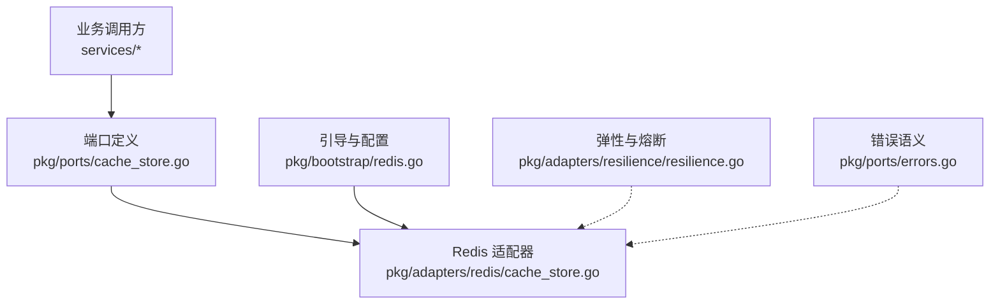
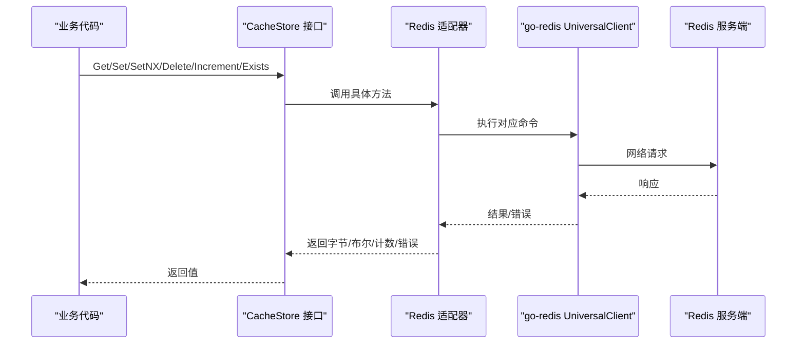
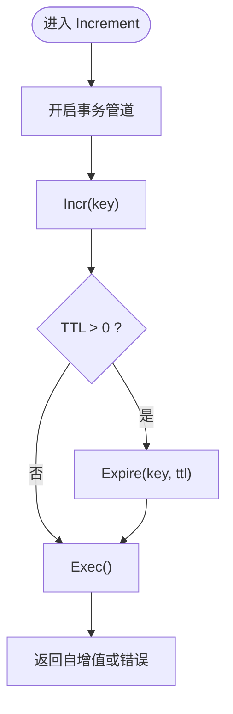
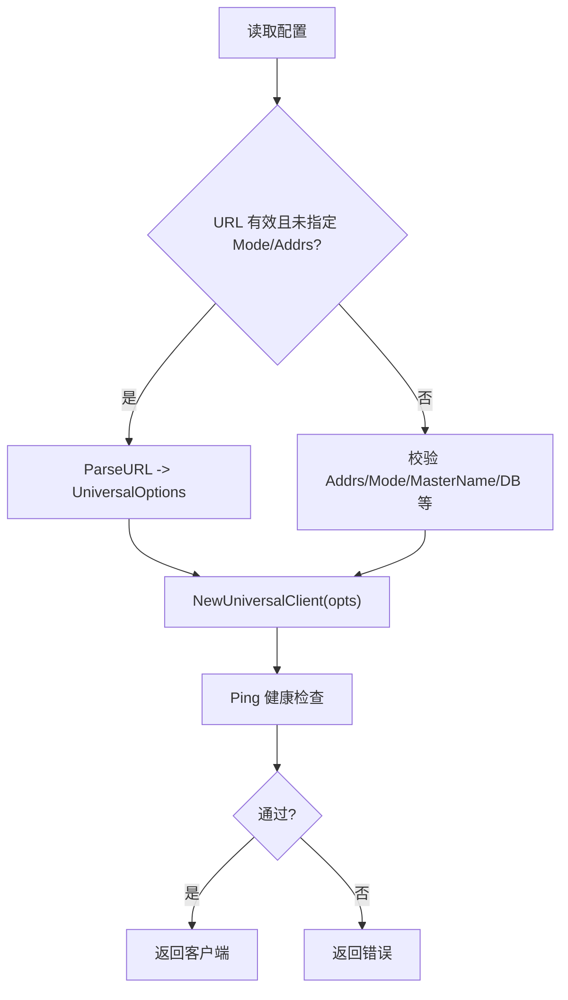
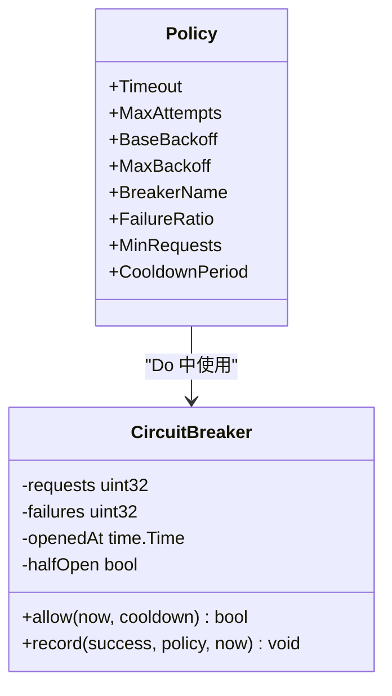
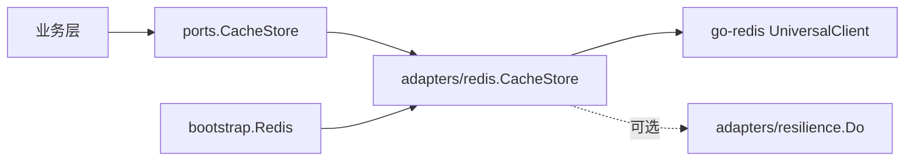

# 缓存适配器

<cite>
**本文引用的文件**
- [cache_store.go](file://repo/pkg/ports/cache_store.go)
- [errors.go](file://repo/pkg/ports/errors.go)
- [cache_store.go](file://repo/pkg/adapters/redis/cache_store.go)
- [redis.go](file://repo/pkg/bootstrap/redis.go)
- [resilience.go](file://repo/pkg/adapters/resilience/resilience.go)
- [degradation.go](file://repo/pkg/adapters/resilience/degradation.go)
</cite>

## 目录
1. [简介](#简介)
2. [项目结构](#项目结构)
3. [核心组件](#核心组件)
4. [架构总览](#架构总览)
5. [详细组件分析](#详细组件分析)
6. [依赖关系分析](#依赖关系分析)
7. [性能考量](#性能考量)
8. [故障排查指南](#故障排查指南)
9. [结论](#结论)
10. [附录](#附录)

## 简介
本文件面向 ANI 平台的“缓存适配器”能力，聚焦 Redis 适配器的实现与使用。内容涵盖：
- 连接配置（单节点、哨兵、集群）
- 数据结构选择与序列化策略
- 过期时间管理与原子计数
- 一致性、分布式锁、穿透防护、热点保护等高级特性建议
- 读写分离、预热、更新策略等最佳实践
- 性能调优与故障恢复方案

该文档以仓库中已实现的端口接口、Redis 适配器、启动引导与弹性重试/熔断组件为依据，并结合通用工程实践给出可操作的建议。

## 项目结构
ANI 将“缓存能力”抽象为端口（port），并提供 Redis 适配器实现；服务启动时通过引导模块创建并注入 Redis 客户端与适配器实例。

图表来源
- [cache_store.go:8-15](file://repo/pkg/ports/cache_store.go#L8-L15)
- [cache_store.go:13-75](file://repo/pkg/adapters/redis/cache_store.go#L13-L75)
- [redis.go:15-125](file://repo/pkg/bootstrap/redis.go#L15-L125)
- [resilience.go:13-223](file://repo/pkg/adapters/resilience/resilience.go#L13-L223)
- [errors.go:5-15](file://repo/pkg/ports/errors.go#L5-L15)

章节来源
- [cache_store.go:8-15](file://repo/pkg/ports/cache_store.go#L8-L15)
- [cache_store.go:13-75](file://repo/pkg/adapters/redis/cache_store.go#L13-L75)
- [redis.go:15-125](file://repo/pkg/bootstrap/redis.go#L15-L125)
- [resilience.go:13-223](file://repo/pkg/adapters/resilience/resilience.go#L13-L223)
- [errors.go:5-15](file://repo/pkg/ports/errors.go#L5-L15)

## 核心组件
- 缓存端口接口：定义 Get/Set/SetNX/Delete/Increment/Exists 的上下文化、带 TTL 的统一能力。
- Redis 适配器：基于 go-redis UniversalClient 实现上述接口，统一错误映射与原子操作。
- 引导与配置：支持 URL 或显式参数构建 UniversalOptions，校验模式（standalone/sentinel/cluster），建立连接并 Ping 验证。
- 弹性与熔断：提供重试、退避、熔断器，用于对下游依赖（如 Redis）的容错保护。
- 错误语义：统一的 ErrNotFound 等语义，便于上层一致处理。

章节来源
- [cache_store.go:8-15](file://repo/pkg/ports/cache_store.go#L8-L15)
- [cache_store.go:13-75](file://repo/pkg/adapters/redis/cache_store.go#L13-L75)
- [redis.go:15-125](file://repo/pkg/bootstrap/redis.go#L15-L125)
- [resilience.go:13-223](file://repo/pkg/adapters/resilience/resilience.go#L13-L223)
- [errors.go:5-15](file://repo/pkg/ports/errors.go#L5-L15)

## 架构总览
从调用到落地的关键路径如下：

图表来源
- [cache_store.go:8-15](file://repo/pkg/ports/cache_store.go#L8-L15)
- [cache_store.go:23-75](file://repo/pkg/adapters/redis/cache_store.go#L23-L75)

章节来源
- [cache_store.go:8-15](file://repo/pkg/ports/cache_store.go#L8-L15)
- [cache_store.go:23-75](file://repo/pkg/adapters/redis/cache_store.go#L23-L75)

## 详细组件分析

### 端口接口 CacheStore
- 设计要点
  - 所有方法接受 context，便于超时与取消传播。
  - Set/Increment 支持 TTL，便于过期控制。
  - SetNX 提供“不存在则设置”，可用于简单互斥与防重。
  - Exists 用于存在性判断，常用于穿透防护与条件写入。
- 错误约定
  - 未命中返回 ErrNotFound，便于上层区分“无数据”和“异常”。

章节来源
- [cache_store.go:8-15](file://repo/pkg/ports/cache_store.go#L8-L15)
- [errors.go:5-15](file://repo/pkg/ports/errors.go#L5-L15)

### Redis 适配器实现
- 连接与封装
  - 持有 goredis.UniversalClient，屏蔽底层拓扑差异。
- 读路径
  - Get：若底层返回 Nil，转换为 ErrNotFound；其他错误包装后返回。
- 写路径
  - Set：直接设置键值与 TTL。
  - SetNX：返回是否成功，适合并发场景下的“首次写入”保护。
  - Delete：删除键。
- 原子计数
  - Increment：使用管道批量执行 Incr + Expire，保证新键首次自增即带 TTL。
- 存在性检查
  - Exists：基于 EXISTS 命令统计是否存在。

图表来源
- [cache_store.go:56-66](file://repo/pkg/adapters/redis/cache_store.go#L56-L66)

章节来源
- [cache_store.go:23-75](file://repo/pkg/adapters/redis/cache_store.go#L23-L75)

### 引导与连接配置
- 配置来源
  - 支持 REDIS_URL 解析，或显式 Mode/Addrs/MasterName/Username/Password/SentinelUsername/SentinelPassword/DB。
- 模式校验
  - standalone/single：必须恰好一个地址。
  - sentinel：必须提供 MasterName。
  - cluster：至少两个地址。
- 连接健康检查
  - 构造 UniversalClient 后执行 Ping，失败即报错。
- 工厂方法
  - ConnectRedisCacheStore / ConnectRedisCacheStoreWithConfig：返回 CacheStore 与关闭函数。

图表来源
- [redis.go:27-64](file://repo/pkg/bootstrap/redis.go#L27-L64)
- [redis.go:80-125](file://repo/pkg/bootstrap/redis.go#L80-L125)

章节来源
- [redis.go:15-125](file://repo/pkg/bootstrap/redis.go#L15-L125)

### 弹性与熔断（适配缓存依赖）
- 重试与退避
  - Do(policy, fn)：按策略进行有限次重试，指数退避，支持超时包裹。
  - Retryable(err)：仅对可重试错误（超时、网络临时错误、5xx/429）重试。
- 熔断器
  - breakerFor：按名称共享状态机。
  - 半开探测：冷却期过后允许试探请求，成功则恢复，失败则再次打开。
- 依赖强弱
  - 通过 DependencyMode 标记强/弱依赖，便于在更高层做降级决策。

图表来源
- [resilience.go:13-223](file://repo/pkg/adapters/resilience/resilience.go#L13-L223)
- [degradation.go:3-22](file://repo/pkg/adapters/resilience/degradation.go#L3-L22)

章节来源
- [resilience.go:13-223](file://repo/pkg/adapters/resilience/resilience.go#L13-L223)
- [degradation.go:3-22](file://repo/pkg/adapters/resilience/degradation.go#L3-L22)

## 依赖关系分析
- 松耦合分层
  - 业务层只依赖 ports.CacheStore 接口，不感知 Redis 细节。
  - Redis 适配器仅依赖 go-redis 与端口接口。
  - 引导模块负责装配与生命周期管理。
- 外部依赖
  - go-redis/v9：提供 UniversalClient，统一多拓扑访问。
  - 弹性组件：为上层调用提供重试/熔断能力，降低瞬时故障影响。

图表来源
- [cache_store.go:8-15](file://repo/pkg/ports/cache_store.go#L8-L15)
- [cache_store.go:13-75](file://repo/pkg/adapters/redis/cache_store.go#L13-L75)
- [redis.go:15-125](file://repo/pkg/bootstrap/redis.go#L15-L125)
- [resilience.go:13-223](file://repo/pkg/adapters/resilience/resilience.go#L13-L223)

章节来源
- [cache_store.go:8-15](file://repo/pkg/ports/cache_store.go#L8-L15)
- [cache_store.go:13-75](file://repo/pkg/adapters/redis/cache_store.go#L13-L75)
- [redis.go:15-125](file://repo/pkg/bootstrap/redis.go#L15-L125)
- [resilience.go:13-223](file://repo/pkg/adapters/resilience/resilience.go#L13-L223)

## 性能考量
- 连接与拓扑
  - 优先使用 UniversalClient 自动路由，减少客户端维护成本。
  - 生产环境建议使用 Sentinel 或 Cluster 提升可用性。
- 序列化与体积
  - 接口以 []byte 传输，建议在业务层采用高效序列化（如 protobuf/msgpack）。
  - 控制单键大小，避免大对象导致网络与内存压力。
- 过期与清理
  - 合理设置 TTL，避免长尾热点键长期驻留。
  - 增量计数配合 TTL，确保计数器不会无限增长。
- 批量化与原子性
  - 使用管道/事务减少往返；当前 Increment 已用管道组合 Incr+Expire。
- 弹性与背压
  - 结合 resilience.Do 设置合理的 MaxAttempts、BaseBackoff、MaxBackoff。
  - 启用熔断器，防止雪崩；根据 FailureRatio/MinRequests 调整阈值。
- 监控与观测
  - 记录命中率、延迟分布、错误率、熔断开关状态。
  - 关注 Redis 侧慢查询与内存占用。

[本节为通用性能建议，不直接分析具体文件]

## 故障排查指南
- 常见错误与定位
  - 连接失败：检查 Redis 地址、认证信息、模式配置（standalone/sentinel/cluster）。
  - 健康检查失败：引导阶段会 Ping，失败需检查网络与权限。
  - 未命中：Get 返回 ErrNotFound 表示键不存在，非异常。
  - 写入失败：Set/SetNX/Del 失败时查看错误包装信息。
  - 计数异常：Increment 失败时检查管道执行错误。
- 弹性策略
  - 针对超时/网络抖动/5xx/429 的重试策略应配合幂等性与去重键。
  - 熔断器打开时快速失败，避免放大故障面。
- 回滚与恢复
  - 启动失败：修正配置后重启；必要时回滚版本。
  - 数据不一致：利用 SetNX 与业务幂等键重建一致性。
  - 缓存雪崩：分散 TTL、增加随机抖动；热点键单独保护。

章节来源
- [redis.go:27-64](file://repo/pkg/bootstrap/redis.go#L27-L64)
- [redis.go:80-125](file://repo/pkg/bootstrap/redis.go#L80-L125)
- [cache_store.go:23-75](file://repo/pkg/adapters/redis/cache_store.go#L23-L75)
- [resilience.go:56-133](file://repo/pkg/adapters/resilience/resilience.go#L56-L133)
- [errors.go:5-15](file://repo/pkg/ports/errors.go#L5-L15)

## 结论
ANI 的缓存适配器通过清晰的 port/adapter 分层实现了与 Redis 的解耦，提供了基础的缓存能力与原子计数，并通过引导模块统一管理连接与拓扑。结合弹性与熔断组件，可在不稳定环境下保持系统韧性。对于一致性、分布式锁、穿透防护与热点保护等高级特性，建议在业务层基于现有 SetNX/Exists/Increment 等原语扩展实现，并配合监控与限流策略保障稳定性。

[本节为总结性内容，不直接分析具体文件]

## 附录

### 连接配置清单
- 必填项
  - 地址列表或 URL
  - 认证信息（用户名/密码）
  - 数据库编号（DB）
- 模式
  - standalone/single：单节点
  - sentinel：主从高可用，需提供 MasterName
  - cluster：分片集群，至少两个地址
- 健康检查
  - 启动时 Ping，失败即报错

章节来源
- [redis.go:15-125](file://repo/pkg/bootstrap/redis.go#L15-L125)

### 数据结构与序列化建议
- 键设计
  - 命名空间隔离（租户/资源类型/ID）
  - 短小稳定，避免动态拼接过长键
- 值格式
  - 二进制友好序列化（protobuf/msgpack）
  - 控制单键体积，避免大对象
- 过期策略
  - 业务相关 TTL 与逻辑过期并存
  - 计数器使用 TTL 防止常驻

[本节为通用建议，不直接分析具体文件]

### 一致性、分布式锁与穿透防护
- 一致性
  - 先更新存储再删除缓存，或采用延迟双删（结合消息队列）
  - 使用 SetNX 作为“首次写入”保护，避免重复初始化
- 分布式锁
  - 基于 SetNX + TTL 实现简易锁，注意续租与释放
  - 复杂场景可使用 Lua 脚本保证原子性
- 穿透防护
  - 空值缓存（短 TTL）+ 布隆过滤器（可选）
  - 使用 Exists 预判，减少无效请求

[本节为通用建议，不直接分析具体文件]

### 热点数据保护
- 本地缓存叠加：进程内多级缓存（L1/L2）
- 限流与降级：结合熔断与速率限制
- 预取与预热：启动或事件触发时主动加载热点键

[本节为通用建议，不直接分析具体文件]

### 读写分离与更新策略
- 读多写少：读走缓存，写时失效或异步刷新
- 写扩散 vs 拉取：按数据规模与一致性要求选择
- 缓存更新
  - 失效模式：写库后删缓存
  - 更新模式：写库后更新缓存（谨慎使用，注意并发）

[本节为通用建议，不直接分析具体文件]

### 性能调优与故障恢复
- 调优
  - 连接池大小、超时、重试次数与退避策略
  - 批量操作与管道使用
  - 监控命中率、延迟、错误率、熔断状态
- 恢复
  - 快速失败与熔断
  - 降级到直连后端或只读模式
  - 配置热更新与灰度发布

[本节为通用建议，不直接分析具体文件]