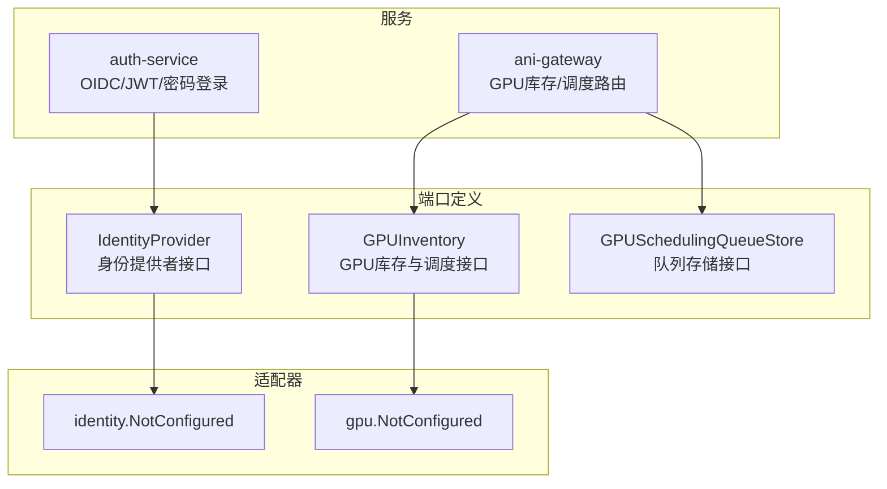
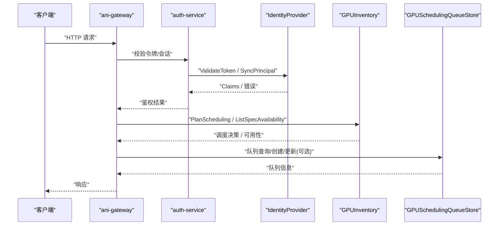
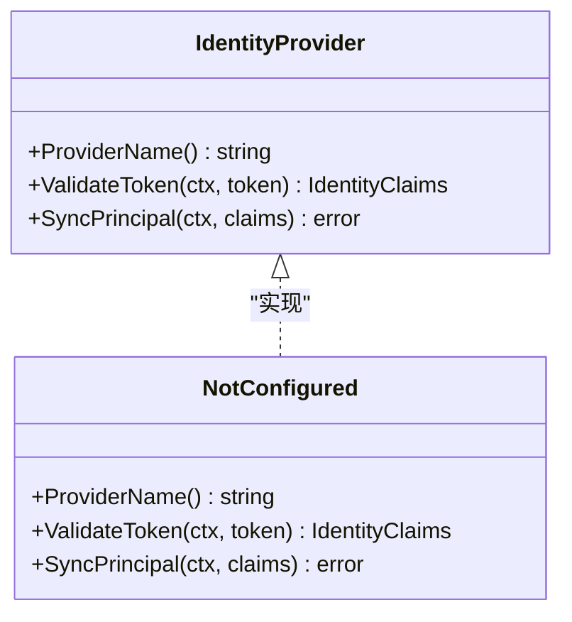
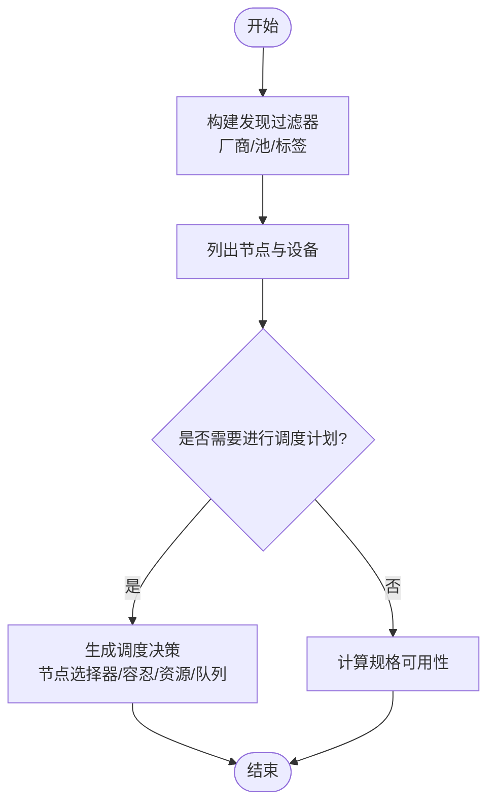
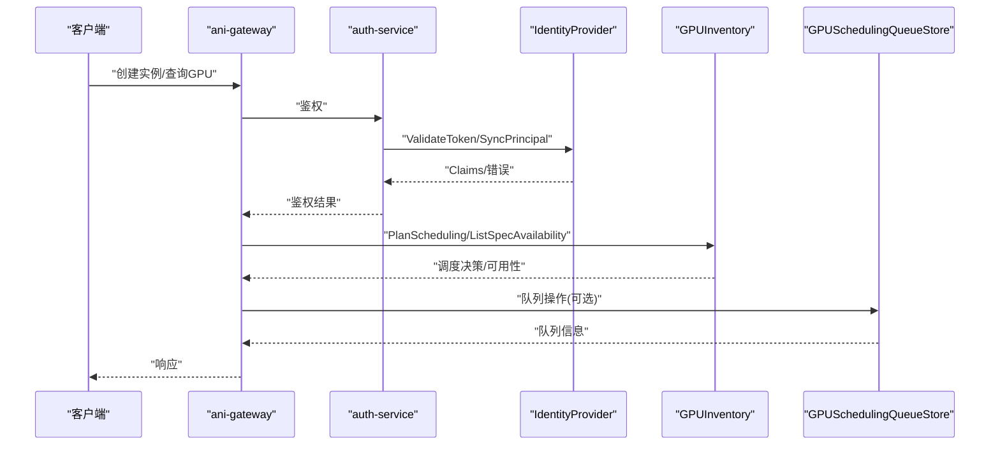
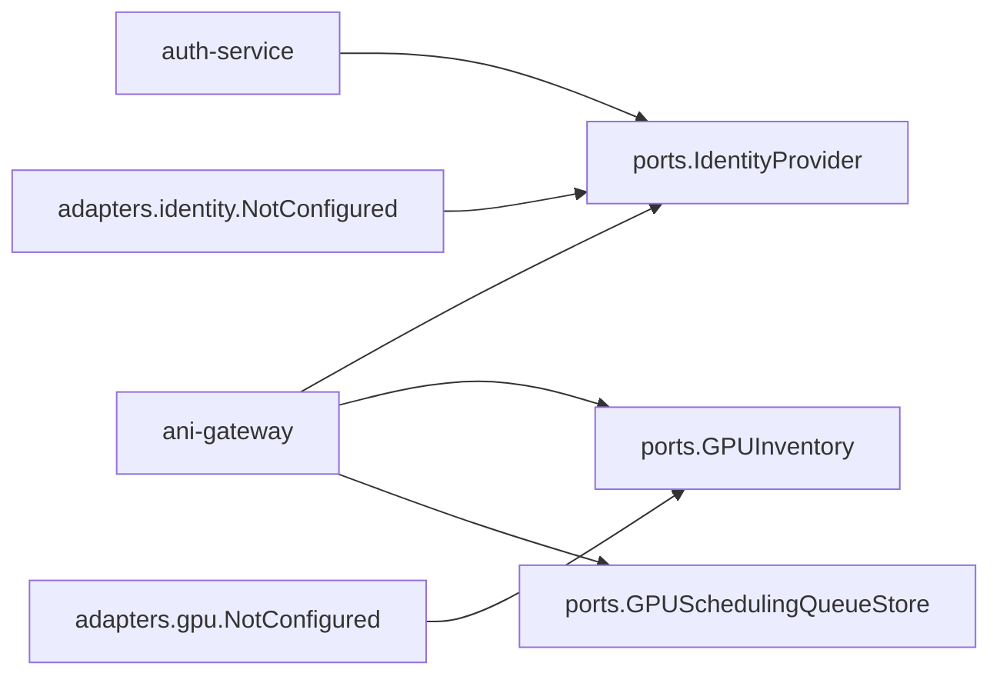

# 身份和GPU适配器

<cite>
**本文引用的文件**
- [identity_provider.go](file://repo/pkg/ports/identity_provider.go)
- [gpu_inventory.go](file://repo/pkg/ports/gpu_inventory.go)
- [gpu_scheduling.go](file://repo/pkg/ports/gpu_scheduling.go)
- [not_configured.go（身份）](file://repo/pkg/adapters/identity/not_configured.go)
- [not_configured.go（GPU）](file://repo/pkg/adapters/gpu/not_configured.go)
- [auth_service.go](file://repo/services/auth-service/internal/service/auth_service.go)
- [oidc.go](file://repo/services/auth-service/internal/service/oidc.go)
- [jwt.go](file://repo/services/auth-service/internal/service/jwt.go)
- [password_login.go](file://repo/services/auth-service/internal/service/password_login.go)
- [platform_login.go](file://repo/services/auth-service/internal/service/platform_login.go)
- [gpu_inventory_runtime.go](file://repo/services/ani-gateway/gpu_inventory_runtime.go)
- [gpu_scheduling_resources.go](file://repo/services/ani-gateway/internal/router/gpu_scheduling_resources.go)
- [gpu_container_resources.go](file://repo/services/ani-gateway/internal/router/gpu_container_resources.go)
</cite>

## 目录
1. [简介](#简介)
2. [项目结构](#项目结构)
3. [核心组件](#核心组件)
4. [架构总览](#架构总览)
5. [详细组件分析](#详细组件分析)
6. [依赖关系分析](#依赖关系分析)
7. [性能考虑](#性能考虑)
8. [故障排查指南](#故障排查指南)
9. [结论](#结论)
10. [附录：集成与测试指南](#附录：集成与测试指南)

## 简介
本文件聚焦于平台中的“身份认证适配器”与“GPU资源适配器”，围绕以下目标展开：
- 阐述身份认证适配器的设计模式，说明如何以统一接口对接多种身份提供商。
- 详细说明GPU资源适配器的能力边界：GPU检测、资源分配、多租户隔离、可用性评估等。
- 提供新身份提供商与新GPU供应商的集成指引，包括接口定义、配置方式与测试方法。

## 项目结构
本项目采用“端口-适配器”分层：
- 端口层（pkg/ports）：定义稳定的服务契约（接口与数据模型），如身份提供者接口、GPU库存与调度接口。
- 适配器层（pkg/adapters）：提供默认或占位实现，便于在未配置时返回明确错误。
- 服务层（services/*）：网关与服务将端口组合为可运行的HTTP/内部调用流程。

图表来源
- [identity_provider.go:5-17](file://repo/pkg/ports/identity_provider.go#L5-L17)
- [gpu_inventory.go:155-171](file://repo/pkg/ports/gpu_inventory.go#L155-L171)
- [gpu_scheduling.go:62-74](file://repo/pkg/ports/gpu_scheduling.go#L62-L74)
- [not_configured.go（身份）:9-23](file://repo/pkg/adapters/identity/not_configured.go#L9-L23)
- [not_configured.go（GPU）:9-25](file://repo/pkg/adapters/gpu/not_configured.go#L9-L25)

章节来源
- [identity_provider.go:5-17](file://repo/pkg/ports/identity_provider.go#L5-L17)
- [gpu_inventory.go:5-171](file://repo/pkg/ports/gpu_inventory.go#L5-L171)
- [gpu_scheduling.go:9-83](file://repo/pkg/ports/gpu_scheduling.go#L9-L83)
- [not_configured.go（身份）:9-23](file://repo/pkg/adapters/identity/not_configured.go#L9-L23)
- [not_configured.go（GPU）:9-25](file://repo/pkg/adapters/gpu/not_configured.go#L9-L25)

## 核心组件
- 身份认证适配器
  - 通过 IdentityProvider 接口抽象不同身份源（OIDC、平台账号、API Key 等）。
  - 支持令牌校验、主体同步（用户/组映射到租户上下文）。
- GPU资源适配器
  - 通过 GPUInventory 抽象异构GPU发现、节点能力建模、计划调度与规格可用性评估。
  - 通过 GPUSchedulingQueueStore 抽象租户级队列CRD的增删改查，保障多租户隔离与幂等性。

章节来源
- [identity_provider.go:5-17](file://repo/pkg/ports/identity_provider.go#L5-L17)
- [gpu_inventory.go:22-171](file://repo/pkg/ports/gpu_inventory.go#L22-L171)
- [gpu_scheduling.go:18-83](file://repo/pkg/ports/gpu_scheduling.go#L18-L83)

## 架构总览
身份认证与GPU调度在网关和服务中协同工作：
- 网关接收请求后，先进行身份鉴权（OIDC/JWT/密码登录），再根据业务路由到GPU相关能力。
- GPU能力由GPU库存与调度端口暴露，适配器负责具体后端（Kubernetes标签、设备插件、厂商SDK等）。

图表来源
- [auth_service.go](file://repo/services/auth-service/internal/service/auth_service.go)
- [oidc.go](file://repo/services/auth-service/internal/service/oidc.go)
- [jwt.go](file://repo/services/auth-service/internal/service/jwt.go)
- [password_login.go](file://repo/services/auth-service/internal/service/password_login.go)
- [platform_login.go](file://repo/services/auth-service/internal/service/platform_login.go)
- [gpu_inventory_runtime.go](file://repo/services/ani-gateway/gpu_inventory_runtime.go)
- [gpu_scheduling_resources.go](file://repo/services/ani-gateway/internal/router/gpu_scheduling_resources.go)

## 详细组件分析

### 身份认证适配器
- 设计要点
  - 统一接口：IdentityProvider 暴露 ProviderName、ValidateToken、SyncPrincipal。
  - 未配置占位：identity.NotConfigured 在所有方法上返回“未配置”错误，便于启动期快速失败。
  - 服务侧实现：auth-service 内聚合 OIDC、JWT、密码登录、平台登录等策略，按配置选择。
- 数据模型
  - IdentityClaims 包含主体、租户ID、邮箱、姓名、组等信息，用于后续授权与配额判断。
- 典型流程
  - 客户端携带令牌访问网关；网关调用 auth-service 校验；成功后将主体与租户注入上下文，继续业务处理。

图表来源
- [identity_provider.go:5-17](file://repo/pkg/ports/identity_provider.go#L5-L17)
- [not_configured.go（身份）:9-23](file://repo/pkg/adapters/identity/not_configured.go#L9-L23)

章节来源
- [identity_provider.go:5-17](file://repo/pkg/ports/identity_provider.go#L5-L17)
- [not_configured.go（身份）:9-23](file://repo/pkg/adapters/identity/not_configured.go#L9-L23)
- [auth_service.go](file://repo/services/auth-service/internal/service/auth_service.go)
- [oidc.go](file://repo/services/auth-service/internal/service/oidc.go)
- [jwt.go](file://repo/services/auth-service/internal/service/jwt.go)
- [password_login.go](file://repo/services/auth-service/internal/service/password_login.go)
- [platform_login.go](file://repo/services/auth-service/internal/service/platform_login.go)

### GPU资源适配器
- 能力边界
  - 节点与设备建模：GPUNodeClass/GPUDeviceClass 描述节点、设备、虚拟化模式、驱动版本、能力列表等。
  - 发现与过滤：GPUDiscoveryFilter 支持按厂商、池、标签筛选。
  - 调度计划：PlanScheduling 基于需求（内存、数量、虚拟化模式、能力、池、队列）输出调度决策（节点选择器、容忍、资源名/数量、运行时类、调度器、队列、原因等）。
  - 规格可用性：ListSpecAvailability 计算每个规格的可用状态（available/full/device_full/unavailable），结合租户配额与空闲设备数。
- 多租户隔离
  - 队列存储接口强制使用请求上下文中的 tenant_id 进行隔离，并保护平台默认队列不被修改。
  - 调度请求携带 TenantID 与 WorkloadClass，用于队列选择与配额检查。
- 未配置占位：gpu.NotConfigured 对所有方法返回“未配置”错误，便于部署期快速失败。

图表来源
- [gpu_inventory.go:64-171](file://repo/pkg/ports/gpu_inventory.go#L64-L171)
- [gpu_scheduling.go:9-83](file://repo/pkg/ports/gpu_scheduling.go#L9-L83)
- [not_configured.go（GPU）:9-25](file://repo/pkg/adapters/gpu/not_configured.go#L9-L25)

章节来源
- [gpu_inventory.go:5-171](file://repo/pkg/ports/gpu_inventory.go#L5-L171)
- [gpu_scheduling.go:9-83](file://repo/pkg/ports/gpu_scheduling.go#L9-L83)
- [not_configured.go（GPU）:9-25](file://repo/pkg/adapters/gpu/not_configured.go#L9-L25)

### 网关与服务的协作
- 身份链路
  - 网关将鉴权委托给 auth-service；auth-service 根据配置选择 OIDC/JWT/密码/平台登录策略，最终产出 Claims 并回传网关。
- GPU链路
  - 网关通过 gpu_inventory_runtime 暴露GPU能力；router 层将请求分发到库存与调度资源处理器；必要时读写队列存储。

图表来源
- [auth_service.go](file://repo/services/auth-service/internal/service/auth_service.go)
- [oidc.go](file://repo/services/auth-service/internal/service/oidc.go)
- [jwt.go](file://repo/services/auth-service/internal/service/jwt.go)
- [password_login.go](file://repo/services/auth-service/internal/service/password_login.go)
- [platform_login.go](file://repo/services/auth-service/internal/service/platform_login.go)
- [gpu_inventory_runtime.go](file://repo/services/ani-gateway/gpu_inventory_runtime.go)
- [gpu_scheduling_resources.go](file://repo/services/ani-gateway/internal/router/gpu_scheduling_resources.go)

## 依赖关系分析
- 松耦合
  - 服务仅依赖端口定义，不直接依赖具体适配器实现，便于替换与扩展。
- 关键依赖链
  - 网关 → GPUInventory/GPUSchedulingQueueStore
  - 认证服务 → IdentityProvider
  - 适配器 → 端口（反向依赖，保证契约稳定）

图表来源
- [identity_provider.go:5-17](file://repo/pkg/ports/identity_provider.go#L5-L17)
- [gpu_inventory.go:155-171](file://repo/pkg/ports/gpu_inventory.go#L155-L171)
- [gpu_scheduling.go:62-74](file://repo/pkg/ports/gpu_scheduling.go#L62-L74)
- [not_configured.go（身份）:9-23](file://repo/pkg/adapters/identity/not_configured.go#L9-L23)
- [not_configured.go（GPU）:9-25](file://repo/pkg/adapters/gpu/not_configured.go#L9-L25)

章节来源
- [identity_provider.go:5-17](file://repo/pkg/ports/identity_provider.go#L5-L17)
- [gpu_inventory.go:155-171](file://repo/pkg/ports/gpu_inventory.go#L155-L171)
- [gpu_scheduling.go:62-83](file://repo/pkg/ports/gpu_scheduling.go#L62-L83)

## 性能考虑
- 发现与计划
  - 建议对节点与设备列表做缓存，减少高频查询带来的开销。
  - PlanScheduling 应尽量避免全量扫描，优先利用标签与预计算的可用设备计数。
- 队列与配额
  - 队列CRD操作需具备幂等性与重试机制，避免重复写入。
  - 规格可用性计算应与配额服务解耦，按需合并结果，降低耦合延迟。
- 超时与熔断
  - 对外部依赖（设备插件、厂商SDK）设置合理超时与熔断，防止雪崩。

[本节为通用指导，不直接分析具体文件]

## 故障排查指南
- 常见错误
  - 未配置：当适配器未正确初始化时，会返回“未配置”错误，便于定位配置缺失。
  - 队列不存在/冲突/受保护：队列存储层定义了明确的错误类型，便于上层映射为HTTP状态码。
- 定位步骤
  - 确认适配器已注入且非 NotConfigured。
  - 检查租户上下文是否正确传递至队列存储与调度请求。
  - 核对节点标签、设备插件与厂商驱动版本是否与期望一致。

章节来源
- [not_configured.go（身份）:9-23](file://repo/pkg/adapters/identity/not_configured.go#L9-L23)
- [not_configured.go（GPU）:9-25](file://repo/pkg/adapters/gpu/not_configured.go#L9-L25)
- [gpu_scheduling.go:76-83](file://repo/pkg/ports/gpu_scheduling.go#L76-L83)

## 结论
- 通过端口-适配器模式，平台实现了身份与GPU能力的可插拔与可扩展。
- 身份认证适配器以统一接口屏蔽多提供商差异；GPU适配器以标准化模型表达异构设备与调度意图。
- 网关与服务通过端口组合能力，形成清晰的职责边界与可维护的演进路径。

[本节为总结，不直接分析具体文件]

## 附录：集成与测试指南

### 新增身份提供商
- 接口要求
  - 实现 ports.IdentityProvider 的三个方法：ProviderName、ValidateToken、SyncPrincipal。
  - ValidateToken 需解析并返回 IdentityClaims；SyncPrincipal 将主体与组同步到租户上下文。
- 配置方式
  - 在服务启动时将具体实现注入到认证服务，确保 ProviderName 与配置一致。
- 测试方法
  - 单元测试：覆盖令牌校验成功/失败、主体同步成功/失败分支。
  - 集成测试：对接真实或Mock的身份提供方，验证端到端鉴权流程。

章节来源
- [identity_provider.go:5-17](file://repo/pkg/ports/identity_provider.go#L5-L17)
- [auth_service.go](file://repo/services/auth-service/internal/service/auth_service.go)
- [oidc.go](file://repo/services/auth-service/internal/service/oidc.go)
- [jwt.go](file://repo/services/auth-service/internal/service/jwt.go)
- [password_login.go](file://repo/services/auth-service/internal/service/password_login.go)
- [platform_login.go](file://repo/services/auth-service/internal/service/platform_login.go)

### 新增GPU供应商
- 接口要求
  - 实现 ports.GPUInventory：ListNodeClasses、GetNodeClass、PlanScheduling、ListSpecAvailability。
  - 如需队列管理，实现 ports.GPUSchedulingQueueStore，并遵循租户隔离与幂等约束。
- 配置方式
  - 在GPU适配器中注册新的供应商实现，并通过发现过滤器（厂商、池、标签）控制可见范围。
- 测试方法
  - 单元测试：构造不同节点/设备场景，验证计划与可用性计算。
  - 集成测试：对接真实设备插件或厂商SDK，验证端到端调度与资源分配。

章节来源
- [gpu_inventory.go:22-171](file://repo/pkg/ports/gpu_inventory.go#L22-L171)
- [gpu_scheduling.go:18-83](file://repo/pkg/ports/gpu_scheduling.go#L18-L83)
- [not_configured.go（GPU）:9-25](file://repo/pkg/adapters/gpu/not_configured.go#L9-L25)

### 网关侧接入点
- GPU能力入口
  - 通过 gpu_inventory_runtime 暴露GPU库存与调度能力。
  - 通过 gpu_scheduling_resources 与 gpu_container_resources 组织路由与参数校验。
- 建议
  - 在路由层增加租户上下文透传与权限校验。
  - 对外部依赖增加超时、重试与熔断策略。

章节来源
- [gpu_inventory_runtime.go](file://repo/services/ani-gateway/gpu_inventory_runtime.go)
- [gpu_scheduling_resources.go](file://repo/services/ani-gateway/internal/router/gpu_scheduling_resources.go)
- [gpu_container_resources.go](file://repo/services/ani-gateway/internal/router/gpu_container_resources.go)