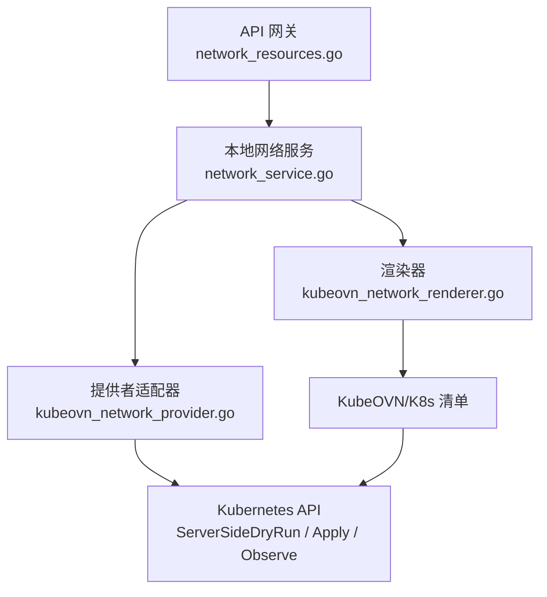
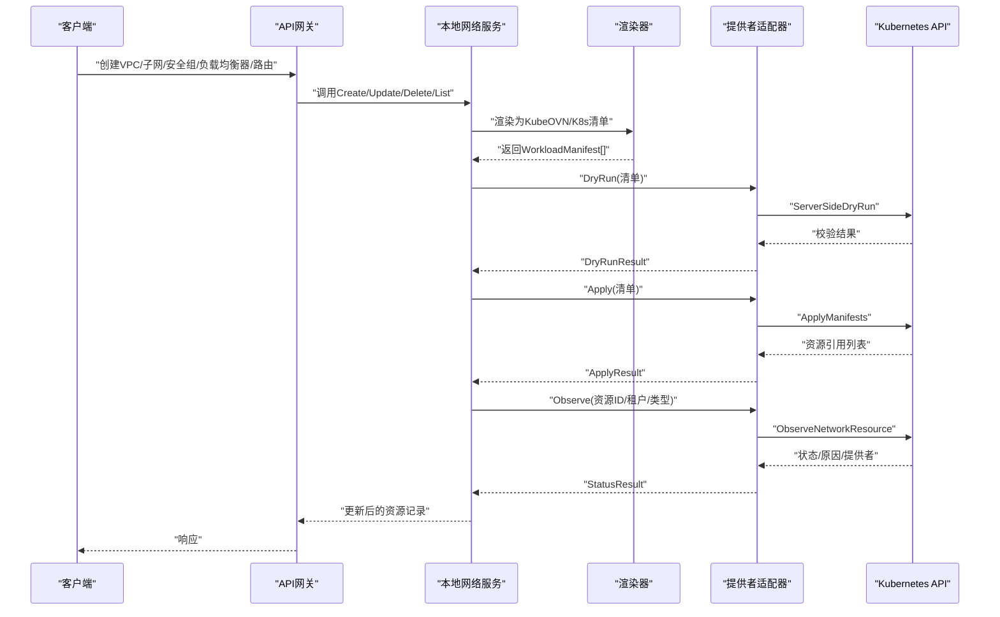
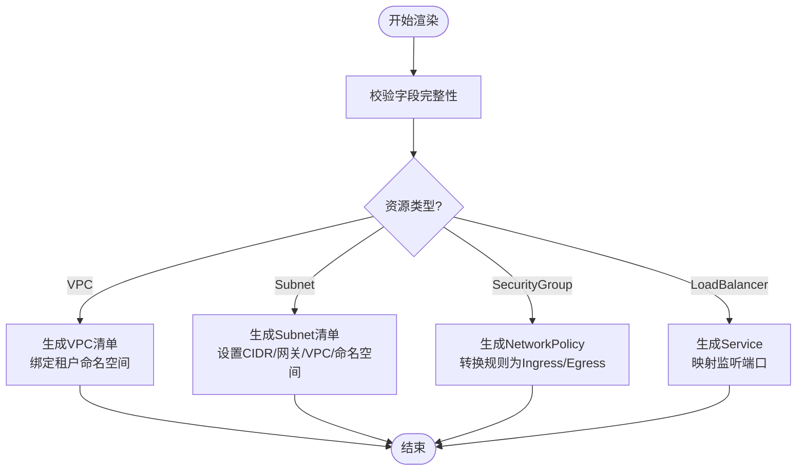
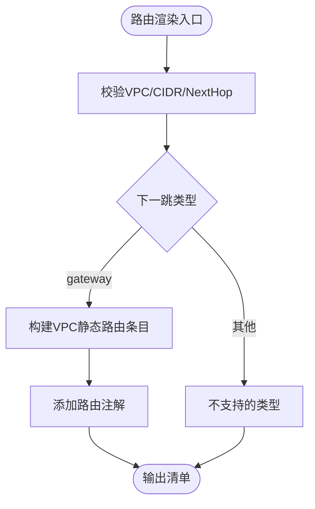
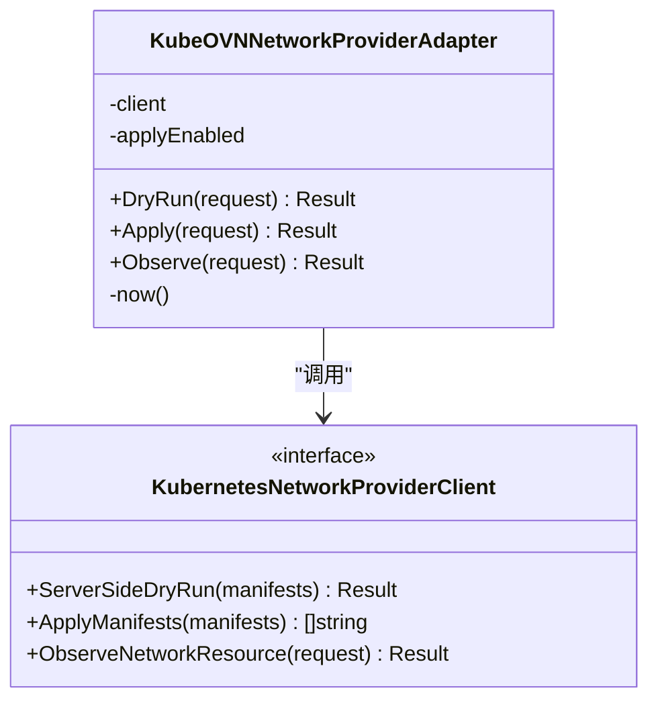
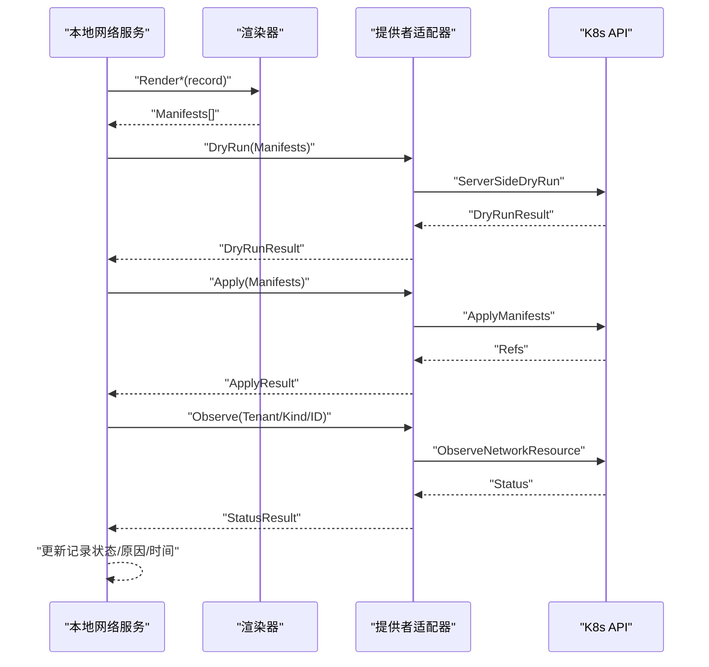
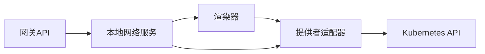

# KubeOVN网络提供商

<cite>
**本文引用的文件**
- [kubeovn_network_provider.go](file://repo/pkg/adapters/runtime/kubeovn_network_provider.go)
- [kubeovn_network_renderer.go](file://repo/pkg/adapters/runtime/kubeovn_network_renderer.go)
- [network_service.go](file://repo/pkg/adapters/runtime/network_service.go)
- [network_resources.go](file://services/ani-gateway/internal/router/network_resources.go)
- [network_resources_test.go](file://services/ani-gateway/internal/router/network_resources_test.go)
- [network_service_test.go](file://repo/pkg/adapters/runtime/network_service_test.go)
- [10-kubeovn-tenant-vpc-template.yaml](file://repo/deploy/manifests/m1-infra-c/10-kubeovn-tenant-vpc-template.yaml)
- [kubeovn-network-live-gate.yaml](file://repo/deploy/real-k8s-lab/kubeovn-network-live-gate.yaml)
- [core-beta-readiness.yaml](file://repo/api/core-beta-readiness.yaml)
- [core-v1-compatibility-baseline.yaml](file://repo/api/core-v1-compatibility-baseline.yaml)
- [deps_test.go](file://repo/pkg/bootstrap/deps_test.go)
</cite>

## 目录
1. [简介](#简介)
2. [项目结构](#项目结构)
3. [核心组件](#核心组件)
4. [架构总览](#架构总览)
5. [详细组件分析](#详细组件分析)
6. [依赖关系分析](#依赖关系分析)
7. [性能与优化](#性能与优化)
8. [故障诊断与可观测性](#故障诊断与可观测性)
9. [迁移、扩容与恢复](#迁移扩容与恢复)
10. [结论](#结论)

## 简介
本文件面向KubeOVN网络提供商的集成实现，系统性说明VPC、子网、路由与安全组的创建与管理流程，资源映射与拓扑自动发现机制，IP地址分配策略与隔离实现，以及负载均衡器配置。同时给出网络性能优化建议、监控指标与告警规则思路，并提供迁移、扩容与故障恢复的操作指引。

## 项目结构
本项目将“网络资源模型”“渲染器”“提供者适配器”“网关API”和“部署清单”分层组织：
- 渲染层：将平台内部的网络资源记录渲染为Kubernetes/KubeOVN清单（VPC、Subnet、NetworkPolicy、Service/LB、静态路由）。
- 适配层：通过DryRun/Apply/Observe三阶段与Kubernetes API交互，完成校验、应用与状态观察。
- 服务层：本地网络服务维护资源状态、编排渲染与提供者执行，并暴露统一接口。
- 网关层：对外提供REST API，承载VPC、子网、安全组、负载均衡器与路由等能力。
- 部署与验证：提供模板与Live Gate用于真实环境验证。

**图示来源**
- [network_resources.go:235-244](file://services/ani-gateway/internal/router/network_resources.go#L235-L244)
- [network_service.go:802-833](file://repo/pkg/adapters/runtime/network_service.go#L802-L833)
- [kubeovn_network_renderer.go:19-142](file://repo/pkg/adapters/runtime/kubeovn_network_renderer.go#L19-L142)
- [kubeovn_network_provider.go:50-134](file://repo/pkg/adapters/runtime/kubeovn_network_provider.go#L50-L134)

**章节来源**
- [network_resources.go:235-244](file://services/ani-gateway/internal/router/network_resources.go#L235-L244)
- [network_service.go:802-833](file://repo/pkg/adapters/runtime/network_service.go#L802-L833)
- [kubeovn_network_renderer.go:19-142](file://repo/pkg/adapters/runtime/kubeovn_network_renderer.go#L19-L142)
- [kubeovn_network_provider.go:50-134](file://repo/pkg/adapters/runtime/kubeovn_network_provider.go#L50-L134)

## 核心组件
- 渲染器（KubeOVNNetworkRenderer）
  - 负责将平台网络资源记录渲染为KubeOVN与Kubernetes对象清单：VPC、Subnet、NetworkPolicy（安全组）、Service（负载均衡器）、VPC静态路由。
  - 关键行为包括：按租户命名空间隔离、生成Provider元数据标签/注解、根据监听端口生成Service端口、将安全组规则转换为入站/出站策略。
- 提供者适配器（KubeOVNNetworkProviderAdapter）
  - 封装DryRun/Apply/Observe三阶段：先进行服务端DryRun校验，再在开关开启时Apply清单，最后读取实际状态并回填到平台资源记录。
  - 严格校验请求身份、权限证明、操作类型与清单一致性，确保幂等与可审计。
- 本地网络服务（LocalNetworkService）
  - 管理VPC、子网、安全组、负载均衡器与路由的生命周期；调用渲染器生成清单，调用提供者适配器执行并观察；维护资源状态与时间戳。
  - 提供列表、获取、创建、删除等操作，支持按租户、VPC、状态过滤。
- 网关API（network_resources.go）
  - 对外暴露网络资源REST接口，返回结构化响应，包含DevProfile标记（local/real/provider信息），便于区分开发环境与真实提供者执行路径。

**章节来源**
- [kubeovn_network_renderer.go:19-142](file://repo/pkg/adapters/runtime/kubeovn_network_renderer.go#L19-L142)
- [kubeovn_network_provider.go:50-134](file://repo/pkg/adapters/runtime/kubeovn_network_provider.go#L50-L134)
- [network_service.go:802-833](file://repo/pkg/adapters/runtime/network_service.go#L802-L833)
- [network_resources.go:235-244](file://services/ani-gateway/internal/router/network_resources.go#L235-L244)

## 架构总览
下图展示了从API请求到KubeOVN/K8s资源落地的完整调用链，包括渲染、DryRun、Apply与状态观察。

**图示来源**
- [kubeovn_network_provider.go:50-134](file://repo/pkg/adapters/runtime/kubeovn_network_provider.go#L50-L134)
- [kubeovn_network_renderer.go:19-142](file://repo/pkg/adapters/runtime/kubeovn_network_renderer.go#L19-L142)
- [network_service.go:802-833](file://repo/pkg/adapters/runtime/network_service.go#L802-L833)

## 详细组件分析

### VPC、子网、安全组与负载均衡器渲染
- VPC：以租户命名空间绑定到KubeOVN VPC，用于租户级网络隔离。
- 子网：指定IPv4 CIDR、网关、所属VPC与命名空间，默认私有且关闭NAT出口。
- 安全组：转换为Kubernetes NetworkPolicy，基于规则方向（入站/出站）、协议、端口范围与CIDR生成策略条目。
- 负载均衡器：渲染为Kubernetes Service，支持内部ClusterIP或外部LoadBalancer模式，端口由监听器映射。

**图示来源**
- [kubeovn_network_renderer.go:19-142](file://repo/pkg/adapters/runtime/kubeovn_network_renderer.go#L19-L142)

**章节来源**
- [kubeovn_network_renderer.go:19-142](file://repo/pkg/adapters/runtime/kubeovn_network_renderer.go#L19-L142)

### 路由渲染与静态路由注入
- 路由当前仅支持“网关”类型的下一跳，将目标CIDR与下一跳IP写入VPC的静态路由段，并通过注解标注路由ID与下一跳信息，便于追踪与调试。

**图示来源**
- [kubeovn_network_renderer.go:108-142](file://repo/pkg/adapters/runtime/kubeovn_network_renderer.go#L108-L142)

**章节来源**
- [kubeovn_network_renderer.go:108-142](file://repo/pkg/adapters/runtime/kubeovn_network_renderer.go#L108-L142)

### 提供者适配器：DryRun/Apply/Observe
- DryRun：使用Kubernetes服务端DryRun对清单进行预校验，返回接受与否、警告与资源引用。
- Apply：在启用开关后执行Apply，返回是否已应用、提供者信息与资源引用。
- Observe：查询实际状态，要求身份一致、资源引用存在，并填充默认状态与时间戳。

**图示来源**
- [kubeovn_network_provider.go:17-134](file://repo/pkg/adapters/runtime/kubeovn_network_provider.go#L17-L134)

**章节来源**
- [kubeovn_network_provider.go:50-134](file://repo/pkg/adapters/runtime/kubeovn_network_provider.go#L50-L134)

### 本地网络服务：生命周期与状态协调
- 负责创建/列出/获取/删除VPC、子网、安全组、负载均衡器与路由。
- 调用渲染器生成清单，调用提供者适配器执行并观察，更新资源状态、原因与更新时间。
- 支持按租户、VPC、状态、Scheme等维度过滤列表。

**图示来源**
- [network_service.go:802-833](file://repo/pkg/adapters/runtime/network_service.go#L802-L833)
- [kubeovn_network_provider.go:50-134](file://repo/pkg/adapters/runtime/kubeovn_network_provider.go#L50-L134)

**章节来源**
- [network_service.go:802-833](file://repo/pkg/adapters/runtime/network_service.go#L802-L833)

### 网关API与资源可见性
- 网关将内部记录转换为对外响应结构，包含ID、租户、名称、CIDR、网关、状态、原因与开发环境标记。
- 支持列出与获取负载均衡器、子网IP分配、安全组规则与绑定等。

**章节来源**
- [network_resources.go:112-244](file://services/ani-gateway/internal/router/network_resources.go#L112-L244)
- [network_resources.go:782-824](file://services/ani-gateway/internal/router/network_resources.go#L782-L824)
- [network_resources.go:874-911](file://services/ani-gateway/internal/router/network_resources.go#L874-L911)

## 依赖关系分析
- 渲染器依赖平台网络资源记录与通用工具函数，输出KubeOVN与Kubernetes清单。
- 提供者适配器依赖Kubernetes API客户端，实现DryRun/Apply/Observe。
- 本地网络服务组合渲染器与适配器，管理资源状态与生命周期。
- 网关依赖本地网络服务，暴露REST接口。
- 启动装配中，网络能力被注册为Capabilities，包含状态读取、重同步与资源服务。

**图示来源**
- [kubeovn_network_renderer.go:19-142](file://repo/pkg/adapters/runtime/kubeovn_network_renderer.go#L19-L142)
- [kubeovn_network_provider.go:50-134](file://repo/pkg/adapters/runtime/kubeovn_network_provider.go#L50-L134)
- [network_service.go:802-833](file://repo/pkg/adapters/runtime/network_service.go#L802-L833)
- [deps_test.go:92-113](file://repo/pkg/bootstrap/deps_test.go#L92-L113)

**章节来源**
- [deps_test.go:92-113](file://repo/pkg/bootstrap/deps_test.go#L92-L113)

## 性能与优化
- 带宽限制与QoS
  - 通过KubeOVN Subnet与VPC能力结合CNI插件进行带宽控制与流量整形；建议在子网级别配置限速策略，并在VPC层面实施全局QoS。
  - 对于高吞吐场景，建议使用独立子网与VPC隔离业务流量，减少跨租户干扰。
- 负载均衡器配置
  - 内部服务优先使用ClusterIP，外部访问使用LoadBalancer；合理设置监听端口与目标端口，避免端口冲突。
  - 结合KubeOVN外部负载均衡器依赖与脚本配置，确保VIP可达性与健康检查。
- 路由优化
  - 静态路由应最小化条目数量，合并相邻CIDR；下一跳类型为网关时使用最短路径。
- 渲染与执行批量化
  - 批量渲染与一次性Apply可减少API调用次数；DryRun失败快速反馈，避免无效Apply。

[本节为通用指导，不直接分析具体文件]

## 故障诊断与可观测性
- 资源状态与原因
  - 通过Observe返回的状态与原因字段定位问题，如未就绪、等待依赖或配置错误。
- 清单校验与DryRun
  - 利用DryRun提前发现语法与语义错误，减少Apply失败概率。
- 日志与事件
  - 关注Kubernetes事件与KubeOVN控制器日志，排查VPC/Subnet/Route/NetworkPolicy/Service创建过程。
- Live Gate验证
  - 使用Live Gate检查CRD就绪、VPC/Subnet/Route/NetworkPolicy/Service创建与外部负载均衡可达性。

**章节来源**
- [kubeovn_network_provider.go:107-134](file://repo/pkg/adapters/runtime/kubeovn_network_provider.go#L107-L134)
- [kubeovn-network-live-gate.yaml:19-41](file://repo/deploy/real-k8s-lab/kubeovn-network-live-gate.yaml#L19-L41)

## 迁移、扩容与恢复
- 迁移
  - 使用DryRun进行预演，确认清单兼容性与资源引用；逐步切换至真实提供者执行。
  - 借助模板清单（VPC/子网）快速复制新租户网络拓扑。
- 扩容
  - 新增子网时确保CIDR不重叠，网关唯一；扩展负载均衡器监听端口需避免冲突。
  - 路由扩容时合并相邻CIDR，保持静态路由表简洁。
- 恢复
  - 若资源处于异常状态，重新Apply对应清单；必要时删除并重建，注意幂等键与资源引用。
  - 通过Observe持续跟踪状态直至可用。

**章节来源**
- [10-kubeovn-tenant-vpc-template.yaml:1-28](file://repo/deploy/manifests/m1-infra-c/10-kubeovn-tenant-vpc-template.yaml#L1-L28)
- [kubeovn-network-live-gate.yaml:19-41](file://repo/deploy/real-k8s-lab/kubeovn-network-live-gate.yaml#L19-L41)

## 结论
本项目通过渲染器与提供者适配器将平台网络资源抽象为KubeOVN与Kubernetes对象，配合本地网络服务的生命周期管理与网关API的对外暴露，实现了VPC、子网、路由与安全组的自动化创建与管理。通过DryRun/Apply/Observe三段式流程保障可靠性与可观测性，Live Gate与模板清单支撑真实环境验证与快速迁移。结合合理的带宽/QoS与负载均衡配置，可在多租户环境下实现稳定高效的网络隔离与连通。