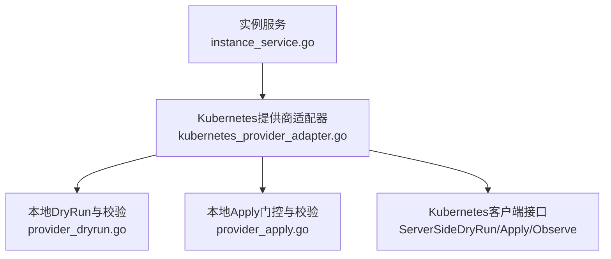
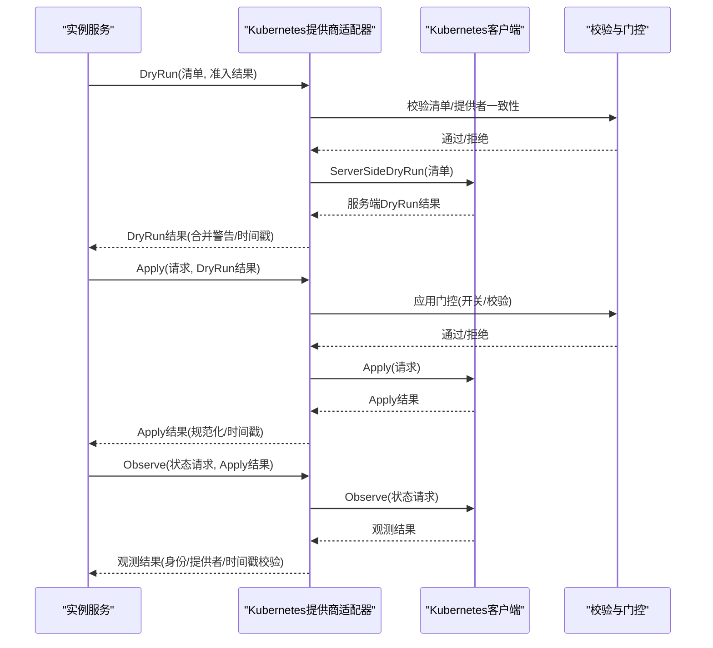
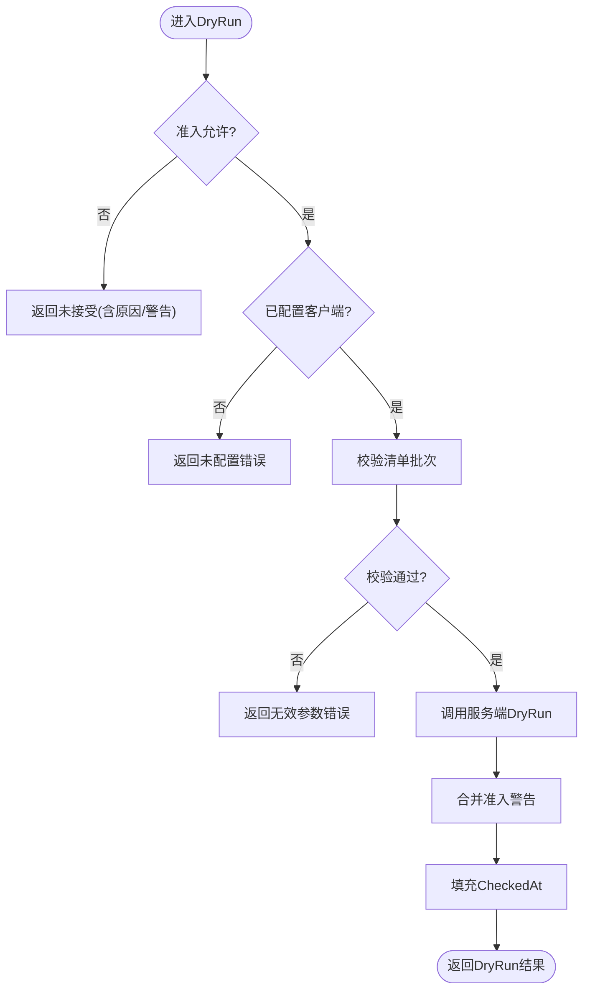
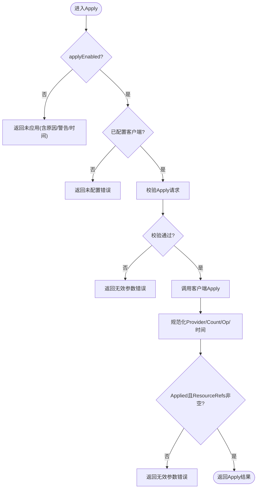
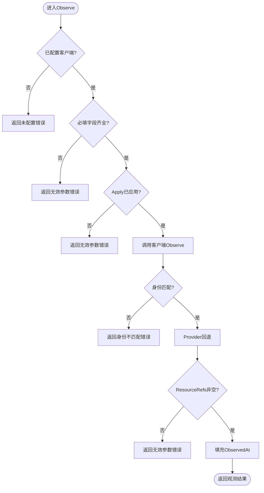
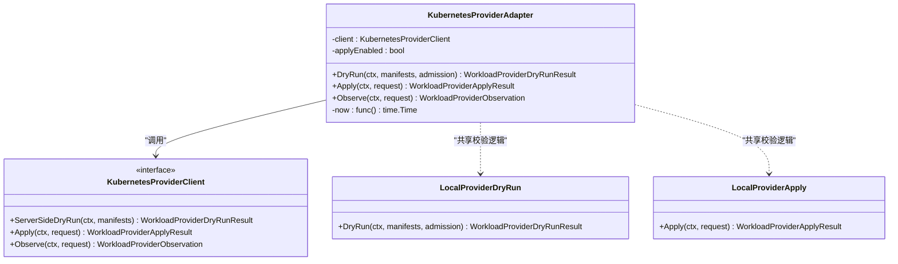

# Kubernetes提供商适配器

<cite>
**本文引用的文件**
- [kubernetes_provider_adapter.go](file://repo/pkg/adapters/runtime/kubernetes_provider_adapter.go)
- [provider_dryrun.go](file://repo/pkg/adapters/runtime/provider_dryrun.go)
- [provider_apply.go](file://repo/pkg/adapters/runtime/provider_apply.go)
- [kubernetes_provider_adapter_test.go](file://repo/pkg/adapters/runtime/kubernetes_provider_adapter_test.go)
- [instance_service.go](file://repo/pkg/adapters/runtime/instance_service.go)
</cite>

## 目录
1. [简介](#简介)
2. [项目结构](#项目结构)
3. [核心组件](#核心组件)
4. [架构总览](#架构总览)
5. [详细组件分析](#详细组件分析)
6. [依赖关系分析](#依赖关系分析)
7. [性能考虑](#性能考虑)
8. [故障排查指南](#故障排查指南)
9. [结论](#结论)
10. [附录](#附录)

## 简介
本文件面向Kubernetes提供商适配器的实现与使用，聚焦于KubernetesProviderAdapter的DryRun、Apply、Observe三个核心方法，解释资源清单验证机制、提供者一致性检查、状态同步流程，并给出配置选项（如applyEnabled开关与时钟注入）、错误处理策略、性能优化建议以及在不同环境中的工作负载管理实践。

## 项目结构
围绕Kubernetes提供商适配器的关键代码位于runtime包中：
- 适配器入口与编排：kubernetes_provider_adapter.go
- Dry Run与清单校验：provider_dryrun.go
- Apply门控与校验：provider_apply.go
- 测试用例：kubernetes_provider_adapter_test.go
- 上层生命周期编排调用：instance_service.go

图表来源
- [kubernetes_provider_adapter.go:11-15](file://repo/pkg/adapters/runtime/kubernetes_provider_adapter.go#L11-L15)
- [provider_dryrun.go:12-82](file://repo/pkg/adapters/runtime/provider_dryrun.go#L12-L82)
- [provider_apply.go:12-73](file://repo/pkg/adapters/runtime/provider_apply.go#L12-L73)
- [instance_service.go:1494-1513](file://repo/pkg/adapters/runtime/instance_service.go#L1494-L1513)

章节来源
- [kubernetes_provider_adapter.go:1-169](file://repo/pkg/adapters/runtime/kubernetes_provider_adapter.go#L1-L169)
- [provider_dryrun.go:1-181](file://repo/pkg/adapters/runtime/provider_dryrun.go#L1-L181)
- [provider_apply.go:1-130](file://repo/pkg/adapters/runtime/provider_apply.go#L1-L130)
- [instance_service.go:1494-1513](file://repo/pkg/adapters/runtime/instance_service.go#L1494-L1513)

## 核心组件
- KubernetesProviderAdapter：封装对底层Kubernetes Provider Client的DryRun、Apply、Observe调用，负责前置校验、提供者一致性、时间戳填充与结果规范化。
- LocalProviderDryRun：本地DryRun执行器，提供清单解析、提供者一致性检查、白名单Kind/apiVersion校验。
- LocalProviderApply：本地Apply门控，强制开启/关闭实际写入，并在开启时进行强校验与引用生成。
- KubernetesProviderClient：抽象接口，定义ServerSideDryRun、Apply、Observe三类能力，便于替换真实Kubernetes客户端或Mock。

章节来源
- [kubernetes_provider_adapter.go:11-48](file://repo/pkg/adapters/runtime/kubernetes_provider_adapter.go#L11-L48)
- [provider_dryrun.go:12-82](file://repo/pkg/adapters/runtime/provider_dryrun.go#L12-L82)
- [provider_apply.go:12-73](file://repo/pkg/adapters/runtime/provider_apply.go#L12-L73)

## 架构总览
Kubernetes提供商适配器作为“网关式”组件，将上层工作负载生命周期（计划、渲染、准入、审计、DryRun、Apply、观察、再均衡）串联起来，确保在真正落盘前完成安全与一致性校验，并在失败时快速返回。

图表来源
- [kubernetes_provider_adapter.go:50-143](file://repo/pkg/adapters/runtime/kubernetes_provider_adapter.go#L50-L143)
- [provider_dryrun.go:34-82](file://repo/pkg/adapters/runtime/provider_dryrun.go#L34-L82)
- [provider_apply.go:41-73](file://repo/pkg/adapters/runtime/provider_apply.go#L41-L73)
- [instance_service.go:1494-1513](file://repo/pkg/adapters/runtime/instance_service.go#L1494-L1513)

## 详细组件分析

### DryRun方法
- 准入前置：若准入拒绝，直接返回未接受结果，附带原因与警告。
- 配置检查：若未配置客户端，返回未配置错误。
- 清单批量校验：
  - 至少一个清单
  - 主提供者一致（辅助Kubernetes资源不参与主提供者判定）
  - 每个清单文档解析与提供者白名单校验（Kind/apiVersion）
- 调用服务端DryRun：将准入警告追加到结果，补齐CheckedAt时间戳。

图表来源
- [kubernetes_provider_adapter.go:50-75](file://repo/pkg/adapters/runtime/kubernetes_provider_adapter.go#L50-L75)
- [provider_dryrun.go:34-82](file://repo/pkg/adapters/runtime/provider_dryrun.go#L34-L82)
- [provider_dryrun.go:92-145](file://repo/pkg/adapters/runtime/provider_dryrun.go#L92-L145)
- [provider_dryrun.go:150-181](file://repo/pkg/adapters/runtime/provider_dryrun.go#L150-L181)

章节来源
- [kubernetes_provider_adapter.go:50-75](file://repo/pkg/adapters/runtime/kubernetes_provider_adapter.go#L50-L75)
- [provider_dryrun.go:34-82](file://repo/pkg/adapters/runtime/provider_dryrun.go#L34-L82)
- [provider_dryrun.go:92-145](file://repo/pkg/adapters/runtime/provider_dryrun.go#L92-L145)
- [provider_dryrun.go:150-181](file://repo/pkg/adapters/runtime/provider_dryrun.go#L150-L181)

### Apply方法
- 开关控制：当applyEnabled为false时，直接返回未应用结果，保留DryRun警告与时间戳。
- 配置检查：未配置客户端时返回未配置错误。
- 请求校验：
  - 必填字段（租户、用户、实例、审计ID、权限证明）
  - 仅支持创建操作
  - 必须已通过准入与DryRun
  - 清单非空且提供者一致
  - DryRun提供者与清单提供者一致（若提供）
  - DryRun清单数量与应用清单数量一致（若提供）
  - 每个清单JSON可解析并通过提供者白名单校验
- 调用客户端Apply：
  - 若Provider为空，回退为主提供者
  - 若ManifestCount为0，回填为清单数量
  - 若Operation为空，回填为请求操作
  - 若AppliedAt为空，填充当前时间
  - 若Applied为真但ResourceRefs为空，返回无效参数错误
- 返回规范化后的Apply结果。

图表来源
- [kubernetes_provider_adapter.go:77-115](file://repo/pkg/adapters/runtime/kubernetes_provider_adapter.go#L77-L115)
- [provider_apply.go:41-73](file://repo/pkg/adapters/runtime/provider_apply.go#L41-L73)
- [provider_apply.go:75-127](file://repo/pkg/adapters/runtime/provider_apply.go#L75-L127)

章节来源
- [kubernetes_provider_adapter.go:77-115](file://repo/pkg/adapters/runtime/kubernetes_provider_adapter.go#L77-L115)
- [provider_apply.go:41-73](file://repo/pkg/adapters/runtime/provider_apply.go#L41-L73)
- [provider_apply.go:75-127](file://repo/pkg/adapters/runtime/provider_apply.go#L75-L127)

### Observe方法
- 配置检查：未配置客户端时返回未配置错误。
- 必填字段校验：租户ID、实例ID、工作负载类型不可为空。
- 前置条件：Apply必须已应用。
- 调用客户端Observe获取观测结果。
- 身份一致性校验：观测结果的租户与实例需匹配请求。
- 提供者回退：若Provider为空，使用Apply结果中的Provider。
- 引用完整性：ResourceRefs不可为空。
- 时间戳填充：ObservedAt为空则填充当前时间。

图表来源
- [kubernetes_provider_adapter.go:117-143](file://repo/pkg/adapters/runtime/kubernetes_provider_adapter.go#L117-L143)

章节来源
- [kubernetes_provider_adapter.go:117-143](file://repo/pkg/adapters/runtime/kubernetes_provider_adapter.go#L117-L143)

### 资源清单验证机制
- 解析清单为JSON文档。
- 提供者白名单校验：
  - kubevirt：要求kubevirt.io/v1 VirtualMachine
  - kubernetes：限定Deployment/Job/NetworkPolicy/Service/PersistentVolumeClaim/VolumeSnapshot/Secret及其对应apiVersion
  - kubeovn：限定Vpc/Subnet且apiVersion为kubeovn.io/v1
- 其他提供者或未允许的Kind将拒绝。

章节来源
- [provider_dryrun.go:92-145](file://repo/pkg/adapters/runtime/provider_dryrun.go#L92-L145)

### 提供者一致性检查
- 主提供者确定：忽略辅助Kubernetes资源（Secret、PersistentVolumeClaim），取首个非辅助资源的Provider。
- 批次内一致性：除辅助资源外，所有清单的Provider必须一致；否则视为混合提供者，拒绝。

章节来源
- [provider_dryrun.go:150-181](file://repo/pkg/adapters/runtime/provider_dryrun.go#L150-L181)
- [kubernetes_provider_adapter.go:146-164](file://repo/pkg/adapters/runtime/kubernetes_provider_adapter.go#L146-L164)

### 状态同步流程
- 上层服务在Apply成功后调用Observe，以获取工作负载的实际运行阶段与资源引用。
- 适配器保证观测结果的身份、提供者、资源引用与时间戳完整有效。
- 上层服务根据观测结果继续reconcile等后续步骤。

章节来源
- [instance_service.go:1494-1513](file://repo/pkg/adapters/runtime/instance_service.go#L1494-L1513)
- [kubernetes_provider_adapter.go:117-143](file://repo/pkg/adapters/runtime/kubernetes_provider_adapter.go#L117-L143)

## 依赖关系分析
- KubernetesProviderAdapter依赖KubernetesProviderClient接口，解耦具体Kubernetes实现。
- DryRun与Apply共享清单解析与提供者白名单校验逻辑，降低重复实现。
- 上层服务通过统一的适配器接口驱动工作负载生命周期，屏蔽底层差异。

图表来源
- [kubernetes_provider_adapter.go:11-48](file://repo/pkg/adapters/runtime/kubernetes_provider_adapter.go#L11-L48)
- [provider_dryrun.go:12-82](file://repo/pkg/adapters/runtime/provider_dryrun.go#L12-L82)
- [provider_apply.go:12-73](file://repo/pkg/adapters/runtime/provider_apply.go#L12-L73)

章节来源
- [kubernetes_provider_adapter.go:11-48](file://repo/pkg/adapters/runtime/kubernetes_provider_adapter.go#L11-L48)
- [provider_dryrun.go:12-82](file://repo/pkg/adapters/runtime/provider_dryrun.go#L12-L82)
- [provider_apply.go:12-73](file://repo/pkg/adapters/runtime/provider_apply.go#L12-L73)

## 性能考虑
- 批处理清单：尽量将同一提供者下的多个清单合并提交，减少网络往返与校验开销。
- 避免不必要的Apply：在未启用applyEnabled时，仅执行DryRun与观察，降低写放大。
- 复用校验结果：DryRun结果在Apply中复用，避免重复解析与校验。
- 时间戳注入：通过时钟注入统一时间源，便于测试与审计，同时避免系统时间抖动影响日志对齐。
- 选择性观察：仅在Apply成功后触发Observe，减少读放大。

[本节为通用指导，无需特定文件来源]

## 故障排查指南
- 未配置客户端：DryRun/Apply/Observe均可能返回未配置错误，检查初始化是否注入KubernetesProviderClient。
- 准入拒绝：DryRun早期返回未接受，查看准入告警与原因。
- 清单格式错误：JSON无法解析或Kind/apiVersion不在白名单，修正渲染输出。
- 提供者不一致：批次中存在混合提供者，调整渲染使主提供者一致，或将不同提供者拆分批次。
- Apply被禁用：applyEnabled为false时不会实际写入，确认开关配置。
- Apply缺少资源引用：Applied为真但ResourceRefs为空会报错，检查客户端实现是否正确返回引用。
- 观测身份不匹配：租户/实例与请求不一致，检查上游传递与客户端实现。
- 时间戳缺失：CheckedAt/AppliedAt/ObservedAt为空会被填充，若仍为空，检查时钟注入。

章节来源
- [kubernetes_provider_adapter.go:50-143](file://repo/pkg/adapters/runtime/kubernetes_provider_adapter.go#L50-L143)
- [provider_dryrun.go:34-82](file://repo/pkg/adapters/runtime/provider_dryrun.go#L34-L82)
- [provider_apply.go:41-73](file://repo/pkg/adapters/runtime/provider_apply.go#L41-L73)
- [provider_apply.go:75-127](file://repo/pkg/adapters/runtime/provider_apply.go#L75-L127)

## 结论
Kubernetes提供商适配器通过严格的清单验证、提供者一致性检查与规范化的结果处理，为上层工作负载生命周期提供了稳定、可审计、可扩展的执行边界。结合DryRun、Apply开关与时钟注入，可在开发、测试与生产环境中灵活控制行为，保障安全性与可观测性。

[本节为总结，无需特定文件来源]

## 附录

### 配置选项说明
- applyEnabled：控制是否允许实际Apply写入。关闭时仅DryRun与观察，适合灰度与只读场景。
- 时钟注入：通过WithKubernetesProviderClock设置时间函数，便于测试与审计对齐。
- 客户端注入：通过NewKubernetesProviderAdapter注入KubernetesProviderClient，支持Mock或真实Kubernetes实现。

章节来源
- [kubernetes_provider_adapter.go:23-48](file://repo/pkg/adapters/runtime/kubernetes_provider_adapter.go#L23-L48)
- [provider_apply.go:17-39](file://repo/pkg/adapters/runtime/provider_apply.go#L17-L39)
- [provider_dryrun.go:16-32](file://repo/pkg/adapters/runtime/provider_dryrun.go#L16-L32)

### 在不同环境中的使用建议
- 开发环境：启用applyEnabled，配合时钟注入与Mock客户端，快速验证渲染与校验逻辑。
- 测试环境：关闭applyEnabled，仅执行DryRun与观察，验证准入、校验与结果规范化。
- 预生产/生产：逐步启用applyEnabled，结合严格准入与审计，确保变更可控。
- 多提供者场景：按提供者拆分批次，避免混合提供者导致的校验失败。

章节来源
- [kubernetes_provider_adapter_test.go:12-171](file://repo/pkg/adapters/runtime/kubernetes_provider_adapter_test.go#L12-L171)
- [provider_dryrun.go:92-145](file://repo/pkg/adapters/runtime/provider_dryrun.go#L92-L145)
- [provider_apply.go:75-127](file://repo/pkg/adapters/runtime/provider_apply.go#L75-L127)