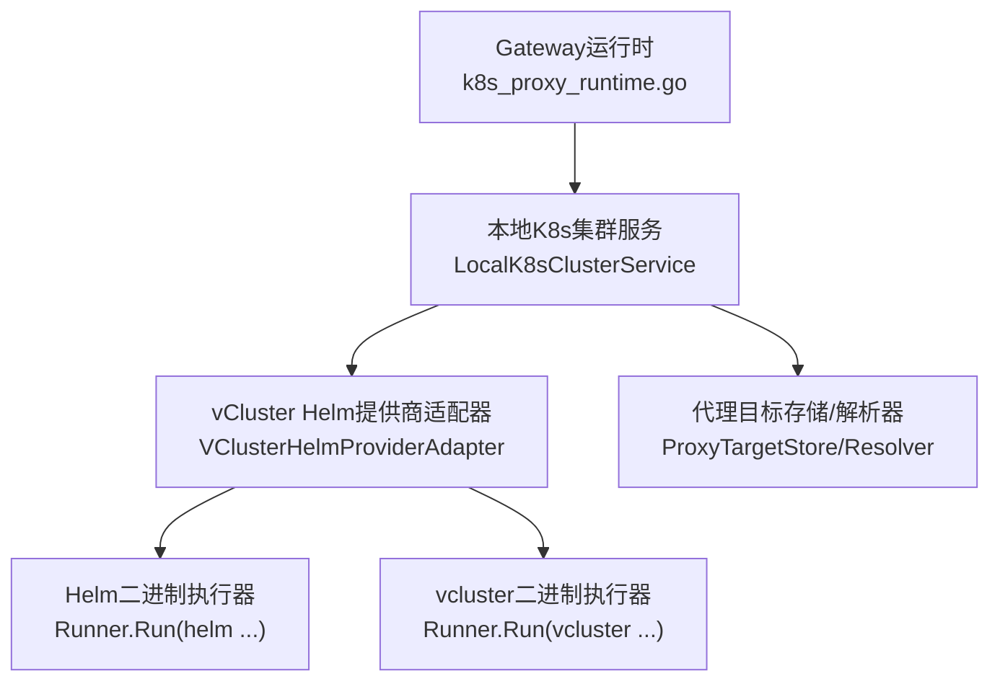
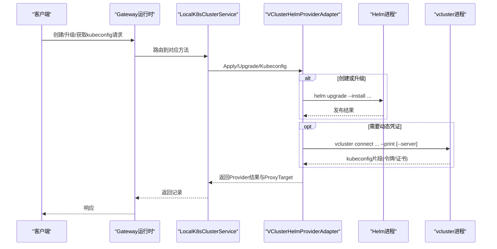
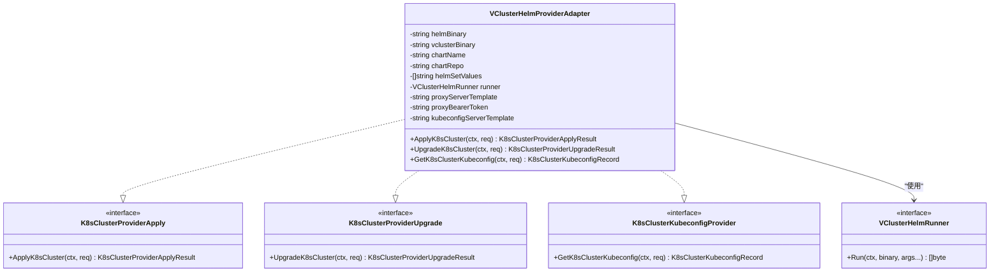
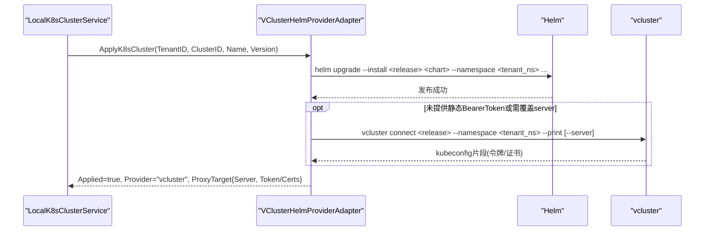
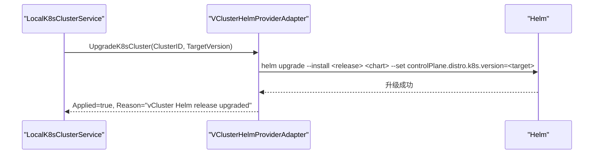
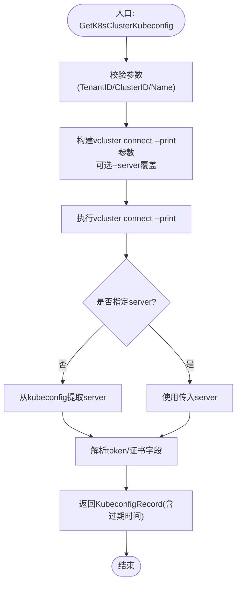
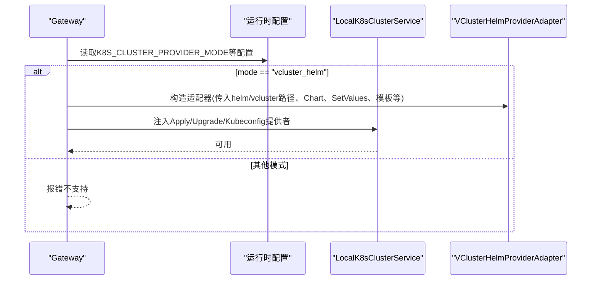
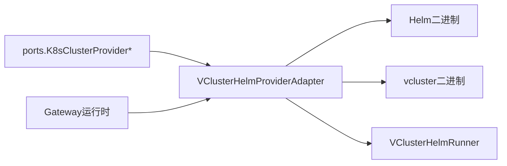

# vCluster Helm提供商

<cite>
**本文引用的文件**
- [vcluster_helm_provider.go](file://repo/pkg/adapters/runtime/vcluster_helm_provider.go)
- [vcluster_helm_provider_test.go](file://repo/pkg/adapters/runtime/vcluster_helm_provider_test.go)
- [k8s_clusters.go](file://repo/pkg/ports/k8s_clusters.go)
- [k8s_proxy_runtime.go](file://services/ani-gateway/k8s_proxy_runtime.go)
- [m1-k8s-c-vcluster-helm-provider.md](file://repo/development-records/m1-k8s-c-vcluster-helm-provider.md)
- [vcluster-live-gate.yaml](file://repo/deploy/real-k8s-lab/vcluster-live-gate.yaml)
- [vcluster-upgrade-live-gate.yaml](file://repo/deploy/real-k8s-lab/vcluster-upgrade-live-gate.yaml)
</cite>

## 目录
1. [简介](#简介)
2. [项目结构](#项目结构)
3. [核心组件](#核心组件)
4. [架构总览](#架构总览)
5. [详细组件分析](#详细组件分析)
6. [依赖关系分析](#依赖关系分析)
7. [性能与可靠性](#性能与可靠性)
8. [故障排查指南](#故障排查指南)
9. [结论](#结论)
10. [附录：生产部署与多租户实践](#附录生产部署与多租户实践)

## 简介
本文件围绕仓库中的“vCluster Helm提供商”进行系统化文档化，聚焦以下目标：
- 解释vCluster与Helm集成的架构设计与数据流。
- 说明虚拟集群的创建、配置与管理流程（安装、升级、kubeconfig获取）。
- 阐述Helm Chart渲染与部署机制、版本管理与升级策略。
- 给出多租户场景下的资源隔离方案、命名空间管理与权限控制建议。
- 提供性能调优、故障恢复与监控集成建议。
- 展示在生产环境中部署和管理vCluster实例以及与Gateway、Proxy等组件的集成方式。

## 项目结构
围绕vCluster Helm提供商的关键代码与契约分布在如下位置：
- 适配器实现：`repo/pkg/adapters/runtime/vcluster_helm_provider.go`
- 单元测试：`repo/pkg/adapters/runtime/vcluster_helm_provider_test.go`
- 端口契约与数据结构：`repo/pkg/ports/k8s_clusters.go`
- Gateway运行时装配：`services/ani-gateway/k8s_proxy_runtime.go`
- 设计边界记录：`repo/development-records/m1-k8s-c-vcluster-helm-provider.md`
- 真实环境验收门禁：`repo/deploy/real-k8s-lab/vcluster-live-gate.yaml`、`repo/deploy/real-k8s-lab/vcluster-upgrade-live-gate.yaml`

图表来源
- [k8s_proxy_runtime.go:180-206](file://services/ani-gateway/k8s_proxy_runtime.go#L180-L206)
- [vcluster_helm_provider.go:73-150](file://repo/pkg/adapters/runtime/vcluster_helm_provider.go#L73-L150)
- [k8s_clusters.go:183-201](file://repo/pkg/ports/k8s_clusters.go#L183-L201)

章节来源
- [m1-k8s-c-vcluster-helm-provider.md:7-25](file://repo/development-records/m1-k8s-c-vcluster-helm-provider.md#L7-L25)
- [k8s_proxy_runtime.go:180-206](file://services/ani-gateway/k8s_proxy_runtime.go#L180-L206)

## 核心组件
- VClusterHelmProviderAdapter：实现集群创建、升级与kubeconfig获取，封装对helm与vcluster命令的调用，并输出统一的Provider结果与代理目标信息。
- K8sClusterProviderApply/Upgrade/Kubeconfig接口：定义provider能力边界，使Gateway可统一编排不同后端。
- Gateway运行时装配：通过环境变量选择provider模式，将vCluster Helm provider注入到本地K8s集群服务中。
- Live Gate：以真实lab环境验证Helm安装、kubeconfig可用性、Core代理访问与升级后连通性。

章节来源
- [vcluster_helm_provider.go:20-71](file://repo/pkg/adapters/runtime/vcluster_helm_provider.go#L20-L71)
- [k8s_clusters.go:263-278](file://repo/pkg/ports/k8s_clusters.go#L263-L278)
- [k8s_proxy_runtime.go:187-206](file://services/ani-gateway/k8s_proxy_runtime.go#L187-L206)
- [vcluster-live-gate.yaml:12-36](file://repo/deploy/real-k8s-lab/vcluster-live-gate.yaml#L12-L36)
- [vcluster-upgrade-live-gate.yaml:19-40](file://repo/deploy/real-k8s-lab/vcluster-upgrade-live-gate.yaml#L19-L40)

## 架构总览
vCluster Helm提供商在系统中的角色是“将Helm与vcluster CLI作为底层执行器，完成虚拟集群的生命周期管理”，并与Gateway的代理链路打通。

图表来源
- [k8s_proxy_runtime.go:187-206](file://services/ani-gateway/k8s_proxy_runtime.go#L187-L206)
- [vcluster_helm_provider.go:73-150](file://repo/pkg/adapters/runtime/vcluster_helm_provider.go#L73-L150)
- [vcluster_helm_provider.go:152-187](file://repo/pkg/adapters/runtime/vcluster_helm_provider.go#L152-L187)

## 详细组件分析

### 适配器类图

图表来源
- [vcluster_helm_provider.go:20-71](file://repo/pkg/adapters/runtime/vcluster_helm_provider.go#L20-L71)
- [vcluster_helm_provider.go:73-187](file://repo/pkg/adapters/runtime/vcluster_helm_provider.go#L73-L187)
- [k8s_clusters.go:263-278](file://repo/pkg/ports/k8s_clusters.go#L263-L278)

章节来源
- [vcluster_helm_provider.go:20-71](file://repo/pkg/adapters/runtime/vcluster_helm_provider.go#L20-L71)
- [k8s_clusters.go:263-278](file://repo/pkg/ports/k8s_clusters.go#L263-L278)

### 创建流程序列图

图表来源
- [vcluster_helm_provider.go:73-106](file://repo/pkg/adapters/runtime/vcluster_helm_provider.go#L73-L106)
- [vcluster_helm_provider.go:221-246](file://repo/pkg/adapters/runtime/vcluster_helm_provider.go#L221-L246)

章节来源
- [vcluster_helm_provider.go:73-106](file://repo/pkg/adapters/runtime/vcluster_helm_provider.go#L73-L106)

### 升级流程序列图

图表来源
- [vcluster_helm_provider.go:130-150](file://repo/pkg/adapters/runtime/vcluster_helm_provider.go#L130-L150)

章节来源
- [vcluster_helm_provider.go:130-150](file://repo/pkg/adapters/runtime/vcluster_helm_provider.go#L130-L150)

### kubeconfig获取流程图

图表来源
- [vcluster_helm_provider.go:152-187](file://repo/pkg/adapters/runtime/vcluster_helm_provider.go#L152-L187)
- [vcluster_helm_provider.go:248-263](file://repo/pkg/adapters/runtime/vcluster_helm_provider.go#L248-L263)
- [vcluster_helm_provider.go:286-308](file://repo/pkg/adapters/runtime/vcluster_helm_provider.go#L286-L308)

章节来源
- [vcluster_helm_provider.go:152-187](file://repo/pkg/adapters/runtime/vcluster_helm_provider.go#L152-L187)

### Gateway装配与选择
Gateway通过环境变量选择provider模式，当设置为`vcluster_helm`时，会构造VClusterHelmProviderAdapter并注入到LocalK8sClusterService，暴露Apply/Upgrade/Kubeconfig能力。

图表来源
- [k8s_proxy_runtime.go:187-206](file://services/ani-gateway/k8s_proxy_runtime.go#L187-L206)

章节来源
- [k8s_proxy_runtime.go:187-206](file://services/ani-gateway/k8s_proxy_runtime.go#L187-L206)

## 依赖关系分析
- 适配器对外依赖：
  - Helm二进制：用于安装/升级vCluster Helm Release。
  - vcluster二进制：用于打印kubeconfig或连接虚拟集群。
  - Runner接口：抽象外部命令执行，便于测试与替换。
- 内部依赖：
  - ports包定义的Provider接口与数据结构，保证与上层服务解耦。
  - 模板字符串：用于生成proxy server地址与kubeconfig server地址。
- 外部集成点：
  - Gateway运行时装配，决定启用该provider。
  - Live Gate：在真实lab中验证端到端流程。

图表来源
- [k8s_clusters.go:263-278](file://repo/pkg/ports/k8s_clusters.go#L263-L278)
- [vcluster_helm_provider.go:20-71](file://repo/pkg/adapters/runtime/vcluster_helm_provider.go#L20-L71)
- [k8s_proxy_runtime.go:187-206](file://services/ani-gateway/k8s_proxy_runtime.go#L187-L206)

章节来源
- [k8s_clusters.go:263-278](file://repo/pkg/ports/k8s_clusters.go#L263-L278)
- [vcluster_helm_provider.go:20-71](file://repo/pkg/adapters/runtime/vcluster_helm_provider.go#L20-L71)
- [k8s_proxy_runtime.go:187-206](file://services/ani-gateway/k8s_proxy_runtime.go#L187-L206)

## 性能与可靠性
- 命令执行开销
  - Helm install/upgrade与vcluster connect均为外部进程调用，存在启动与I/O开销。建议在批量操作时复用Runner上下文与超时控制，避免长时间阻塞。
- 并发与幂等
  - Helm release具备幂等语义；建议在应用层增加幂等键与重试退避，防止重复触发导致竞争。
- 资源隔离
  - 每个租户使用独立命名空间部署Helm release，天然隔离vCluster实例及其资源。
- 认证与证书
  - 支持从kubeconfig中提取BearerToken或客户端证书，适配不同安全策略。若使用静态BearerToken，请确保其生命周期与轮换策略受控。
- 升级策略
  - 通过设置`controlPlane.distro.k8s.version`驱动目标Kubernetes版本；跨小版本升级需结合Chart版本与兼容性矩阵评估风险。
- 可观测性
  - 建议在Live Gate基础上扩展指标采集：Helm发布事件、vcluster连接耗时、错误率、kubeconfig签发次数等。

[本节为通用指导，不直接分析具体文件]

## 故障排查指南
- Helm安装失败
  - 检查Chart名称、仓库地址、命名空间是否存在；确认Helm二进制可用且网络可达。
  - 参考用例断言：安装命令参数与返回值。
- vcluster连接失败
  - 检查vcluster二进制可用性与上下文；确认release名称与命名空间匹配。
  - 若需覆盖server，请确认模板变量替换正确。
- kubeconfig解析异常
  - 若未提供静态BearerToken，适配器会从kubeconfig中解析token或客户端证书；若两者均缺失，将返回无效错误。
  - 检查kubeconfig中是否包含server/token/certificate-authority-data/client-certificate-data/client-key-data等关键字段。
- Gateway装配错误
  - 确认环境变量`K8S_CLUSTER_PROVIDER_MODE=vcluster_helm`已设置；否则将返回不支持的错误。
- Live Gate失败
  - 对照门禁步骤逐项验证：Helm安装、vcluster连接、kubectl版本、临时工作负载创建、Core代理访问、清理。

章节来源
- [vcluster_helm_provider_test.go:11-55](file://repo/pkg/adapters/runtime/vcluster_helm_provider_test.go#L11-L55)
- [vcluster_helm_provider_test.go:57-106](file://repo/pkg/adapters/runtime/vcluster_helm_provider_test.go#L57-L106)
- [vcluster_helm_provider_test.go:182-237](file://repo/pkg/adapters/runtime/vcluster_helm_provider_test.go#L182-L237)
- [vcluster_helm_provider_test.go:279-316](file://repo/pkg/adapters/runtime/vcluster_helm_provider_test.go#L279-L316)
- [vcluster-live-gate.yaml:12-36](file://repo/deploy/real-k8s-lab/vcluster-live-gate.yaml#L12-L36)
- [vcluster-upgrade-live-gate.yaml:19-40](file://repo/deploy/real-k8s-lab/vcluster-upgrade-live-gate.yaml#L19-L40)

## 结论
vCluster Helm提供商通过清晰的Provider接口与适配器实现，将Helm与vcluster CLI纳入统一的生命周期管理流程。Gateway可按模式选择该provider，实现虚拟集群的安装、升级与kubeconfig获取。配合Live Gate可在真实lab中验证端到端能力。后续可在多租户隔离、认证策略、升级策略与可观测性方面进一步增强。

[本节为总结，不直接分析具体文件]

## 附录：生产部署与多租户实践
- 命名空间与资源隔离
  - 每个租户使用独立命名空间部署Helm release，避免资源冲突。适配器默认基于TenantID推导命名空间。
- 权限控制
  - 若使用静态BearerToken，应限制其作用域与有效期；若使用客户端证书，应遵循最小权限原则。
- 版本管理
  - 通过Chart版本与`controlPlane.distro.k8s.version`共同控制Kubernetes版本；升级前评估兼容性与回滚策略。
- 监控与告警
  - 采集Helm发布状态、vcluster连接成功率、kubeconfig签发量、错误码分布；对关键指标设置阈值告警。
- 与其他组件集成
  - 与Gateway集成：通过`K8S_CLUSTER_PROVIDER_MODE=vcluster_helm`启用。
  - 与Proxy集成：适配器返回ProxyTarget，Gateway据此转发API请求至vCluster API Server。
  - 与Node Pool集成：当前provider聚焦集群生命周期；节点池由其他provider处理（如Cluster API/CAPK），可通过Gateway装配组合使用。

章节来源
- [k8s_proxy_runtime.go:187-206](file://services/ani-gateway/k8s_proxy_runtime.go#L187-L206)
- [vcluster_helm_provider.go:73-150](file://repo/pkg/adapters/runtime/vcluster_helm_provider.go#L73-L150)
- [m1-k8s-c-vcluster-helm-provider.md:7-25](file://repo/development-records/m1-k8s-c-vcluster-helm-provider.md#L7-L25)