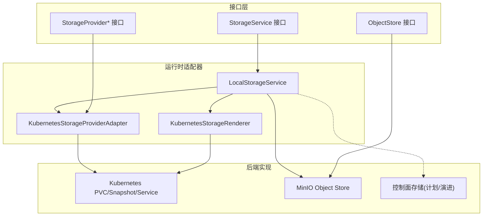
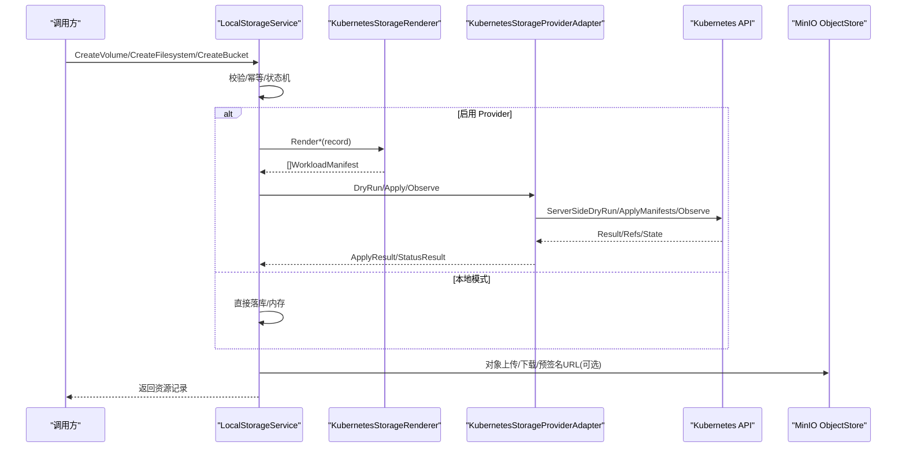
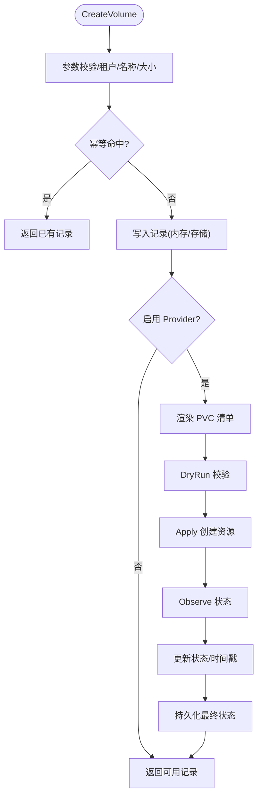
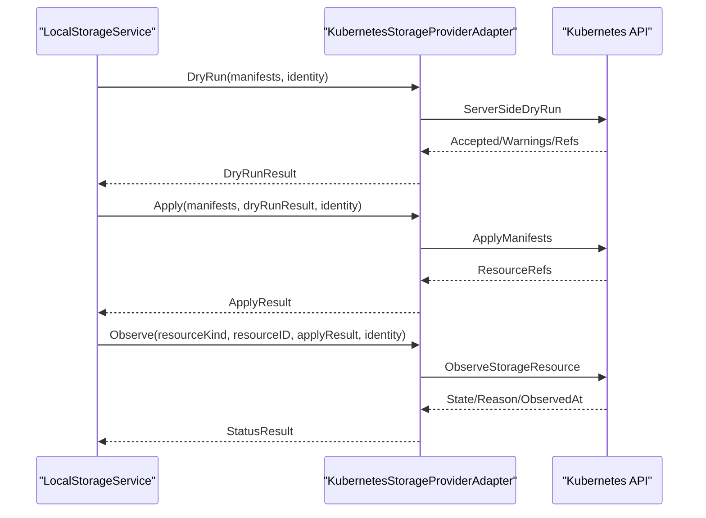
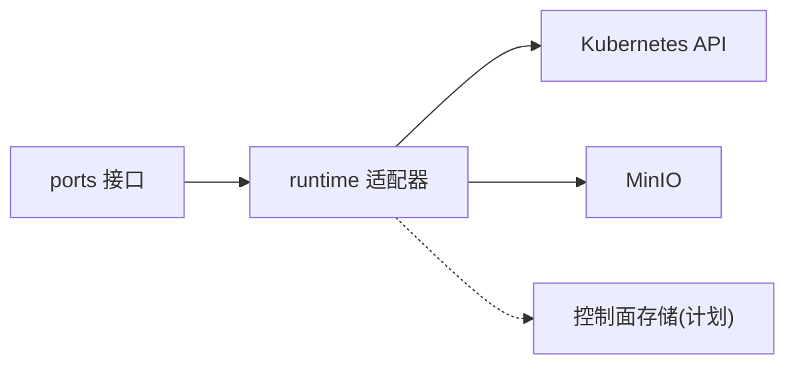

# 存储提供商

<cite>
**本文引用的文件**
- [storage_resources.go](file://repo/pkg/ports/storage_resources.go)
- [object_store.go](file://repo/pkg/ports/object_store.go)
- [storage_service.go](file://repo/pkg/adapters/runtime/storage_service.go)
- [storage_provider.go](file://repo/pkg/adapters/runtime/storage_provider.go)
- [storage_renderer.go](file://repo/pkg/adapters/runtime/storage_renderer.go)
- [minio_store.go](file://repo/pkg/adapters/objectstore/minio_store.go)
- [storage_runtime.go](file://repo/services/ani-gateway/storage_runtime.go)
- [2026-08-03-control-plane-state-recovery.md](file://docs/superpowers/plans/2026-08-03-control-plane-state-recovery.md)
</cite>

## 目录
1. [简介](#简介)
2. [项目结构](#项目结构)
3. [核心组件](#核心组件)
4. [架构总览](#架构总览)
5. [详细组件分析](#详细组件分析)
6. [依赖关系分析](#依赖关系分析)
7. [性能与容量规划](#性能与容量规划)
8. [故障排查指南](#故障排查指南)
9. [结论](#结论)
10. [附录：扩展新后端与最佳实践](#附录：扩展新后端与最佳实践)

## 简介
本文件面向“存储提供商”能力，系统性说明存储抽象层的设计与实现，覆盖块存储（卷）、对象存储、文件存储的适配方式，以及快照、挂载、备份恢复、配额与容量规划、监控与可观测性、数据迁移与容灾等主题。代码层面以统一接口为边界，通过渲染器将资源描述转换为具体后端工作负载清单，由提供者执行并观察状态，最终由服务层持久化元数据与结果。

## 项目结构
- 接口定义位于 ports 包，明确存储服务、对象存储、存储提供者等契约。
- 运行时适配器在 runtime 包中提供本地内存态与服务编排逻辑，并支持可选的后端存储（Postgres）与对象存储（MinIO）。
- 渲染器负责将内部记录渲染为 Kubernetes 或对象存储相关的清单。
- 网关侧根据环境变量装配不同的存储提供者模式（本地/不配置、Kubernetes REST），并注入 MinIO 对象存储。

图表来源
- [storage_resources.go:487-684](file://repo/pkg/ports/storage_resources.go#L487-L684)
- [object_store.go:47-56](file://repo/pkg/ports/object_store.go#L47-L56)
- [storage_service.go:18-119](file://repo/pkg/adapters/runtime/storage_service.go#L18-L119)
- [storage_provider.go:11-48](file://repo/pkg/adapters/runtime/storage_provider.go#L11-L48)
- [storage_renderer.go:11-15](file://repo/pkg/adapters/runtime/storage_renderer.go#L11-L15)
- [minio_store.go:31-60](file://repo/pkg/adapters/objectstore/minio_store.go#L31-L60)

章节来源
- [storage_resources.go:487-684](file://repo/pkg/ports/storage_resources.go#L487-L684)
- [object_store.go:47-56](file://repo/pkg/ports/object_store.go#L47-L56)
- [storage_service.go:18-119](file://repo/pkg/adapters/runtime/storage_service.go#L18-L119)
- [storage_provider.go:11-48](file://repo/pkg/adapters/runtime/storage_provider.go#L11-L48)
- [storage_renderer.go:11-15](file://repo/pkg/adapters/runtime/storage_renderer.go#L11-L15)
- [minio_store.go:31-60](file://repo/pkg/adapters/objectstore/minio_store.go#L31-L60)
- [storage_runtime.go:75-158](file://repo/services/ani-gateway/storage_runtime.go#L75-L158)

## 核心组件
- 存储资源模型与操作接口：定义卷、文件系统、对象、桶、快照、挂载目标等数据结构与 CRUD/扩缩/挂载/快照等操作。
- 存储服务：Local Storage Service 实现统一的业务编排，包含幂等控制、状态机、可选 Provider 执行、对象存储集成与持久化存储桥接。
- 存储提供者适配：Kubernetes 存储提供者适配器封装 DryRun/Apply/Observe 流程，校验身份与清单，调用 K8s API 完成实际资源创建与状态观察。
- 渲染器：将内部记录渲染为 Kubernetes 清单（PVC、VolumeSnapshot、Service）或对象元数据清单。
- 对象存储：MinIO 实现 S3 兼容的对象读写、预签名 URL、桶管理、健康检查与重试策略。
- 网关装配：根据环境变量选择本地/不配置/Kubernetes REST 模式，并可选择接入 MinIO 与控制面存储。

章节来源
- [storage_resources.go:18-684](file://repo/pkg/ports/storage_resources.go#L18-L684)
- [storage_service.go:18-119](file://repo/pkg/adapters/runtime/storage_service.go#L18-L119)
- [storage_provider.go:11-228](file://repo/pkg/adapters/runtime/storage_provider.go#L11-L228)
- [storage_renderer.go:11-230](file://repo/pkg/adapters/runtime/storage_renderer.go#L11-L230)
- [minio_store.go:31-619](file://repo/pkg/adapters/objectstore/minio_store.go#L31-L619)
- [storage_runtime.go:46-158](file://repo/services/ani-gateway/storage_runtime.go#L46-L158)

## 架构总览
存储抽象层采用“接口 + 适配器 + 渲染器 + 提供者”的分层设计：
- 上层通过 StorageService 接口发起请求，服务层负责参数校验、幂等控制、状态更新与持久化。
- 当启用 Kubernetes 存储提供者时，服务层调用渲染器生成清单，再交由提供者进行 DryRun/Apply/Observe。
- 对象存储通过 ObjectStore 接口解耦，当前实现为 MinIO，支持多端点、预签名 URL、重试与健康检查。
- 控制面存储（Postgres）作为可选持久化后端，用于重启安全与跨实例共享元数据。

图表来源
- [storage_service.go:121-224](file://repo/pkg/adapters/runtime/storage_service.go#L121-L224)
- [storage_renderer.go:17-134](file://repo/pkg/adapters/runtime/storage_renderer.go#L17-L134)
- [storage_provider.go:50-134](file://repo/pkg/adapters/runtime/storage_provider.go#L50-L134)
- [minio_store.go:127-313](file://repo/pkg/adapters/objectstore/minio_store.go#L127-L313)
- [storage_runtime.go:110-152](file://repo/services/ani-gateway/storage_runtime.go#L110-L152)

## 详细组件分析

### 存储抽象接口与数据模型
- 卷、文件系统、对象、桶、快照、挂载目标等实体均具备租户隔离、生命周期状态、软删除与幂等字段。
- 操作接口覆盖创建、列表、获取、删除、扩容、挂载/卸载、从快照创建、自动快照策略、对象上传/下载、桶 ACL/生命周期规则等。
- 存储提供者接口包括 DryRun/Apply/Observe，确保先验证后应用，并通过状态观察收敛到一致状态。

章节来源
- [storage_resources.go:18-684](file://repo/pkg/ports/storage_resources.go#L18-L684)

### LocalStorageService（服务编排与状态机）
- 幂等控制：基于 idempotency key 与并发锁，避免重复创建与并发冲突。
- 状态机：资源创建时若启用 Provider，则进入 pending/creating 状态，待 Provider 观察后更新为 available/error。
- 持久化：支持可选 StorageResourceStore（计划中的 Postgres 实现），未配置时使用内存映射。
- 对象存储集成：通过 ObjectStore 接口提供桶存在性检查、对象上传/下载、预签名 URL。
- 关键路径示例：
  - 创建卷：校验 -> 幂等 -> 写入记录 -> 可选 Provider 渲染与应用 -> 观察状态 -> 持久化。
  - 创建快照：校验 -> 写入快照记录 -> 可选 Provider 渲染 VolumeSnapshot -> 观察状态 -> 持久化。
  - 创建挂载目标：校验 -> 写入记录 -> 可选 Provider 渲染 Service -> 观察状态 -> 持久化。

图表来源
- [storage_service.go:121-224](file://repo/pkg/adapters/runtime/storage_service.go#L121-L224)
- [storage_service.go:1782-1836](file://repo/pkg/adapters/runtime/storage_service.go#L1782-L1836)

章节来源
- [storage_service.go:121-224](file://repo/pkg/adapters/runtime/storage_service.go#L121-L224)
- [storage_service.go:1782-1836](file://repo/pkg/adapters/runtime/storage_service.go#L1782-L1836)

### Kubernetes 存储提供者适配
- DryRun：校验租户/用户/权限证明与清单，调用 K8s 服务端 DryRun 并返回接受与否、警告与资源引用。
- Apply：仅在 DryRun 接受且开关开启时执行，提交清单并返回资源引用。
- Observe：校验 Apply 已执行，拉取资源状态并标准化状态与时间戳。
- 清单校验：当前仅支持 Kubernetes PVC/Volumesnapshot/Service 等清单。

图表来源
- [storage_provider.go:50-134](file://repo/pkg/adapters/runtime/storage_provider.go#L50-L134)

章节来源
- [storage_provider.go:50-134](file://repo/pkg/adapters/runtime/storage_provider.go#L50-L134)

### 渲染器（Kubernetes 清单生成）
- 卷：渲染 PersistentVolumeClaim，设置访问模式、存储类、容量。
- 文件系统：渲染 PVC，标注协议（NFS/CephFS）与端点注解。
- 对象：渲染自定义 ObjectMetadata 清单，记录租户、桶、键、大小与内容类型。
- 快照：渲染 VolumeSnapshot，指向源 PVC。
- 挂载目标：渲染 ClusterIP Service，暴露 NFS 端口并附加注解。

章节来源
- [storage_renderer.go:17-181](file://repo/pkg/adapters/runtime/storage_renderer.go#L17-L181)

### 对象存储（MinIO）
- 功能：桶存在性检查、对象上传/下载/删除/统计、预签名上传/下载 URL、健康检查。
- 可靠性：多端点重试、可重试 HTTP 状态码处理、超时策略、签名与鉴权。
- 命名：桶名需符合 S3 规范，支持前缀隔离；对象路径按租户与键组织。

章节来源
- [minio_store.go:127-313](file://repo/pkg/adapters/objectstore/minio_store.go#L127-L313)
- [minio_store.go:333-389](file://repo/pkg/adapters/objectstore/minio_store.go#L333-L389)
- [minio_store.go:475-484](file://repo/pkg/adapters/objectstore/minio_store.go#L475-L484)

### 网关装配与环境变量
- 存储提供者模式：
  - 空/local/not_configured：使用本地服务（可选注入对象存储与控制面存储）。
  - kubernetes_rest：构建 K8s REST 客户端与提供者适配器，启用 DryRun/Apply/Observe。
- 对象存储：支持 MinIO，可配置端点、公开端点、认证、区域、安全、桶前缀、超时等。
- 控制面存储：按需连接数据库并注入 StorageResourceStore。

章节来源
- [storage_runtime.go:46-158](file://repo/services/ani-gateway/storage_runtime.go#L46-L158)

## 依赖关系分析
- 耦合度：
  - LocalStorageService 对 StorageProviderRenderer/Provider 为可选依赖，便于本地模式与生产模式切换。
  - 对象存储通过 ObjectStore 接口解耦，当前实现为 MinIO。
  - 控制面存储通过 StorageResourceStore 接口解耦，当前以内存为主，计划引入 Postgres。
- 外部依赖：
  - Kubernetes API：通过 K8s REST 客户端执行 DryRun/Apply/Observe。
  - MinIO：S3 兼容对象存储，支持多端点与重试。
- 潜在循环依赖：无直接循环，接口与实现分层清晰。

图表来源
- [storage_resources.go:487-684](file://repo/pkg/ports/storage_resources.go#L487-L684)
- [object_store.go:47-56](file://repo/pkg/ports/object_store.go#L47-L56)
- [storage_service.go:18-119](file://repo/pkg/adapters/runtime/storage_service.go#L18-L119)
- [storage_provider.go:11-48](file://repo/pkg/adapters/runtime/storage_provider.go#L11-L48)
- [minio_store.go:31-60](file://repo/pkg/adapters/objectstore/minio_store.go#L31-L60)

章节来源
- [storage_resources.go:487-684](file://repo/pkg/ports/storage_resources.go#L487-L684)
- [object_store.go:47-56](file://repo/pkg/ports/object_store.go#L47-L56)
- [storage_service.go:18-119](file://repo/pkg/adapters/runtime/storage_service.go#L18-L119)
- [storage_provider.go:11-48](file://repo/pkg/adapters/runtime/storage_provider.go#L11-L48)
- [minio_store.go:31-60](file://repo/pkg/adapters/objectstore/minio_store.go#L31-L60)

## 性能与容量规划
- 幂等与并发：
  - 创建类操作通过 idempotency key 与并发锁保证幂等与一致性，避免重复创建与竞态。
- 重试与超时：
  - MinIO 客户端支持可重试错误与超时策略，提升稳定性。
- 容量规划建议：
  - 卷与文件系统：依据 IOPS、存储类、性能模式与副本数评估容量与吞吐；结合 K8s StorageClass 与后端 CSI 驱动特性规划。
  - 对象存储：依据桶前缀与分片策略规划命名空间；利用生命周期规则归档与清理低频数据。
  - 快照：合理设置保留天数与调度频率，避免快照膨胀影响存储成本与性能。
- 监控与可观测性：
  - 资源状态与事件：通过 Provider 观察结果与状态机记录追踪资源生命周期。
  - 对象存储健康检查：定期调用 Health 接口探测可用性。
  - 指标采集：结合平台监控体系采集 API 延迟、错误率、对象大小分布、桶命中率等。

[本节为通用指导，不直接分析具体文件]

## 故障排查指南
- 常见错误与定位：
  - 参数无效：如体积小于等于零、必填字段缺失、不支持的协议或存储类。
  - 权限不足：Provider 执行需要有效的租户/用户/权限证明。
  - DryRun 拒绝：清单不符合后端要求或权限不足，需检查 Manifest 与 RBAC。
  - 对象存储错误：HTTP 状态码映射为语义化错误（NotFound/Conflict/Forbidden 等）。
- 排查步骤：
  - 确认幂等键与租户隔离是否正确。
  - 查看 Provider DryRun/Apply/Observe 返回的 Reason/Warnings。
  - 检查 MinIO 健康与端点可达性，核对签名与区域配置。
  - 若启用控制面存储，确认持久化写入成功与状态同步。

章节来源
- [storage_provider.go:136-176](file://repo/pkg/adapters/runtime/storage_provider.go#L136-L176)
- [minio_store.go:566-581](file://repo/pkg/adapters/objectstore/minio_store.go#L566-L581)

## 结论
存储提供商通过清晰的接口与分层实现，提供了块存储、对象存储与文件存储的统一管理能力。服务层负责幂等、状态机与持久化，渲染器与提供者适配屏蔽了后端差异，MinIO 提供可靠的对象存储能力。配合控制面存储的计划落地，可实现重启安全与跨实例一致的元数据管理。

[本节为总结，不直接分析具体文件]

## 附录：扩展新后端与最佳实践

### 扩展新的存储后端
- 新增 Provider 实现：
  - 实现 StorageProviderDryRun/Apply/StatusReader 接口，封装 DryRun/Apply/Observe 流程。
  - 在渲染器中增加对应资源的清单渲染逻辑。
  - 在网关装配中注册新模式，注入新的 Provider 与渲染器。
- 新增对象存储后端：
  - 实现 ObjectStore 接口，支持健康检查、桶管理、对象读写与预签名 URL。
  - 在网关装配中按环境变量切换后端。

章节来源
- [storage_resources.go:669-684](file://repo/pkg/ports/storage_resources.go#L669-L684)
- [object_store.go:47-56](file://repo/pkg/ports/object_store.go#L47-L56)
- [storage_runtime.go:110-152](file://repo/services/ani-gateway/storage_runtime.go#L110-L152)

### 数据迁移策略
- 控制面存储迁移：
  - 计划引入 Postgres 作为控制面存储，提供幂等列、唯一约束、外键、RLS 策略与软删除。
  - 通过迁移脚本与静态校验门控保障 schema 正确性与向后兼容。
- 对象存储迁移：
  - 利用预签名 URL 与批量复制工具进行数据迁移；注意桶前缀与命名规范。
- 快照与备份：
  - 使用 VolumeSnapshot 与对象版本化/生命周期规则实现增量与归档策略。

章节来源
- [2026-08-03-control-plane-state-recovery.md:38-130](file://docs/superpowers/plans/2026-08-03-control-plane-state-recovery.md#L38-L130)

### 容灾备份与恢复机制
- 多端点与重试：MinIO 支持多端点与可重试错误，提升可用性。
- 快照与副本：K8s VolumeSnapshot 与后端 CSI 驱动支持快照与跨域复制。
- 恢复流程：
  - 从快照创建新卷或文件系统。
  - 从对象存储恢复数据至桶，并更新元数据。
  - 通过 Provider 观察与状态机收敛恢复结果。

章节来源
- [storage_service.go:396-450](file://repo/pkg/adapters/runtime/storage_service.go#L396-L450)
- [minio_store.go:333-389](file://repo/pkg/adapters/objectstore/minio_store.go#L333-L389)

### 在不同环境下优化存储性能的最佳实践
- 卷与文件系统：
  - 选择合适的存储类与性能模式；根据 IOPS 与吞吐需求调整副本与缓存策略。
  - 合理使用挂载目标与网络拓扑，减少跨 AZ 访问延迟。
- 对象存储：
  - 使用预签名 URL 直传/直下，减轻服务带宽压力。
  - 配置生命周期规则与归档策略，降低冷数据成本。
- 监控与告警：
  - 采集 API 延迟、错误率、对象大小分布、桶命中率等指标。
  - 针对 Provider 观察失败与对象存储健康异常设置告警。

[本节为通用指导，不直接分析具体文件]