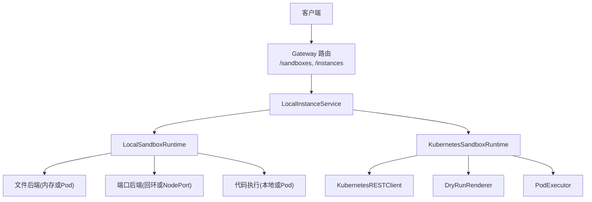
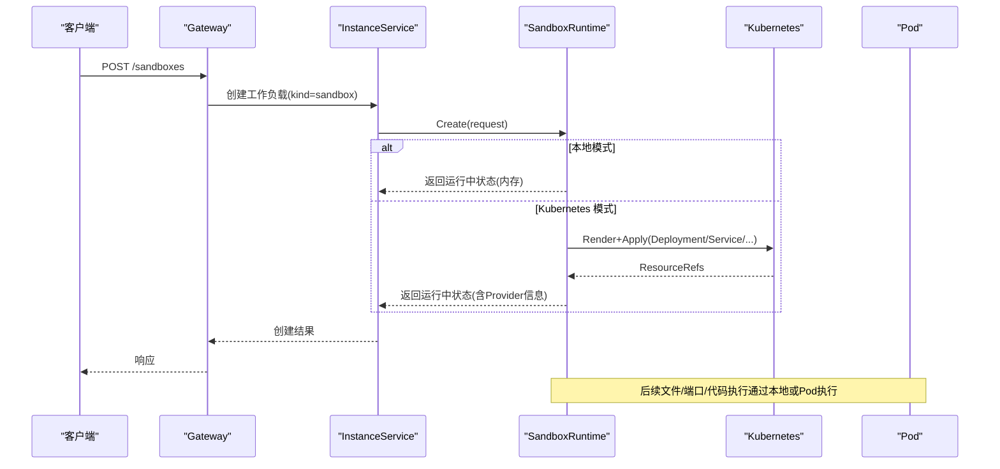
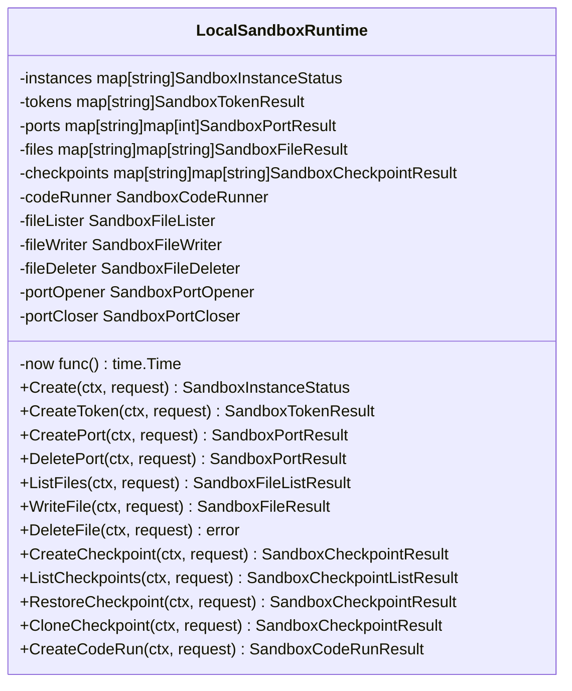
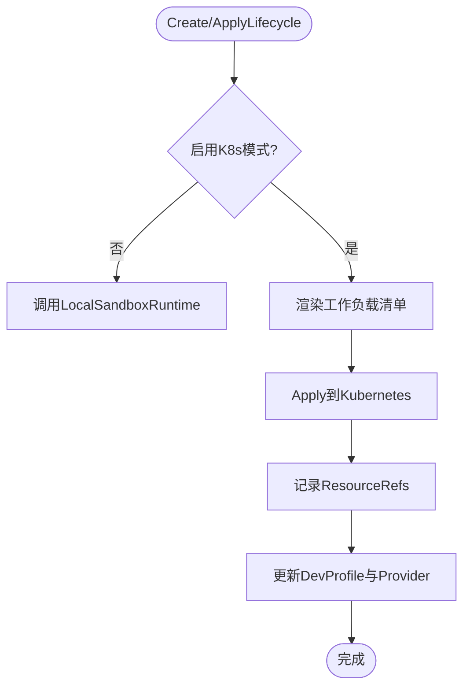
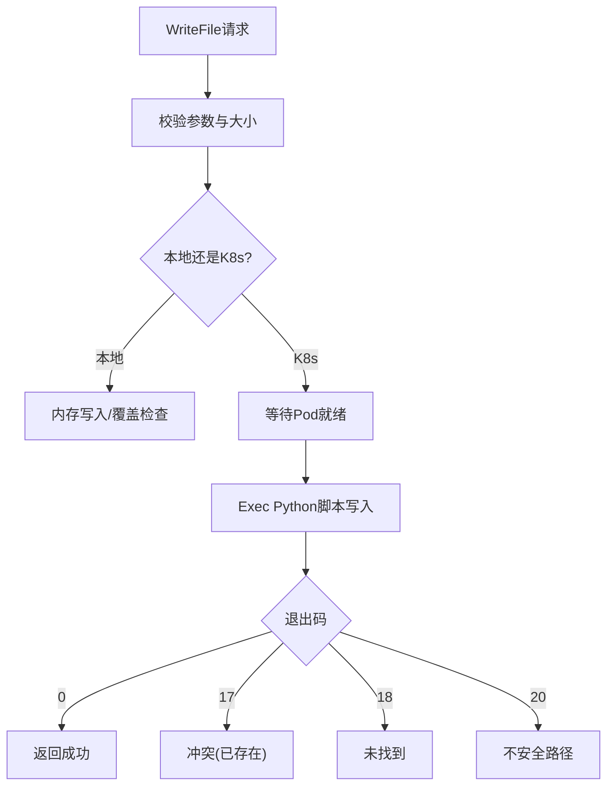
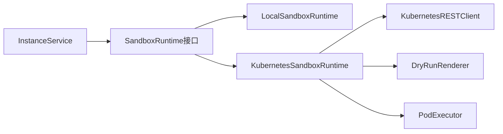

# 本地沙箱运行时

<cite>
**本文引用的文件列表**
- [local_sandbox_runtime.go](file://repo/pkg/adapters/runtime/local_sandbox_runtime.go)
- [kubernetes_sandbox_runtime.go](file://repo/pkg/adapters/runtime/kubernetes_sandbox_runtime.go)
- [kubernetes_sandbox_files.go](file://repo/pkg/adapters/runtime/kubernetes_sandbox_files.go)
- [instance_service.go](file://repo/pkg/adapters/runtime/instance_service.go)
- [sandbox_runtime.go](file://repo/pkg/ports/sandbox_runtime.go)
- [sandbox_template_catalog.go](file://repo/pkg/adapters/runtime/local_sandbox_template_catalog.go)
- [sandbox_template_catalog_port.go](file://repo/pkg/ports/sandbox_template_catalog.go)
- [instances_router.go](file://repo/services/ani-gateway/internal/router/instances.go)
- [sandbox_resources_router.go](file://repo/services/ani-gateway/internal/router/sandbox_resources.go)
</cite>

## 目录
1. [简介](#简介)
2. [项目结构](#项目结构)
3. [核心组件](#核心组件)
4. [架构总览](#架构总览)
5. [详细组件分析](#详细组件分析)
6. [依赖关系分析](#依赖关系分析)
7. [性能考虑](#性能考虑)
8. [故障排查指南](#故障排查指南)
9. [结论](#结论)
10. [附录：使用示例与扩展指南](#附录使用示例与扩展指南)

## 简介
本文件面向“本地沙箱运行时”的设计与实现，围绕以下目标展开：
- 解释 LocalSandboxRuntime 的设计理念、隔离策略、资源限制配置与生命周期管理。
- 说明沙箱模板的加载与管理方式，以及开发工具链集成点。
- 提供开发环境下的使用示例（代码执行、文件访问、网络隔离等）。
- 总结性能与安全边界，并给出调试技巧。
- 指导如何扩展本地沙箱以支持新的开发工具与语言环境。

## 项目结构
本地沙箱运行时由“端口定义 + 本地实现 + Kubernetes 适配 + 网关路由”组成：
- 端口层：统一抽象 SandboxRuntime 接口与数据模型，屏蔽底层实现差异。
- 本地实现：进程内内存态的沙箱会话管理，包含实例、令牌、端口、文件、检查点、代码执行等能力。
- Kubernetes 适配：在启用时通过渲染与 Apply Kubernetes 对象（Deployment、Service 等）将沙箱落地到真实集群；对文件、端口、代码执行等能力进行 Pod 级注入。
- 网关路由：对外暴露沙箱相关 API，并将请求委派给 InstanceService 与 SandboxRuntime。

图表来源
- [instances_router.go:721-757](file://repo/services/ani-gateway/internal/router/instances.go#L721-L757)
- [instance_service.go:1038-1074](file://repo/pkg/adapters/runtime/instance_service.go#L1038-L1074)
- [kubernetes_sandbox_runtime.go:59-79](file://repo/pkg/adapters/runtime/kubernetes_sandbox_runtime.go#L59-L79)
- [local_sandbox_runtime.go:34-58](file://repo/pkg/adapters/runtime/local_sandbox_runtime.go#L34-L58)

章节来源
- [instances_router.go:721-757](file://repo/services/ani-gateway/internal/router/instances.go#L721-L757)
- [sandbox_resources_router.go:12-22](file://repo/services/ani-gateway/internal/router/sandbox_resources.go#L12-L22)

## 核心组件
- SandboxRuntime 接口与数据模型：定义沙箱创建、生命周期、令牌、端口、文件、检查点、代码执行等统一契约。
- LocalSandboxRuntime：进程内沙箱会话管理器，维护实例、令牌、端口、文件、检查点、代码执行结果等内存状态，并提供可插拔的后端（文件、端口、代码执行）。
- KubernetesSandboxRuntime：在启用时通过渲染与 Apply Kubernetes 对象将沙箱部署到集群，并对文件、端口、代码执行进行 Pod 级注入；同时保留本地会话用于令牌与检查点等。
- LocalSandboxTemplateCatalog：内置沙箱模板目录，提供 Python、CUDA Notebook 等模板元数据。
- InstanceService：编排工作负载生命周期，当 kind=sandbox 时将操作委派给 SandboxRuntime。

章节来源
- [sandbox_runtime.go:8-31](file://repo/pkg/ports/sandbox_runtime.go#L8-L31)
- [sandbox_runtime.go:33-53](file://repo/pkg/ports/sandbox_runtime.go#L33-L53)
- [sandbox_runtime.go:259-296](file://repo/pkg/ports/sandbox_runtime.go#L259-L296)
- [local_sandbox_runtime.go:34-58](file://repo/pkg/adapters/runtime/local_sandbox_runtime.go#L34-L58)
- [kubernetes_sandbox_runtime.go:14-25](file://repo/pkg/adapters/runtime/kubernetes_sandbox_runtime.go#L14-L25)
- [sandbox_template_catalog.go:13-51](file://repo/pkg/adapters/runtime/local_sandbox_template_catalog.go#L13-L51)
- [sandbox_template_catalog_port.go:14-39](file://repo/pkg/ports/sandbox_template_catalog.go#L14-L39)
- [instance_service.go:1038-1074](file://repo/pkg/adapters/runtime/instance_service.go#L1038-L1074)

## 架构总览
本地沙箱运行时的关键流程如下：
- 创建沙箱：InstanceService 根据 kind=sandbox 调用 SandboxRuntime.Create；本地实现记录内存状态，Kubernetes 适配在启用时渲染并 Apply 工作负载对象。
- 生命周期：pause/resume/delete 等操作在本地与 Kubernetes 之间协调，确保资源清理与状态一致。
- 令牌签发：基于 HMAC 签发短期令牌，支持幂等键回放。
- 文件 IO：本地模式在进程内存中维护文件；Kubernetes 模式通过 Pod exec 写入/读取工作区文件，路径安全校验严格。
- 端口预览：本地模式返回回环 URL；Kubernetes 模式通过 Service/NodePort 暴露预览端口。
- 代码执行：本地模式接受请求但不实际执行；Kubernetes 模式在 Pod 中执行 Python/JavaScript。
- 检查点：本地模式在内存中模拟；Kubernetes 模式基于 PVC 的工作区快照。

图表来源
- [kubernetes_sandbox_runtime.go:81-148](file://repo/pkg/adapters/runtime/kubernetes_sandbox_runtime.go#L81-L148)
- [local_sandbox_runtime.go:124-164](file://repo/pkg/adapters/runtime/local_sandbox_runtime.go#L124-L164)
- [instance_service.go:1038-1074](file://repo/pkg/adapters/runtime/instance_service.go#L1038-L1074)

## 详细组件分析

### LocalSandboxRuntime：本地沙箱会话与资源管理
- 设计要点
  - 进程内内存存储实例、令牌、端口、文件、检查点、代码执行结果。
  - 通过选项注入文件后端、端口后端、代码执行器，便于测试与切换。
  - 令牌签发使用 HMAC，支持过期时间与幂等键回放。
  - 文件读写限制大小（默认 1 MiB），路径规范化与安全检查。
  - 端口支持 http/tcp，默认回环预览 URL；可扩展为真实 NodePort。
  - 检查点支持创建、列出、恢复、克隆；本地模式为内存模拟。
  - 代码执行仅接受 python/javascript，超时限制（默认 60s，最大 300s）。

- 隔离策略
  - 租户隔离：所有操作基于 TenantID 与 InstanceID 索引。
  - 资源限制：文件上传大小限制、代码执行超时限制、端口协议白名单。
  - 网络隔离：本地模式不开放外部网络；Kubernetes 模式可通过 NetworkPolicy 控制出站策略（由上层配置）。

- 生命周期管理
  - Create：生成唯一 InstanceID，设置初始状态（pending/running），记录 DevProfile。
  - ApplyLifecycle：支持 pause/resume/delete；删除时清理端口服务与工作区检查点。
  - Token：仅在 running 状态下签发，支持短时效与幂等键。
  - File/Port/Checkpoint：均要求 running 状态，否则返回前置条件错误。

图表来源
- [local_sandbox_runtime.go:34-58](file://repo/pkg/adapters/runtime/local_sandbox_runtime.go#L34-L58)
- [local_sandbox_runtime.go:124-164](file://repo/pkg/adapters/runtime/local_sandbox_runtime.go#L124-L164)
- [local_sandbox_runtime.go:166-225](file://repo/pkg/adapters/runtime/local_sandbox_runtime.go#L166-L225)
- [local_sandbox_runtime.go:227-376](file://repo/pkg/adapters/runtime/local_sandbox_runtime.go#L227-L376)
- [local_sandbox_runtime.go:378-601](file://repo/pkg/adapters/runtime/local_sandbox_runtime.go#L378-L601)
- [local_sandbox_runtime.go:603-761](file://repo/pkg/adapters/runtime/local_sandbox_runtime.go#L603-L761)
- [local_sandbox_runtime.go:763-800](file://repo/pkg/adapters/runtime/local_sandbox_runtime.go#L763-L800)

章节来源
- [local_sandbox_runtime.go:124-164](file://repo/pkg/adapters/runtime/local_sandbox_runtime.go#L124-L164)
- [local_sandbox_runtime.go:166-225](file://repo/pkg/adapters/runtime/local_sandbox_runtime.go#L166-L225)
- [local_sandbox_runtime.go:227-376](file://repo/pkg/adapters/runtime/local_sandbox_runtime.go#L227-L376)
- [local_sandbox_runtime.go:378-601](file://repo/pkg/adapters/runtime/local_sandbox_runtime.go#L378-L601)
- [local_sandbox_runtime.go:603-761](file://repo/pkg/adapters/runtime/local_sandbox_runtime.go#L603-L761)
- [local_sandbox_runtime.go:763-800](file://repo/pkg/adapters/runtime/local_sandbox_runtime.go#L763-L800)

### KubernetesSandboxRuntime：真实集群落地与能力注入
- 设计要点
  - 封装 LocalSandboxRuntime，并在启用时注入文件、端口、代码执行后端。
  - Create 时渲染并 Apply Kubernetes 工作负载对象（Deployment、Service、PVC 等），记录 ResourceRefs。
  - ApplyLifecycle 支持 scale 到 0/1 实现 pause/resume；delete 时清理 Service、PVC、检查点。
  - 令牌仍由本地会话管理；检查点在启用时使用 PVC 工作区快照。

- 资源限制与隔离
  - RuntimeClass：默认 sandbox-kata，结合 Kata 运行时实现强隔离。
  - 网络策略：通过上层配置 NetworkPolicy 控制出站策略（deny_all/allowlist/internet）。
  - 存储：工作区使用 PVC，支持检查点与恢复。

图表来源
- [kubernetes_sandbox_runtime.go:59-79](file://repo/pkg/adapters/runtime/kubernetes_sandbox_runtime.go#L59-L79)
- [kubernetes_sandbox_runtime.go:81-148](file://repo/pkg/adapters/runtime/kubernetes_sandbox_runtime.go#L81-L148)
- [kubernetes_sandbox_runtime.go:158-207](file://repo/pkg/adapters/runtime/kubernetes_sandbox_runtime.go#L158-L207)

章节来源
- [kubernetes_sandbox_runtime.go:59-79](file://repo/pkg/adapters/runtime/kubernetes_sandbox_runtime.go#L59-L79)
- [kubernetes_sandbox_runtime.go:81-148](file://repo/pkg/adapters/runtime/kubernetes_sandbox_runtime.go#L81-L148)
- [kubernetes_sandbox_runtime.go:158-207](file://repo/pkg/adapters/runtime/kubernetes_sandbox_runtime.go#L158-L207)

### 文件 IO 安全与实现
- 安全边界
  - 路径校验：禁止绝对路径、NUL、..、符号链接越界；使用 O_NOFOLLOW 防止绕过。
  - 大小限制：单文件上限 1 MiB，超限返回 413。
  - 覆盖策略：overwrite=false 时若文件存在返回 409。
  - 执行超时：Pod exec 超时 60s，避免长时间阻塞。

- 实现机制
  - 本地模式：进程内存维护文件映射。
  - Kubernetes 模式：通过 Pod exec 执行 Python 脚本进行文件操作，严格路径校验与权限控制。

图表来源
- [kubernetes_sandbox_files.go:24-31](file://repo/pkg/adapters/runtime/kubernetes_sandbox_files.go#L24-L31)
- [kubernetes_sandbox_files.go:93-138](file://repo/pkg/adapters/runtime/kubernetes_sandbox_files.go#L93-L138)
- [kubernetes_sandbox_files.go:140-168](file://repo/pkg/adapters/runtime/kubernetes_sandbox_files.go#L140-L168)
- [kubernetes_sandbox_files.go:170-258](file://repo/pkg/adapters/runtime/kubernetes_sandbox_files.go#L170-L258)

章节来源
- [kubernetes_sandbox_files.go:24-31](file://repo/pkg/adapters/runtime/kubernetes_sandbox_files.go#L24-L31)
- [kubernetes_sandbox_files.go:93-138](file://repo/pkg/adapters/runtime/kubernetes_sandbox_files.go#L93-L138)
- [kubernetes_sandbox_files.go:140-168](file://repo/pkg/adapters/runtime/kubernetes_sandbox_files.go#L140-L168)
- [kubernetes_sandbox_files.go:170-258](file://repo/pkg/adapters/runtime/kubernetes_sandbox_files.go#L170-L258)

### 模板目录与开发工具链集成
- 模板目录
  - 内置 Python 与 CUDA Notebook 模板，提供 CPU/内存/存储建议与镜像引用。
  - 模板元数据独立于运行时状态，便于前端展示与选择。

- 开发工具链集成
  - 通过 TemplateID 引用模板，自动注入镜像与环境变量。
  - 支持 RuntimeClass 指定隔离级别（如 sandbox-kata）。
  - 初始端口与环境变量可在模板中预设。

章节来源
- [sandbox_template_catalog.go:13-51](file://repo/pkg/adapters/runtime/local_sandbox_template_catalog.go#L13-L51)
- [sandbox_template_catalog_port.go:14-39](file://repo/pkg/ports/sandbox_template_catalog.go#L14-L39)

## 依赖关系分析
- 组件耦合
  - InstanceService 依赖 SandboxRuntime 接口，解耦具体实现。
  - KubernetesSandboxRuntime 依赖 LocalSandboxRuntime 作为基础会话管理。
  - 文件/端口/代码执行通过函数指针注入，降低耦合度。

- 外部依赖
  - KubernetesRESTClient：与集群交互，Apply/查询资源。
  - DryRunRenderer：渲染工作负载清单。
  - PodExecutor：执行 Pod 内命令。

图表来源
- [instance_service.go:1038-1074](file://repo/pkg/adapters/runtime/instance_service.go#L1038-L1074)
- [kubernetes_sandbox_runtime.go:59-79](file://repo/pkg/adapters/runtime/kubernetes_sandbox_runtime.go#L59-L79)

章节来源
- [instance_service.go:1038-1074](file://repo/pkg/adapters/runtime/instance_service.go#L1038-L1074)
- [kubernetes_sandbox_runtime.go:59-79](file://repo/pkg/adapters/runtime/kubernetes_sandbox_runtime.go#L59-L79)

## 性能考虑
- 内存占用
  - 本地模式文件与检查点存储在进程内存，适合小规模开发；生产建议使用 Kubernetes 模式持久化。
- 并发与锁
  - 使用读写锁保护共享状态，避免竞态；大文件写入与 Pod exec 可能成为瓶颈。
- 网络开销
  - Kubernetes 模式涉及多次 API 调用与 Pod exec，需合理设置超时与重试。
- 资源限制
  - 文件上传大小限制、代码执行超时限制，防止资源滥用。

## 故障排查指南
- 常见问题
  - 找不到实例：检查 TenantID/InstanceID 是否正确，或实例是否已被删除。
  - 非运行状态：文件/端口/检查点操作要求 running 状态。
  - 路径不安全：检查路径是否包含 ..、绝对路径或符号链接。
  - 文件过大：超过 1 MiB 会返回 413。
  - 令牌无效：检查过期时间与幂等键。

- 调试技巧
  - 启用 Kubernetes 模式时，查看 Applied 资源与 Pod 状态。
  - 使用日志记录 Pod exec 输出与错误。
  - 通过 DevProfile 判断当前运行模式与 Provider。

章节来源
- [local_sandbox_runtime.go:166-225](file://repo/pkg/adapters/runtime/local_sandbox_runtime.go#L166-L225)
- [kubernetes_sandbox_files.go:93-138](file://repo/pkg/adapters/runtime/kubernetes_sandbox_files.go#L93-L138)
- [kubernetes_sandbox_runtime.go:158-207](file://repo/pkg/adapters/runtime/kubernetes_sandbox_runtime.go#L158-L207)

## 结论
本地沙箱运行时通过统一的 SandboxRuntime 接口，提供了灵活的本地与 Kubernetes 两种实现。本地模式适合开发与测试，Kubernetes 模式提供真实隔离与持久化能力。通过模板目录与可插拔后端，系统易于扩展新工具与语言环境。在生产环境中，建议结合 NetworkPolicy、PVC 与 Kata RuntimeClass 实现强隔离与资源限制。

## 附录：使用示例与扩展指南

### 开发环境使用示例
- 创建沙箱
  - 通过 InstanceService 创建 kind=sandbox 的工作负载，指定模板与 RuntimeClass。
  - 本地模式立即返回运行状态；Kubernetes 模式 Apply 后返回 Provider 信息。

- 代码执行
  - 提交 Python/JavaScript 代码，设置超时；本地模式接受请求，Kubernetes 模式在 Pod 中执行。

- 文件访问
  - 列出/写入/删除工作区文件；注意路径安全与大小限制。

- 网络隔离
  - 本地模式使用回环 URL；Kubernetes 模式通过 Service/NodePort 暴露预览端口。

### 扩展新工具与语言环境
- 新增代码执行语言
  - 在 LocalSandboxRuntime 中扩展语言白名单，并实现对应执行器。
  - 在 Kubernetes 模式中注入新的执行脚本。

- 新增模板
  - 在 LocalSandboxTemplateCatalog 中添加模板元数据，包括镜像、资源建议与环境变量。

- 自定义端口后端
  - 实现 SandboxPortOpener/SandboxPortCloser，对接真实负载均衡或服务发现。

章节来源
- [local_sandbox_runtime.go:763-800](file://repo/pkg/adapters/runtime/local_sandbox_runtime.go#L763-L800)
- [sandbox_template_catalog.go:13-51](file://repo/pkg/adapters/runtime/local_sandbox_template_catalog.go#L13-L51)
- [kubernetes_sandbox_files.go:24-31](file://repo/pkg/adapters/runtime/kubernetes_sandbox_files.go#L24-L31)