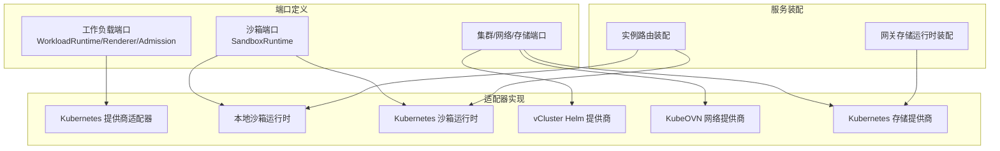
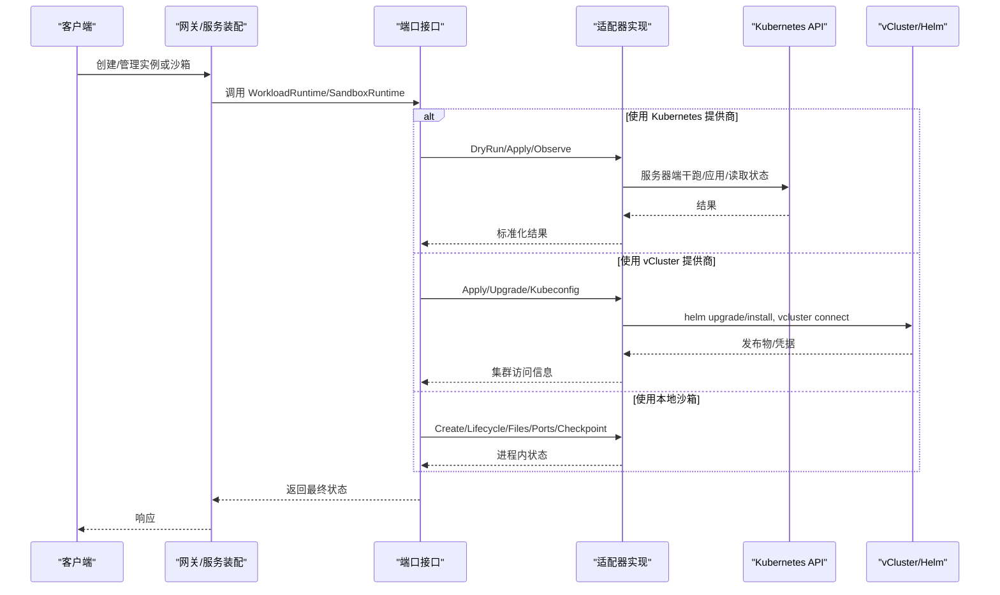
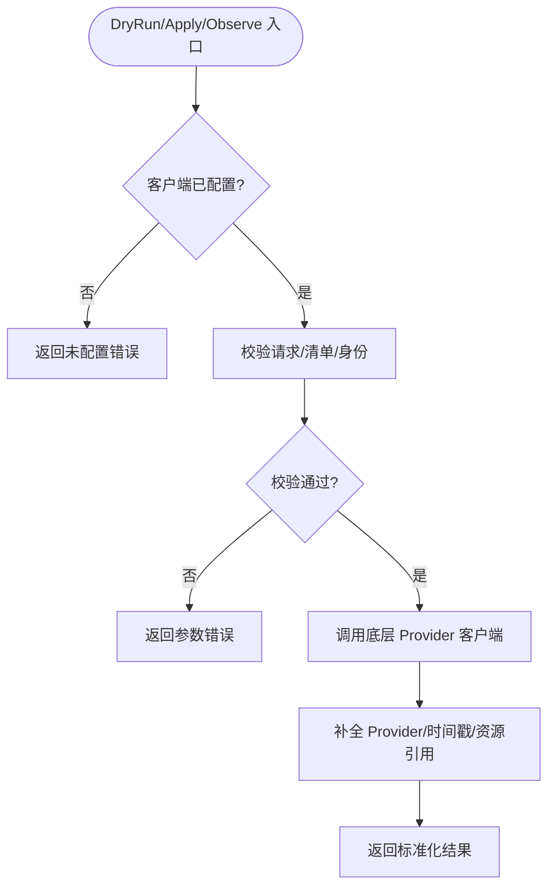
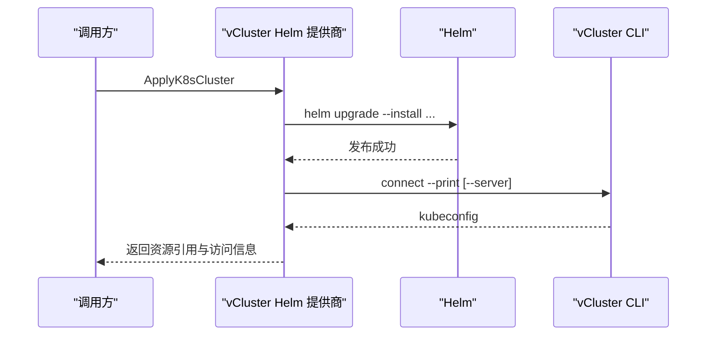
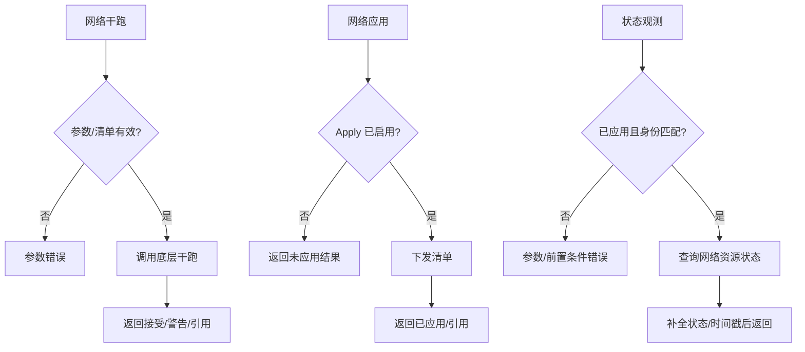
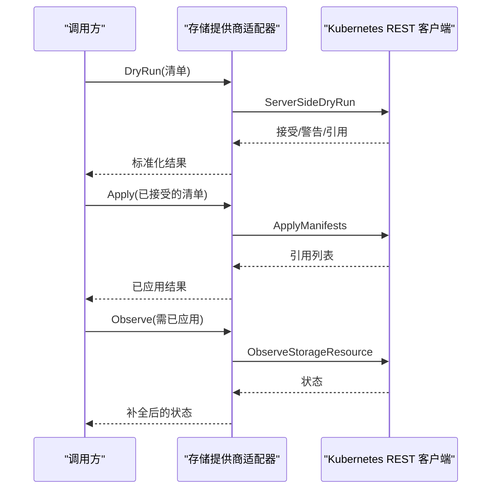
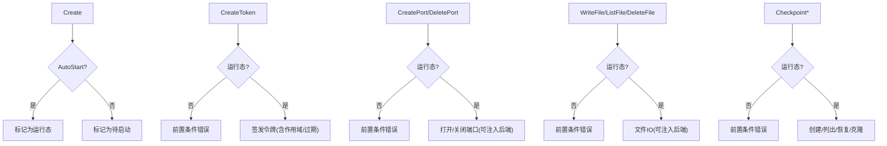
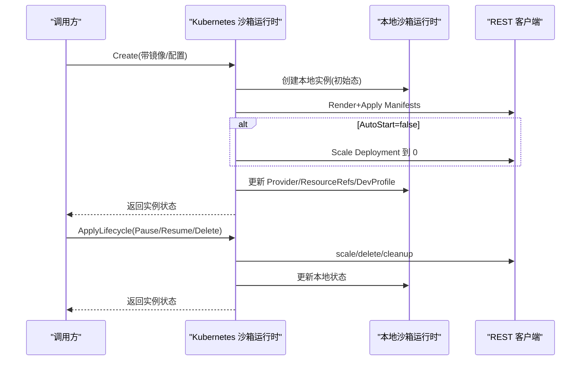
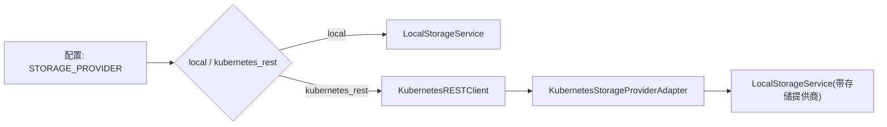
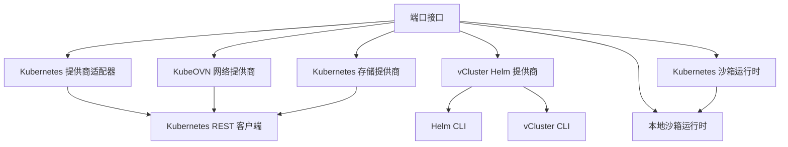

# 运行时适配器

<cite>
**本文引用的文件**
- [workload_runtime.go](file://repo/pkg/ports/workload_runtime.go)
- [sandbox_runtime.go](file://repo/pkg/ports/sandbox_runtime.go)
- [kubernetes_provider_adapter.go](file://repo/pkg/adapters/runtime/kubernetes_provider_adapter.go)
- [vcluster_helm_provider.go](file://repo/pkg/adapters/runtime/vcluster_helm_provider.go)
- [kubeovn_network_provider.go](file://repo/pkg/adapters/runtime/kubeovn_network_provider.go)
- [storage_provider.go](file://repo/pkg/adapters/runtime/storage_provider.go)
- [local_sandbox_runtime.go](file://repo/pkg/adapters/runtime/local_sandbox_runtime.go)
- [kubernetes_sandbox_runtime.go](file://repo/pkg/adapters/runtime/kubernetes_sandbox_runtime.go)
- [kubernetes_rest_client.go](file://repo/pkg/adapters/runtime/kubernetes_rest_client.go)
- [storage_runtime.go](file://repo/services/ani-gateway/storage_runtime.go)
- [instances.go](file://repo/services/ani-gateway/internal/router/instances.go)
</cite>

## 目录
1. [简介](#简介)
2. [项目结构](#项目结构)
3. [核心组件](#核心组件)
4. [架构总览](#架构总览)
5. [详细组件分析](#详细组件分析)
6. [依赖关系分析](#依赖关系分析)
7. [性能与可扩展性](#性能与可扩展性)
8. [故障排查指南](#故障排查指南)
9. [结论](#结论)
10. [附录：运行时选择与切换指南](#附录：运行时选择与切换指南)

## 简介
本文件系统性梳理 ANI 平台的“运行时适配器”体系，覆盖多种运行时环境及其适配实现：Kubernetes 提供商适配器、本地沙箱运行时、vCluster Helm 提供商、KubeOVN 网络提供商、存储提供商等。文档从接口契约、资源调度策略、生命周期管理、状态同步机制出发，给出不同运行时的配置方式、选择建议与环境适配策略（开发、测试、生产），帮助读者快速理解并正确集成各运行时。

## 项目结构
ANI 的运行时适配器采用“端口-适配器”风格：
- 端口层定义跨实现的稳定接口与数据模型，如工作负载运行时、沙箱运行时、网络/存储提供者接口等。
- 适配器层提供具体实现，包括 Kubernetes REST 调用、Helm/vCluster 命令执行、本地内存态沙箱等。
- 服务装配层根据配置将端口与适配器组合，形成可运行的运行时能力。

图表来源
- [workload_runtime.go:775-792](file://repo/pkg/ports/workload_runtime.go#L775-L792)
- [sandbox_runtime.go:278-296](file://repo/pkg/ports/sandbox_runtime.go#L278-L296)
- [kubernetes_provider_adapter.go:11-16](file://repo/pkg/adapters/runtime/kubernetes_provider_adapter.go#L11-L16)
- [vcluster_helm_provider.go:20-35](file://repo/pkg/adapters/runtime/vcluster_helm_provider.go#L20-L35)
- [kubeovn_network_provider.go:11-15](file://repo/pkg/adapters/runtime/kubeovn_network_provider.go#L11-L15)
- [storage_provider.go:11-15](file://repo/pkg/adapters/runtime/storage_provider.go#L11-L15)
- [storage_runtime.go:110-157](file://repo/services/ani-gateway/storage_runtime.go#L110-L157)
- [instances.go:721-757](file://repo/services/ani-gateway/internal/router/instances.go#L721-L757)

章节来源
- [workload_runtime.go:775-792](file://repo/pkg/ports/workload_runtime.go#L775-L792)
- [sandbox_runtime.go:278-296](file://repo/pkg/ports/sandbox_runtime.go#L278-L296)
- [storage_runtime.go:110-157](file://repo/services/ani-gateway/storage_runtime.go#L110-L157)
- [instances.go:721-757](file://repo/services/ani-gateway/internal/router/instances.go#L721-L757)

## 核心组件
- 工作负载运行时端口
  - 统一抽象 WorkloadRuntime、WorkloadRenderer、WorkloadAdmission，屏蔽底层 VM/容器/GPU/推理/笔记本/沙箱/批处理等差异。
  - 关键类型包括 WorkloadSpec、WorkloadStatus、WorkloadManifest、操作与审计记录等。
- 沙箱运行时端口
  - 统一抽象 SandboxRuntime，封装创建、生命周期、令牌、端口、文件、检查点、代码执行等能力。
  - 支持本地进程内态与真实 Kubernetes 后端两种模式。
- 提供商适配器
  - Kubernetes 提供商适配器：对干跑、应用、观测进行统一包装与校验。
  - vCluster Helm 提供商：通过 Helm/vCluster CLI 安装/升级虚拟集群，生成 kubeconfig。
  - KubeOVN 网络提供商：对网络资源的干跑、应用、状态观测进行封装。
  - Kubernetes 存储提供商：对 PVC 等资源进行干跑、应用、状态观测。

章节来源
- [workload_runtime.go:8-19](file://repo/pkg/ports/workload_runtime.go#L8-L19)
- [workload_runtime.go:353-381](file://repo/pkg/ports/workload_runtime.go#L353-L381)
- [workload_runtime.go:775-792](file://repo/pkg/ports/workload_runtime.go#L775-L792)
- [sandbox_runtime.go:23-43](file://repo/pkg/ports/sandbox_runtime.go#L23-L43)
- [sandbox_runtime.go:278-296](file://repo/pkg/ports/sandbox_runtime.go#L278-L296)
- [kubernetes_provider_adapter.go:11-16](file://repo/pkg/adapters/runtime/kubernetes_provider_adapter.go#L11-L16)
- [vcluster_helm_provider.go:20-35](file://repo/pkg/adapters/runtime/vcluster_helm_provider.go#L20-L35)
- [kubeovn_network_provider.go:11-15](file://repo/pkg/adapters/runtime/kubeovn_network_provider.go#L11-L15)
- [storage_provider.go:11-15](file://repo/pkg/adapters/runtime/storage_provider.go#L11-L15)

## 架构总览
下图展示了请求从网关到适配器的典型路径，以及不同运行时的装配方式。

图表来源
- [kubernetes_provider_adapter.go:50-143](file://repo/pkg/adapters/runtime/kubernetes_provider_adapter.go#L50-L143)
- [vcluster_helm_provider.go:73-187](file://repo/pkg/adapters/runtime/vcluster_helm_provider.go#L73-L187)
- [local_sandbox_runtime.go:124-163](file://repo/pkg/adapters/runtime/local_sandbox_runtime.go#L124-L163)
- [kubernetes_sandbox_runtime.go:81-147](file://repo/pkg/adapters/runtime/kubernetes_sandbox_runtime.go#L81-L147)

## 详细组件分析

### Kubernetes 提供商适配器
- 职责
  - 对 Workload 资源的服务器端干跑、应用、状态观测进行统一封装。
  - 强制校验：至少一个清单、禁止混合提供商、必须包含资源引用、时间戳填充等。
  - 支持开关控制是否真正 Apply。
- 关键流程
  - DryRun：先走准入结果校验，再调用底层干跑，合并警告与时间戳。
  - Apply：在启用时调用 Apply，否则返回未应用的只读结果；校验请求与结果完整性。
  - Observe：要求已 Apply 且身份一致，补充缺失字段。
- 错误与边界
  - 未配置客户端返回“未配置”。
  - 混合提供商、空清单、缺少资源引用均视为非法。

图表来源
- [kubernetes_provider_adapter.go:50-143](file://repo/pkg/adapters/runtime/kubernetes_provider_adapter.go#L50-L143)
- [kubernetes_provider_adapter.go:146-164](file://repo/pkg/adapters/runtime/kubernetes_provider_adapter.go#L146-L164)

章节来源
- [kubernetes_provider_adapter.go:11-16](file://repo/pkg/adapters/runtime/kubernetes_provider_adapter.go#L11-L16)
- [kubernetes_provider_adapter.go:50-143](file://repo/pkg/adapters/runtime/kubernetes_provider_adapter.go#L50-L143)
- [kubernetes_provider_adapter.go:146-164](file://repo/pkg/adapters/runtime/kubernetes_provider_adapter.go#L146-L164)

### vCluster Helm 提供商
- 职责
  - 通过 Helm 安装/升级 vCluster Chart，生成租户隔离的虚拟集群访问信息。
  - 支持自定义 Helm 仓库、Set 值、代理服务器模板、kubeconfig 服务器模板。
- 关键流程
  - Apply：helm upgrade --install 指定命名空间与 Chart，输出资源引用。
  - Upgrade：追加目标版本参数执行升级。
  - Kubeconfig：vcluster connect 打印 kubeconfig，解析 server/token/证书。
- 错误与边界
  - 必填字段校验失败返回参数错误。
  - 代理凭据缺失或不完整时报错。

图表来源
- [vcluster_helm_provider.go:73-187](file://repo/pkg/adapters/runtime/vcluster_helm_provider.go#L73-L187)
- [vcluster_helm_provider.go:208-263](file://repo/pkg/adapters/runtime/vcluster_helm_provider.go#L208-L263)
- [vcluster_helm_provider.go:310-318](file://repo/pkg/adapters/runtime/vcluster_helm_provider.go#L310-L318)

章节来源
- [vcluster_helm_provider.go:20-35](file://repo/pkg/adapters/runtime/vcluster_helm_provider.go#L20-L35)
- [vcluster_helm_provider.go:73-187](file://repo/pkg/adapters/runtime/vcluster_helm_provider.go#L73-L187)
- [vcluster_helm_provider.go:208-263](file://repo/pkg/adapters/runtime/vcluster_helm_provider.go#L208-L263)
- [vcluster_helm_provider.go:265-284](file://repo/pkg/adapters/runtime/vcluster_helm_provider.go#L265-L284)

### KubeOVN 网络提供商
- 职责
  - 对网络资源（如 VPC/Subnet）进行干跑、应用与状态观测。
  - 严格校验身份、操作类型（当前仅创建）、清单数量一致性、已应用后才能观测。
- 关键流程
  - DryRun：调用底层干跑，提取资源引用。
  - Apply：若启用则下发清单，否则返回未应用结果。
  - Observe：校验身份与已应用状态，补全默认状态与时间戳。
- 错误与边界
  - 未配置、参数缺失、非创建操作、清单不匹配等均报错。

图表来源
- [kubeovn_network_provider.go:50-133](file://repo/pkg/adapters/runtime/kubeovn_network_provider.go#L50-L133)
- [kubeovn_network_provider.go:136-176](file://repo/pkg/adapters/runtime/kubeovn_network_provider.go#L136-L176)

章节来源
- [kubeovn_network_provider.go:11-15](file://repo/pkg/adapters/runtime/kubeovn_network_provider.go#L11-L15)
- [kubeovn_network_provider.go:50-133](file://repo/pkg/adapters/runtime/kubeovn_network_provider.go#L50-L133)
- [kubeovn_network_provider.go:136-176](file://repo/pkg/adapters/runtime/kubeovn_network_provider.go#L136-L176)

### 存储提供商（Kubernetes PVC）
- 职责
  - 对存储资源（PVC）进行干跑、应用与状态观测。
  - 限制当前仅支持 Kubernetes PVC 清单。
- 关键流程
  - DryRun：校验身份与清单，调用底层干跑，提取资源引用。
  - Apply：若启用则下发清单，否则返回未应用结果。
  - Observe：校验已应用与身份，补全默认状态与时间戳。
- 错误与边界
  - 非 Kubernetes 提供商、未配置、未应用即观测、清单不匹配等报错。

图表来源
- [storage_provider.go:50-133](file://repo/pkg/adapters/runtime/storage_provider.go#L50-L133)
- [storage_provider.go:136-176](file://repo/pkg/adapters/runtime/storage_provider.go#L136-L176)
- [storage_provider.go:197-213](file://repo/pkg/adapters/runtime/storage_provider.go#L197-L213)

章节来源
- [storage_provider.go:11-15](file://repo/pkg/adapters/runtime/storage_provider.go#L11-L15)
- [storage_provider.go:50-133](file://repo/pkg/adapters/runtime/storage_provider.go#L50-L133)
- [storage_provider.go:136-176](file://repo/pkg/adapters/runtime/storage_provider.go#L136-L176)
- [storage_provider.go:197-213](file://repo/pkg/adapters/runtime/storage_provider.go#L197-L213)

### 本地沙箱运行时
- 职责
  - 提供进程内沙箱会话：创建、令牌、端口、文件、检查点、代码执行。
  - 默认以内存态维护实例、令牌、端口、文件、检查点等，适合开发与调试。
- 关键特性
  - 令牌签发：基于 HMAC 签名，支持作用域与过期时间，幂等键防重放。
  - 端口：未注入后端时返回 loopback 预览 URL；注入后可对接真实网关。
  - 文件：未注入后端时在内存中维护；支持写入大小限制与覆盖策略。
  - 检查点：创建/列出/恢复/克隆，保持幂等键去重。
  - 代码执行：支持 Python/JavaScript，超时限制，未注入后端时返回接受但无输出。
- 错误与边界
  - 非运行态沙箱拒绝令牌/端口/文件/检查点/代码执行。
  - 参数缺失、协议非法、内容过大等返回相应错误。

图表来源
- [local_sandbox_runtime.go:124-163](file://repo/pkg/adapters/runtime/local_sandbox_runtime.go#L124-L163)
- [local_sandbox_runtime.go:166-225](file://repo/pkg/adapters/runtime/local_sandbox_runtime.go#L166-L225)
- [local_sandbox_runtime.go:227-376](file://repo/pkg/adapters/runtime/local_sandbox_runtime.go#L227-L376)
- [local_sandbox_runtime.go:378-601](file://repo/pkg/adapters/runtime/local_sandbox_runtime.go#L378-L601)
- [local_sandbox_runtime.go:603-761](file://repo/pkg/adapters/runtime/local_sandbox_runtime.go#L603-L761)

章节来源
- [local_sandbox_runtime.go:124-163](file://repo/pkg/adapters/runtime/local_sandbox_runtime.go#L124-L163)
- [local_sandbox_runtime.go:166-225](file://repo/pkg/adapters/runtime/local_sandbox_runtime.go#L166-L225)
- [local_sandbox_runtime.go:227-376](file://repo/pkg/adapters/runtime/local_sandbox_runtime.go#L227-L376)
- [local_sandbox_runtime.go:378-601](file://repo/pkg/adapters/runtime/local_sandbox_runtime.go#L378-L601)
- [local_sandbox_runtime.go:603-761](file://repo/pkg/adapters/runtime/local_sandbox_runtime.go#L603-L761)

### Kubernetes 沙箱运行时
- 职责
  - 在启用时，将沙箱工作负载渲染为 Kubernetes Deployment（支持 RuntimeClass），并通过 REST 客户端应用。
  - 支持 pause/resume（scale 0/1）、delete（清理 Service/PVC/工作区检查点）。
  - 当启用时，文件/端口/代码执行/检查点走真实 Pod 后端；令牌仍由本地会话管理。
- 关键流程
  - Create：渲染清单 -> Apply -> 可选 scale 0 -> 更新本地实例元数据。
  - Lifecycle：按动作执行 scale/delete/cleanup。
  - 子资源：根据 enabled 与 ResourceRefs 决定走本地还是真实后端。
- 错误与边界
  - 未配置或未启用时回滚本地状态。
  - 需要 image、Deployment 引用、PVC 引用等前置条件。

图表来源
- [kubernetes_sandbox_runtime.go:81-147](file://repo/pkg/adapters/runtime/kubernetes_sandbox_runtime.go#L81-L147)
- [kubernetes_sandbox_runtime.go:158-207](file://repo/pkg/adapters/runtime/kubernetes_sandbox_runtime.go#L158-L207)
- [kubernetes_sandbox_runtime.go:321-399](file://repo/pkg/adapters/runtime/kubernetes_sandbox_runtime.go#L321-L399)

章节来源
- [kubernetes_sandbox_runtime.go:14-25](file://repo/pkg/adapters/runtime/kubernetes_sandbox_runtime.go#L14-L25)
- [kubernetes_sandbox_runtime.go:81-147](file://repo/pkg/adapters/runtime/kubernetes_sandbox_runtime.go#L81-L147)
- [kubernetes_sandbox_runtime.go:158-207](file://repo/pkg/adapters/runtime/kubernetes_sandbox_runtime.go#L158-L207)
- [kubernetes_sandbox_runtime.go:321-399](file://repo/pkg/adapters/runtime/kubernetes_sandbox_runtime.go#L321-L399)

### 服务装配与配置
- 存储运行时装配
  - 根据配置选择 local 或 kubernetes_rest 模式。
  - 在 kubernetes_rest 模式下，构建 REST 客户端与存储提供商适配器，并注入渲染器与执行配置。
- 实例路由装配
  - 默认注入本地沙箱运行时与本地实例资源解析器，便于开发调试。
  - 可通过选项注入生命周期执行器、观察服务等。

图表来源
- [storage_runtime.go:110-157](file://repo/services/ani-gateway/storage_runtime.go#L110-L157)

章节来源
- [storage_runtime.go:110-157](file://repo/services/ani-gateway/storage_runtime.go#L110-L157)
- [instances.go:721-757](file://repo/services/ani-gateway/internal/router/instances.go#L721-L757)

## 依赖关系分析
- 端口与适配器解耦
  - 所有适配器均实现对应端口接口，便于替换与扩展。
- 外部依赖
  - Kubernetes REST 客户端：用于干跑、应用、状态观测。
  - vCluster/Helm CLI：用于虚拟集群的安装与 kubeconfig 获取。
- 内部耦合
  - Kubernetes 沙箱运行时依赖本地沙箱运行时作为会话与令牌管理。
  - 网关装配层负责将端口与适配器组合成可用服务。

图表来源
- [kubernetes_provider_adapter.go:11-16](file://repo/pkg/adapters/runtime/kubernetes_provider_adapter.go#L11-L16)
- [vcluster_helm_provider.go:20-35](file://repo/pkg/adapters/runtime/vcluster_helm_provider.go#L20-L35)
- [kubeovn_network_provider.go:11-15](file://repo/pkg/adapters/runtime/kubeovn_network_provider.go#L11-L15)
- [storage_provider.go:11-15](file://repo/pkg/adapters/runtime/storage_provider.go#L11-L15)
- [kubernetes_sandbox_runtime.go:14-25](file://repo/pkg/adapters/runtime/kubernetes_sandbox_runtime.go#L14-L25)

章节来源
- [kubernetes_provider_adapter.go:11-16](file://repo/pkg/adapters/runtime/kubernetes_provider_adapter.go#L11-L16)
- [vcluster_helm_provider.go:20-35](file://repo/pkg/adapters/runtime/vcluster_helm_provider.go#L20-L35)
- [kubeovn_network_provider.go:11-15](file://repo/pkg/adapters/runtime/kubeovn_network_provider.go#L11-L15)
- [storage_provider.go:11-15](file://repo/pkg/adapters/runtime/storage_provider.go#L11-L15)
- [kubernetes_sandbox_runtime.go:14-25](file://repo/pkg/adapters/runtime/kubernetes_sandbox_runtime.go#L14-L25)

## 性能与可扩展性
- 适配器层最小化开销
  - 适配器主要做参数校验、结果标准化与开关控制，避免重复逻辑。
- 批量与幂等
  - 清单批量提交减少往返；大量操作通过幂等键避免重复执行。
- 可扩展点
  - 新增运行时只需实现端口接口并提供适配器。
  - 通过配置开关控制 Apply 行为，便于灰度与回滚。
- 资源观测
  - 状态观测统一补全时间与引用，降低上层复杂度。

[本节为通用指导，无需特定文件来源]

## 故障排查指南
- 常见错误与定位
  - “未配置”：检查是否注入客户端或二进制（Helm/vCluster）。
  - “参数错误”：核对必填字段（租户ID、用户ID、资源ID、权限证明等）。
  - “前置条件错误”：确保已 Apply 后再观测；沙箱需处于运行态。
  - “不支持”：确认清单提供商是否为当前适配器支持的类型（如存储仅支持 Kubernetes PVC）。
- 日志与证据
  - 关注适配器返回的 Reason/Warnings 字段，结合清单与资源引用定位问题。
  - 对于 vCluster，检查 helm/vcluster 命令输出与 kubeconfig 解析结果。

章节来源
- [kubernetes_provider_adapter.go:50-143](file://repo/pkg/adapters/runtime/kubernetes_provider_adapter.go#L50-L143)
- [kubeovn_network_provider.go:136-176](file://repo/pkg/adapters/runtime/kubeovn_network_provider.go#L136-L176)
- [storage_provider.go:136-176](file://repo/pkg/adapters/runtime/storage_provider.go#L136-L176)
- [vcluster_helm_provider.go:265-284](file://repo/pkg/adapters/runtime/vcluster_helm_provider.go#L265-L284)

## 结论
ANI 的运行时适配器通过清晰的端口-适配器分层，实现了多运行时环境的统一抽象与灵活装配。Kubernetes 提供商适配器、vCluster Helm 提供商、KubeOVN 网络提供商、存储提供商与本地/真实沙箱运行时共同构成了完整的运行时生态。借助配置开关与严格的校验流程，系统可在开发、测试、生产环境中平滑切换与演进。

[本节为总结性内容，无需特定文件来源]

## 附录：运行时选择与切换指南
- 开发环境
  - 推荐：本地沙箱运行时 + 本地存储/网络服务。
  - 优点：零依赖、快速迭代、易于调试。
  - 配置要点：使用默认本地装配，不启用 Apply 开关。
- 测试环境
  - 推荐：Kubernetes 提供商适配器 + KubeOVN 网络提供商 + Kubernetes 存储提供商。
  - 优点：贴近生产行为，验证清单与状态观测链路。
  - 配置要点：启用 Apply，注入 REST 客户端；必要时使用 vCluster 模拟租户隔离。
- 生产环境
  - 推荐：Kubernetes 提供商适配器 + vCluster Helm 提供商（如需租户级集群）+ KubeOVN 网络提供商 + Kubernetes 存储提供商 + Kubernetes 沙箱运行时（启用）。
  - 优点：高可用、可观测、可治理；支持真实资源编排与状态同步。
  - 配置要点：严格校验权限证明；开启 Apply 开关；配置 Helm/vCluster 二进制与仓库；启用沙箱真实后端（文件/端口/检查点）。

章节来源
- [storage_runtime.go:110-157](file://repo/services/ani-gateway/storage_runtime.go#L110-L157)
- [instances.go:721-757](file://repo/services/ani-gateway/internal/router/instances.go#L721-L757)
- [kubernetes_sandbox_runtime.go:81-147](file://repo/pkg/adapters/runtime/kubernetes_sandbox_runtime.go#L81-L147)
- [vcluster_helm_provider.go:73-187](file://repo/pkg/adapters/runtime/vcluster_helm_provider.go#L73-L187)
- [kubeovn_network_provider.go:50-133](file://repo/pkg/adapters/runtime/kubeovn_network_provider.go#L50-L133)
- [storage_provider.go:50-133](file://repo/pkg/adapters/runtime/storage_provider.go#L50-L133)