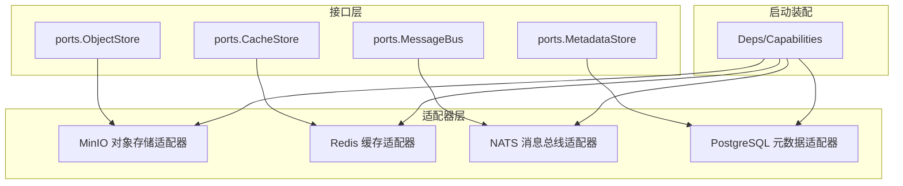
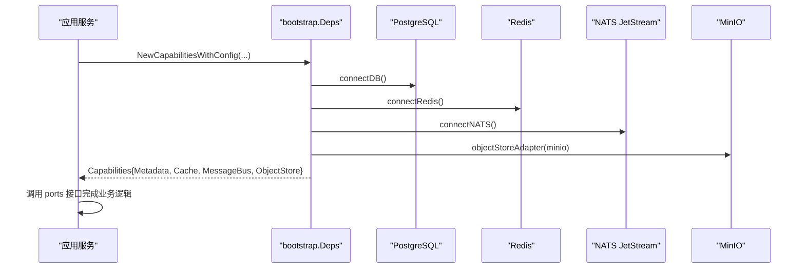
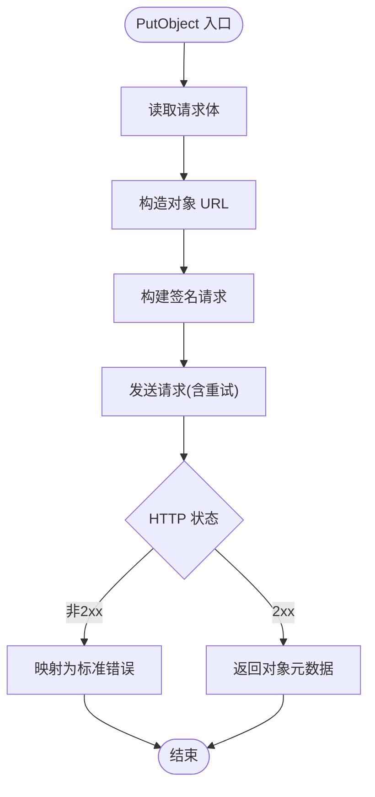
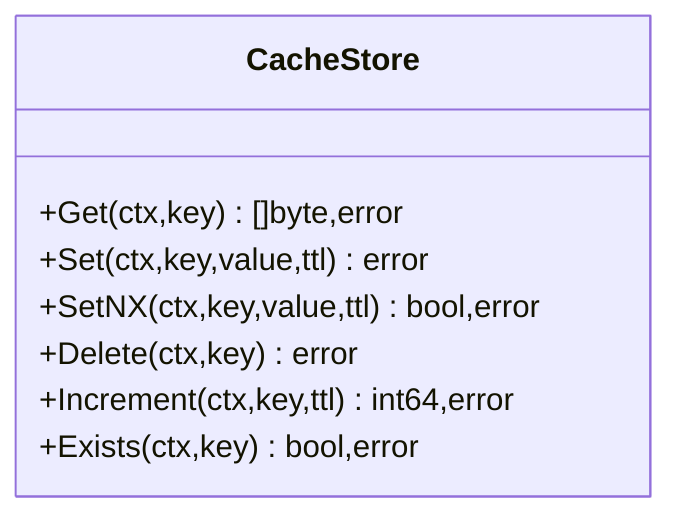
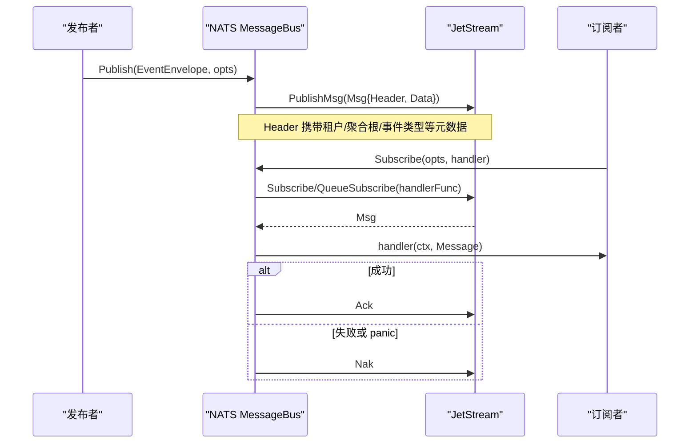
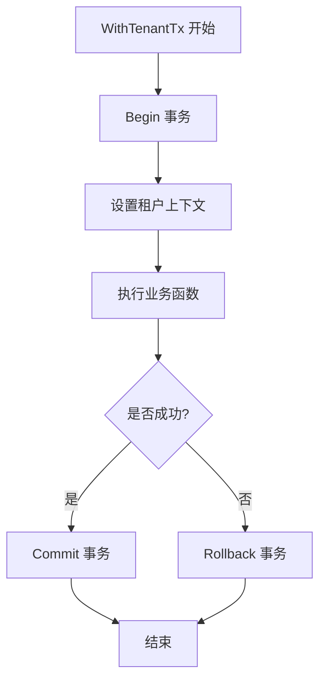
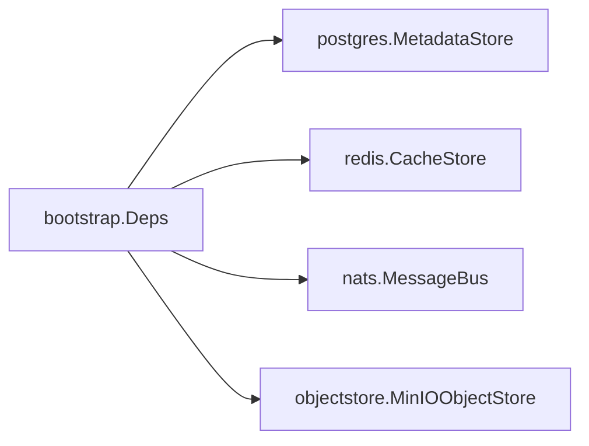

# 适配器实现

<cite>
**本文引用的文件**
- [object_store.go](file://repo/pkg/ports/object_store.go)
- [cache_store.go](file://repo/pkg/ports/cache_store.go)
- [message_bus.go](file://repo/pkg/ports/message_bus.go)
- [minio_store.go](file://repo/pkg/adapters/objectstore/minio_store.go)
- [cache_store.go](file://repo/pkg/adapters/redis/cache_store.go)
- [message_bus.go](file://repo/pkg/adapters/nats/message_bus.go)
- [metadata_store.go](file://repo/pkg/adapters/postgres/metadata_store.go)
- [deps.go](file://repo/pkg/bootstrap/deps.go)
- [db.go](file://repo/pkg/bootstrap/db.go)
- [redis.go](file://repo/pkg/bootstrap/redis.go)
- [nats.go](file://repo/pkg/bootstrap/nats.go)
</cite>

## 目录
1. [简介](#简介)
2. [项目结构](#项目结构)
3. [核心组件](#核心组件)
4. [架构总览](#架构总览)
5. [详细组件分析](#详细组件分析)
6. [依赖关系分析](#依赖关系分析)
7. [性能考量](#性能考量)
8. [故障排查指南](#故障排查指南)
9. [结论](#结论)
10. [附录：新适配器开发指南与最佳实践](#附录：新适配器开发指南与最佳实践)

## 简介
本文件系统性梳理 ANI 平台中的基础设施适配器实现，涵盖对象存储（MinIO）、数据库（PostgreSQL）、缓存（Redis）、消息总线（NATS JetStream）等。文档从接口契约、配置方式、连接池管理、错误处理、性能优化到扩展新适配器的最佳实践进行分层说明，帮助读者快速理解并安全地扩展系统能力。

## 项目结构
- 接口层（ports）：定义跨服务一致的抽象接口，如 ObjectStore、CacheStore、MessageBus、MetadataStore 等，屏蔽底层差异。
- 适配器层（adapters）：针对具体基础设施的实现，如 MinIO、Redis、NATS、Postgres。
- 启动装配（bootstrap）：负责连接外部依赖、创建适配器实例、组装 Capabilities，供各服务统一使用。

图表来源
- [deps.go:25-71](file://repo/pkg/bootstrap/deps.go#L25-L71)
- [object_store.go:47-56](file://repo/pkg/ports/object_store.go#L47-L56)
- [cache_store.go:8-15](file://repo/pkg/ports/cache_store.go#L8-L15)
- [message_bus.go:62-65](file://repo/pkg/ports/message_bus.go#L62-L65)
- [metadata_store.go:13-21](file://repo/pkg/adapters/postgres/metadata_store.go#L13-L21)

章节来源
- [deps.go:25-71](file://repo/pkg/bootstrap/deps.go#L25-L71)

## 核心组件
- 对象存储适配器（MinIO）：实现 S3 兼容协议，支持多端点、签名请求、预签名上传/下载、桶存在性检查与健康检查。
- 缓存适配器（Redis）：基于 go-redis UniversalClient，提供 Get/Set/SetNX/Delete/Increment/Exists 等基础操作。
- 消息总线适配器（NATS JetStream）：封装 Publish/Subscribe，自动 Ack/Nak 语义，支持队列订阅、消费者、最大并发与重试策略。
- 数据库适配器（PostgreSQL）：基于 pgxpool 的 MetadataStore，提供租户/平台事务包装与 SQL 执行封装。

章节来源
- [minio_store.go:31-105](file://repo/pkg/adapters/objectstore/minio_store.go#L31-L105)
- [cache_store.go:13-21](file://repo/pkg/adapters/redis/cache_store.go#L13-L21)
- [message_bus.go:13-30](file://repo/pkg/adapters/nats/message_bus.go#L13-L30)
- [metadata_store.go:13-21](file://repo/pkg/adapters/postgres/metadata_store.go#L13-L21)

## 架构总览
服务通过 bootstrap 初始化外部依赖并注入适配器实例，业务代码仅依赖 ports 接口，从而解耦具体实现。

图表来源
- [deps.go:89-307](file://repo/pkg/bootstrap/deps.go#L89-L307)
- [db.go:14-64](file://repo/pkg/bootstrap/db.go#L14-L64)
- [redis.go:27-64](file://repo/pkg/bootstrap/redis.go#L27-L64)
- [nats.go:12-54](file://repo/pkg/bootstrap/nats.go#L12-L54)
- [deps.go:380-399](file://repo/pkg/bootstrap/deps.go#L380-L399)

## 详细组件分析

### 对象存储适配器（MinIO）
- 配置要点
  - Endpoint/Endpoints：主端点与备选端点列表；支持 http/https。
  - PublicEndpoint：用于生成对外可访问的预签名 URL。
  - AccessKeyID/SecretAccessKey/SessionToken：鉴权信息。
  - Region：默认 us-east-1。
  - BucketPrefix：桶名前缀，结合 BucketClass 形成最终桶名。
  - RequestTimeout：请求超时，配合 resilience.Policy 控制重试与超时。
  - Now：时间源，便于测试与一致性。
- 连接与重试
  - doRequest 遍历 endpoints 列表，对可重试错误与特定 HTTP 状态码进行重试。
  - 使用 resilience.Do 包裹 HTTP 客户端调用，统一超时与重试策略。
- 错误处理
  - 将常见 HTTP 状态映射为统一错误类型（NotFound、Conflict、FailedPrecondition）。
  - 健康检查通过 HEAD / 验证连通性。
- 预签名 URL
  - 实现 AWS SigV4 风格的预签名 GET/PUT，支持可选 SessionToken。
- 性能优化建议
  - 合理设置 RequestTimeout 与后端重试次数。
  - 大对象上传建议使用预签名直传，减少网关压力。
  - 复用 http.Client，避免频繁握手。

图表来源
- [minio_store.go:163-198](file://repo/pkg/adapters/objectstore/minio_store.go#L163-L198)
- [minio_store.go:333-366](file://repo/pkg/adapters/objectstore/minio_store.go#L333-L366)
- [minio_store.go:566-581](file://repo/pkg/adapters/objectstore/minio_store.go#L566-L581)

章节来源
- [object_store.go:9-56](file://repo/pkg/ports/object_store.go#L9-L56)
- [minio_store.go:31-105](file://repo/pkg/adapters/objectstore/minio_store.go#L31-L105)
- [minio_store.go:107-272](file://repo/pkg/adapters/objectstore/minio_store.go#L107-L272)
- [minio_store.go:333-389](file://repo/pkg/adapters/objectstore/minio_store.go#L333-L389)
- [minio_store.go:566-619](file://repo/pkg/adapters/objectstore/minio_store.go#L566-L619)

### 缓存适配器（Redis）
- 功能覆盖
  - Get/Set/SetNX/Delete/Increment/Exists。
  - Increment 使用管道批量设置过期时间，降低往返。
- 错误处理
  - 将 redis.Nil 映射为 NotFound。
  - 其他错误统一包装为带上下文的错误。
- 连接与配置
  - 由 bootstrap 提供 UniversalClient，支持单机/Sentinel/Cluster。
  - 连接时 Ping 校验可用性。

图表来源
- [cache_store.go:13-75](file://repo/pkg/adapters/redis/cache_store.go#L13-L75)
- [cache_store.go:8-15](file://repo/pkg/ports/cache_store.go#L8-L15)

章节来源
- [cache_store.go:13-75](file://repo/pkg/adapters/redis/cache_store.go#L13-L75)
- [cache_store.go:8-15](file://repo/pkg/ports/cache_store.go#L8-L15)
- [redis.go:27-64](file://repo/pkg/bootstrap/redis.go#L27-L64)

### 消息总线适配器（NATS JetStream）
- 发布流程
  - 将 EventEnvelope 元数据写入消息头，消费侧可重建租户上下文。
  - 支持可选 Key 作为消息 ID，用于去重。
- 订阅流程
  - 支持 Queue 订阅、消费者名称、最大并发、AckWait、MaxDeliver。
  - 自动 Ack/Nak：handler 返回 nil → Ack；error → Nak；panic → recover 后 Nak。
  - 每条消息独立 context.Background()，超时由业务自行控制。
- 流初始化
  - 启动时确保 ANI_TASKS、ANI_EVENTS 两个 Stream 存在，分别采用 WorkQueuePolicy 与 InterestPolicy。

图表来源
- [message_bus.go:32-57](file://repo/pkg/adapters/nats/message_bus.go#L32-L57)
- [message_bus.go:59-135](file://repo/pkg/adapters/nats/message_bus.go#L59-L135)
- [nats.go:56-94](file://repo/pkg/bootstrap/nats.go#L56-L94)

章节来源
- [message_bus.go:8-65](file://repo/pkg/ports/message_bus.go#L8-L65)
- [message_bus.go:13-162](file://repo/pkg/adapters/nats/message_bus.go#L13-L162)
- [nats.go:12-94](file://repo/pkg/bootstrap/nats.go#L12-L94)

### 数据库适配器（PostgreSQL）
- 事务封装
  - WithTenantTx：在事务中设置租户上下文，提交或回滚。
  - WithPlatformTx：平台级事务，无租户上下文。
- 执行封装
  - Exec/Query/QueryRow 统一包装 pgx.Tx，返回标准接口。
- 连接池
  - 连接池大小、生命周期、空闲时间与健康检查周期在启动时配置。
  - 启动时带超时重试，直到数据库可用。

图表来源
- [metadata_store.go:27-60](file://repo/pkg/adapters/postgres/metadata_store.go#L27-L60)
- [db.go:14-64](file://repo/pkg/bootstrap/db.go#L14-L64)

章节来源
- [metadata_store.go:13-105](file://repo/pkg/adapters/postgres/metadata_store.go#L13-L105)
- [db.go:14-64](file://repo/pkg/bootstrap/db.go#L14-L64)

## 依赖关系分析
- 启动装配集中管理外部依赖的生命周期与配置，向业务暴露统一的 Capabilities。
- 各适配器仅依赖对应 ports 接口，保持低耦合。
- 关键依赖链：
  - bootstrap.db → PostgreSQL 连接池 → postgres.MetadataStore
  - bootstrap.redis → Redis UniversalClient → redis.CacheStore
  - bootstrap.nats → NATS JetStream → nats.MessageBus
  - bootstrap.deps → objectStoreAdapter → minio_store.MinIOObjectStore

图表来源
- [deps.go:89-307](file://repo/pkg/bootstrap/deps.go#L89-L307)
- [db.go:54-64](file://repo/pkg/bootstrap/db.go#L54-L64)
- [redis.go:50-64](file://repo/pkg/bootstrap/redis.go#L50-L64)
- [nats.go:12-54](file://repo/pkg/bootstrap/nats.go#L12-L54)
- [deps.go:380-399](file://repo/pkg/bootstrap/deps.go#L380-L399)

章节来源
- [deps.go:89-307](file://repo/pkg/bootstrap/deps.go#L89-L307)

## 性能考量
- 对象存储（MinIO）
  - 多端点与重试：适用于分布式部署，提升可用性。
  - 预签名直传：减少网关转发压力，适合大文件。
  - 合理设置 RequestTimeout，避免长尾请求拖垮资源。
- 缓存（Redis）
  - 使用管道批量操作（如 Incr+Expire），减少 RTT。
  - 根据模式（单机/Sentinel/Cluster）选择合适拓扑与地址数。
- 消息总线（NATS）
  - MaxInflight/AckWait/MaxDeliver 控制吞吐与可靠性。
  - 队列订阅提升水平扩展能力；持久化 Stream 保障消息不丢失。
- 数据库（PostgreSQL）
  - 连接池参数（最大连接数、生命周期、空闲时间、健康检查）需按负载调优。
  - 事务粒度尽量小，避免长事务占用连接。

[本节为通用指导，不直接分析具体文件]

## 故障排查指南
- 对象存储（MinIO）
  - 健康检查失败：确认 Endpoint/Secure/Region/鉴权信息正确；检查网络可达与防火墙。
  - 预签名 URL 无效：确认 PublicEndpoint 与签名算法一致；注意时区与时间同步。
  - 常见错误映射：404→NotFound，409→Conflict，400/401/403→FailedPrecondition。
- 缓存（Redis）
  - 连接失败：检查 URL/Mode/Addrs/MasterName/密码；Sentinel/Cluster 模式需满足最小地址数要求。
  - 键不存在：Get 返回 NotFound；SetNX 可用于防重入。
- 消息总线（NATS）
  - 无法消费：确认 Stream 已创建且 Subject 匹配；检查 Consumer/Queue 配置。
  - 重复消费：Handler 返回 error 会触发 Nak；确保幂等处理。
  - Panic 兜底：adapter 捕获 panic 后 Nak，避免消息丢失。
- 数据库（PostgreSQL）
  - 连接超时：检查 DATABASE_URL 与网络；启动时会重试最多 30 秒。
  - 事务异常：WithTenantTx/WithPlatformTx 会在失败时回滚，关注日志定位。

章节来源
- [minio_store.go:107-125](file://repo/pkg/adapters/objectstore/minio_store.go#L107-L125)
- [minio_store.go:566-581](file://repo/pkg/adapters/objectstore/minio_store.go#L566-L581)
- [cache_store.go:23-75](file://repo/pkg/adapters/redis/cache_store.go#L23-L75)
- [redis.go:27-124](file://repo/pkg/bootstrap/redis.go#L27-L124)
- [message_bus.go:59-135](file://repo/pkg/adapters/nats/message_bus.go#L59-L135)
- [nats.go:56-94](file://repo/pkg/bootstrap/nats.go#L56-L94)
- [db.go:14-64](file://repo/pkg/bootstrap/db.go#L14-L64)

## 结论
通过 ports 接口与 bootstrap 装配，ANI 实现了高内聚、低耦合的基础设施适配体系。MinIO、Redis、NATS、PostgreSQL 适配器均具备完善的配置、错误处理与性能优化手段。新增适配器只需遵循接口契约并在 bootstrap 中注册，即可无缝接入现有生态。

[本节为总结性内容，不直接分析具体文件]

## 附录：新适配器开发指南与最佳实践
- 定义接口
  - 在 ports 中定义清晰、稳定的接口，明确输入输出、错误约定与上下文使用。
- 实现适配器
  - 在 adapters 下新建包，实现 ports 接口；保证线程安全与资源释放。
  - 错误处理：将底层错误映射为统一错误类型，便于上层判断与重试。
  - 配置项：集中管理配置，提供默认值与校验，避免运行时歧义。
- 启动装配
  - 在 bootstrap 中提供 ConnectXxx 方法，负责连接、健康检查与生命周期管理。
  - 在 NewCapabilitiesWithConfig 中按配置选择具体实现，注入 Capabilities。
- 测试与可观测性
  - 单元测试：对关键路径进行覆盖，尤其是错误分支与边界条件。
  - 集成测试：对接真实或 Mock 的外部依赖，验证端到端流程。
  - 日志与指标：记录关键操作与异常，便于问题定位。
- 性能与安全
  - 连接池/会话复用：避免频繁建立连接。
  - 超时与重试：合理设置超时与重试策略，防止雪崩。
  - 安全：敏感配置通过环境变量或密钥管理服务注入，避免硬编码。

[本节为通用指导，不直接分析具体文件]