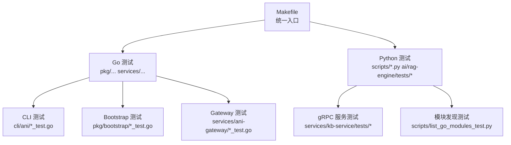
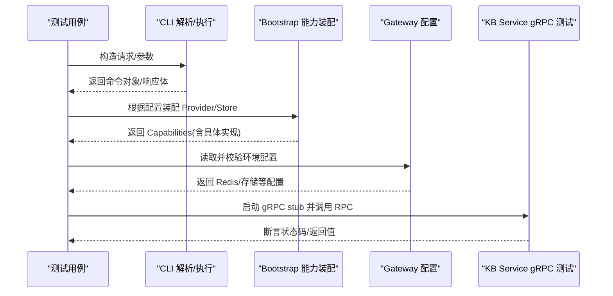
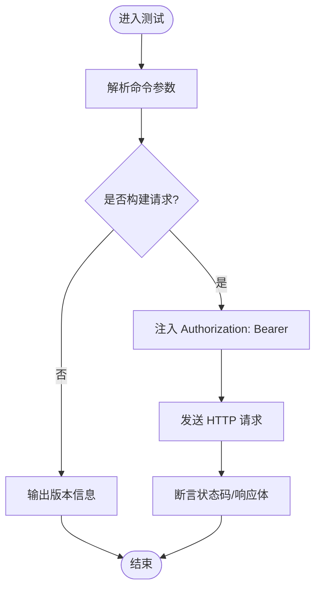
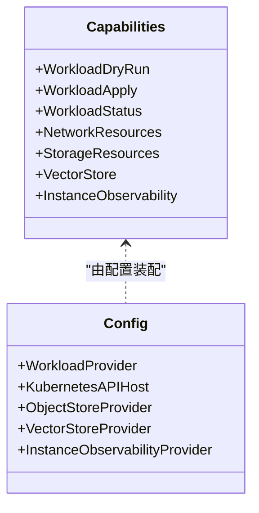
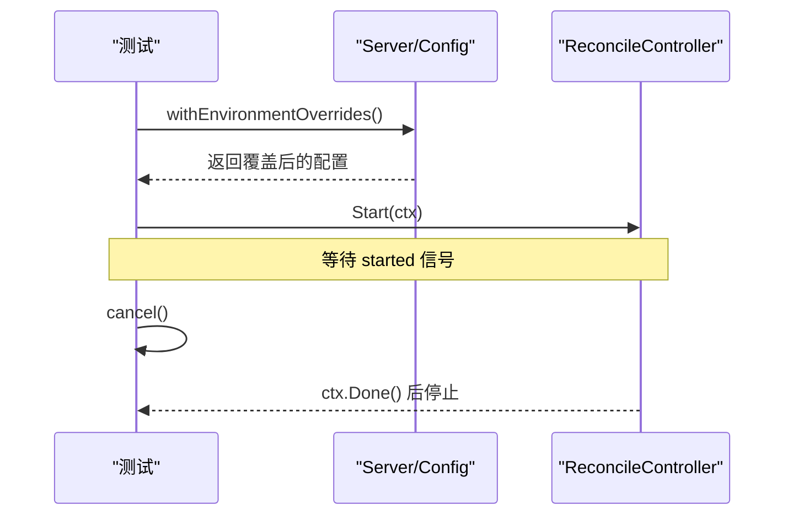
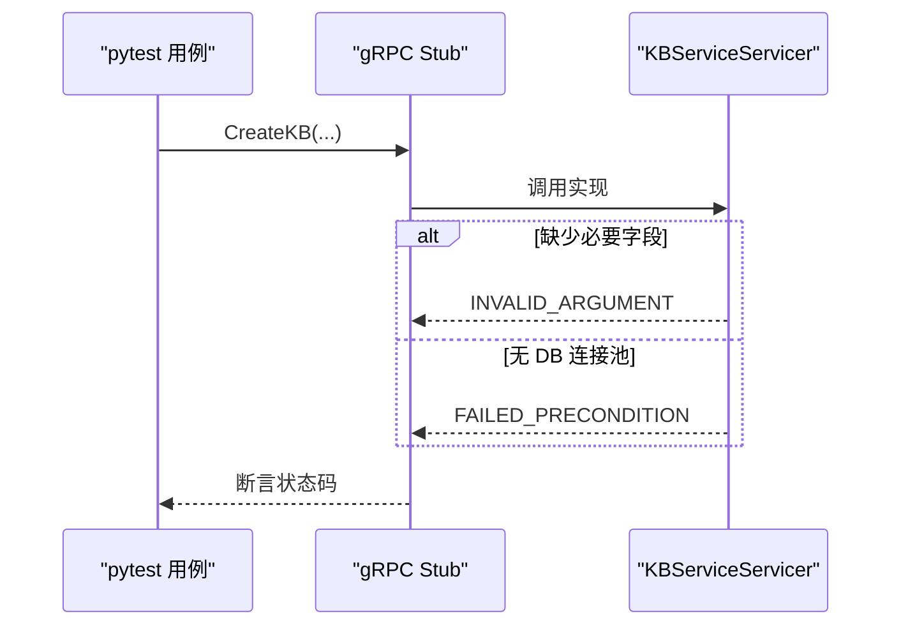
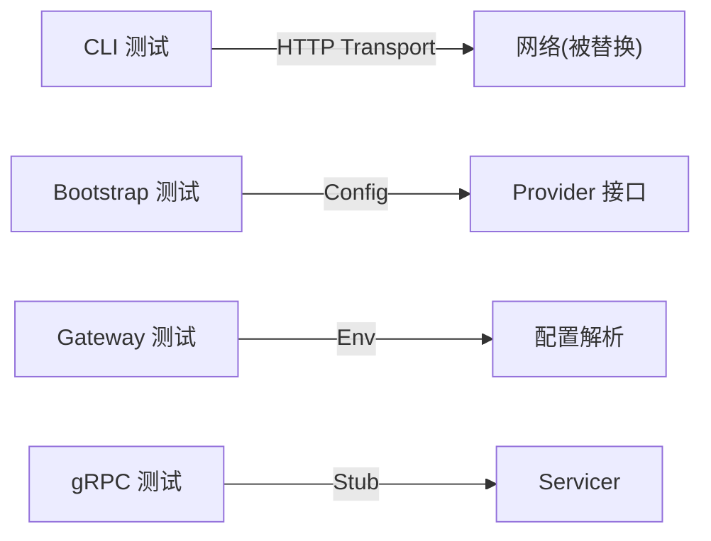

# 单元测试

<cite>
**本文引用的文件**
- [Makefile](file://repo/Makefile)
- [main_test.go](file://repo/cli/ani/main_test.go)
- [deps_test.go](file://repo/pkg/bootstrap/deps_test.go)
- [server_test.go](file://repo/pkg/bootstrap/server_test.go)
- [main_test.go](file://services/ani-gateway/main_test.go)
- [test_grpc_server.py](file://repo/services/kb-service/tests/test_grpc_server.py)
- [list_go_modules_test.py](file://repo/scripts/list_go_modules_test.py)
</cite>

## 目录
1. [简介](#简介)
2. [项目结构](#项目结构)
3. [核心组件](#核心组件)
4. [架构总览](#架构总览)
5. [详细组件分析](#详细组件分析)
6. [依赖关系分析](#依赖关系分析)
7. [性能与覆盖率](#性能与覆盖率)
8. [故障排查指南](#故障排查指南)
9. [结论](#结论)
10. [附录](#附录)

## 简介
本文件面向 ANI 多语言仓库的单元测试实践，覆盖 Go 与 Python 两类测试：
- Go 单元测试：命名约定、函数结构、断言方式、隔离策略、覆盖率统计。
- Python 验证脚本：pytest 使用、用例组织、数据准备与隔离。
- 测试数据准备：mock/stub、测试数据库配置、外部依赖替换。
- 覆盖率工具：go test -cover 与 HTML 报告生成。
- 结合仓库现有测试样例，给出 API 处理器、适配器与服务组件的编写要点与参考路径。

## 项目结构
仓库采用统一 Makefile 编排测试与覆盖率任务，Go 包分布在 pkg 与 services 下，Python 验证脚本集中在 scripts 与 ai/rag-engine/tests。测试以“单元/契约/live gate”分层组织，便于在 CI 中按需执行。

图表来源
- [Makefile:283-297](file://repo/Makefile#L283-L297)

章节来源
- [Makefile:283-297](file://repo/Makefile#L283-L297)

## 核心组件
- Go 测试规范
  - 命名：*_test.go；函数 TestXxx(t *testing.T)。
  - 断言：标准库 testing（t.Fatalf/t.Errorf），必要时用 require 风格封装。
  - 隔离：t.Setenv 设置环境变量；t.TempDir 创建临时目录；context.WithCancel 控制生命周期。
  - 外部依赖：通过接口抽象 + 本地实现或内存态替代（如 HTTP Transport 替换）。
- Python 测试规范
  - pytest 框架：conftest/fixtures、参数化、异常断言。
  - 用例组织：按服务/模块划分目录，tests 子目录存放。
  - 数据准备：临时文件、内存对象、最小化 fixture。
- 覆盖率
  - go test -coverprofile=coverage.out -covermode=atomic，再 go tool cover -html 生成 coverage.html。

章节来源
- [main_test.go:18-173](file://repo/cli/ani/main_test.go#L18-L173)
- [deps_test.go:21-492](file://repo/pkg/bootstrap/deps_test.go#L21-L492)
- [server_test.go:13-243](file://repo/pkg/bootstrap/server_test.go#L13-L243)
- [main_test.go:5-24](file://services/ani-gateway/main_test.go#L5-L24)
- [test_grpc_server.py:1-230](file://repo/services/kb-service/tests/test_grpc_server.py#L1-L230)
- [list_go_modules_test.py:13-44](file://repo/scripts/list_go_modules_test.py#L13-L44)
- [Makefile:283-297](file://repo/Makefile#L283-L297)

## 架构总览
下图展示 CLI、Bootstrap、Gateway 与 Python gRPC 测试之间的调用与依赖关系，体现“接口抽象 + 可替换实现”的测试友好设计。

图表来源
- [main_test.go:18-173](file://repo/cli/ani/main_test.go#L18-L173)
- [deps_test.go:52-492](file://repo/pkg/bootstrap/deps_test.go#L52-L492)
- [server_test.go:13-243](file://repo/pkg/bootstrap/server_test.go#L13-L243)
- [main_test.go:5-24](file://services/ani-gateway/main_test.go#L5-L24)
- [test_grpc_server.py:79-230](file://repo/services/kb-service/tests/test_grpc_server.py#L79-L230)

## 详细组件分析

### CLI 单元测试（API 处理器/请求构建）
- 目标：验证命令行到 HTTP 请求的转换、鉴权头注入、版本输出格式。
- 关键模式：
  - 自定义 http.RoundTripper 拦截请求，断言 Method/Path/Header。
  - 使用 t.Cleanup 恢复全局变量，保证测试隔离。
  - 通过 bytes.Buffer 捕获 stdout/stderr 进行断言。
- 示例参考路径：
  - 请求构建与查询参数：[main_test.go:25-82](file://repo/cli/ani/main_test.go#L25-L82)
  - Bearer Token 注入与响应体断言：[main_test.go:84-117](file://repo/cli/ani/main_test.go#L84-L117)
  - 版本输出（文本/JSON）：[main_test.go:119-173](file://repo/cli/ani/main_test.go#L119-L173)

图表来源
- [main_test.go:18-173](file://repo/cli/ani/main_test.go#L18-L173)

章节来源
- [main_test.go:18-173](file://repo/cli/ani/main_test.go#L18-L173)

### Bootstrap 能力装配测试（适配器/服务组件）
- 目标：验证不同 Provider 配置下的能力装配（Kubernetes REST、MinIO、Milvus、Prometheus 等），以及错误路径（缺失必填项、无效 URL）。
- 关键模式：
  - 通过 Config 字段切换 Provider，断言返回的具体类型。
  - 使用 t.TempDir 生成临时 token/CA 文件模拟 in-cluster 配置。
  - 对关闭函数 closeStore/closeRuntime 进行空操作保护，确保资源释放安全。
- 示例参考路径：
  - 默认本地 Provider 装配：[deps_test.go:52-127](file://repo/pkg/bootstrap/deps_test.go#L52-L127)
  - Kubernetes REST/GPU/网络/存储 Provider：[deps_test.go:128-284](file://repo/pkg/bootstrap/deps_test.go#L128-L284)
  - MinIO/Milvus EndpointList 与签名 URL：[deps_test.go:286-361](file://repo/pkg/bootstrap/deps_test.go#L286-L361)
  - Prometheus 观测与 Leader Election：[deps_test.go:389-442](file://repo/pkg/bootstrap/deps_test.go#L389-L442)
  - 临时证书/Token 生成辅助：[deps_test.go:462-492](file://repo/pkg/bootstrap/deps_test.go#L462-L492)

图表来源
- [deps_test.go:52-492](file://repo/pkg/bootstrap/deps_test.go#L52-L492)

章节来源
- [deps_test.go:52-492](file://repo/pkg/bootstrap/deps_test.go#L52-L492)

### Bootstrap 服务器与控制器测试（环境覆盖/生命周期）
- 目标：验证环境变量覆盖配置、Reconcile Controller 启停、上下文取消后的优雅退出。
- 关键模式：
  - t.Setenv 批量注入环境变量，断言解析结果。
  - 使用 fake controller 与 channel 信号验证 Start/Stop 行为。
  - 通过 context.WithCancel 控制协程生命周期。
- 示例参考路径：
  - 环境变量覆盖（Reconcile/Redis/Provider/K8s SA）：[server_test.go:13-157](file://repo/pkg/bootstrap/server_test.go#L13-L157)
  - 控制器启停与上下文取消：[server_test.go:158-243](file://repo/pkg/bootstrap/server_test.go#L158-L243)

图表来源
- [server_test.go:13-243](file://repo/pkg/bootstrap/server_test.go#L13-L243)

章节来源
- [server_test.go:13-243](file://repo/pkg/bootstrap/server_test.go#L13-L243)

### Gateway 配置测试（Redis Sentinel）
- 目标：验证从环境变量解析 Redis Sentinel 配置（模式、主节点名、地址列表、认证信息）。
- 示例参考路径：
  - 解析 Sentinel 配置并断言字段：[main_test.go:5-24](file://services/ani-gateway/main_test.go#L5-L24)

章节来源
- [main_test.go:5-24](file://services/ani-gateway/main_test.go#L5-L24)

### Python gRPC 服务测试（pytest）
- 目标：验证 KB Service gRPC Servicer 表面契约（P0/P1 RPC）、输入校验、无 DB 池时的 FAILED_PRECONDITION。
- 关键模式：
  - 使用 pytest 与 grpc 客户端发起 RPC 调用。
  - 通过 sys.path.insert 将服务根与 generated 目录加入导入路径。
  - 针对每个 RPC 编写独立用例，断言 StatusCode。
- 示例参考路径：
  - 服务基类继承与 RPC 列表定义：[test_grpc_server.py:79-88](file://repo/services/kb-service/tests/test_grpc_server.py#L79-L88)
  - P0 RPC 输入校验与无池失败：[test_grpc_server.py:90-176](file://repo/services/kb-service/tests/test_grpc_server.py#L90-L176)
  - P1 RPC 未实现断言：[test_grpc_server.py:211-230](file://repo/services/kb-service/tests/test_grpc_server.py#L211-L230)

图表来源
- [test_grpc_server.py:79-230](file://repo/services/kb-service/tests/test_grpc_server.py#L79-L230)

章节来源
- [test_grpc_server.py:79-230](file://repo/services/kb-service/tests/test_grpc_server.py#L79-L230)

### Python 模块发现测试（unittest）
- 目标：验证从 go.work 解析模块列表，忽略注释，缺失 go.mod 时报错。
- 示例参考路径：
  - 列出模块与忽略注释：[list_go_modules_test.py:13-30](file://repo/scripts/list_go_modules_test.py#L13-L30)
  - 缺失 go.mod 报错：[list_go_modules_test.py:32-39](file://repo/scripts/list_go_modules_test.py#L32-L39)

章节来源
- [list_go_modules_test.py:13-39](file://repo/scripts/list_go_modules_test.py#L13-L39)

## 依赖关系分析
- 测试与实现的耦合点：
  - CLI 测试依赖 HTTP 传输层，通过自定义 RoundTripper 解耦真实网络。
  - Bootstrap 测试依赖 Provider 接口，通过 Config 选择具体实现，避免直接耦合外部系统。
  - Gateway 测试仅关注配置解析，不启动服务。
  - Python gRPC 测试通过 stub 与 servicer 交互，无需真实后端。
- 外部依赖隔离：
  - 使用 t.Setenv 与临时文件模拟 K8s SA、Redis Sentinel、MinIO/Milvus 端点列表。
  - 通过 context 控制协程生命周期，确保测试结束后清理资源。

图表来源
- [main_test.go:18-173](file://repo/cli/ani/main_test.go#L18-L173)
- [deps_test.go:52-492](file://repo/pkg/bootstrap/deps_test.go#L52-L492)
- [main_test.go:5-24](file://services/ani-gateway/main_test.go#L5-L24)
- [test_grpc_server.py:79-230](file://repo/services/kb-service/tests/test_grpc_server.py#L79-L230)

章节来源
- [main_test.go:18-173](file://repo/cli/ani/main_test.go#L18-L173)
- [deps_test.go:52-492](file://repo/pkg/bootstrap/deps_test.go#L52-L492)
- [main_test.go:5-24](file://services/ani-gateway/main_test.go#L5-L24)
- [test_grpc_server.py:79-230](file://repo/services/kb-service/tests/test_grpc_server.py#L79-L230)

## 性能与覆盖率
- 运行 Go 测试：make test-go
- 生成覆盖率：make test-cover
  - 步骤：go test ... -coverprofile=coverage.out -covermode=atomic
  - 报告：go tool cover -html=coverage.out -o coverage.html
- 建议：
  - 使用 -count=1 避免缓存影响。
  - 对热点路径补充边界条件用例，提升分支覆盖。
  - 对 I/O 密集测试使用超时与并发限制，缩短 CI 时间。

章节来源
- [Makefile:283-297](file://repo/Makefile#L283-L297)

## 故障排查指南
- 常见失败原因
  - 环境变量未正确设置：检查 t.Setenv 或 make 传入的环境变量键名与值。
  - 外部依赖不可达：确认 Mock/Stub 已生效，避免真实网络/数据库调用。
  - 资源未释放：确保 closeStore/closeRuntime 被调用，或使用 t.TempDir 自动清理。
  - gRPC 状态码不符：核对服务端逻辑与测试期望的状态码映射。
- 定位方法
  - 缩小范围：使用 -run 指定单个测试函数。
  - 打印日志：在测试中输出关键中间状态，便于定位问题。
  - 复现实验：在本地重复执行，观察是否稳定。

章节来源
- [server_test.go:13-243](file://repo/pkg/bootstrap/server_test.go#L13-L243)
- [deps_test.go:21-492](file://repo/pkg/bootstrap/deps_test.go#L21-L492)
- [test_grpc_server.py:79-230](file://repo/services/kb-service/tests/test_grpc_server.py#L79-L230)

## 结论
本仓库的测试体系围绕“接口抽象 + 可替换实现”展开，Go 与 Python 测试均强调隔离性与可重复性。通过统一的 Makefile 入口，开发者可以便捷地运行测试与生成覆盖率报告。建议在新增功能时同步补充单元/契约测试，保持高覆盖率与稳定性。

## 附录
- 快速开始
  - 运行全部测试：make test
  - 运行 Go 测试：make test-go
  - 生成覆盖率：make test-cover
  - 运行特定测试：go test ./... -run TestXxx -v
- 参考路径
  - CLI 测试：[main_test.go:18-173](file://repo/cli/ani/main_test.go#L18-L173)
  - Bootstrap 装配：[deps_test.go:52-492](file://repo/pkg/bootstrap/deps_test.go#L52-L492)
  - Bootstrap 控制器：[server_test.go:13-243](file://repo/pkg/bootstrap/server_test.go#L13-L243)
  - Gateway 配置：[main_test.go:5-24](file://services/ani-gateway/main_test.go#L5-L24)
  - Python gRPC：[test_grpc_server.py:79-230](file://repo/services/kb-service/tests/test_grpc_server.py#L79-L230)
  - Python 模块发现：[list_go_modules_test.py:13-39](file://repo/scripts/list_go_modules_test.py#L13-L39)