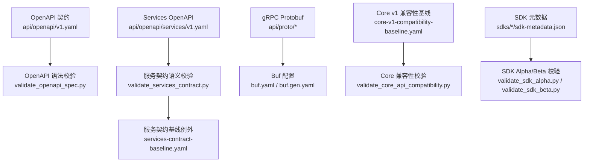
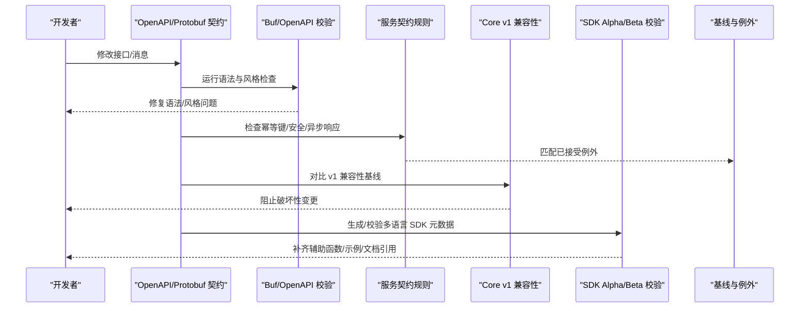
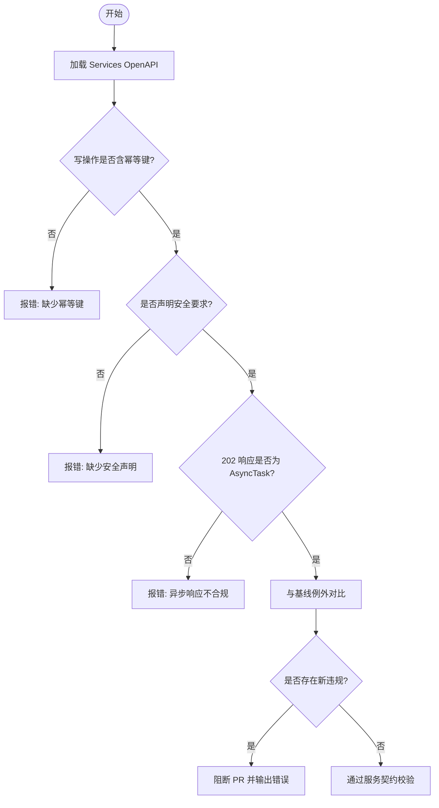
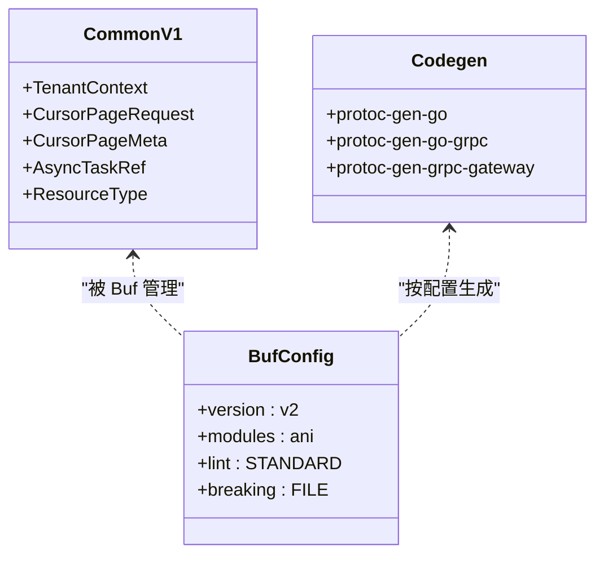
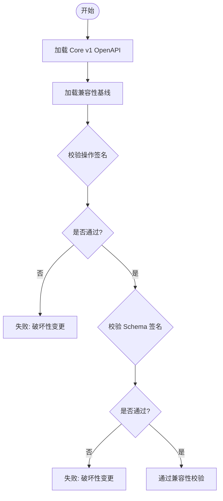
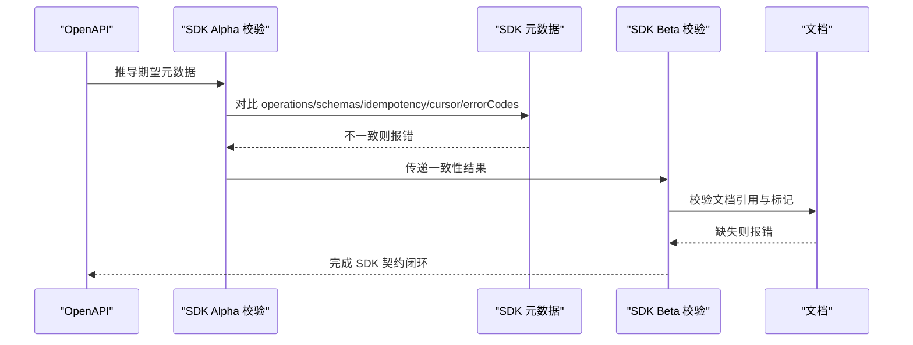
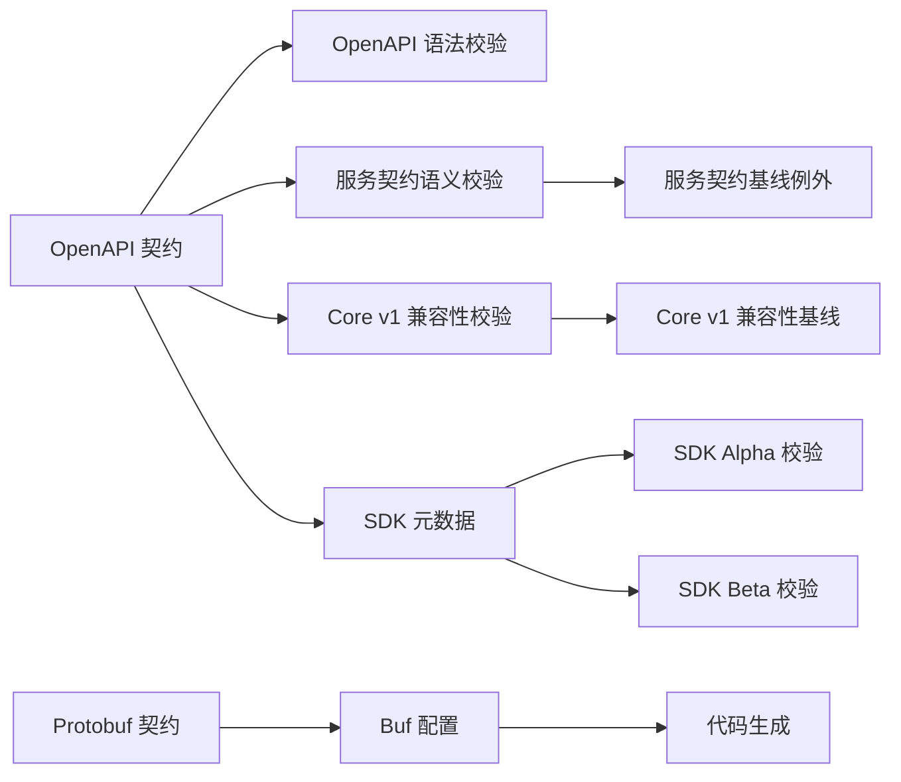

# 契约测试

<cite>
**本文引用的文件**
- [repo/api/openapi/v1.yaml](file://repo/api/openapi/v1.yaml)
- [repo/api/openapi/services/v1.yaml](file://repo/api/openapi/services/v1.yaml)
- [repo/api/proto/buf.yaml](file://repo/api/proto/buf.yaml)
- [repo/api/proto/buf.gen.yaml](file://repo/api/proto/buf.gen.yaml)
- [repo/api/proto/common/v1/common.proto](file://repo/api/proto/common/v1/common.proto)
- [repo/scripts/validate_openapi_spec.py](file://repo/scripts/validate_openapi_spec.py)
- [repo/scripts/validate_services_contract.py](file://repo/scripts/validate_services_contract.py)
- [repo/scripts/validate_core_api_compatibility.py](file://repo/scripts/validate_core_api_compatibility.py)
- [repo/scripts/validate_sdk_alpha.py](file://repo/scripts/validate_sdk_alpha.py)
- [repo/scripts/validate_sdk_beta.py](file://repo/scripts/validate_sdk_beta.py)
- [repo/architecture/services-contract-baseline.yaml](file://repo/architecture/services-contract-baseline.yaml)
- [repo/api/core-v1-compatibility-baseline.yaml](file://repo/api/core-v1-compatibility-baseline.yaml)
- [repo/sdks/core/sdk-metadata.json](file://repo/sdks/core/sdk-metadata.json)
- [repo/sdks/services/sdk-metadata.json](file://repo/sdks/services/sdk-metadata.json)
</cite>

## 目录
1. [简介](#简介)
2. [项目结构](#项目结构)
3. [核心组件](#核心组件)
4. [架构总览](#架构总览)
5. [详细组件分析](#详细组件分析)
6. [依赖关系分析](#依赖关系分析)
7. [性能与稳定性考虑](#性能与稳定性考虑)
8. [故障排查指南](#故障排查指南)
9. [结论](#结论)
10. [附录：示例与流程](#附录示例与流程)

## 简介
本文件面向“契约测试”主题，系统化说明如何基于仓库中的 OpenAPI 规范、gRPC Protobuf 定义以及 SDK 元数据，构建并执行端到端的契约验证。内容覆盖：
- OpenAPI 接口定义检查、参数校验、响应格式校验
- gRPC 协议契约测试（Protobuf 文件验证与服务接口一致性）
- 版本兼容性策略（向后兼容基线、废弃接口处理）
- 多语言 SDK 生成的契约测试（确保客户端与服务端一致）
- 契约变更管理流程（版本控制、影响分析、迁移指导）
- 具体契约测试示例（API 变更、协议升级、SDK 更新）

## 项目结构
仓库围绕“契约即真实来源”组织：
- OpenAPI 契约位于 api/openapi，包含 Core API 与 Services API 两个层次
- gRPC 契约位于 api/proto，使用 Buf 进行 lint、breaking 检测与代码生成
- 契约校验脚本位于 scripts，提供 OpenAPI 语法校验、服务契约语义规则、Core v1 兼容性基线比对、SDK Alpha/Beta 产物校验
- SDK 元数据位于 sdks/{core,services}/sdk-metadata.json，作为多语言 SDK 的契约快照与一致性基准
- 架构基线位于 architecture/services-contract-baseline.yaml，用于记录已接受的例外项

**图表来源**
- [repo/api/openapi/v1.yaml:1-40](file://repo/api/openapi/v1.yaml#L1-L40)
- [repo/scripts/validate_openapi_spec.py:11-34](file://repo/scripts/validate_openapi_spec.py#L11-L34)
- [repo/scripts/validate_services_contract.py:19-31](file://repo/scripts/validate_services_contract.py#L19-L31)
- [repo/api/proto/buf.yaml:1-11](file://repo/api/proto/buf.yaml#L1-L11)
- [repo/api/proto/buf.gen.yaml:1-19](file://repo/api/proto/buf.gen.yaml#L1-L19)
- [repo/scripts/validate_core_api_compatibility.py:12-15](file://repo/scripts/validate_core_api_compatibility.py#L12-L15)
- [repo/scripts/validate_sdk_alpha.py:17-22](file://repo/scripts/validate_sdk_alpha.py#L17-L22)
- [repo/scripts/validate_sdk_beta.py:14-26](file://repo/scripts/validate_sdk_beta.py#L14-L26)
- [repo/architecture/services-contract-baseline.yaml:1-10](file://repo/architecture/services-contract-baseline.yaml#L1-L10)

**章节来源**
- [repo/api/openapi/v1.yaml:1-40](file://repo/api/openapi/v1.yaml#L1-L40)
- [repo/scripts/validate_openapi_spec.py:11-34](file://repo/scripts/validate_openapi_spec.py#L11-L34)
- [repo/scripts/validate_services_contract.py:19-31](file://repo/scripts/validate_services_contract.py#L19-L31)
- [repo/api/proto/buf.yaml:1-11](file://repo/api/proto/buf.yaml#L1-L11)
- [repo/api/proto/buf.gen.yaml:1-19](file://repo/api/proto/buf.gen.yaml#L1-L19)
- [repo/scripts/validate_core_api_compatibility.py:12-15](file://repo/scripts/validate_core_api_compatibility.py#L12-L15)
- [repo/scripts/validate_sdk_alpha.py:17-22](file://repo/scripts/validate_sdk_alpha.py#L17-L22)
- [repo/scripts/validate_sdk_beta.py:14-26](file://repo/scripts/validate_sdk_beta.py#L14-L26)
- [repo/architecture/services-contract-baseline.yaml:1-10](file://repo/architecture/services-contract-baseline.yaml#L1-L10)

## 核心组件
- OpenAPI 契约与文档
  - Core API：定义基础设施资源（实例、存储、网络、加密、计量等），统一错误格式、分页、异步任务模型
  - Services API：定义业务层资源（模型、推理、知识库、租户管理等），通过独立 server URL 隔离
- gRPC 契约
  - 使用 Buf 管理模块、lint 与 breaking 检测；生成 Go/gRPC-Gateway 代码
  - 公共消息类型（租户上下文、分页、异步任务引用、资源类型枚举）在 common.v1 中统一定义
- 契约校验脚本
  - OpenAPI 语法校验：调用 openapi_spec_validator
  - 服务契约语义规则：幂等键要求、安全声明、异步 202 响应必须返回 AsyncTask
  - Core v1 兼容性：对比基线，禁止破坏性变更
  - SDK Alpha/Beta：校验多语言 SDK 元数据、辅助函数、示例与文档引用
- 基线与例外
  - services-contract-baseline.yaml：记录已接受的例外（如部分操作尚未声明认证或异步响应）
  - core-v1-compatibility-baseline.yaml：锁定受保护的 path/method/schema，保障向后兼容

**章节来源**
- [repo/api/openapi/v1.yaml:1-40](file://repo/api/openapi/v1.yaml#L1-L40)
- [repo/api/proto/common/v1/common.proto:1-49](file://repo/api/proto/common/v1/common.proto#L1-L49)
- [repo/scripts/validate_openapi_spec.py:11-34](file://repo/scripts/validate_openapi_spec.py#L11-L34)
- [repo/scripts/validate_services_contract.py:25-31](file://repo/scripts/validate_services_contract.py#L25-L31)
- [repo/scripts/validate_core_api_compatibility.py:12-15](file://repo/scripts/validate_core_api_compatibility.py#L12-L15)
- [repo/scripts/validate_sdk_alpha.py:17-22](file://repo/scripts/validate_sdk_alpha.py#L17-L22)
- [repo/scripts/validate_sdk_beta.py:14-26](file://repo/scripts/validate_sdk_beta.py#L14-L26)
- [repo/architecture/services-contract-baseline.yaml:1-10](file://repo/architecture/services-contract-baseline.yaml#L1-L10)
- [repo/api/core-v1-compatibility-baseline.yaml:1-18](file://repo/api/core-v1-compatibility-baseline.yaml#L1-L18)

## 架构总览
契约测试流水线由“契约源 → 校验器 → 基线/例外 → 产物（SDK/文档/部署）”构成。OpenAPI 与 Protobuf 是权威契约源；校验脚本负责语法、语义与兼容性；基线文件记录允许的历史例外与保护范围；SDK 元数据保证多语言客户端与服务端一致。

**图表来源**
- [repo/api/proto/buf.yaml:1-11](file://repo/api/proto/buf.yaml#L1-L11)
- [repo/scripts/validate_openapi_spec.py:11-34](file://repo/scripts/validate_openapi_spec.py#L11-L34)
- [repo/scripts/validate_services_contract.py:143-210](file://repo/scripts/validate_services_contract.py#L143-L210)
- [repo/scripts/validate_core_api_compatibility.py:70-151](file://repo/scripts/validate_core_api_compatibility.py#L70-L151)
- [repo/scripts/validate_sdk_alpha.py:144-171](file://repo/scripts/validate_sdk_alpha.py#L144-L171)
- [repo/scripts/validate_sdk_beta.py:118-142](file://repo/scripts/validate_sdk_beta.py#L118-L142)
- [repo/architecture/services-contract-baseline.yaml:1-10](file://repo/architecture/services-contract-baseline.yaml#L1-L10)
- [repo/api/core-v1-compatibility-baseline.yaml:1-18](file://repo/api/core-v1-compatibility-baseline.yaml#L1-L18)

## 详细组件分析

### OpenAPI 契约验证
- 语法校验：validate_openapi_spec.py 对 Core 与 Services 的 OpenAPI 文件执行 openapi_spec_validator，确保 spec 合法
- 服务契约语义：validate_services_contract.py 强制以下规则
  - 写操作请求体必须包含 idempotency_key
  - 每个操作必须声明非空 security 要求
  - 返回 202 的异步操作必须返回 AsyncTask 引用
  - 服务 server URL 必须为 https://{host}/api/v1/svc
  - 必须保留 BearerAuth 与 ApiKeyAuth 安全方案
- 基线与例外：services-contract-baseline.yaml 记录已接受的例外（例如当前 Services 尚未声明认证或异步响应未切换），新违规将阻断 PR

**图表来源**
- [repo/scripts/validate_services_contract.py:25-31](file://repo/scripts/validate_services_contract.py#L25-L31)
- [repo/scripts/validate_services_contract.py:108-156](file://repo/scripts/validate_services_contract.py#L108-L156)
- [repo/scripts/validate_services_contract.py:186-210](file://repo/scripts/validate_services_contract.py#L186-L210)
- [repo/architecture/services-contract-baseline.yaml:1-10](file://repo/architecture/services-contract-baseline.yaml#L1-L10)

**章节来源**
- [repo/scripts/validate_openapi_spec.py:11-34](file://repo/scripts/validate_openapi_spec.py#L11-L34)
- [repo/scripts/validate_services_contract.py:19-31](file://repo/scripts/validate_services_contract.py#L19-L31)
- [repo/scripts/validate_services_contract.py:143-210](file://repo/scripts/validate_services_contract.py#L143-L210)
- [repo/architecture/services-contract-baseline.yaml:1-10](file://repo/architecture/services-contract-baseline.yaml#L1-L10)

### gRPC 协议契约测试
- 模块与规则：buf.yaml 启用 STANDARD lint 与 FILE 级别的 breaking 检测，避免破坏性变更
- 代码生成：buf.gen.yaml 指定 protoc-gen-go、protoc-gen-go-grpc、protoc-gen-grpc-gateway 的输出路径与选项，确保服务端与网关代码与契约同步
- 公共消息：common.v1 定义 TenantContext、CursorPageRequest/Meta、AsyncTaskRef、ResourceType 等，统一跨服务契约

**图表来源**
- [repo/api/proto/buf.yaml:1-11](file://repo/api/proto/buf.yaml#L1-L11)
- [repo/api/proto/buf.gen.yaml:1-19](file://repo/api/proto/buf.gen.yaml#L1-L19)
- [repo/api/proto/common/v1/common.proto:1-49](file://repo/api/proto/common/v1/common.proto#L1-L49)

**章节来源**
- [repo/api/proto/buf.yaml:1-11](file://repo/api/proto/buf.yaml#L1-L11)
- [repo/api/proto/buf.gen.yaml:1-19](file://repo/api/proto/buf.gen.yaml#L1-L19)
- [repo/api/proto/common/v1/common.proto:1-49](file://repo/api/proto/common/v1/common.proto#L1-L49)

### 版本兼容性测试策略
- Core v1 兼容性基线：core-v1-compatibility-baseline.yaml 锁定受保护的 paths/methods/schemas，禁止删除路径/方法、改变 operationId、移除必需字段、移除响应字段、改变字段签名等
- 校验逻辑：validate_core_api_compatibility.py 对比当前 spec 与基线，逐项校验参数签名、请求体/响应体 schema、operationId 与 RBAC scope
- 向后兼容原则：仅允许添加可选请求字段、添加响应字段、新增端点、扩展枚举值；其他变更需走基线更新流程

**图表来源**
- [repo/scripts/validate_core_api_compatibility.py:70-151](file://repo/scripts/validate_core_api_compatibility.py#L70-L151)
- [repo/api/core-v1-compatibility-baseline.yaml:1-18](file://repo/api/core-v1-compatibility-baseline.yaml#L1-L18)

**章节来源**
- [repo/scripts/validate_core_api_compatibility.py:70-151](file://repo/scripts/validate_core_api_compatibility.py#L70-L151)
- [repo/api/core-v1-compatibility-baseline.yaml:1-18](file://repo/api/core-v1-compatibility-baseline.yaml#L1-L18)

### SDK 生成的契约测试
- 元数据一致性：validate_sdk_alpha.py 从 OpenAPI 推导期望的 operations、schemas、idempotencyOperations、cursorPaginationOperations、errorCodes，并与 sdks/*/sdk-metadata.json 对比
- 分层隔离：确保 Core SDK 不包含 Services 业务路径，Services SDK 不包含 Core 基础设施路径
- 辅助函数与示例：校验各语言 SDK 是否包含幂等键、游标分页、错误码等辅助函数与示例用法
- Beta 增强：validate_sdk_beta.py 进一步校验 idempotency/cursor/error codes 与文档引用，防止 SDK 与契约脱节

**图表来源**
- [repo/scripts/validate_sdk_alpha.py:48-91](file://repo/scripts/validate_sdk_alpha.py#L48-L91)
- [repo/scripts/validate_sdk_alpha.py:144-171](file://repo/scripts/validate_sdk_alpha.py#L144-L171)
- [repo/scripts/validate_sdk_alpha.py:194-215](file://repo/scripts/validate_sdk_alpha.py#L194-L215)
- [repo/scripts/validate_sdk_beta.py:118-142](file://repo/scripts/validate_sdk_beta.py#L118-L142)
- [repo/scripts/validate_sdk_beta.py:144-198](file://repo/scripts/validate_sdk_beta.py#L144-L198)

**章节来源**
- [repo/scripts/validate_sdk_alpha.py:48-91](file://repo/scripts/validate_sdk_alpha.py#L48-L91)
- [repo/scripts/validate_sdk_alpha.py:144-171](file://repo/scripts/validate_sdk_alpha.py#L144-L171)
- [repo/scripts/validate_sdk_alpha.py:194-215](file://repo/scripts/validate_sdk_alpha.py#L194-L215)
- [repo/scripts/validate_sdk_beta.py:118-142](file://repo/scripts/validate_sdk_beta.py#L118-L142)
- [repo/scripts/validate_sdk_beta.py:144-198](file://repo/scripts/validate_sdk_beta.py#L144-L198)
- [repo/sdks/core/sdk-metadata.json:1-12](file://repo/sdks/core/sdk-metadata.json#L1-L12)
- [repo/sdks/services/sdk-metadata.json:1-12](file://repo/sdks/services/sdk-metadata.json#L1-L12)

## 依赖关系分析
- 契约源依赖
  - OpenAPI 契约驱动 SDK 元数据与文档生成
  - Protobuf 契约驱动 gRPC/Gateway 代码生成
- 校验器依赖
  - validate_openapi_spec.py 依赖 openapi_spec_validator
  - validate_services_contract.py 依赖 YAML 解析与基线文件
  - validate_core_api_compatibility.py 依赖兼容性基线
  - validate_sdk_alpha.py / validate_sdk_beta.py 依赖 SDK 元数据与各语言源码/示例
- 基线与例外
  - services-contract-baseline.yaml 作为服务契约规则的例外清单
  - core-v1-compatibility-baseline.yaml 作为 Core v1 的受保护契约快照

**图表来源**
- [repo/scripts/validate_openapi_spec.py:11-34](file://repo/scripts/validate_openapi_spec.py#L11-L34)
- [repo/scripts/validate_services_contract.py:19-31](file://repo/scripts/validate_services_contract.py#L19-L31)
- [repo/scripts/validate_core_api_compatibility.py:12-15](file://repo/scripts/validate_core_api_compatibility.py#L12-L15)
- [repo/api/proto/buf.yaml:1-11](file://repo/api/proto/buf.yaml#L1-L11)
- [repo/api/proto/buf.gen.yaml:1-19](file://repo/api/proto/buf.gen.yaml#L1-L19)
- [repo/architecture/services-contract-baseline.yaml:1-10](file://repo/architecture/services-contract-baseline.yaml#L1-L10)
- [repo/api/core-v1-compatibility-baseline.yaml:1-18](file://repo/api/core-v1-compatibility-baseline.yaml#L1-L18)
- [repo/scripts/validate_sdk_alpha.py:17-22](file://repo/scripts/validate_sdk_alpha.py#L17-L22)
- [repo/scripts/validate_sdk_beta.py:14-26](file://repo/scripts/validate_sdk_beta.py#L14-L26)

**章节来源**
- [repo/scripts/validate_openapi_spec.py:11-34](file://repo/scripts/validate_openapi_spec.py#L11-L34)
- [repo/scripts/validate_services_contract.py:19-31](file://repo/scripts/validate_services_contract.py#L19-L31)
- [repo/scripts/validate_core_api_compatibility.py:12-15](file://repo/scripts/validate_core_api_compatibility.py#L12-L15)
- [repo/api/proto/buf.yaml:1-11](file://repo/api/proto/buf.yaml#L1-L11)
- [repo/api/proto/buf.gen.yaml:1-19](file://repo/api/proto/buf.gen.yaml#L1-L19)
- [repo/architecture/services-contract-baseline.yaml:1-10](file://repo/architecture/services-contract-baseline.yaml#L1-L10)
- [repo/api/core-v1-compatibility-baseline.yaml:1-18](file://repo/api/core-v1-compatibility-baseline.yaml#L1-L18)
- [repo/scripts/validate_sdk_alpha.py:17-22](file://repo/scripts/validate_sdk_alpha.py#L17-L22)
- [repo/scripts/validate_sdk_beta.py:14-26](file://repo/scripts/validate_sdk_beta.py#L14-L26)

## 性能与稳定性考虑
- 校验顺序建议：先 OpenAPI 语法校验，再服务契约语义校验，最后兼容性基线比对与 SDK 校验，减少无效工作
- 基线维护：定期审查 services-contract-baseline.yaml 的例外项，逐步收敛到无例外状态
- 并行执行：各校验脚本可并行运行，缩短 CI 时间
- 缓存与增量：利用 Buf 与 Python 脚本的输入文件哈希，实现增量校验

[本节为通用指导，无需特定文件来源]

## 故障排查指南
- OpenAPI 语法错误
  - 现象：validate_openapi_spec.py 抛出异常
  - 处理：根据 openapi_spec_validator 输出修正 spec 语法
- 服务契约规则违规
  - 现象：validate_services_contract.py 输出错误并阻断 PR
  - 处理：补充幂等键、安全声明或异步响应；若确属历史遗留，需在 services-contract-baseline.yaml 中添加例外并说明原因
- Core v1 兼容性破坏
  - 现象：validate_core_api_compatibility.py 报错
  - 处理：恢复受保护字段/参数/响应；如需变更，更新兼容性基线并评估影响
- SDK 元数据不一致
  - 现象：validate_sdk_alpha.py / validate_sdk_beta.py 报错
  - 处理：重新生成 SDK 元数据或补齐辅助函数与示例；确保 Core/Services 分层隔离
- gRPC 破坏性变更
  - 现象：Buf breaking 检测失败
  - 处理：调整 Protobuf 定义以保持向后兼容，或在必要时升级包版本并同步下游

**章节来源**
- [repo/scripts/validate_openapi_spec.py:17-34](file://repo/scripts/validate_openapi_spec.py#L17-L34)
- [repo/scripts/validate_services_contract.py:186-235](file://repo/scripts/validate_services_contract.py#L186-L235)
- [repo/scripts/validate_core_api_compatibility.py:153-167](file://repo/scripts/validate_core_api_compatibility.py#L153-L167)
- [repo/scripts/validate_sdk_alpha.py:263-277](file://repo/scripts/validate_sdk_alpha.py#L263-L277)
- [repo/scripts/validate_sdk_beta.py:200-212](file://repo/scripts/validate_sdk_beta.py#L200-L212)
- [repo/api/proto/buf.yaml:5-11](file://repo/api/proto/buf.yaml#L5-L11)

## 结论
本项目以 OpenAPI 与 Protobuf 为契约真实来源，结合 Buf、OpenAPI 校验器与自定义脚本，形成从语法、语义到兼容性、SDK 的多层契约测试体系。通过基线与例外机制，既保障向后兼容，又允许渐进式演进。建议在 CI 中集成上述校验，持续维护契约质量与生态一致性。

[本节为总结性内容，无需特定文件来源]

## 附录：示例与流程

### 示例一：验证 API 变更的正确性
- 步骤
  - 修改 api/openapi/v1.yaml 或 services/v1.yaml
  - 运行 validate_openapi_spec.py 确保语法正确
  - 运行 validate_services_contract.py 检查语义规则与基线例外
  - 运行 validate_core_api_compatibility.py 确保未破坏 v1 兼容性
  - 运行 validate_sdk_alpha.py / validate_sdk_beta.py 确保 SDK 元数据与辅助函数一致
- 预期结果：所有校验通过；如有例外，需在基线文件中登记并说明

**章节来源**
- [repo/scripts/validate_openapi_spec.py:11-34](file://repo/scripts/validate_openapi_spec.py#L11-L34)
- [repo/scripts/validate_services_contract.py:186-235](file://repo/scripts/validate_services_contract.py#L186-L235)
- [repo/scripts/validate_core_api_compatibility.py:153-167](file://repo/scripts/validate_core_api_compatibility.py#L153-L167)
- [repo/scripts/validate_sdk_alpha.py:263-277](file://repo/scripts/validate_sdk_alpha.py#L263-L277)
- [repo/scripts/validate_sdk_beta.py:200-212](file://repo/scripts/validate_sdk_beta.py#L200-L212)

### 示例二：协议升级（Protobuf）
- 步骤
  - 修改 api/proto 下的 .proto 文件
  - 运行 Buf lint 与 breaking 检测，确保无破坏性变更
  - 运行代码生成，确认 Go/gRPC-Gateway 代码与契约一致
  - 更新相关服务的实现与测试，确保接口行为符合契约
- 预期结果：Buf 检测通过，代码生成成功，服务行为与 Protobuf 契约一致

**章节来源**
- [repo/api/proto/buf.yaml:1-11](file://repo/api/proto/buf.yaml#L1-L11)
- [repo/api/proto/buf.gen.yaml:1-19](file://repo/api/proto/buf.gen.yaml#L1-L19)
- [repo/api/proto/common/v1/common.proto:1-49](file://repo/api/proto/common/v1/common.proto#L1-L49)

### 示例三：SDK 更新与多语言一致性
- 步骤
  - 更新 OpenAPI 后，重新生成 SDK 元数据
  - 运行 validate_sdk_alpha.py 校验元数据、分层隔离、辅助函数与示例
  - 运行 validate_sdk_beta.py 校验 Beta 辅助函数与文档引用
  - 在各语言 SDK 中补充必要的辅助函数与示例用法
- 预期结果：SDK 元数据与 OpenAPI 一致，多语言客户端与服务端接口保持一致

**章节来源**
- [repo/scripts/validate_sdk_alpha.py:144-171](file://repo/scripts/validate_sdk_alpha.py#L144-L171)
- [repo/scripts/validate_sdk_alpha.py:194-215](file://repo/scripts/validate_sdk_alpha.py#L194-L215)
- [repo/scripts/validate_sdk_beta.py:144-198](file://repo/scripts/validate_sdk_beta.py#L144-L198)
- [repo/sdks/core/sdk-metadata.json:1-12](file://repo/sdks/core/sdk-metadata.json#L1-L12)
- [repo/sdks/services/sdk-metadata.json:1-12](file://repo/sdks/services/sdk-metadata.json#L1-L12)

### 契约变更管理流程
- 版本控制
  - OpenAPI 与 Protobuf 变更提交至对应目录，附带变更说明
  - 基线文件（services-contract-baseline.yaml、core-v1-compatibility-baseline.yaml）作为受控资产，变更需评审
- 影响分析
  - 通过兼容性基线判断是否破坏现有客户端
  - 通过服务契约规则判断是否需要新增例外
  - 通过 SDK 校验判断是否需要更新多语言 SDK
- 迁移指导
  - 对于新增可选字段与响应字段，提供客户端适配建议
  - 对于废弃接口，提供过渡期与替代方案
  - 对于 Protobuf 升级，提供版本映射与降级策略

**章节来源**
- [repo/architecture/services-contract-baseline.yaml:1-10](file://repo/architecture/services-contract-baseline.yaml#L1-L10)
- [repo/api/core-v1-compatibility-baseline.yaml:1-18](file://repo/api/core-v1-compatibility-baseline.yaml#L1-L18)
- [repo/scripts/validate_services_contract.py:186-235](file://repo/scripts/validate_services_contract.py#L186-L235)
- [repo/scripts/validate_core_api_compatibility.py:153-167](file://repo/scripts/validate_core_api_compatibility.py#L153-L167)
- [repo/scripts/validate_sdk_alpha.py:263-277](file://repo/scripts/validate_sdk_alpha.py#L263-L277)
- [repo/scripts/validate_sdk_beta.py:200-212](file://repo/scripts/validate_sdk_beta.py#L200-L212)