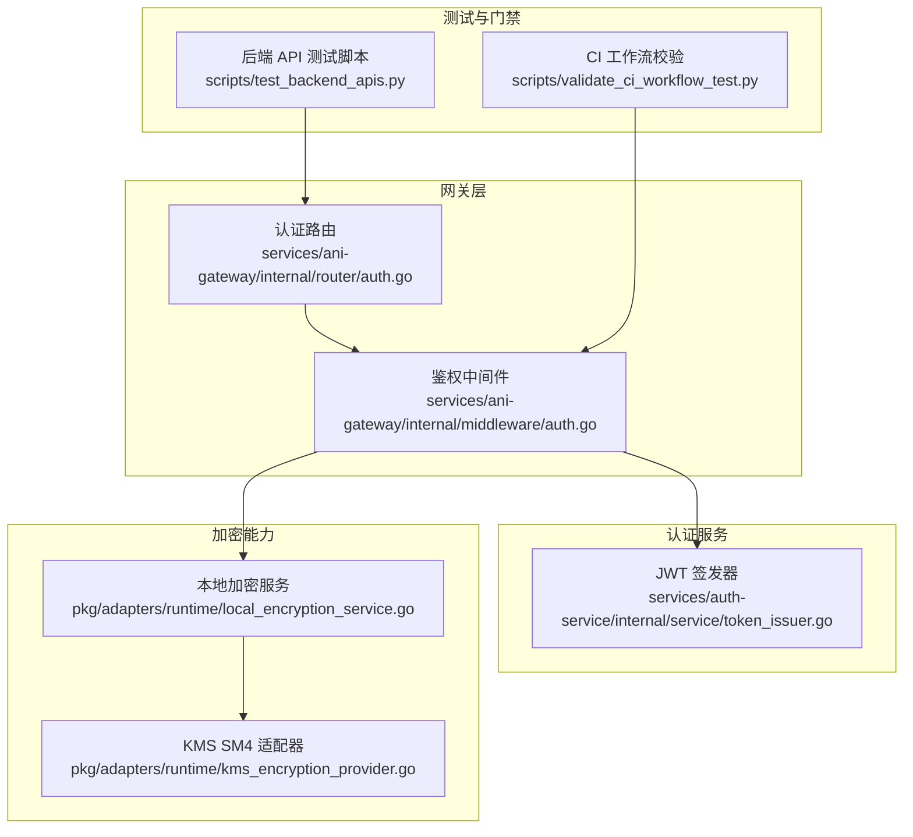
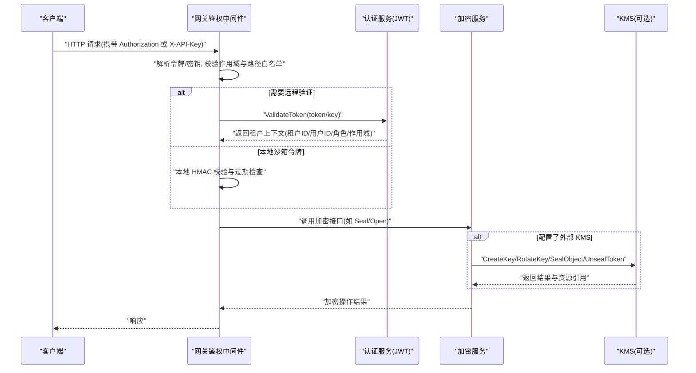
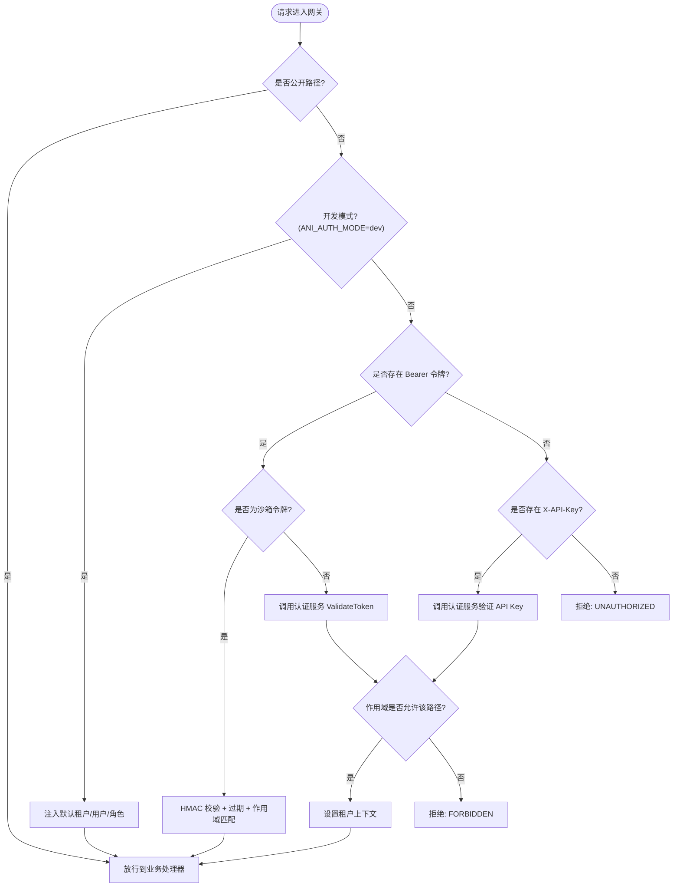
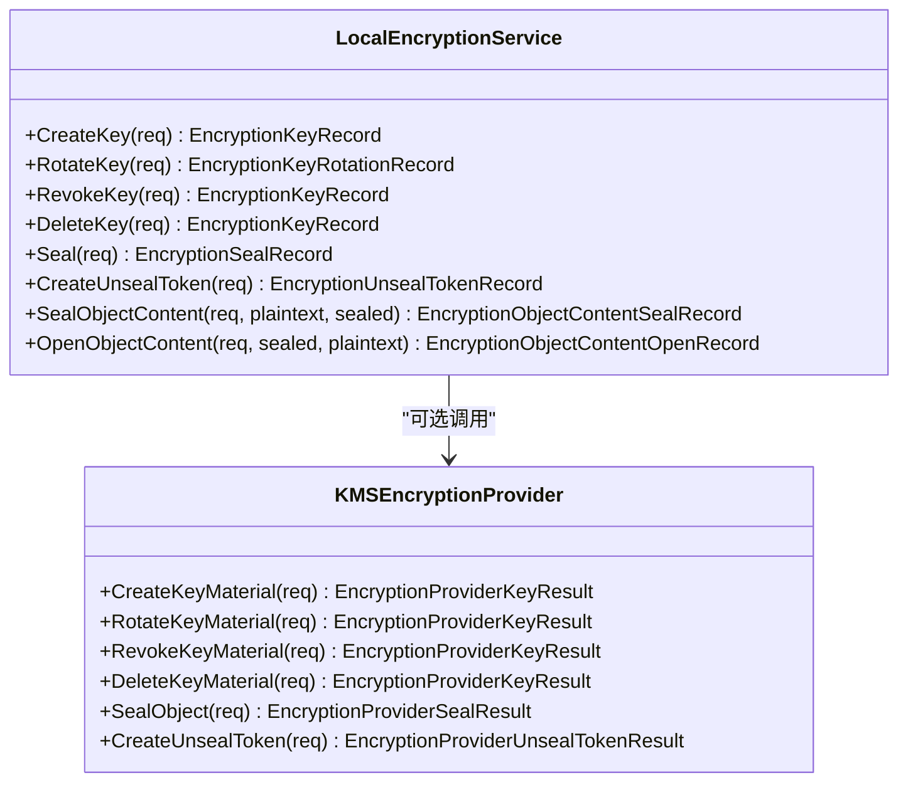
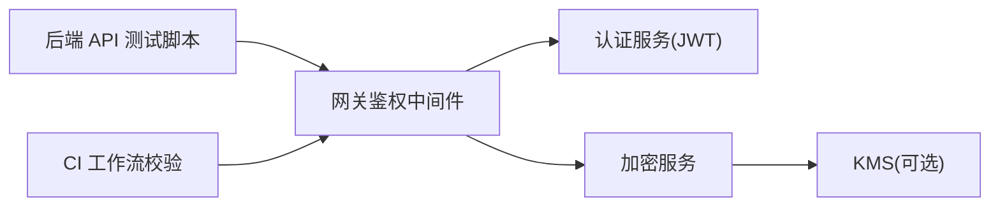

# 安全测试

<cite>
**本文引用的文件**
- [services/ani-gateway/internal/middleware/auth.go](file://repo/services/ani-gateway/internal/middleware/auth.go)
- [services/ani-gateway/internal/router/auth.go](file://repo/services/ani-gateway/internal/router/auth.go)
- [services/auth-service/internal/service/token_issuer.go](file://repo/services/auth-service/internal/service/token_issuer.go)
- [pkg/adapters/runtime/local_encryption_service.go](file://repo/pkg/adapters/runtime/local_encryption_service.go)
- [pkg/adapters/runtime/kms_encryption_provider.go](file://repo/pkg/adapters/runtime/kms_encryption_provider.go)
- [scripts/test_backend_apis.py](file://repo/scripts/test_backend_apis.py)
- [scripts/validate_ci_workflow_test.py](file://repo/scripts/validate_ci_workflow_test.py)
- [development-records/auth-login-core-001.md](file://repo/development-records/auth-login-core-001.md)
</cite>

## 目录
1. [简介](#简介)
2. [项目结构](#项目结构)
3. [核心组件](#核心组件)
4. [架构总览](#架构总览)
5. [详细组件分析](#详细组件分析)
6. [依赖关系分析](#依赖关系分析)
7. [性能考虑](#性能考虑)
8. [故障排查指南](#故障排查指南)
9. [结论](#结论)
10. [附录](#附录)

## 简介
本安全测试文档面向 ANI 平台的安全验证与合规保障，覆盖以下目标：
- 安全漏洞扫描工具的配置与使用：静态代码分析、依赖包漏洞检测、运行时安全扫描。
- 认证授权测试方法：JWT 令牌验证、RBAC 权限控制、会话管理（含刷新令牌）测试。
- 加密功能测试策略：SM4 算法验证、密钥生命周期管理、数据传输安全。
- 渗透测试实施方法：SQL 注入、XSS、越权访问防护验证。
- 安全合规性自动化流程：安全基线验证、合规报告生成。
- 具体安全测试示例：身份认证、数据加密、访问控制的端到端验证步骤。

## 项目结构
与安全相关的关键实现集中在网关鉴权中间件、认证服务令牌签发、加密服务与 KMS 适配器，以及脚本化的后端 API 测试和 CI 门禁校验。

**图表来源**
- [services/ani-gateway/internal/middleware/auth.go:18-141](file://repo/services/ani-gateway/internal/middleware/auth.go#L18-L141)
- [services/ani-gateway/internal/router/auth.go:18-95](file://repo/services/ani-gateway/internal/router/auth.go#L18-L95)
- [services/auth-service/internal/service/token_issuer.go:19-107](file://repo/services/auth-service/internal/service/token_issuer.go#L19-L107)
- [pkg/adapters/runtime/local_encryption_service.go:53-345](file://repo/pkg/adapters/runtime/local_encryption_service.go#L53-L345)
- [pkg/adapters/runtime/kms_encryption_provider.go:17-154](file://repo/pkg/adapters/runtime/kms_encryption_provider.go#L17-L154)
- [scripts/test_backend_apis.py:342-368](file://repo/scripts/test_backend_apis.py#L342-L368)
- [scripts/validate_ci_workflow_test.py:58-84](file://repo/scripts/validate_ci_workflow_test.py#L58-L84)

**章节来源**
- [services/ani-gateway/internal/middleware/auth.go:18-230](file://repo/services/ani-gateway/internal/middleware/auth.go#L18-L230)
- [services/ani-gateway/internal/router/auth.go:18-95](file://repo/services/ani-gateway/internal/router/auth.go#L18-L95)
- [services/auth-service/internal/service/token_issuer.go:19-135](file://repo/services/auth-service/internal/service/token_issuer.go#L19-L135)
- [pkg/adapters/runtime/local_encryption_service.go:21-613](file://repo/pkg/adapters/runtime/local_encryption_service.go#L21-L613)
- [pkg/adapters/runtime/kms_encryption_provider.go:17-212](file://repo/pkg/adapters/runtime/kms_encryption_provider.go#L17-L212)
- [scripts/test_backend_apis.py:342-368](file://repo/scripts/test_backend_apis.py#L342-L368)
- [scripts/validate_ci_workflow_test.py:58-84](file://repo/scripts/validate_ci_workflow_test.py#L58-L84)

## 核心组件
- 网关鉴权中间件：统一处理 Bearer Token、API Key、沙箱短命令牌，并基于路径与作用域进行 RBAC 隔离。
- 认证服务 JWT 签发：使用 RSA 私钥签发 Access Token，支持租户与平台两种作用域。
- 加密服务与 KMS 适配：提供密钥创建、轮换、撤销、删除；对象封禁解封；内容级 SM4-GCM 加解密；对接外部 KMS。
- 测试与门禁：后端 API 测试脚本覆盖加密与密钥管理；CI 工作流校验强制依赖扫描、工具链安全基线与镜像一致性。

**章节来源**
- [services/ani-gateway/internal/middleware/auth.go:18-230](file://repo/services/ani-gateway/internal/middleware/auth.go#L18-L230)
- [services/auth-service/internal/service/token_issuer.go:19-135](file://repo/services/auth-service/internal/service/token_issuer.go#L19-L135)
- [pkg/adapters/runtime/local_encryption_service.go:53-345](file://repo/pkg/adapters/runtime/local_encryption_service.go#L53-L345)
- [pkg/adapters/runtime/kms_encryption_provider.go:52-154](file://repo/pkg/adapters/runtime/kms_encryption_provider.go#L52-L154)
- [scripts/test_backend_apis.py:342-368](file://repo/scripts/test_backend_apis.py#L342-L368)
- [scripts/validate_ci_workflow_test.py:58-84](file://repo/scripts/validate_ci_workflow_test.py#L58-L84)

## 架构总览
下图展示请求从网关进入，经过鉴权中间件与认证服务交互，再到加密能力调用的整体流程。

**图表来源**
- [services/ani-gateway/internal/middleware/auth.go:22-141](file://repo/services/ani-gateway/internal/middleware/auth.go#L22-L141)
- [services/auth-service/internal/service/token_issuer.go:25-107](file://repo/services/auth-service/internal/service/token_issuer.go#L25-L107)
- [pkg/adapters/runtime/local_encryption_service.go:53-345](file://repo/pkg/adapters/runtime/local_encryption_service.go#L53-L345)
- [pkg/adapters/runtime/kms_encryption_provider.go:52-154](file://repo/pkg/adapters/runtime/kms_encryption_provider.go#L52-L154)

## 详细组件分析

### 认证与授权测试
- 令牌类型与作用域
  - Bearer Token：通过网关中间件解析，若为沙箱短命令牌则本地 HMAC 校验；否则调用认证服务验证。
  - API Key：通过 X-API-Key 头传递，仅允许租户作用域访问非平台路由。
  - 作用域隔离：平台路由前缀 /auth/platform/*、/platform/*、/admin/* 仅接受 scope=platform；其他路由仅接受 tenant。
- JWT 签发与校验
  - 使用 RSA 私钥签发 RS256 的 Access Token，包含租户 ID、用户 ID、角色、作用域等声明。
  - 支持平台管理员令牌（scope=platform，无租户 ID）。
- 会话管理与刷新令牌
  - 登录成功后签发 Access Token 与 Refresh Token；当前实现中刷新令牌未轮换，存在泄露长期风险，建议评估启用轮换。
  - 刷新令牌以哈希形式存储，降低泄露影响面。

**图表来源**
- [services/ani-gateway/internal/middleware/auth.go:22-141](file://repo/services/ani-gateway/internal/middleware/auth.go#L22-L141)
- [services/ani-gateway/internal/middleware/auth.go:199-229](file://repo/services/ani-gateway/internal/middleware/auth.go#L199-L229)

**章节来源**
- [services/ani-gateway/internal/middleware/auth.go:18-230](file://repo/services/ani-gateway/internal/middleware/auth.go#L18-L230)
- [services/auth-service/internal/service/token_issuer.go:19-135](file://repo/services/auth-service/internal/service/token_issuer.go#L19-L135)
- [development-records/auth-login-core-001.md:14-28](file://repo/development-records/auth-login-core-001.md#L14-L28)
- [development-records/auth-login-core-001.md:58-61](file://repo/development-records/auth-login-core-001.md#L58-L61)

### 加密功能测试策略（SM4、密钥管理、传输安全）
- 密钥生命周期
  - 创建：支持指定算法（默认 SM4），可对接外部 KMS；记录应用证据与资源引用。
  - 轮换：将旧密钥标记为已轮换，生成新活跃密钥；支持幂等键避免重复。
  - 撤销/删除：支持撤销与删除，状态变更并记录证据。
- 对象封禁与解封
  - Seal：封装对象 URI 并生成解封令牌，支持过期时间；若未配置外部 KMS，则使用本地 SM4-GCM 生成占位 URI 与令牌。
  - Unseal Token：根据封禁 URI 生成临时解封令牌，支持过期时间。
- 内容级加解密
  - 使用 SM4-GCM 对大对象分块加解密，附带 AAD（租户、密钥、对象 URI、分块索引）与 nonce，确保完整性与防篡改。
  - 输出明文/密文 SHA256 校验值，用于端到端一致性验证。
- 传输安全
  - 网关到 KMS 的 HTTP 请求支持 Bearer Token 认证；错误码与响应体被包装为明确错误。
  - 邮件通知支持 STARTTLS 与 no encryption 路径，测试覆盖证书校验行为。

**图表来源**
- [pkg/adapters/runtime/local_encryption_service.go:53-345](file://repo/pkg/adapters/runtime/local_encryption_service.go#L53-L345)
- [pkg/adapters/runtime/kms_encryption_provider.go:52-154](file://repo/pkg/adapters/runtime/kms_encryption_provider.go#L52-L154)

**章节来源**
- [pkg/adapters/runtime/local_encryption_service.go:53-345](file://repo/pkg/adapters/runtime/local_encryption_service.go#L53-L345)
- [pkg/adapters/runtime/kms_encryption_provider.go:52-154](file://repo/pkg/adapters/runtime/kms_encryption_provider.go#L52-L154)
- [scripts/test_backend_apis.py:342-368](file://repo/scripts/test_backend_apis.py#L342-L368)

### 渗透测试实施方法
- SQL 注入防护
  - 使用显式约束与参数化查询，避免拼接用户输入；在数据库层面通过 RLS（行级安全）限制跨租户访问。
  - 集成测试场景覆盖跨租户 INSERT/UPDATE/DELETE 被 RLS 拦截的情况。
- XSS 防护
  - 前端与网关层对输入进行严格校验与转义；对外暴露的 API 返回结构化 JSON，避免直接渲染用户输入。
- 越权访问防护
  - 网关中间件基于作用域与路径白名单进行强校验；平台路由仅接受 platform 作用域，租户路由仅接受 tenant 作用域。
  - 沙箱令牌仅允许访问特定子资源路径，防止横向移动。

**章节来源**
- [services/ani-gateway/internal/middleware/auth.go:199-229](file://repo/services/ani-gateway/internal/middleware/auth.go#L199-L229)
- [development-records/auth-login-core-001.md:22-28](file://repo/development-records/auth-login-core-001.md#L22-L28)

### 安全合规性自动化流程
- 依赖漏洞扫描
  - CI 工作流中包含 Go 依赖漏洞扫描步骤，禁止使用静态模块列表，确保动态发现所有依赖。
- 工具链安全基线
  - 强制最低 Go 版本，构建镜像必须与 CI 工具链版本一致，避免不一致导致的未知风险。
- 可重复构建与锁定引用
  - 禁止使用可变 @latest 引用，确保构建过程可追溯与可复现。
- 服务边界与契约校验
  - 通过脚本校验服务边界、OpenAPI 契约与文档入口一致性，防止越界调用与接口漂移。

**章节来源**
- [scripts/validate_ci_workflow_test.py:58-84](file://repo/scripts/validate_ci_workflow_test.py#L58-L84)

## 依赖关系分析
- 网关中间件依赖认证服务进行令牌验证，并可选择性地调用加密服务。
- 加密服务可选择对接外部 KMS；当未配置时回退到本地 SM4-GCM 实现。
- 测试脚本通过网关 API 触发加密与密钥管理流程，形成端到端验证闭环。
- CI 校验脚本确保构建与依赖扫描符合安全基线。

**图表来源**
- [services/ani-gateway/internal/middleware/auth.go:22-141](file://repo/services/ani-gateway/internal/middleware/auth.go#L22-L141)
- [pkg/adapters/runtime/local_encryption_service.go:53-345](file://repo/pkg/adapters/runtime/local_encryption_service.go#L53-L345)
- [pkg/adapters/runtime/kms_encryption_provider.go:52-154](file://repo/pkg/adapters/runtime/kms_encryption_provider.go#L52-L154)
- [scripts/test_backend_apis.py:342-368](file://repo/scripts/test_backend_apis.py#L342-L368)
- [scripts/validate_ci_workflow_test.py:58-84](file://repo/scripts/validate_ci_workflow_test.py#L58-L84)

**章节来源**
- [services/ani-gateway/internal/middleware/auth.go:22-141](file://repo/services/ani-gateway/internal/middleware/auth.go#L22-L141)
- [pkg/adapters/runtime/local_encryption_service.go:53-345](file://repo/pkg/adapters/runtime/local_encryption_service.go#L53-L345)
- [pkg/adapters/runtime/kms_encryption_provider.go:52-154](file://repo/pkg/adapters/runtime/kms_encryption_provider.go#L52-L154)
- [scripts/test_backend_apis.py:342-368](file://repo/scripts/test_backend_apis.py#L342-L368)
- [scripts/validate_ci_workflow_test.py:58-84](file://repo/scripts/validate_ci_workflow_test.py#L58-L84)

## 性能考虑
- 网关鉴权中间件优先本地校验（沙箱令牌），减少远程调用开销。
- 加密服务对大对象采用分块处理，避免一次性加载内存；同时计算明文与密文摘要，便于快速校验。
- 外部 KMS 调用失败时，加密服务返回明确错误，便于上层重试或降级策略。
- CI 依赖扫描与校验应在并行任务中执行，缩短流水线耗时。

[本节为通用指导，不直接分析具体文件]

## 故障排查指南
- 认证失败
  - 检查 Authorization 头格式与作用域；确认路径是否在公开白名单内。
  - 开发模式下可通过设置 ANI_AUTH_MODE=dev 与 X-Dev-Tenant-ID/X-Dev-User-ID 快速验证路由。
- 令牌无效或过期
  - 确认 JWT 签名算法与私钥配置正确；检查过期时间与签发时间。
- 加密操作失败
  - 检查密钥状态是否为 active；确认算法为 SM4；若使用外部 KMS，检查 BaseURL、Bearer Token 与网络连通性。
  - 内容加解密失败时，核对 nonce 长度与 AAD 参数是否与封禁时一致。
- CI 校验失败
  - 检查 Go 版本是否符合安全基线；Dockerfile 构建镜像版本是否与 CI 工具链一致；依赖扫描是否使用动态发现而非静态列表。

**章节来源**
- [services/ani-gateway/internal/middleware/auth.go:33-49](file://repo/services/ani-gateway/internal/middleware/auth.go#L33-L49)
- [services/auth-service/internal/service/token_issuer.go:25-42](file://repo/services/auth-service/internal/service/token_issuer.go#L25-L42)
- [pkg/adapters/runtime/local_encryption_service.go:418-456](file://repo/pkg/adapters/runtime/local_encryption_service.go#L418-L456)
- [pkg/adapters/runtime/kms_encryption_provider.go:31-50](file://repo/pkg/adapters/runtime/kms_encryption_provider.go#L31-L50)
- [scripts/validate_ci_workflow_test.py:58-84](file://repo/scripts/validate_ci_workflow_test.py#L58-L84)

## 结论
本项目在认证授权、加密能力与 CI 安全基线方面具备较完善的实现与测试支撑。建议后续重点推进：
- 刷新令牌的轮换机制，降低泄露风险。
- 强化外部 KMS 的可用性监控与降级策略。
- 扩展渗透测试用例，覆盖更多攻击向量与边界条件。
- 持续完善 CI 门禁，确保依赖与构建环境始终处于安全基线之上。

[本节为总结性内容，不直接分析具体文件]

## 附录
- 安全测试示例（端到端）
  - 身份认证：通过网关登录接口获取 Access Token 与 Refresh Token，随后使用 Bearer Token 访问受保护路由，验证 401/403 响应。
  - 数据加密：调用加密密钥管理接口创建 SM4 密钥，执行对象封禁与解封，验证返回的 URI、令牌与过期时间；对大对象进行分块加解密，比对明文/密文摘要。
  - 访问控制：分别使用租户令牌与平台令牌访问不同前缀的路由，验证作用域隔离；使用 API Key 访问租户路由，确认无法访问平台路由。
  - 渗透测试：尝试 SQL 注入与 XSS 载荷，验证被拒绝；构造跨租户请求，验证 RLS 拦截；模拟越权访问，验证网关作用域校验生效。
  - 合规检查：运行 CI 工作流校验脚本，确保依赖扫描、工具链版本与镜像一致性符合要求。

**章节来源**
- [services/ani-gateway/internal/router/auth.go:18-95](file://repo/services/ani-gateway/internal/router/auth.go#L18-L95)
- [scripts/test_backend_apis.py:342-368](file://repo/scripts/test_backend_apis.py#L342-L368)
- [scripts/validate_ci_workflow_test.py:58-84](file://repo/scripts/validate_ci_workflow_test.py#L58-L84)