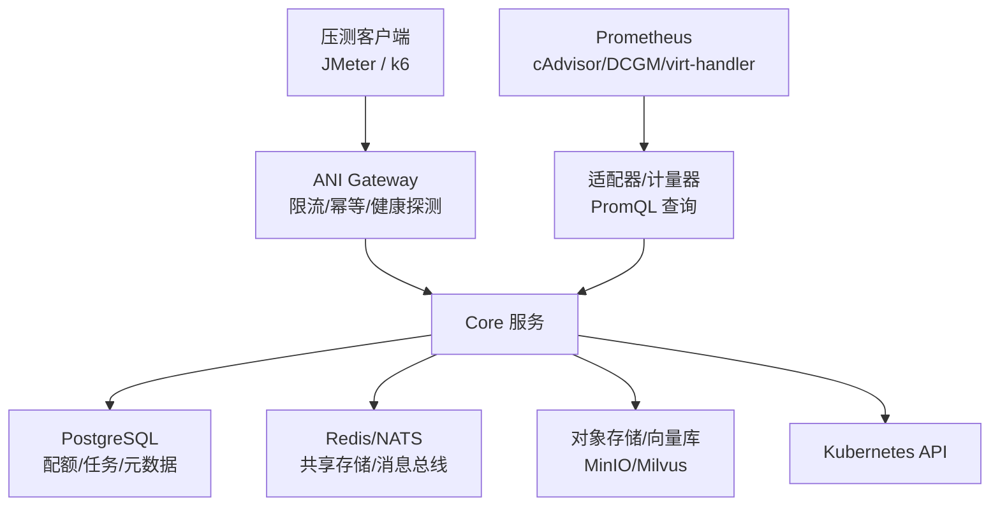
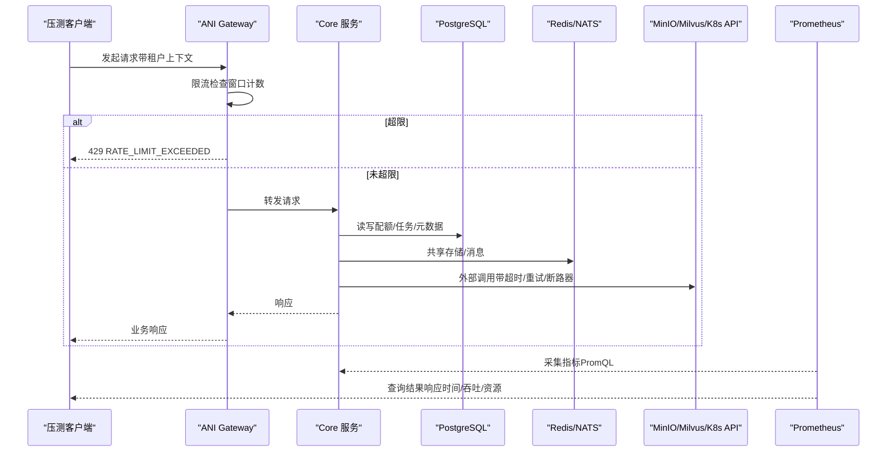
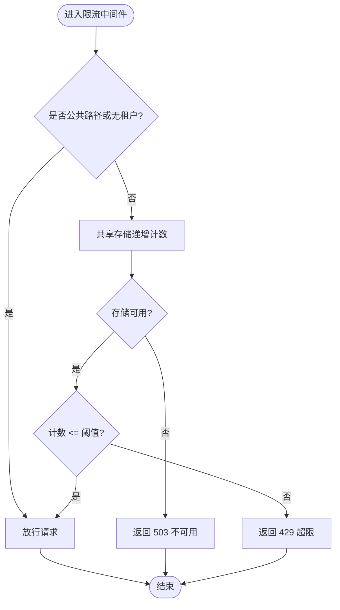
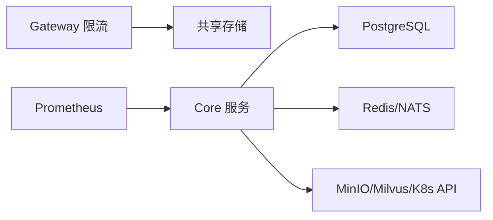

# 性能测试

<cite>
**本文引用的文件**
- [sprint13-instance-observability-prometheus-live.yaml](file://repo/deploy/real-k8s-lab/sprint13-instance-observability-prometheus-live.yaml)
- [ratelimit.go](file://repo/services/ani-gateway/internal/middleware/ratelimit.go)
- [ratelimit_test.go](file://repo/services/ani-gateway/internal/middleware/ratelimit_test.go)
- [resilience_plan.md](file://repo/development-records/sprint14-core-resilience-plan.md)
- [collectors_test.go](file://repo/pkg/adapters/metering/collectors_test.go)
- [spec-quota-service.md](file://repo/services/tasks/modules/spec/core/quota/spec-quota-service.md)
- [test_backend_apis.py](file://repo/scripts/test_backend_apis.py)
</cite>

## 目录
1. [简介](#简介)
2. [项目结构](#项目结构)
3. [核心组件](#核心组件)
4. [架构总览](#架构总览)
5. [详细组件分析](#详细组件分析)
6. [依赖关系分析](#依赖关系分析)
7. [性能考虑](#性能考虑)
8. [故障排查指南](#故障排查指南)
9. [结论](#结论)
10. [附录](#附录)

## 简介
本文件面向 ANI 平台的性能测试与容量规划，聚焦以下目标：
- 明确压测工具选型与集成方式（JMeter、k6），并结合现有 Gateway 限流与韧性能力设计压测场景。
- 规范基准测试编写方法：单接口性能测试、混合负载测试设计与执行。
- 建立性能监控指标采集与分析体系：响应时间、吞吐量、错误率、资源利用率（CPU/内存/GPU）。
- 识别并优化性能瓶颈：数据库查询、缓存策略、并发控制、外部依赖超时与重试。
- 实施容量规划测试：峰值流量模拟、弹性伸缩验证、多端点故障切换。
- 提供高并发稳定性示例：以真实可复跑的脚本和配置为参考，覆盖 Gateway 限流、后端降级、Prometheus 指标采集等关键路径。

## 项目结构
本项目已具备与性能测试密切相关的若干基础设施与实现：
- Prometheus 观测栈：包含 cAdvisor、DCGM、KubeVirt virt-handler 的 scrape 配置，用于采集 CPU/内存/GPU/VM 指标。
- Gateway 限流中间件：基于共享存储的窗口计数限流，支持 per-tenant + method + route-class 维度，超限返回 429。
- 韧性基础：每调用超时、操作级重试、断路器 foundation、数据面 readyz 与健康降级语义。
- 计量与配额：PromQL 查询与资源配额原子预占/确认/释放流程，支撑容量与计费。
- 后端 API 验证脚本：覆盖实例、GPU 库存、调度队列等关键接口，可用于回归与轻量压测基线。

图表来源
- [sprint13-instance-observability-prometheus-live.yaml:57-103](file://repo/deploy/real-k8s-lab/sprint13-instance-observability-prometheus-live.yaml#L57-L103)
- [ratelimit.go:14-87](file://repo/services/ani-gateway/internal/middleware/ratelimit.go#L14-L87)

章节来源
- [sprint13-instance-observability-prometheus-live.yaml:57-103](file://repo/deploy/real-k8s-lab/sprint13-instance-observability-prometheus-live.yaml#L57-L103)
- [ratelimit.go:14-87](file://repo/services/ani-gateway/internal/middleware/ratelimit.go#L14-L87)

## 核心组件
- Gateway 限流中间件：通过共享存储维护窗口计数，按租户+方法+路由类别限制请求速率；超限返回 429，存储不可用返回 503。
- 韧性包：提供每调用超时、重试退避、断路器 foundation，适配 K8s REST、MinIO、Milvus 等外部调用。
- Prometheus 采集：统一 scrape 配置，支持 cAdvisor、DCGM、virt-handler，便于获取节点/容器/GPU/VM 指标。
- 计量与配额：PromQL 采集 CPU/内存使用量，配额服务提供原子预占与确认/取消/释放事务模型。
- 后端 API 验证脚本：覆盖实例、GPU 库存、调度队列等接口，可作为回归与轻量压力基线。

章节来源
- [ratelimit.go:14-87](file://repo/services/ani-gateway/internal/middleware/ratelimit.go#L14-L87)
- [resilience_plan.md:102-116](file://repo/development-records/sprint14-core-resilience-plan.md#L102-L116)
- [sprint13-instance-observability-prometheus-live.yaml:57-103](file://repo/deploy/real-k8s-lab/sprint13-instance-observability-prometheus-live.yaml#L57-L103)
- [collectors_test.go:568-611](file://repo/pkg/adapters/metering/collectors_test.go#L568-L611)
- [spec-quota-service.md:573-769](file://repo/services/tasks/modules/spec/core/quota/spec-quota-service.md#L573-L769)
- [test_backend_apis.py:295-321](file://repo/scripts/test_backend_apis.py#L295-L321)

## 架构总览
下图展示从压测客户端到后端依赖的端到端链路，以及 Prometheus 指标采集对性能分析的支撑作用。

图表来源
- [ratelimit.go:14-87](file://repo/services/ani-gateway/internal/middleware/ratelimit.go#L14-L87)
- [resilience_plan.md:102-116](file://repo/development-records/sprint14-core-resilience-plan.md#L102-L116)
- [sprint13-instance-observability-prometheus-live.yaml:57-103](file://repo/deploy/real-k8s-lab/sprint13-instance-observability-prometheus-live.yaml#L57-L103)

## 详细组件分析

### Gateway 限流中间件
- 功能要点：
  - 按租户+方法+路由类别进行窗口计数限流，默认阈值与窗口可通过环境变量覆盖。
  - 公共路径或缺失租户上下文放行。
  - 存储不可用时返回 503，超限返回 429。
- 压测建议：
  - 使用 k6/JMeter 构造同一租户的高频请求，验证 429 触发与窗口恢复行为。
  - 结合 Prometheus 指标观察限流键命中率与错误率。

图表来源
- [ratelimit.go:14-87](file://repo/services/ani-gateway/internal/middleware/ratelimit.go#L14-L87)

章节来源
- [ratelimit.go:14-87](file://repo/services/ani-gateway/internal/middleware/ratelimit.go#L14-L87)
- [ratelimit_test.go:15-53](file://repo/services/ani-gateway/internal/middleware/ratelimit_test.go#L15-L53)

### 韧性基础（超时/重试/断路器）
- 功能要点：
  - 每调用超时：为 K8s REST、MinIO、Milvus 的外部调用注入 deadline。
  - 操作级重试：幂等读/观察/dry-run 可配置重试策略。
  - 断路器 foundation：命名断路器、失败比、冷却期，open 时快速失败。
  - 数据面 readyz：后端不可用时返回 503 或降级状态。
- 压测建议：
  - 构造瞬时错误与持续错误场景，验证重试与断路器行为。
  - 在 live gate 中执行真实后端 kill/failover，记录恢复时间与错误率。

章节来源
- [resilience_plan.md:102-116](file://repo/development-records/sprint14-core-resilience-plan.md#L102-L116)

### Prometheus 指标采集
- 功能要点：
  - cAdvisor 采集节点/容器指标。
  - DCGM 采集 GPU 指标（利用率、显存 used/total）。
  - KubeVirt virt-handler 采集 VM 指标（CPU/内存/网络）。
- 压测建议：
  - 在压测期间查询 Prometheus，评估响应时间、吞吐与资源利用率变化。
  - 针对 GPU/VM 分支，验证指标非空与正确性。

章节来源
- [sprint13-instance-observability-prometheus-live.yaml:57-103](file://repo/deploy/real-k8s-lab/sprint13-instance-observability-prometheus-live.yaml#L57-L103)

### 计量与配额
- 功能要点：
  - PromQL 采集 CPU/内存使用量，用于计量与容量规划。
  - 配额服务提供原子预占/确认/释放事务模型，保证并发安全与一致性。
- 压测建议：
  - 在高并发下验证配额预占成功率、回滚行为与最终一致性。
  - 结合 Prometheus 指标评估查询延迟与负载。

章节来源
- [collectors_test.go:568-611](file://repo/pkg/adapters/metering/collectors_test.go#L568-L611)
- [spec-quota-service.md:573-769](file://repo/services/tasks/modules/spec/core/quota/spec-quota-service.md#L573-L769)

### 后端 API 验证脚本
- 功能要点：
  - 覆盖实例、GPU 库存、调度队列等接口，可用于回归与轻量压力基线。
- 压测建议：
  - 将脚本扩展为循环并发调用，统计成功/失败比例与平均耗时。
  - 结合 Prometheus 观察后端资源使用与错误率。

章节来源
- [test_backend_apis.py:295-321](file://repo/scripts/test_backend_apis.py#L295-L321)

## 依赖关系分析
- Gateway 限流依赖共享存储（Redis/NATS）进行窗口计数。
- Core 服务依赖 PostgreSQL（配额/任务/元数据）、对象存储/向量库（MinIO/Milvus）、Kubernetes API。
- Prometheus 作为独立采集层，通过 scrape 配置获取节点/容器/GPU/VM 指标。
- 韧性基础贯穿各外部调用点，确保超时、重试与断路器生效。

图表来源
- [ratelimit.go:14-87](file://repo/services/ani-gateway/internal/middleware/ratelimit.go#L14-L87)
- [resilience_plan.md:102-116](file://repo/development-records/sprint14-core-resilience-plan.md#L102-L116)
- [sprint13-instance-observability-prometheus-live.yaml:57-103](file://repo/deploy/real-k8s-lab/sprint13-instance-observability-prometheus-live.yaml#L57-L103)

章节来源
- [ratelimit.go:14-87](file://repo/services/ani-gateway/internal/middleware/ratelimit.go#L14-L87)
- [resilience_plan.md:102-116](file://repo/development-records/sprint14-core-resilience-plan.md#L102-L116)
- [sprint13-instance-observability-prometheus-live.yaml:57-103](file://repo/deploy/real-k8s-lab/sprint13-instance-observability-prometheus-live.yaml#L57-L103)

## 性能考虑
- 压测工具选择与集成
  - JMeter：适合图形化编排复杂场景，导出 CSV 与聚合报告。
  - k6：适合脚本化、CI 集成与云原生环境，支持 VU 并发与指标导出。
  - 建议：以 k6 为主力脚本语言，JMeter 用于复杂 UI/协议场景；两者均对接 Prometheus 指标进行对比分析。
- 基准测试编写
  - 单接口性能测试：固定租户、固定参数，逐步提升并发，记录 P95/P99 响应时间与吞吐。
  - 混合负载测试：组合读/写/长事务/批量操作，模拟真实用户行为分布。
- 监控指标采集与分析
  - 响应时间：P50/P90/P95/P99，错误率（4xx/5xx）。
  - 吞吐量：RPS、BPS，队列长度与处理延迟。
  - 资源利用率：CPU/内存/GPU 使用率，磁盘 IO，网络带宽。
- 瓶颈识别与优化
  - 数据库查询：慢查询定位、索引优化、分页与批处理。
  - 缓存策略：热点 key 预热、过期策略、缓存穿透/雪崩防护。
  - 并发控制：限流、熔断、背压、连接池调优。
- 容量规划测试
  - 峰值流量模拟：阶梯式加压至系统崩溃点，记录最大吞吐与错误率拐点。
  - 弹性伸缩验证：自动扩缩容触发条件与恢复时间，Pod 数量与资源分配。

## 故障排查指南
- Gateway 限流异常
  - 现象：频繁 429 或 503。
  - 排查：检查共享存储可用性、限流阈值与窗口配置、租户上下文是否正确注入。
- 后端不可用
  - 现象：readyz 返回 503 或 degraded。
  - 排查：检查外部依赖健康状态、超时与重试配置、断路器状态。
- 指标缺失
  - 现象：Prometheus 无 GPU/VM 指标。
  - 排查：检查 scrape 配置、Service 可达性、RBAC 权限。

章节来源
- [ratelimit.go:14-87](file://repo/services/ani-gateway/internal/middleware/ratelimit.go#L14-L87)
- [resilience_plan.md:102-116](file://repo/development-records/sprint14-core-resilience-plan.md#L102-L116)
- [sprint13-instance-observability-prometheus-live.yaml:57-103](file://repo/deploy/real-k8s-lab/sprint13-instance-observability-prometheus-live.yaml#L57-L103)

## 结论
本项目已具备完善的性能测试基础：Gateway 限流、韧性基础、Prometheus 指标采集、计量与配额、后端 API 验证脚本。通过合理选择压测工具、规范基准测试编写、完善监控指标采集与分析、识别并优化瓶颈、实施容量规划测试，可有效保障高并发场景下的系统稳定性与性能表现。建议在 CI/CD 中集成自动化压测与门禁，持续验证性能回归与容量边界。

## 附录
- 压测脚本示例（概念性说明）
  - k6 脚本：定义 VU、阶段并发、请求体、断言与指标导出。
  - JMeter 计划：线程组、HTTP 请求、监听器、聚合报告。
- 指标查询示例（概念性说明）
  - Prometheus PromQL：查询响应时间分位、错误率、资源利用率。
- 容量规划步骤（概念性说明）
  - 阶梯加压、峰值维持、弹性伸缩验证、恢复时间测量。