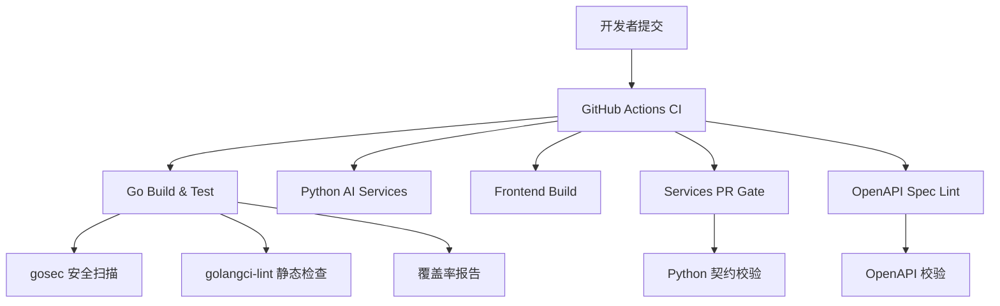
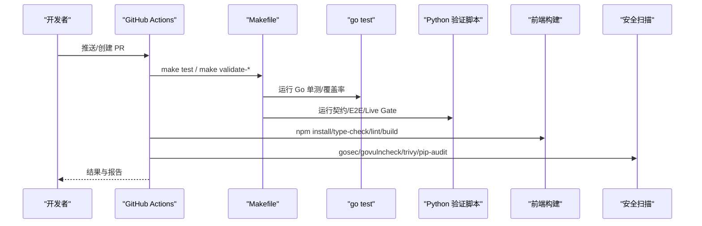
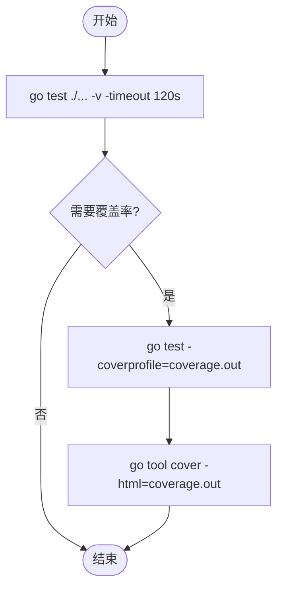
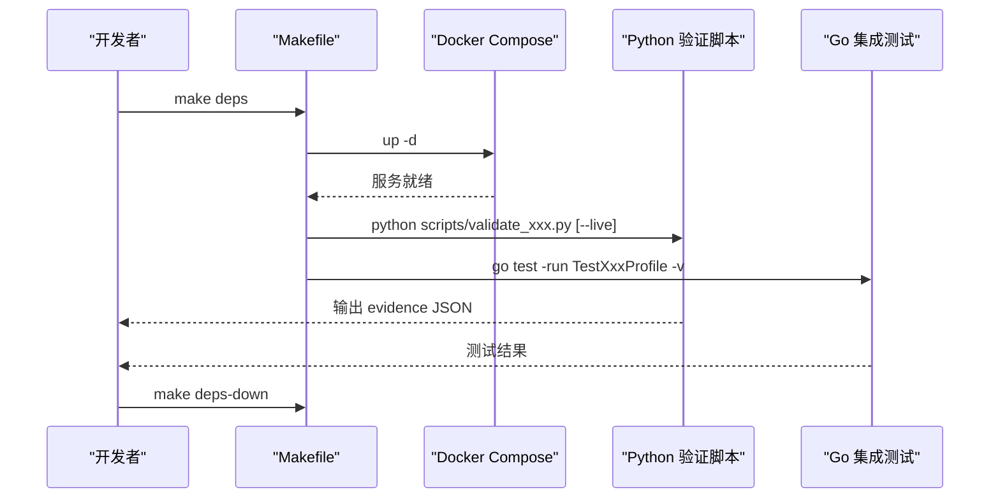
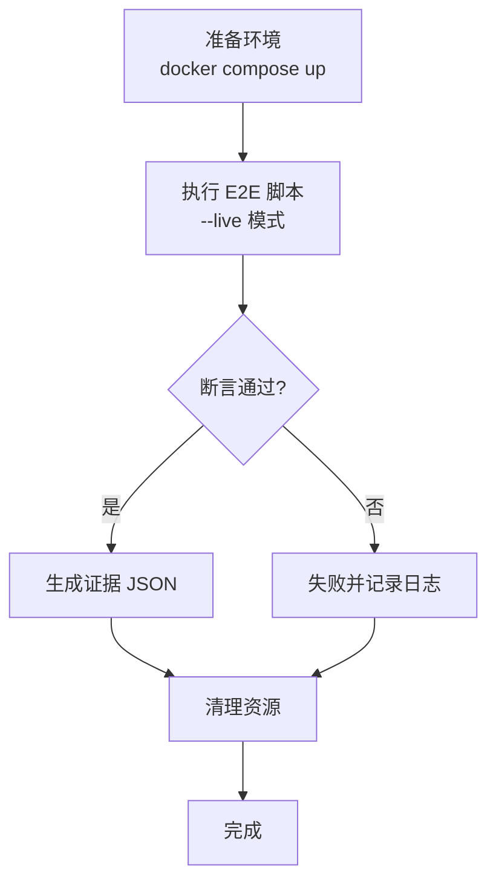
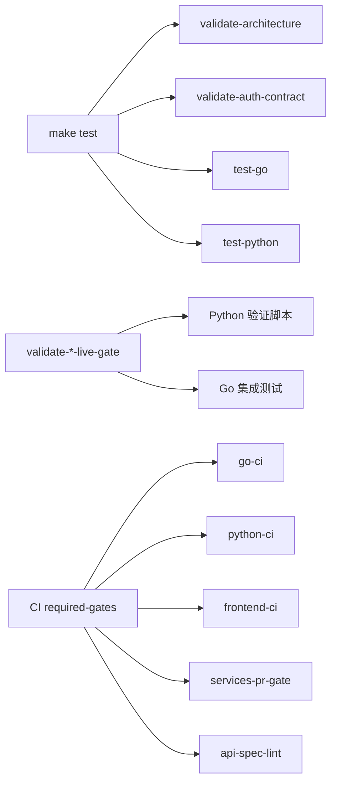

# 测试策略

<cite>
**本文引用的文件**
- [Makefile](file://repo/Makefile)
- [CI 工作流](file://.github/workflows/ci.yml)
- [镜像构建与扫描工作流](file://repo/.github/workflows/build-image.yml)
- [Go 模块列表脚本](file://repo/scripts/list_go_modules.py)
- [Python 契约依赖清单](file://repo/ci/requirements-contract.txt)
- [CLI 单元测试](file://repo/cli/ani/main_test.go)
- [NATS 集成测试](file://repo/pkg/adapters/nats/integration_test.go)
- [运行时适配器集成测试](file://repo/pkg/adapters/runtime/integration_test.go)
- [Sprint14 韧性计划（含门禁说明）](file://repo/development-records/sprint14-core-resilience-plan.md)
</cite>

## 目录
1. [简介](#简介)
2. [项目结构](#项目结构)
3. [核心组件](#核心组件)
4. [架构总览](#架构总览)
5. [详细组件分析](#详细组件分析)
6. [依赖关系分析](#依赖关系分析)
7. [性能考虑](#性能考虑)
8. [故障排查指南](#故障排查指南)
9. [结论](#结论)
10. [附录](#附录)

## 简介
本测试策略面向 ANI 多语言、多服务、多环境的仓库，覆盖单元测试、集成测试、端到端测试的编写规范与执行流程；明确自动化测试框架的选择与配置；给出测试数据准备与管理、环境隔离策略；并说明性能测试、安全测试、兼容性测试的实施方法。同时提供覆盖率统计、持续集成配置与质量门禁设置指南，确保代码变更在本地与 CI 中均具备可重复、可观测、可回溯的质量保障。

## 项目结构
仓库采用 Monorepo 组织方式，测试相关的关键位置如下：
- Go 服务与包：位于 repo/services 与 repo/pkg，使用 go test 运行单元测试与部分集成测试。
- Python 验证脚本：位于 repo/scripts，承担契约校验、E2E/Live Gate 编排、合规检查等职责。
- 前端：位于 repo/frontends/console，包含类型检查、Lint、构建等前端质量门禁。
- CI：根级 .github/workflows/ci.yml 定义 PR/MR 门禁；repo/.github/workflows/build-image.yml 负责镜像构建与安全扫描。
- Makefile：统一入口，聚合构建、测试、覆盖率、各类 validate-* 门禁。

**图表来源**
- [CI 工作流:1-311](file://.github/workflows/ci.yml#L1-L311)
- [镜像构建与扫描工作流:1-82](file://repo/.github/workflows/build-image.yml#L1-L82)

**章节来源**
- [Makefile:1-160](file://repo/Makefile#L1-L160)
- [CI 工作流:24-138](file://.github/workflows/ci.yml#L24-L138)

## 核心组件
- Go 测试框架与执行
  - 使用 go test 运行所有 Go 包测试，超时与并发由命令参数控制。
  - 通过 Makefile 的 test-go 目标统一入口，便于在本地与 CI 一致执行。
- Python 验证脚本与测试
  - 大量 validate_*.py 脚本作为契约/E2E/Live Gate 的执行器，配合 Makefile 的 validate-* 目标。
  - Python AI 层使用 pytest 进行可选测试执行，并通过 ruff/mypy 做静态检查。
- 前端质量门禁
  - npm 安装依赖、审计、类型检查、Lint、构建，形成前端质量门。
- 覆盖率
  - Go 覆盖率通过 go test -coverprofile 生成，并在 CI 中按模块输出汇总。
- 安全扫描
  - Go 代码使用 gosec 扫描；镜像使用 Trivy 扫描 HIGH/CRITICAL 漏洞；依赖使用 govulncheck/pip-audit。

**章节来源**
- [Makefile:282-297](file://repo/Makefile#L282-L297)
- [CI 工作流:24-93](file://.github/workflows/ci.yml#L24-L93)
- [CI 工作流:95-138](file://.github/workflows/ci.yml#L95-L138)
- [CI 工作流:139-170](file://.github/workflows/ci.yml#L139-L170)
- [CI 工作流:216-256](file://.github/workflows/ci.yml#L216-L256)
- [镜像构建与扫描工作流:65-82](file://repo/.github/workflows/build-image.yml#L65-L82)

## 架构总览
测试分层与流水线如下：
- 单元测试：go test 针对 pkg 与 services 内部逻辑；Python 侧对 AI 模块进行编译检查与可选 pytest 执行。
- 集成测试：基于真实或模拟的后端（Postgres、MinIO、Milvus、NATS、Redis、Kubernetes），通过 integration_test 与 validate_* 脚本驱动。
- 端到端测试：M1-E2E 与 Live Gate 脚本组合，验证从 Gateway API 到后端资源的全链路行为，产出证据 JSON。
- 契约与兼容性：OpenAPI/Protobuf/SDK 一致性校验，防止契约漂移。
- 质量门禁：PR 必须通过 go-ci、python-ci、frontend-ci、services-pr-gate、api-spec-lint 等 required gates。

**图表来源**
- [CI 工作流:24-138](file://.github/workflows/ci.yml#L24-L138)
- [Makefile:282-297](file://repo/Makefile#L282-L297)

**章节来源**
- [CI 工作流:282-311](file://.github/workflows/ci.yml#L282-L311)
- [Makefile:299-703](file://repo/Makefile#L299-L703)

## 详细组件分析

### 单元测试（Go）
- 范围与组织
  - 每个 Go 包内以 *_test.go 命名，覆盖业务逻辑、适配器、中间件、bootstrap 能力装配等。
  - 示例包括 CLI 单测、NATS 消息总线单测、运行时适配器等。
- 执行方式
  - 本地：make test-go 或 go test ./... -v -timeout 120s。
  - CI：go-ci job 在每个模块下独立执行 go test 并收集覆盖率。
- 建议规范
  - 表驱动用例优先，保证边界条件覆盖。
  - 外部依赖通过接口抽象与 mock，避免网络/存储耦合。
  - 失败时打印上下文信息，便于定位。

**图表来源**
- [Makefile:285-297](file://repo/Makefile#L285-L297)

**章节来源**
- [CLI 单元测试](file://repo/cli/ani/main_test.go)
- [NATS 集成测试](file://repo/pkg/adapters/nats/integration_test.go)
- [运行时适配器集成测试](file://repo/pkg/adapters/runtime/integration_test.go)
- [Makefile:285-297](file://repo/Makefile#L285-L297)

### 集成测试（Go + Python）
- Go 集成测试
  - 通过 integration_test 与特定测试函数触发，例如 M1-E2E Profile、Kubernetes Provider Execution、REST Client 等。
  - 依赖本地 Docker Compose 启动 Postgres、MinIO、NATS、Redis、Milvus 等。
- Python 集成测试
  - validate_* 脚本驱动端到端场景，支持 --live 模式在真实环境中执行，并输出 evidence JSON。
  - 结合 Makefile 的 validate-* 目标，形成可复用的门禁。
- 环境与数据
  - 使用 docker-compose 管理依赖服务生命周期；测试前等待就绪，测试后清理数据。
  - 测试数据通过 YAML manifests 与迁移脚本准备，确保状态可预期。

**图表来源**
- [Makefile:167-186](file://repo/Makefile#L167-L186)
- [Makefile:461-465](file://repo/Makefile#L461-L465)

**章节来源**
- [Makefile:167-186](file://repo/Makefile#L167-L186)
- [Makefile:461-465](file://repo/Makefile#L461-L465)
- [Sprint14 韧性计划:51-64](file://repo/development-records/sprint14-core-resilience-plan.md#L51-L64)

### 端到端测试（E2E）
- 设计原则
  - 以“契约+场景”为核心，通过 Python 脚本编排请求序列，断言响应与资源状态。
  - 支持 local 与 live 两种模式，live 模式需显式参数并产出证据。
- 典型场景
  - M1-E2E Profile：验证实例编排全链路。
  - Kubernetes Provider Execution：验证 provider 执行路径。
  - Instance Orchestration Live Gate：真实环境下容器编排验证。
- 证据与可追溯性
  - 每次 live gate 执行输出 JSON 证据，归档于 development-records/live-evidence。
  - 门禁脚本将证据纳入验收材料，便于审计与回溯。

**图表来源**
- [Makefile:461-465](file://repo/Makefile#L461-L465)
- [Sprint14 韧性计划:51-64](file://repo/development-records/sprint14-core-resilience-plan.md#L51-L64)

**章节来源**
- [Makefile:461-465](file://repo/Makefile#L461-L465)
- [Sprint14 韧性计划:51-64](file://repo/development-records/sprint14-core-resilience-plan.md#L51-L64)

### 契约与兼容性测试
- OpenAPI/Protobuf/SDK
  - 通过 validate_openapi_spec.py、validate_services_contract.py、validate_sdk_alpha/beta.py 等脚本校验契约一致性。
  - CI 中 api-spec-lint job 强制 OpenAPI 结构正确。
- 基线与冻结
  - 使用 core-v1-compatibility-baseline.yaml 等基线文件，防止 API 向后不兼容变更。
- 文档一致性
  - 校验文档入口与实现的一致性，避免文档漂移。

**章节来源**
- [CI 工作流:257-281](file://.github/workflows/ci.yml#L257-L281)
- [Makefile:140-150](file://repo/Makefile#L140-L150)

### 安全测试
- 代码安全
  - gosec 扫描高严重级别问题，阻断高风险漏洞。
- 依赖安全
  - govulncheck 扫描 Go 依赖；pip-audit 扫描 Python 依赖。
- 镜像安全
  - Trivy 扫描镜像中的 HIGH/CRITICAL 漏洞，阻断发布。
- 签名与供应链
  - Cosign 对镜像签名，确保制品完整性。

**章节来源**
- [CI 工作流:65-93](file://.github/workflows/ci.yml#L65-L93)
- [CI 工作流:216-256](file://.github/workflows/ci.yml#L216-L256)
- [镜像构建与扫描工作流:65-82](file://repo/.github/workflows/build-image.yml#L65-L82)

### 兼容性测试
- SDK 与 API
  - 生成四语言 SDK Alpha/Beta，并通过 validate-sdk-alpha/beta 校验操作 ID 与元数据一致性。
- OpenAPI 结构
  - 校验 Core/Services OpenAPI 结构，防止破坏性变更。
- 版本策略
  - 校验版本策略与产物清单，确保发布物一致。

**章节来源**
- [Makefile:219-232](file://repo/Makefile#L219-L232)
- [Makefile:776-798](file://repo/Makefile#L776-L798)

## 依赖关系分析
- 测试与门禁的依赖链
  - make test 依赖 validate-architecture、validate-auth-contract、test-go、test-python。
  - 各 validate-* 目标依赖对应的 Python 脚本与 Go 测试。
- CI 作业依赖
  - required-gates 聚合 go-ci、python-ci、frontend-ci、services-pr-gate、api-spec-lint。
- 工具链依赖
  - Go：golangci-lint、gosec、govulncheck。
  - Python：pytest、ruff、mypy、pip-audit。
  - Node：npm audit、type-check、lint、build。

**图表来源**
- [Makefile:282-297](file://repo/Makefile#L282-L297)
- [CI 工作流:282-311](file://.github/workflows/ci.yml#L282-L311)

**章节来源**
- [Makefile:282-297](file://repo/Makefile#L282-L297)
- [CI 工作流:282-311](file://.github/workflows/ci.yml#L282-L311)

## 性能考虑
- 测试执行优化
  - 使用并发缓存（Go module cache、pip cache、npm cache）加速 CI。
  - 按模块并行执行 go test 与覆盖率收集，减少整体耗时。
- 资源隔离
  - 通过 docker-compose 为测试提供独立依赖服务，避免污染。
  - Live Gate 在隔离 fixture 中执行，避免影响生产环境。
- 稳定性
  - 超时与重试策略在适配器层实现，测试中复用以确保一致性。
  - 健康探针与降级语义在测试中验证，确保系统韧性。

[本节为通用指导，不直接分析具体文件]

## 故障排查指南
- 常见失败原因
  - 依赖服务未就绪：检查 docker-compose 状态与服务端口。
  - 环境变量缺失：确认 Gateway URL、Token、租户 ID 等必要参数。
  - 契约不一致：OpenAPI/SDK/Proto 变更未同步，需重新生成并校验。
  - 安全扫描失败：修复 gosec/trivy 报告的高危问题。
- 定位步骤
  - 查看 CI 日志，定位失败 job 与步骤。
  - 本地复现：使用 make deps、make test、make validate-* 逐步缩小范围。
  - 证据分析：Live Gate 输出 JSON 证据，核对状态码与资源状态。
- 恢复措施
  - 修正代码或配置后，重新运行对应门禁。
  - 更新契约基线或文档，保持同步。

**章节来源**
- [Makefile:167-186](file://repo/Makefile#L167-L186)
- [CI 工作流:282-311](file://.github/workflows/ci.yml#L282-L311)
- [Sprint14 韧性计划:51-64](file://repo/development-records/sprint14-core-resilience-plan.md#L51-L64)

## 结论
本测试策略以 Makefile 为统一入口，结合 GitHub Actions 实现跨语言、跨层的自动化质量保障。通过单元测试、集成测试、端到端测试与契约校验，覆盖功能、性能、安全与兼容性维度。建议在开发过程中遵循 TDD 实践，严格使用门禁与证据机制，确保每次变更均可回溯、可验证、可发布。

[本节为总结性内容，不直接分析具体文件]

## 附录

### 测试执行速查
- 本地
  - 启动依赖：make deps
  - 运行测试：make test
  - 生成覆盖率：make test-cover
  - 运行特定门禁：make validate-xxx
- CI
  - PR 触发：go-ci、python-ci、frontend-ci、services-pr-gate、api-spec-lint
  - 发布触发：镜像构建与安全扫描

**章节来源**
- [Makefile:18-48](file://repo/Makefile#L18-L48)
- [CI 工作流:24-170](file://.github/workflows/ci.yml#L24-L170)
- [镜像构建与扫描工作流:1-82](file://repo/.github/workflows/build-image.yml#L1-L82)