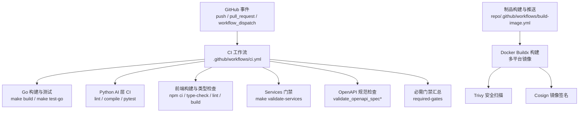
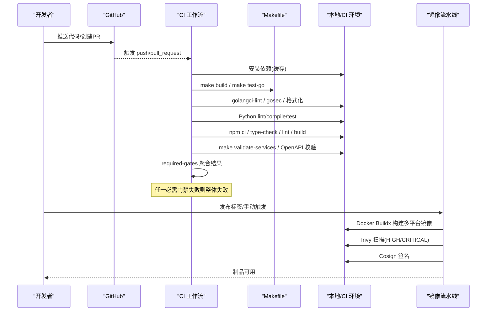
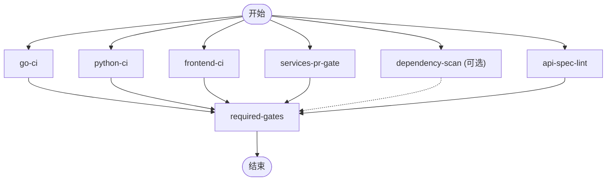
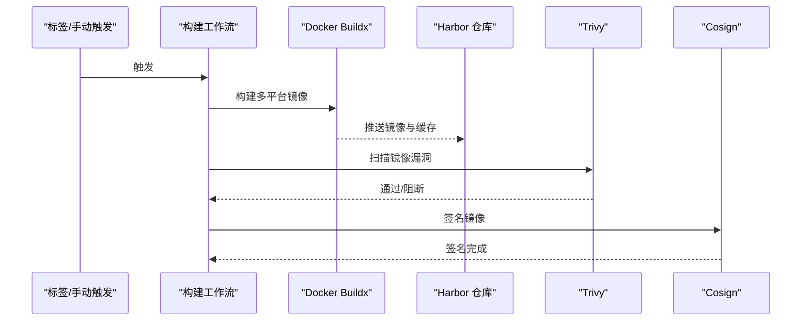
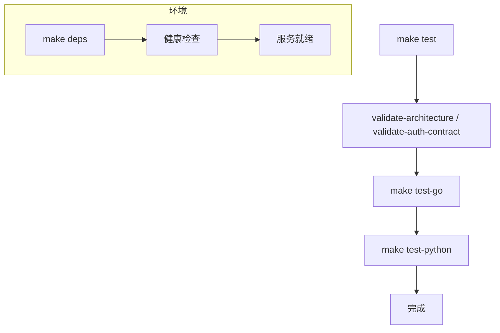
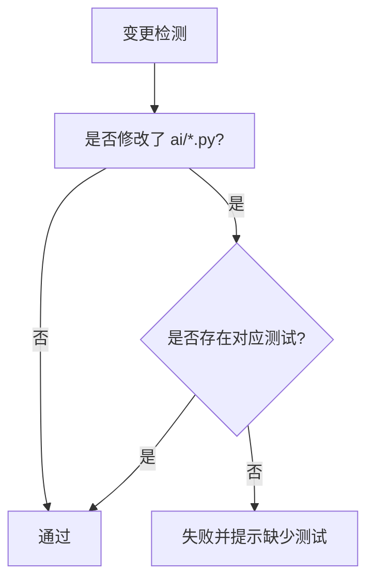
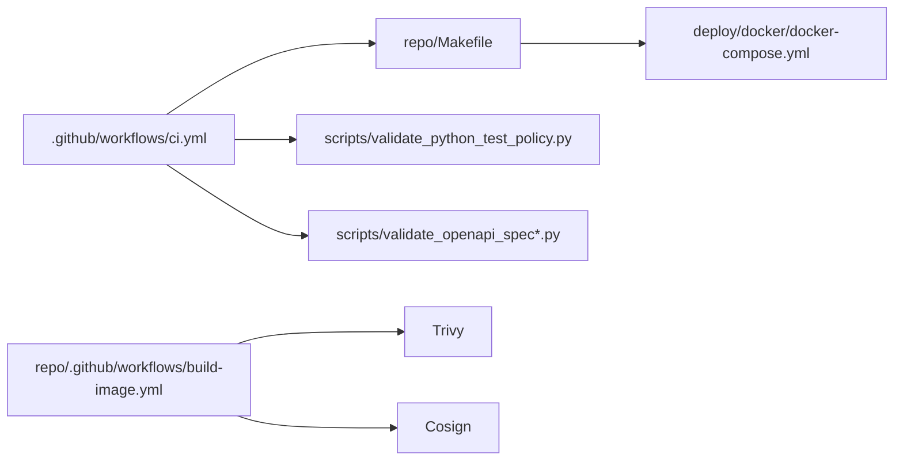

# 测试自动化

<cite>
**本文引用的文件**
- [ci.yml](file://.github/workflows/ci.yml)
- [build-image.yml](file://repo/.github/workflows/build-image.yml)
- [Makefile](file://repo/Makefile)
- [docker-compose.yml](file://repo/deploy/docker/docker-compose.yml)
- [validate_python_test_policy.py](file://repo/scripts/validate_python_test_policy.py)
- [requirements-contract.txt](file://repo/ci/requirements-contract.txt)
- [validate_ci_workflow_test.py](file://repo/scripts/validate_ci_workflow_test.py)
</cite>

## 目录
1. [简介](#简介)
2. [项目结构](#项目结构)
3. [核心组件](#核心组件)
4. [架构总览](#架构总览)
5. [详细组件分析](#详细组件分析)
6. [依赖关系分析](#依赖关系分析)
7. [性能与并行性](#性能与并行性)
8. [故障排查指南](#故障排查指南)
9. [结论](#结论)
10. [附录：流水线配置示例](#附录流水线配置示例)

## 简介
本文件面向 ANI 仓库的测试自动化体系，系统性说明持续集成流水线的配置、测试编排策略、结果收集与分析、环境自动化管理以及代码质量门禁。重点覆盖 GitHub Actions 工作流（CI）与构建镜像流水线（Build & Push Images），结合 Makefile 提供的统一入口，形成从“代码提交”到“质量门禁”再到“制品产出”的完整闭环。

## 项目结构
- 顶层 CI 工作流位于 .github/workflows/ci.yml，负责 Go、Python、前端、服务契约校验、OpenAPI 规范检查等任务。
- 制品构建与推送工作流位于 repo/.github/workflows/build-image.yml，负责多服务镜像构建、安全扫描与签名。
- 统一的本地与 CI 执行入口在 repo/Makefile，提供 test、test-cover、validate-* 等目标。
- 本地依赖服务通过 repo/deploy/docker/docker-compose.yml 管理（PostgreSQL、MinIO、NATS、Redis、Milvus 等）。
- Python AI 层测试策略由 repo/scripts/validate_python_test_policy.py 强制约束。
- 契约校验依赖包由 repo/ci/requirements-contract.txt 集中声明。
- CI 工作流契约校验脚本为 repo/scripts/validate_ci_workflow_test.py，确保 PR Gate 聚合 job 使用 always() 且必要 job 存在。

**图示来源**
- [ci.yml:1-311](file://.github/workflows/ci.yml#L1-L311)
- [build-image.yml:1-82](file://repo/.github/workflows/build-image.yml#L1-L82)

**章节来源**
- [ci.yml:1-311](file://.github/workflows/ci.yml#L1-L311)
- [build-image.yml:1-82](file://repo/.github/workflows/build-image.yml#L1-L82)
- [Makefile:1-800](file://repo/Makefile#L1-L800)
- [docker-compose.yml:1-184](file://repo/deploy/docker/docker-compose.yml#L1-L184)

## 核心组件
- 统一构建与测试入口：Makefile 暴露 test、test-go、test-cover 及大量 validate-* 目标，串联 Go 单元测试、Python 编译检查、契约校验与 live gate 验证。
- CI 工作流：按语言/领域拆分 jobs，并行执行并设置超时；通过 required-gates 聚合所有必需门禁结果，实现 fail-closed。
- 制品流水线：基于 tag 或手动触发，构建多服务镜像，进行 Trivy 扫描与 Cosign 签名，推送到 Harbor。
- 环境管理：docker-compose 提供开发/测试所需的基础设施（PG、MinIO、NATS、Redis、Milvus），并通过 healthcheck 保障就绪。
- 质量门禁：golangci-lint、gosec、ruff/mypy、npm audit/type-check/lint、OpenAPI 校验、Python 测试策略校验。

**章节来源**
- [Makefile:282-297](file://repo/Makefile#L282-L297)
- [ci.yml:24-311](file://.github/workflows/ci.yml#L24-L311)
- [build-image.yml:16-82](file://repo/.github/workflows/build-image.yml#L16-L82)
- [docker-compose.yml:14-184](file://repo/deploy/docker/docker-compose.yml#L14-L184)

## 架构总览
下图展示从代码变更到质量门禁与制品产出的端到端流程，包括并行执行、失败聚合、安全扫描与镜像签名。

**图示来源**
- [ci.yml:24-311](file://.github/workflows/ci.yml#L24-L311)
- [build-image.yml:16-82](file://repo/.github/workflows/build-image.yml#L16-L82)
- [Makefile:282-297](file://repo/Makefile#L282-L297)

## 详细组件分析

### CI 工作流（.github/workflows/ci.yml）
- 触发条件：push 到 main/develop、pull_request 到 main/develop、workflow_dispatch。
- 并发控制：按 PR number 或 ref 分组，取消进行中任务，避免重复构建。
- 并行 Jobs：
  - go-ci：安装工具、构建、运行 Go 测试、安全扫描、格式化、golangci-lint、覆盖率统计。
  - python-ci：安装依赖、Ruff/Mypy 检查、编译检查、pytest（如有）、Python 测试策略校验。
  - frontend-ci：npm 依赖缓存、审计、类型检查、Lint、构建。
  - services-pr-gate：安装契约校验依赖、执行 make validate-services、CI 策略校验、文档入口校验。
  - dependency-scan：可选的依赖漏洞扫描（当前设置为 continue-on-error）。
  - api-spec-lint：OpenAPI 规范校验。
  - required-gates：聚合上述必需门禁，fail-closed。
- 超时与缓存：各 job 设置超时；Go/Python/Node 依赖均启用缓存。

**图示来源**
- [ci.yml:24-311](file://.github/workflows/ci.yml#L24-L311)

**章节来源**
- [ci.yml:1-311](file://.github/workflows/ci.yml#L1-L311)

### 制品构建与推送（repo/.github/workflows/build-image.yml）
- 触发条件：带 v*.*.* 标签的 push，或 workflow_dispatch 输入 tag。
- 矩阵构建：对多个服务（ani-gateway、inference-operator、upgrade-operator、rag-engine、doc-parser）并行构建。
- 构建与推送：使用 Docker Buildx 构建 linux/amd64、linux/arm64 镜像，推送到 Harbor，并启用 registry 缓存。
- 安全与签名：Trivy 阻断 HIGH/CRITICAL 漏洞；Cosign 使用私钥签名镜像。

**图示来源**
- [build-image.yml:16-82](file://repo/.github/workflows/build-image.yml#L16-L82)

**章节来源**
- [build-image.yml:1-82](file://repo/.github/workflows/build-image.yml#L1-L82)

### 测试编排与环境管理（Makefile + docker-compose）
- 测试入口：
  - make test：先执行架构与服务契约校验，再运行 Go 测试与 Python 编译检查。
  - make test-go：并行运行 pkg/services 下 Go 单测，设置超时。
  - make test-cover：生成覆盖率报告（coverage.out -> coverage.html）。
- 环境准备：
  - make deps：启动 docker-compose 中的 PG、MinIO、NATS、Redis、Milvus，并等待健康检查通过。
  - make deps-down / deps-clean：停止与清理数据卷。
- 契约与门禁：
  - 大量 validate-* 目标将 Python 校验脚本与 Go 测试组合，覆盖实例生命周期、Kubernetes 执行、live gate 等。
  - 部分 live gate 支持 --live 参数以连接真实环境并输出证据。

**图示来源**
- [Makefile:282-297](file://repo/Makefile#L282-L297)
- [Makefile:167-186](file://repo/Makefile#L167-L186)
- [docker-compose.yml:14-184](file://repo/deploy/docker/docker-compose.yml#L14-L184)

**章节来源**
- [Makefile:282-297](file://repo/Makefile#L282-L297)
- [docker-compose.yml:14-184](file://repo/deploy/docker/docker-compose.yml#L14-L184)

### Python AI 测试策略与门禁
- 策略：当 ai/ 目录下 Python 源文件发生变更时，必须同时包含匹配的测试文件（文件名以 test_ 开头或 _test.py 结尾），否则 CI 失败。
- 执行：在 python-ci job 中调用 validate_python_test_policy.py，传入 BASE_SHA 比较变更集。
- 目的：防止无测试的代码变更进入分支，提升回归风险可控性。

**图示来源**
- [validate_python_test_policy.py:11-34](file://repo/scripts/validate_python_test_policy.py#L11-L34)
- [ci.yml:125-137](file://.github/workflows/ci.yml#L125-L137)

**章节来源**
- [validate_python_test_policy.py:1-62](file://repo/scripts/validate_python_test_policy.py#L1-L62)
- [ci.yml:95-137](file://.github/workflows/ci.yml#L95-L137)

### 契约与 OpenAPI 校验
- 契约依赖：通过 requirements-contract.txt 固定 PyYAML、openapi-spec-validator、pytest 版本，保证可重现。
- 校验步骤：
  - services-pr-gate 中安装契约依赖后执行 make validate-services。
  - api-spec-lint 中执行 validate_openapi_spec_test.py 与 validate_openapi_spec.py。
- 作用：确保 Services/OpenAPI 契约一致性与向后兼容基线不被破坏。

**章节来源**
- [requirements-contract.txt:1-4](file://repo/ci/requirements-contract.txt#L1-L4)
- [ci.yml:171-215](file://.github/workflows/ci.yml#L171-L215)
- [ci.yml:257-281](file://.github/workflows/ci.yml#L257-L281)

### 必需门禁聚合与失败关闭
- required-gates 使用 if: ${{ always() }} 确保在所有前置 job 完成后执行。
- 通过读取 needs.*.result 判断每个必需门禁是否成功，任一失败即退出码非零，阻止合并。
- 契约测试 validate_ci_workflow_test.py 确保：
  - 当前工作流满足 fail-closed。
  - 缺失必需 job 会被阻断。
  - 聚合 job 必须使用 always()。
  - services-pr-gate 不得安装运行时依赖（如 RAG 依赖）。

**章节来源**
- [ci.yml:282-311](file://.github/workflows/ci.yml#L282-L311)
- [validate_ci_workflow_test.py:12-35](file://repo/scripts/validate_ci_workflow_test.py#L12-L35)

## 依赖关系分析
- CI 与 Makefile：CI 通过 make 目标组织测试与校验，降低跨语言差异带来的维护成本。
- 环境与测试：docker-compose 提供稳定一致的依赖服务，healthcheck 确保测试前环境就绪。
- 契约与门禁：Python 校验脚本与 Go 测试共同构成契约与行为验证，OpenAPI 校验保障接口一致性。
- 制品与安全：构建流水线与 Trivy/Cosign 形成制品安全与可信链。

**图示来源**
- [ci.yml:24-311](file://.github/workflows/ci.yml#L24-L311)
- [Makefile:282-297](file://repo/Makefile#L282-L297)
- [docker-compose.yml:14-184](file://repo/deploy/docker/docker-compose.yml#L14-L184)
- [build-image.yml:16-82](file://repo/.github/workflows/build-image.yml#L16-L82)

**章节来源**
- [ci.yml:24-311](file://.github/workflows/ci.yml#L24-L311)
- [Makefile:282-297](file://repo/Makefile#L282-L297)
- [docker-compose.yml:14-184](file://repo/deploy/docker/docker-compose.yml#L14-L184)
- [build-image.yml:16-82](file://repo/.github/workflows/build-image.yml#L16-L82)

## 性能与并行性
- 并行执行：CI 中多个 jobs 并行运行，缩短整体耗时；构建镜像使用 matrix 并行构建多服务。
- 缓存策略：Go/Python/Node 依赖均启用缓存，显著减少安装时间。
- 超时控制：每个 job 设置超时，避免长时间阻塞。
- 建议优化：
  - 将可选的 dependency-scan 改为独立通知型 job，避免阻塞主流程。
  - 针对大模块测试进一步拆分 job 或使用分片测试。
  - 使用远程缓存（如 GitHub Actions cache 或专用缓存后端）加速依赖下载。

[本节为通用指导，不直接分析具体文件]

## 故障排查指南
- 必需门禁失败：查看 required-gates 日志，定位失败的 job（go-ci/python-ci/frontend-ci/services-pr-gate/api-spec-lint）。
- Python 测试策略失败：确认 ai/ 目录变更是否附带对应测试文件；必要时调整测试命名或补充测试。
- 环境未就绪：检查 docker-compose 健康检查与端口绑定；必要时清理数据卷并重启。
- 契约校验失败：根据 validate_* 脚本输出定位问题（OpenAPI 结构、边界/路由/SDK 契约等）。
- 镜像构建失败：检查 Dockerfile 上下文、构建缓存、Trivy 阻断规则与 Cosign 私钥配置。

**章节来源**
- [ci.yml:282-311](file://.github/workflows/ci.yml#L282-L311)
- [validate_python_test_policy.py:11-34](file://repo/scripts/validate_python_test_policy.py#L11-L34)
- [docker-compose.yml:14-184](file://repo/deploy/docker/docker-compose.yml#L14-L184)

## 结论
本项目通过 GitHub Actions 与 Makefile 构建了覆盖多语言、多领域的测试自动化体系：并行执行、严格门禁、契约校验、环境标准化与制品安全。建议在后续迭代中继续完善可选门禁的通知机制、细化测试分片与缓存策略，以提升效率与稳定性。

[本节为总结，不直接分析具体文件]

## 附录：流水线配置示例
以下给出关键配置的要点与路径，便于快速复现与扩展：

- 触发与并发
  - 触发：push/PR/dispatch
  - 并发组：按 PR number/ref 分组，取消进行中
  - 参考：[ci.yml:3-20](file://.github/workflows/ci.yml#L3-L20)

- Go 构建与测试
  - 安装工具：gosec、golangci-lint
  - 构建：make build
  - 测试：make test-go
  - 覆盖率：按模块生成 coverprofile 并打印汇总
  - 参考：[ci.yml:24-94](file://.github/workflows/ci.yml#L24-L94)

- Python AI 层
  - 依赖：requirements.txt + ruff/mypy/pytest
  - 检查：ruff check、mypy、compileall
  - 策略：validate_python_test_policy.py
  - 参考：[ci.yml:95-137](file://.github/workflows/ci.yml#L95-L137)、[validate_python_test_policy.py:1-62](file://repo/scripts/validate_python_test_policy.py#L1-L62)

- 前端
  - 依赖：package-lock.json 缓存
  - 检查：audit、type-check、lint、build
  - 参考：[ci.yml:139-169](file://.github/workflows/ci.yml#L139-L169)

- 服务契约与 OpenAPI
  - 依赖：requirements-contract.txt
  - 执行：make validate-services、validate_openapi_spec*
  - 参考：[ci.yml:171-215](file://.github/workflows/ci.yml#L171-L215)、[ci.yml:257-281](file://.github/workflows/ci.yml#L257-L281)、[requirements-contract.txt:1-4](file://repo/ci/requirements-contract.txt#L1-L4)

- 必需门禁聚合
  - always() 聚合，fail-closed
  - 参考：[ci.yml:282-311](file://.github/workflows/ci.yml#L282-L311)

- 镜像构建与推送
  - 触发：tag 或 dispatch
  - 构建：Buildx 多平台
  - 安全：Trivy 阻断 HIGH/CRITICAL
  - 签名：Cosign
  - 参考：[build-image.yml:16-82](file://repo/.github/workflows/build-image.yml#L16-L82)

- 本地/CI 环境
  - 启动：make deps
  - 服务：PG、MinIO、NATS、Redis、Milvus
  - 健康检查：healthcheck
  - 参考：[Makefile:167-186](file://repo/Makefile#L167-L186)、[docker-compose.yml:14-184](file://repo/deploy/docker/docker-compose.yml#L14-L184)

**章节来源**
- [ci.yml:3-311](file://.github/workflows/ci.yml#L3-L311)
- [build-image.yml:16-82](file://repo/.github/workflows/build-image.yml#L16-L82)
- [Makefile:167-186](file://repo/Makefile#L167-L186)
- [docker-compose.yml:14-184](file://repo/deploy/docker/docker-compose.yml#L14-L184)
- [requirements-contract.txt:1-4](file://repo/ci/requirements-contract.txt#L1-L4)
- [validate_python_test_policy.py:1-62](file://repo/scripts/validate_python_test_policy.py#L1-L62)