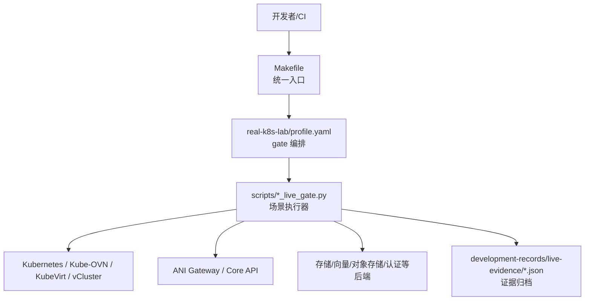
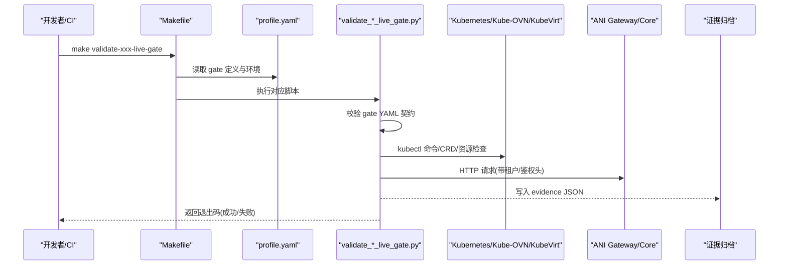
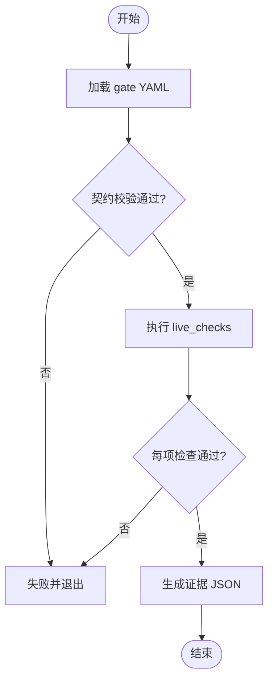
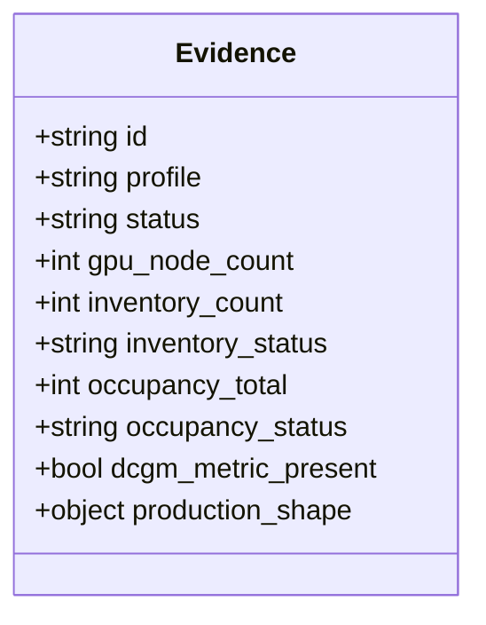
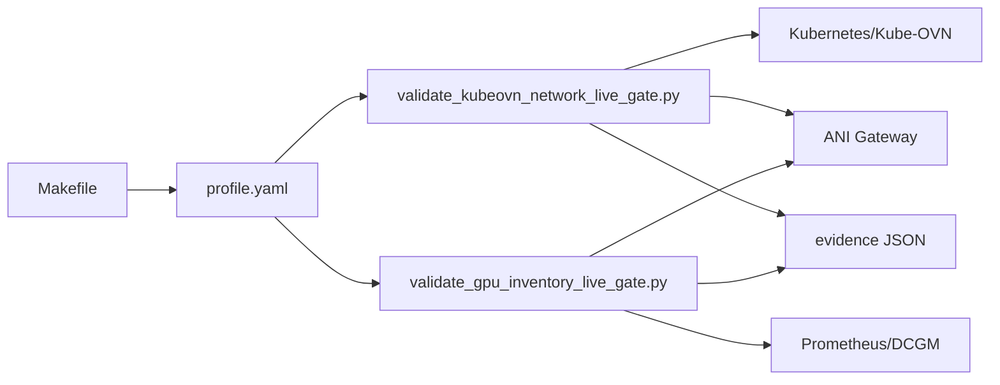

# 端到端测试

<cite>
**本文引用的文件**
- [Makefile](file://repo/Makefile)
- [profile.yaml](file://repo/deploy/real-k8s-lab/profile.yaml)
- [README.md](file://repo/deploy/manifests/m1-e2e/README.md)
- [validate_kubeovn_network_live_gate.py](file://repo/scripts/validate_kubeovn_network_live_gate.py)
- [validate_gpu_inventory_live_gate.py](file://repo/scripts/validate_gpu_inventory_live_gate.py)
- [m1-e2e-b-real-provider-profile.md](file://repo/development-records/m1-e2e-b-real-provider-profile.md)
- [real-k8s-lab-k8s-kubeovn-kubevirt-bootstrap.md](file://repo/development-records/real-k8s-lab-k8s-kubeovn-kubevirt-bootstrap.md)
- [instance-observability-completion-b2-prometheus-dcgm-scrape.md](file://repo/development-records/instance-observability-completion-b2-prometheus-dcgm-scrape.md)
- [PHASE3-MODEL-ENHANCEMENT-ACCEPTANCE-RECORD.md](file://repo/services/tasks/phase3/acceptance/PHASE3-MODEL-ENHANCEMENT-ACCEPTANCE-RECORD.md)
- [openapi-phase3-agent-audit-draft.md](file://repo/services/docs/console-modules/openapi-drafts/phase3/openapi-phase3-agent-audit-draft.md)
</cite>

## 目录
1. [简介](#简介)
2. [项目结构](#项目结构)
3. [核心组件](#核心组件)
4. [架构总览](#架构总览)
5. [详细组件分析](#详细组件分析)
6. [依赖关系分析](#依赖关系分析)
7. [性能与稳定性考虑](#性能与稳定性考虑)
8. [故障排查指南](#故障排查指南)
9. [结论](#结论)
10. [附录](#附录)

## 简介
本文件面向 ANI 平台的端到端（E2E）测试体系，覆盖从设计原则、真实环境 real-k8s-lab 的搭建与维护、自动化执行流程、证据收集与分析，到冒烟与回归策略及具体示例。目标是让不同背景的读者都能理解并落地一套可重复、可审计、可扩展的 E2E 验证体系。

## 项目结构
仓库采用 monorepo 组织方式，E2E 相关能力主要分布在以下位置：
- 统一入口与编排：Makefile 提供统一的测试与门禁目标，集中管理 E2E、live gate、契约校验等任务。
- 真实环境配置：deploy/real-k8s-lab 下以 profile.yaml 为核心，声明各 live gate、所需工具与环境变量，以及组件就绪检查。
- 离线/本地 E2E 剖面：deploy/manifests/m1-e2e 提供 M1 实例契约链的离线/本地验证说明。
- 脚本化 live gate：scripts 目录下按领域划分 validate_*_live_gate.py，负责在真实集群或网关上执行业务场景并产出证据。
- 开发记录与证据：development-records 下包含 bootstrap 记录、结果文档与 live-evidence JSON 归档。

图示来源
- [Makefile:1-200](file://repo/Makefile#L1-L200)
- [profile.yaml:1-142](file://repo/deploy/real-k8s-lab/profile.yaml#L1-L142)
- [validate_kubeovn_network_live_gate.py:1-200](file://repo/scripts/validate_kubeovn_network_live_gate.py#L1-L200)

章节来源
- [Makefile:1-200](file://repo/Makefile#L1-L200)
- [profile.yaml:1-142](file://repo/deploy/real-k8s-lab/profile.yaml#L1-L142)

## 核心组件
- 统一构建与测试入口（Makefile）
  - 暴露大量 validate-* 目标，涵盖 E2E、live gate、契约与架构校验，便于 CI 与本地一键执行。
  - 通过环境变量加载 .env，导出给子进程，保证凭据与端点集中管理。
- 真实环境编排（real-k8s-lab/profile.yaml）
  - 定义 REAL-K8S-LAB-A profile，列出各 live gate、对应 manifest、validator 脚本、必需环境变量。
  - 声明组件就绪检查（Kubernetes/Kube-OVN/KubeVirt/vCluster），确保底座可用后再跑 gate。
- 场景化 live gate 脚本
  - 每个脚本实现“加载 gate YAML → 校验契约 → 执行命令/HTTP 调用 → 断言 → 输出证据”的闭环。
  - 典型字段包括 profile、required_tools、required_endpoints、live_checks、pass_condition。
- 离线/本地 E2E 剖面（M1-E2E）
  - 默认离线运行，覆盖 VM/容器/GPU 容器的创建、生命周期、查询与可视化操作；生产态可切换真实 provider。

章节来源
- [Makefile:1-200](file://repo/Makefile#L1-L200)
- [profile.yaml:1-142](file://repo/deploy/real-k8s-lab/profile.yaml#L1-L142)
- [README.md:1-25](file://repo/deploy/manifests/m1-e2e/README.md#L1-L25)

## 架构总览
下图展示一次典型的 live gate 执行链路：Makefile 触发目标 → 读取 profile.yaml 中的 gate 定义 → 调用对应 validator 脚本 → 脚本校验 gate 契约 → 执行 kubectl/HTTP 命令 → 断言并通过/失败 → 输出证据 JSON 到 development-records/live-evidence。

图示来源
- [Makefile:1-200](file://repo/Makefile#L1-L200)
- [profile.yaml:1-142](file://repo/deploy/real-k8s-lab/profile.yaml#L1-L142)
- [validate_kubeovn_network_live_gate.py:1-200](file://repo/scripts/validate_kubeovn_network_live_gate.py#L1-L200)

## 详细组件分析

### 组件A：Kube-OVN 网络 live gate
职责
- 校验 Kube-OVN 网络能力（VPC/Subnet/路由/NetworkPolicy/Service/LB）。
- 要求具备 kubectl 与 Kubernetes API、Kube-OVN CRDs、NetworkPolicy API 等端点。
- 通过一组 required live_checks 断言资源存在性与可达性。

关键实现要点
- 强制校验 gate YAML 的 profile/status/tools/endpoints/checks 字段。
- 使用 subprocess 执行 kubectl 命令，捕获 stdout/stderr 并断言 pass_condition。
- 通过 HTTP 客户端向 ANI Gateway 发起带租户与鉴权的请求，用于端到端连通性验证。

图示来源
- [validate_kubeovn_network_live_gate.py:1-200](file://repo/scripts/validate_kubeovn_network_live_gate.py#L1-L200)

章节来源
- [validate_kubeovn_network_live_gate.py:1-200](file://repo/scripts/validate_kubeovn_network_live_gate.py#L1-L200)

### 组件B：GPU 库存 live gate
职责
- 校验 GPU 节点数量、容量、库存与占用情况，并确认 DCGM 指标采集可用。
- 支持 production_shaped 模式，记录传输路径与证明项。

证据模型
- 输出 JSON 包含 id、profile、status、gpu_node_count、inventory_status、occupancy_status、dcgm_metric_present 等字段。
- 若启用 production_shaped，追加 production_shape 段，包含 transport_profile 与 proof_items。

图示来源
- [validate_gpu_inventory_live_gate.py:298-324](file://repo/scripts/validate_gpu_inventory_live_gate.py#L298-L324)

章节来源
- [validate_gpu_inventory_live_gate.py:298-324](file://repo/scripts/validate_gpu_inventory_live_gate.py#L298-L324)

### 组件C：M1-E2E-B Real Provider 回归剖面
职责
- 在不连接真实 Kubernetes 集群的前提下，保持真实 adapter 链（REST Client → Provider Adapter → Lifecycle Executor → Instance Ops → Service），验证统一的实例流（创建、状态观察、启停、日志、exec）。
- 作为回归测试剖面，快速发现 provider 适配层变更引入的问题。

执行方式
- 通过 Makefile 目标 validate-m1-real-provider-profile 触发。
- 配合 deploy/manifests/m1-e2e-b 下的配置与脚本完成编排。

章节来源
- [m1-e2e-b-real-provider-profile.md:1-75](file://repo/development-records/m1-e2e-b-real-provider-profile.md#L1-L75)
- [Makefile:1-200](file://repo/Makefile#L1-L200)

### 组件D：real-k8s-lab 环境搭建与维护
职责
- 在三台物理机上最小化部署 Kubernetes、Kube-OVN、KubeVirt，为后续 live gate 提供真实底座。
- 记录镜像源处理、节点身份冲突、CNI 初始化等关键问题与修复过程。

维护要点
- 使用国内镜像源解决拉取超时。
- 修正 containerd v2 sandbox pinned image。
- 清理 OVN 残留 annotation 与 IP 对象，恢复控制平面 join port。
- 等待 KubeVirt 大镜像拉取完成，确保 virt-handler Ready。

章节来源
- [real-k8s-lab-k8s-kubeovn-kubevirt-bootstrap.md:1-87](file://repo/development-records/real-k8s-lab-k8s-kubeovn-kubevirt-bootstrap.md#L1-L87)

### 组件E：实例可观测性 Prometheus/DCGM 采集验证
职责
- 验证 Prometheus scrape job 能正确采集 DCGM GPU 指标，target 状态 up。
- 提供手动验证步骤与期望结果，支撑端到端指标可用性。

验证流程
- 应用 YAML → 触发 Prometheus reload → 查询指标 → 检查 target 状态。

章节来源
- [instance-observability-completion-b2-prometheus-dcgm-scrape.md:94-134](file://repo/development-records/instance-observability-completion-b2-prometheus-dcgm-scrape.md#L94-L134)

### 组件F：异步任务链路 E2E（RAG 解析）
职责
- 验证 outbox → NATS → rag-engine → 状态回写的完整异步链路。
- 覆盖上传文档后事件发布、任务领取、解析/分块/摘要/向量化、状态回写与重试。

验收标准
- 符合 SPEC 中关于状态机流转与可复跑的要求。

章节来源
- [PHASE3-MODEL-ENHANCEMENT-ACCEPTANCE-RECORD.md:1-30](file://repo/services/tasks/phase3/acceptance/PHASE3-MODEL-ENHANCEMENT-ACCEPTANCE-RECORD.md#L1-L30)

### 组件G：Agent 审计接口验收（Console）
职责
- 提供审计事件的列表、会话内过滤、详情查看与导出等接口草案。
- 明确权限边界与负向用例（无权限 403、不存在 404、敏感信息脱敏）。

验收要点
- 列表与过滤语义一致。
- 响应不含未脱敏的 prompt 全文。
- 与 Core 安全审计路径不冲突。

章节来源
- [openapi-phase3-agent-audit-draft.md:85-174](file://repo/services/docs/console-modules/openapi-drafts/phase3/openapi-phase3-agent-audit-draft.md#L85-L174)

## 依赖关系分析
- Makefile 与 profile.yaml 强耦合：所有 live gate 的执行入口集中在 Makefile，而 gate 清单、环境与组件就绪检查由 profile.yaml 统一管理。
- 脚本与 gate YAML 契约绑定：validate_*_live_gate.py 会严格校验 gate YAML 的 profile、tools、endpoints、checks 等字段，确保一致性。
- 外部依赖：Kubernetes API、Kube-OVN CRDs、KubeVirt、vCluster、Prometheus、对象存储、向量存储、认证服务等。
- 证据归档：所有 live gate 将结果以 JSON 形式写入 development-records/live-evidence，便于追溯与审计。

图示来源
- [Makefile:1-200](file://repo/Makefile#L1-L200)
- [profile.yaml:1-142](file://repo/deploy/real-k8s-lab/profile.yaml#L1-L142)
- [validate_kubeovn_network_live_gate.py:1-200](file://repo/scripts/validate_kubeovn_network_live_gate.py#L1-L200)
- [validate_gpu_inventory_live_gate.py:298-324](file://repo/scripts/validate_gpu_inventory_live_gate.py#L298-L324)

章节来源
- [Makefile:1-200](file://repo/Makefile#L1-L200)
- [profile.yaml:1-142](file://repo/deploy/real-k8s-lab/profile.yaml#L1-L142)

## 性能与稳定性考虑
- 超时与重试：脚本中对命令执行设置超时，避免长时间阻塞；对网络请求进行异常捕获与错误详情记录。
- 资源隔离：建议在独立 namespace 或隔离环境中执行 live gate，避免影响生产流量。
- 指标采集：确保 Prometheus scrape 间隔与目标健康状态满足观测需求，必要时调整采集频率。
- 证据大小：证据 JSON 应去敏且精简，仅保留必要断言与上下文，便于归档与检索。

[本节为通用指导，不直接分析具体文件]

## 故障排查指南
- 常见失败原因
  - 缺少必需环境变量（如 KUBECONFIG、ANI_GATEWAY_URL、ANI_BEARER_TOKEN）。
  - 组件未就绪（Kubernetes nodes、StorageClass、Kube-OVN CRD、KubeVirt CR 等）。
  - 网络不可达或服务端口未开放。
- 定位方法
  - 查看脚本 stderr/stdout 输出与错误详情。
  - 检查 evidence JSON 中的 status 与关键字段。
  - 使用 kubectl 与 curl 手工复现断言条件。
- 修复建议
  - 补齐环境变量与凭据。
  - 先执行 readiness 检查（profile.yaml 中的 live_checks）。
  - 清理残留资源（如 OVN annotation/IP 对象）后重试。

章节来源
- [validate_kubeovn_network_live_gate.py:1-200](file://repo/scripts/validate_kubeovn_network_live_gate.py#L1-L200)
- [real-k8s-lab-k8s-kubeovn-kubevirt-bootstrap.md:49-75](file://repo/development-records/real-k8s-lab-k8s-kubeovn-kubevirt-bootstrap.md#L49-L75)

## 结论
本项目已建立完善的 E2E 与 live gate 体系：以 Makefile 为统一入口，以 profile.yaml 为编排中心，以脚本化 gate 为执行单元，以 evidence JSON 为可审计证据。结合 real-k8s-lab 的真实底座，能够稳定覆盖网络、存储、计算、可观测性等关键域，并支持离线回归与生产形态验证。建议持续完善 gate 覆盖率、优化执行效率与证据可读性，逐步提升平台交付质量与可信度。

[本节为总结性内容，不直接分析具体文件]

## 附录

### E2E 测试场景设计原则
- 用户工作流模拟
  - 以“创建实例 → 启动/停止 → 查询 → 日志/终端/执行 → 删除”为主线，覆盖 VM、容器、GPU 容器三类工作负载。
  - 通过 M1-E2E 剖面与 real provider 回归剖面组合，兼顾离线快速验证与真实链路验证。
- 业务场景覆盖
  - 网络：VPC/Subnet/路由/NetworkPolicy/Service/LB 可达性。
  - 存储：对象存储、向量存储、快照与挂载目标。
  - 可观测性：Prometheus 抓取 DCGM 指标，target 状态 up。
  - 认证与授权：Gateway 鉴权、租户隔离、RBAC。
- 优先级与频率
  - 冒烟测试：每次提交或 PR 合并前执行，聚焦核心路径与高风险变更。
  - 回归测试：每日或每版本执行，覆盖更多 gate 与边界场景。
  - 生产形态验证：在 real-k8s-lab 定期执行，确保与生产拓扑一致。

章节来源
- [README.md:1-25](file://repo/deploy/manifests/m1-e2e/README.md#L1-L25)
- [m1-e2e-b-real-provider-profile.md:1-75](file://repo/development-records/m1-e2e-b-real-provider-profile.md#L1-L75)
- [profile.yaml:1-142](file://repo/deploy/real-k8s-lab/profile.yaml#L1-L142)

### real-k8s-lab 环境搭建与维护
- 最小安装边界
  - Kubernetes 控制面与 worker 节点、Kube-OVN、KubeVirt operator 与 CR。
- 镜像与软件源
  - 使用国内 registry 替代 registry.k8s.io 等，修正 containerd v2 sandbox image。
- 关键问题处理
  - Node 身份冲突、OVN 残留、大镜像拉取耗时等。
- 后续扩展
  - 按需接入 Helm、vCluster CLI、CDI、Harbor、MinIO、Milvus、NATS、Redis、PostgreSQL、Volcano、GPU device plugin、KMS/SM4 等。

章节来源
- [real-k8s-lab-k8s-kubeovn-kubevirt-bootstrap.md:1-87](file://repo/development-records/real-k8s-lab-k8s-kubeovn-kubevirt-bootstrap.md#L1-L87)

### 自动化测试套件执行流程
- 编排
  - 通过 Makefile 目标触发，读取 profile.yaml 中的 gate 清单与环境。
- 执行
  - 调用对应 validator 脚本，执行 kubectl/HTTP 命令，断言 pass_condition。
- 结果与报告
  - 输出 evidence JSON 至 development-records/live-evidence，供 CI 归档与人工审查。
- 频率控制
  - 冒烟：PR 级别；回归：每日/版本级；生产形态：定期或里程碑前。

章节来源
- [Makefile:1-200](file://repo/Makefile#L1-L200)
- [profile.yaml:1-142](file://repo/deploy/real-k8s-lab/profile.yaml#L1-L142)

### 测试证据收集与分析
- 日志捕获
  - 脚本捕获命令 stdout/stderr，并在失败时附带详细信息。
- 截图保存
  - 当前体系以 JSON 证据为主；如需 UI 截图，可在 Console 相关 gate 中补充截图逻辑。
- 性能指标记录
  - 通过 Prometheus 查询 DCGM 指标与 target 状态，纳入证据或关联报告。

章节来源
- [validate_kubeovn_network_live_gate.py:1-200](file://repo/scripts/validate_kubeovn_network_live_gate.py#L1-L200)
- [validate_gpu_inventory_live_gate.py:298-324](file://repo/scripts/validate_gpu_inventory_live_gate.py#L298-L324)
- [instance-observability-completion-b2-prometheus-dcgm-scrape.md:94-134](file://repo/development-records/instance-observability-completion-b2-prometheus-dcgm-scrape.md#L94-L134)

### 冒烟与回归测试策略
- 冒烟测试
  - 聚焦核心路径（实例创建/生命周期/网络可达/基础存储），快速反馈阻断性问题。
- 回归测试
  - 覆盖更多 gate（网络、存储、可观测性、HA、加密、Secrets 等），确保变更不影响既有能力。
- 优先级管理
  - 按模块风险与变更范围排序，优先保障高价值与高复杂度路径。
- 执行频率
  - 冒烟高频（提交/PR），回归中频（每日/版本），生产形态低频但高置信度。

章节来源
- [Makefile:1-200](file://repo/Makefile#L1-L200)
- [profile.yaml:1-142](file://repo/deploy/real-k8s-lab/profile.yaml#L1-L142)

### E2E 测试示例
- 示例一：Kube-OVN 网络端到端
  - 目标：验证 VPC/Subnet/路由/NetworkPolicy/Service/LB 的创建与可达。
  - 执行：make validate-kubeovn-network-live-gate。
  - 证据：脚本输出 evidence JSON，包含检查项与断言结果。
- 示例二：GPU 库存与指标
  - 目标：校验 GPU 节点与容量、库存与占用，确认 DCGM 指标可用。
  - 执行：make validate-gpu-inventory-live-gate。
  - 证据：evidence JSON 包含 inventory/occupancy/dcgmetric 等字段。
- 示例三：实例可观测性
  - 目标：验证 Prometheus 抓取 DCGM 指标，target 状态 up。
  - 执行：参考 instance-observability 文档中的手动验证步骤。
  - 证据：指标查询结果与 target 状态。

章节来源
- [validate_kubeovn_network_live_gate.py:1-200](file://repo/scripts/validate_kubeovn_network_live_gate.py#L1-L200)
- [validate_gpu_inventory_live_gate.py:298-324](file://repo/scripts/validate_gpu_inventory_live_gate.py#L298-L324)
- [instance-observability-completion-b2-prometheus-dcgm-scrape.md:94-134](file://repo/development-records/instance-observability-completion-b2-prometheus-dcgm-scrape.md#L94-L134)