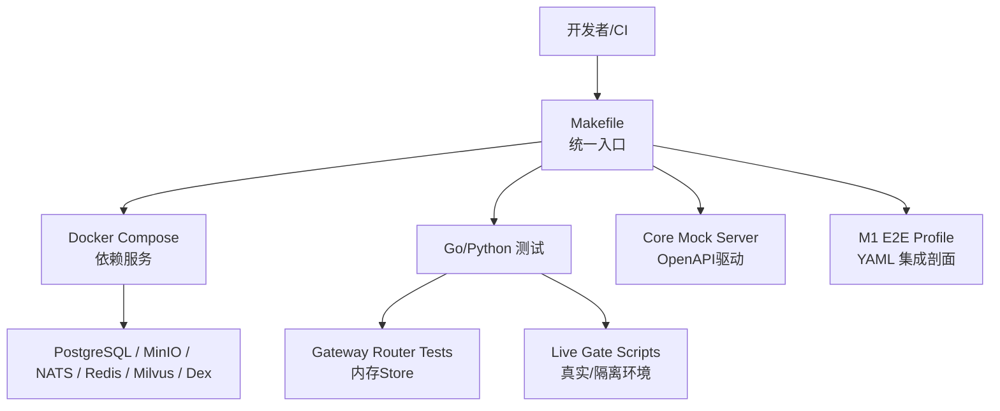
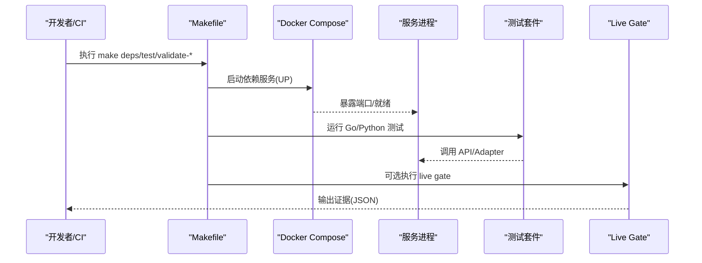
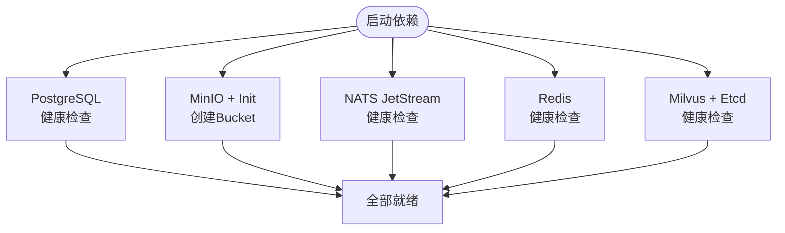
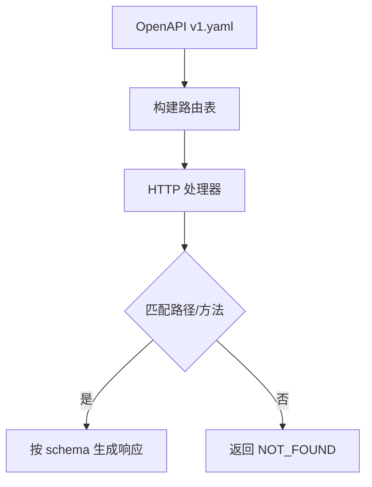
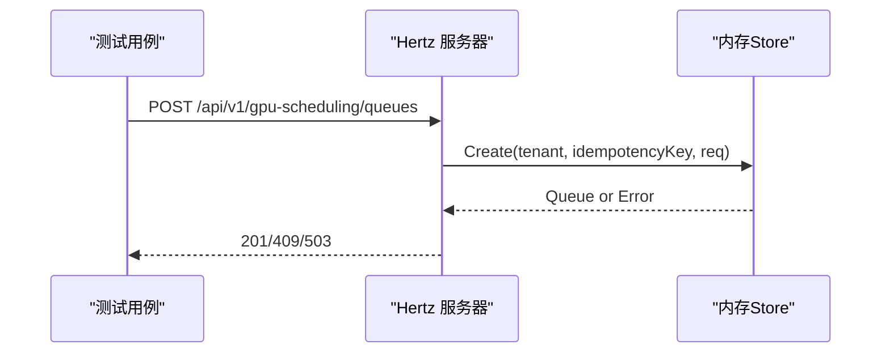
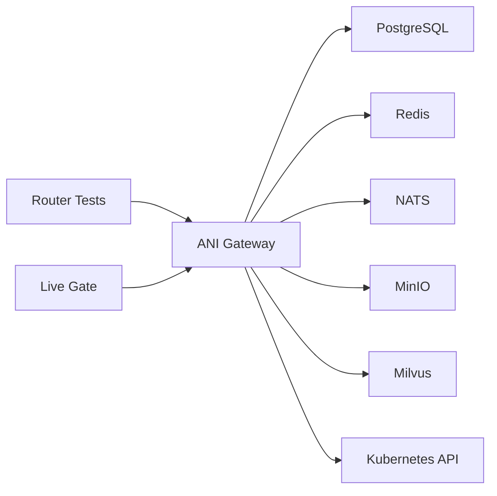

# 集成测试

<cite>
**本文引用的文件**
- [Makefile](file://repo/Makefile)
- [docker-compose.yml](file://repo/deploy/docker/docker-compose.yml)
- [main_test.go](file://repo/services/ani-gateway/main_test.go)
- [serve_core_mock.py](file://repo/scripts/serve_core_mock.py)
- [gpu_scheduling_resources_test.go](file://repo/services/ani-gateway/internal/router/gpu_scheduling_resources_test.go)
- [network_resources_test.go](file://repo/services/ani-gateway/internal/router/network_resources_test.go)
- [README.md](file://repo/deploy/manifests/m1-e2e/README.md)
- [00-instance-e2e-profile.yaml](file://repo/deploy/manifests/m1-e2e/00-instance-e2e-profile.yaml)
- [10-instance-e2e-guardrails.yaml](file://repo/deploy/manifests/m1-e2e/10-instance-e2e-guardrails.yaml)
- [validate_gpu_inventory_live_gate.py](file://repo/scripts/validate_gpu_inventory_live_gate.py)
- [sprint14-core-resilience-plan.md](file://repo/development-records/sprint14-core-resilience-plan.md)
</cite>

## 目录
1. [简介](#简介)
2. [项目结构](#项目结构)
3. [核心组件](#核心组件)
4. [架构总览](#架构总览)
5. [详细组件分析](#详细组件分析)
6. [依赖关系分析](#依赖关系分析)
7. [性能与基准测试](#性能与基准测试)
8. [故障排查指南](#故障排查指南)
9. [结论](#结论)
10. [附录](#附录)

## 简介
本文件面向微服务间的集成测试，覆盖以下目标：
- 服务依赖管理与测试环境搭建（Docker Compose、Kubernetes 测试集群）
- 外部依赖模拟方案（数据库、消息队列、对象存储等）
- 测试数据生命周期管理（数据清理与状态重置）
- 性能基准测试方法（负载与压力测试）
- 具体集成测试示例（认证流程、实例生命周期、网络资源管理等）

本仓库通过 Makefile 统一编排测试与门禁，结合 Docker Compose 提供本地依赖栈，并通过 YAML Profile 描述端到端集成剖面；同时提供 Core API Mock Server 以在无真实后端时验证前端与 SDK。

## 项目结构
- 构建与测试入口：根级 Makefile 集中定义依赖启动、代码生成、构建、测试与各类 validate-* 门禁。
- 本地依赖栈：deploy/docker/docker-compose.yml 提供 PostgreSQL、MinIO、NATS、Redis、Milvus、Dex 等容器化依赖。
- 端到端集成剖面：deploy/manifests/m1-e2e 下的 YAML 描述 M1 实例契约链的 create/lifecycle/query/visual ops 验证路径。
- 接口契约与 Mock：scripts/serve_core_mock.py 基于 OpenAPI 生成轻量 Mock Server，供前端与 SDK 在本地联调。
- Gateway 路由与中间件测试：services/ani-gateway/internal/router/*_test.go 使用内存 Store 进行 HTTP 层集成测试。
- Live Gate：scripts/validate_*_live_gate.py 用于在真实或隔离环境中执行端到端验证并输出证据。

图表来源
- [Makefile:167-186](file://repo/Makefile#L167-L186)
- [docker-compose.yml:1-184](file://repo/deploy/docker/docker-compose.yml#L1-L184)
- [serve_core_mock.py:1-80](file://repo/scripts/serve_core_mock.py#L1-L80)
- [README.md:1-25](file://repo/deploy/manifests/m1-e2e/README.md#L1-L25)

章节来源
- [Makefile:167-186](file://repo/Makefile#L167-L186)
- [docker-compose.yml:1-184](file://repo/deploy/docker/docker-compose.yml#L1-L184)

## 核心组件
- 依赖服务编排：通过 docker compose 启动 PG、MinIO、NATS、Redis、Milvus、Dex，并提供健康检查与初始化脚本。
- 测试运行器：make test 串联架构校验、契约校验与 Go/Python 测试；各 validate-* target 聚焦特定能力。
- 接口契约与 Mock：serve_core_mock.py 从 api/openapi/v1.yaml 解析路由与响应，提供无依赖的本地 API 模拟。
- 网关路由集成测试：router/*_test.go 使用内存 Store 构造 HTTP 请求，验证状态码、幂等键、错误分支。
- 端到端集成剖面：m1-e2e 的 YAML 定义实例契约链，支持离线/local 与生产 e2e 切换。
- Live Gate：validate_*_live_gate.py 在真实或隔离环境中执行端到端验证，输出结构化证据 JSON。

章节来源
- [Makefile:283-297](file://repo/Makefile#L283-L297)
- [serve_core_mock.py:46-87](file://repo/scripts/serve_core_mock.py#L46-L87)
- [gpu_scheduling_resources_test.go:19-166](file://repo/services/ani-gateway/internal/router/gpu_scheduling_resources_test.go#L19-L166)
- [README.md:1-25](file://repo/deploy/manifests/m1-e2e/README.md#L1-L25)

## 架构总览
下图展示集成测试在开发/CI 中的整体流程：开发者触发 make 命令，系统拉起依赖服务，运行单元/集成测试与契约校验，必要时执行 live gate 并在真实或隔离环境中产出证据。

图表来源
- [Makefile:167-186](file://repo/Makefile#L167-L186)
- [Makefile:283-297](file://repo/Makefile#L283-L297)
- [validate_gpu_inventory_live_gate.py:298-324](file://repo/scripts/validate_gpu_inventory_live_gate.py#L298-L324)

## 详细组件分析

### 依赖服务与测试环境搭建（Docker Compose）
- 服务清单：PostgreSQL（TimescaleDB）、MinIO（含 Console）、NATS JetStream、Redis、Milvus（Standalone）、Etcd、可选 Dex（OIDC）。
- 健康检查：每个服务配置 healthcheck，确保依赖就绪后再启动后续任务。
- 初始化：MinIO 启动后创建业务 Bucket，便于对象存储相关测试。
- 端口绑定：所有端口绑定 127.0.0.1，避免意外暴露。

图表来源
- [docker-compose.yml:16-163](file://repo/deploy/docker/docker-compose.yml#L16-L163)

章节来源
- [docker-compose.yml:16-163](file://repo/deploy/docker/docker-compose.yml#L16-L163)

### 外部依赖模拟方案（Mock Server）
- 原理：基于 OpenAPI 规范解析路径与方法，自动生成成功响应体，支持 listInstanceLogs/events/security-events 等场景化数据。
- 用途：为前端与 SDK 提供无依赖本地联调；也可作为契约一致性校验的基础。
- 扩展：可注入查询参数控制返回场景（如错误态、空数据态），便于 UI 异常分支验证。

图表来源
- [serve_core_mock.py:46-87](file://repo/scripts/serve_core_mock.py#L46-L87)
- [serve_core_mock.py:700-733](file://repo/scripts/serve_core_mock.py#L700-L733)

章节来源
- [serve_core_mock.py:46-87](file://repo/scripts/serve_core_mock.py#L46-L87)
- [serve_core_mock.py:700-733](file://repo/scripts/serve_core_mock.py#L700-L733)

### 网关路由集成测试（HTTP 层）
- 内存 Store：实现 ports 接口，提供 List/Get/Create/Delete 等能力，支持失败注入与幂等键回放。
- 测试策略：通过 Hertz 测试引擎发起 HTTP 请求，断言状态码、响应体字段与错误分支。
- 覆盖场景：创建队列、名称冲突、平台默认保护、删除权限、Store 不可用等。

图表来源
- [gpu_scheduling_resources_test.go:19-166](file://repo/services/ani-gateway/internal/router/gpu_scheduling_resources_test.go#L19-L166)
- [gpu_scheduling_resources_test.go:226-412](file://repo/services/ani-gateway/internal/router/gpu_scheduling_resources_test.go#L226-L412)

章节来源
- [gpu_scheduling_resources_test.go:226-412](file://repo/services/ani-gateway/internal/router/gpu_scheduling_resources_test.go#L226-L412)

### 端到端集成剖面（M1 E2E）
- 目标：验证 VM/Container/GPU Container 的 create/lifecycle/query/visual ops 全链路。
- 模式：默认离线/local 不依赖真实 K8s；生产 e2e 可替换为 KubernetesProviderAdapter。
- 执行：通过 make validate-m1-e2e 触发 Python 校验与 Go 测试。

章节来源
- [README.md:1-25](file://repo/deploy/manifests/m1-e2e/README.md#L1-L25)
- [Makefile:461-465](file://repo/Makefile#L461-L465)

### 认证流程集成测试（Dex OIDC）
- 环境：Docker Compose 提供 Dex（可选 profile），配合 auth-service 完成 OIDC 授权码流程。
- 门禁：make validate-auth-dex-smoke 用于校验 Docker Dex 的 OIDC auth-code flow。
- 建议：在 CI 中按需启用 auth profile，确保认证链路稳定。

章节来源
- [docker-compose.yml:165-175](file://repo/deploy/docker/docker-compose.yml#L165-L175)
- [Makefile:147-148](file://repo/Makefile#L147-L148)

### 实例生命周期集成测试
- 契约链：通过 m1-e2e profile 的 YAML 描述实例对象、计划、渲染、apply、状态同步等阶段。
- 执行：make validate-m1-e2e 触发 Python 校验与 Go 测试，覆盖 create/delete/query/ops。
- 扩展：可切换到 real provider 回归剖面（m1-e2e-b）验证真实后端行为。

章节来源
- [README.md:1-25](file://repo/deploy/manifests/m1-e2e/README.md#L1-L25)
- [Makefile:461-465](file://repo/Makefile#L461-L465)

### 网络资源管理集成测试
- 场景：VPC/Subnet/SecurityGroup/LB 的创建与查询，验证 dev profile 与租户隔离。
- 测试：network_resources_test.go 通过 service 接口创建资源并断言状态与 dev_profile。

章节来源
- [network_resources_test.go:11-44](file://repo/services/ani-gateway/internal/router/network_resources_test.go#L11-L44)

### 数据准备与生命周期管理
- 依赖数据：MinIO 初始化脚本创建业务 Bucket；PG 通过 init-scripts 初始化。
- 清理机制：make deps-clean 停止并移除卷，彻底清除本地数据（谨慎使用）。
- 建议：在测试前执行 deps-up，测试后执行 deps-down；如需重置，使用 deps-clean。

章节来源
- [docker-compose.yml:56-75](file://repo/deploy/docker/docker-compose.yml#L56-L75)
- [Makefile:184-186](file://repo/Makefile#L184-L186)

### 性能基准测试方法
- 现状：仓库未包含专用压测脚本；可通过以下方式实施：
  - 使用 k6/JMeter 对 Gateway API 进行负载测试，关注吞吐、延迟与错误率。
  - 针对适配器（MinIO/Milvus/K8s REST）进行超时与重试边界测试，参考 resilience 相关测试。
  - 利用 live gate 的隔离 namespace 执行真实后端 kill/degradation/failover 场景，评估恢复时间。
- 指标：P95/P99 延迟、错误率、资源利用率、断路器开合次数、failover 切换耗时。

[本节为通用指导，不直接分析具体文件]

## 依赖关系分析
- 服务耦合：Gateway 依赖 PG/Redis/NATS/MinIO/Milvus/K8s API；适配器封装外部依赖，ports 定义接口边界。
- 测试解耦：router/*_test.go 使用内存 Store 替代真实后端，保证快速稳定的单元测试与集成测试。
- 契约优先：OpenAPI/Protobuf 驱动代码生成与 SDK 生成，确保多语言客户端一致性。
- 门禁体系：Makefile 将架构校验、契约校验、live gate 串联为流水线，保障质量门控。

图表来源
- [docker-compose.yml:16-163](file://repo/deploy/docker/docker-compose.yml#L16-L163)
- [gpu_scheduling_resources_test.go:226-412](file://repo/services/ani-gateway/internal/router/gpu_scheduling_resources_test.go#L226-L412)
- [validate_gpu_inventory_live_gate.py:298-324](file://repo/scripts/validate_gpu_inventory_live_gate.py#L298-L324)

章节来源
- [docker-compose.yml:16-163](file://repo/deploy/docker/docker-compose.yml#L16-L163)
- [gpu_scheduling_resources_test.go:226-412](file://repo/services/ani-gateway/internal/router/gpu_scheduling_resources_test.go#L226-L412)

## 性能与基准测试
- 建议实践：
  - 在隔离命名空间部署 Gateway 与依赖，使用 k6/JMeter 发送并发请求，采集 Prometheus 指标。
  - 针对适配器超时与重试，参考 resilience 测试用例设计边界场景（瞬时失败、持续失败、断路开合）。
  - 使用 live gate 的真实后端 kill 场景，验证 readyz/degradation/recovery 语义与恢复时间。
- 关键指标：
  - 吞吐（RPS）、延迟分位（P95/P99）、错误率、资源使用（CPU/Mem）、断路器状态、failover 切换耗时。

[本节为通用指导，不直接分析具体文件]

## 故障排查指南
- 依赖未就绪：检查 docker compose 健康检查与日志，确认 PG/MinIO/NATS/Redis/Milvus/Dex 已就绪。
- 认证失败：确认 Dex profile 已启用，环境变量与回调地址正确；执行 validate-auth-dex-smoke。
- 网络资源测试失败：检查租户 ID、幂等键、平台默认保护逻辑；查看 router 测试的状态码断言。
- Live Gate 失败：核对目标环境（真实/隔离）配置，检查证据 JSON 中的 status 与缺失项。

章节来源
- [docker-compose.yml:30-163](file://repo/deploy/docker/docker-compose.yml#L30-L163)
- [Makefile:147-148](file://repo/Makefile#L147-L148)
- [gpu_scheduling_resources_test.go:226-412](file://repo/services/ani-gateway/internal/router/gpu_scheduling_resources_test.go#L226-L412)
- [validate_gpu_inventory_live_gate.py:298-324](file://repo/scripts/validate_gpu_inventory_live_gate.py#L298-L324)

## 结论
本项目提供了完善的集成测试基础设施：通过 Makefile 统一入口、Docker Compose 本地依赖栈、OpenAPI 驱动的 Mock Server、YAML 描述的端到端集成剖面以及丰富的 live gate 脚本。建议在 CI 中分层执行：
- 快速层：单元测试与 router 集成测试（内存 Store）
- 契约层：OpenAPI/Protobuf 校验与 SDK 生成校验
- 慢速层：live gate 在隔离/真实环境执行，产出证据
- 性能层：基于 k6/JMeter 的负载与压力测试，结合 Prometheus 指标分析

## 附录
- 常用命令
  - 启动依赖：make deps
  - 停止依赖：make deps-down
  - 清理数据：make deps-clean
  - 运行测试：make test
  - 生成覆盖率：make test-cover
  - 执行 E2E：make validate-m1-e2e
  - 认证门禁：make validate-auth-dex-smoke

章节来源
- [Makefile:167-186](file://repo/Makefile#L167-L186)
- [Makefile:283-297](file://repo/Makefile#L283-L297)
- [Makefile:461-465](file://repo/Makefile#L461-L465)
- [Makefile:147-148](file://repo/Makefile#L147-L148)