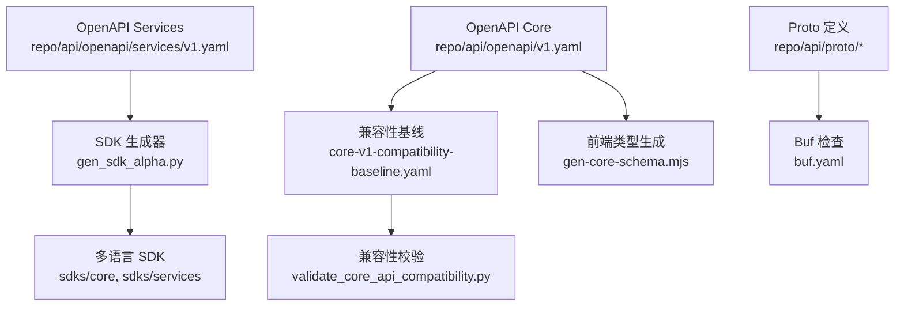
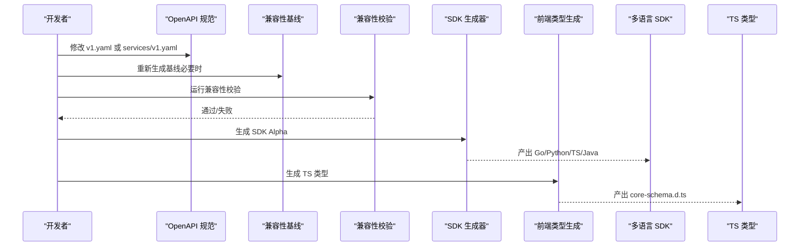
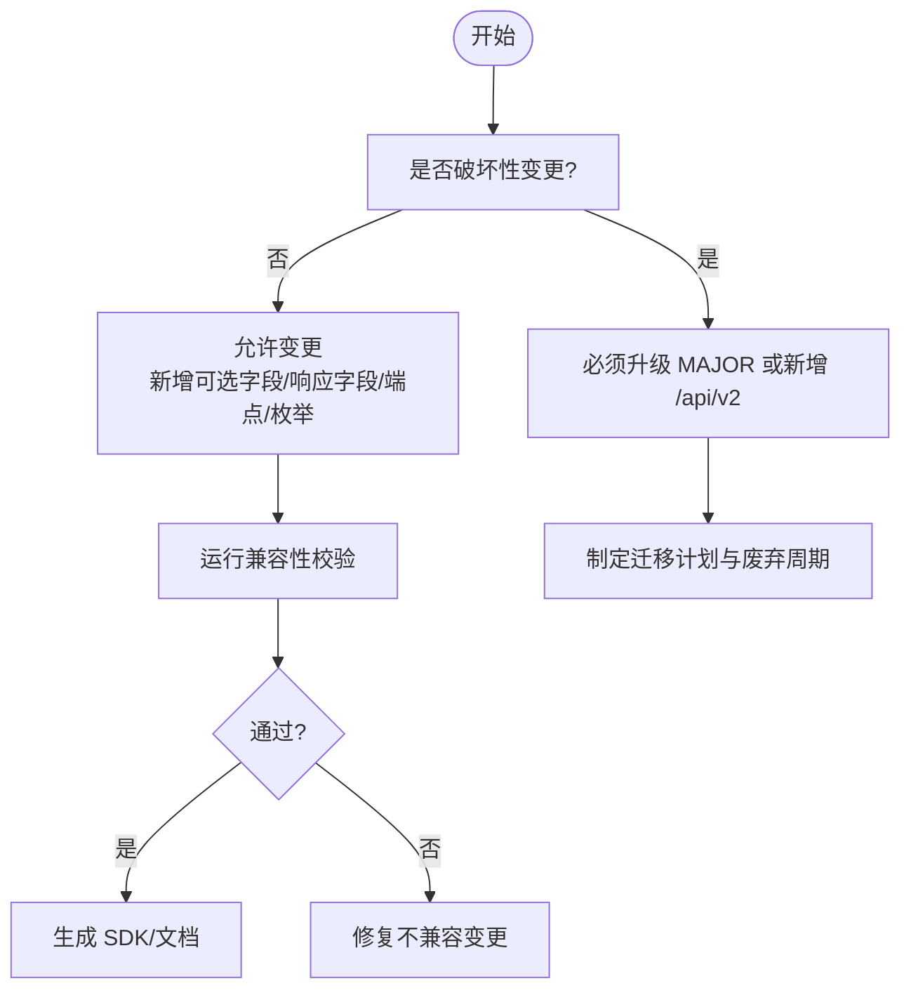
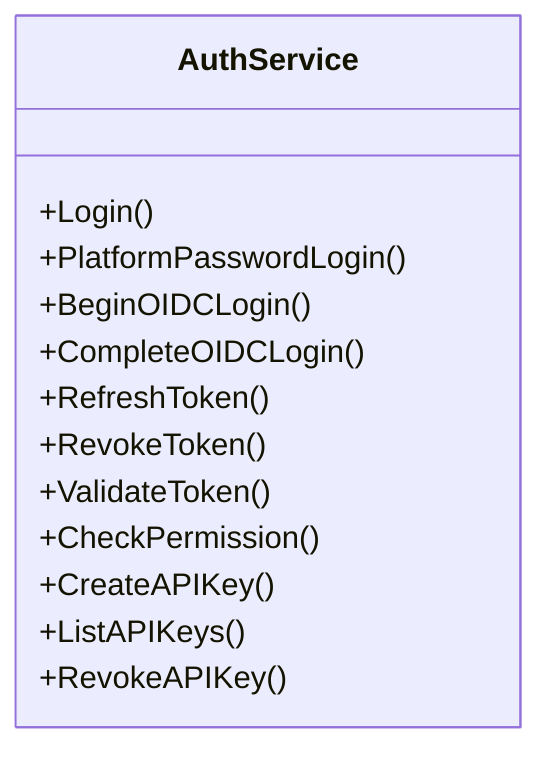
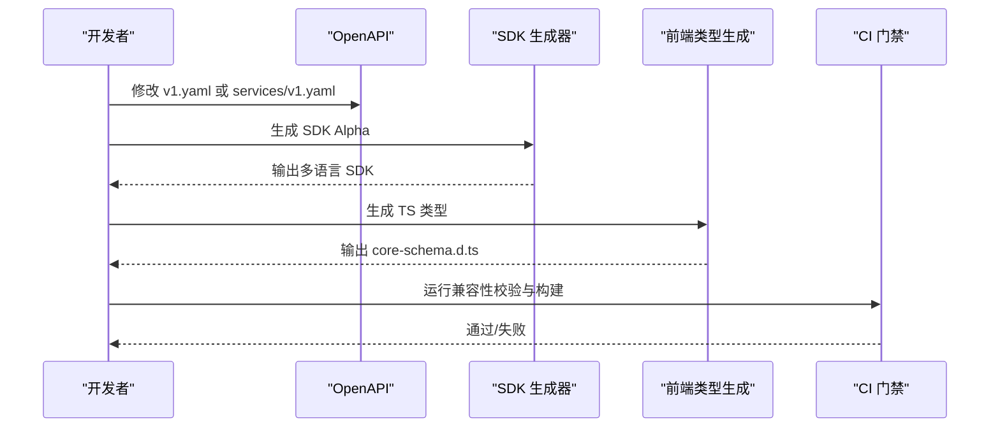
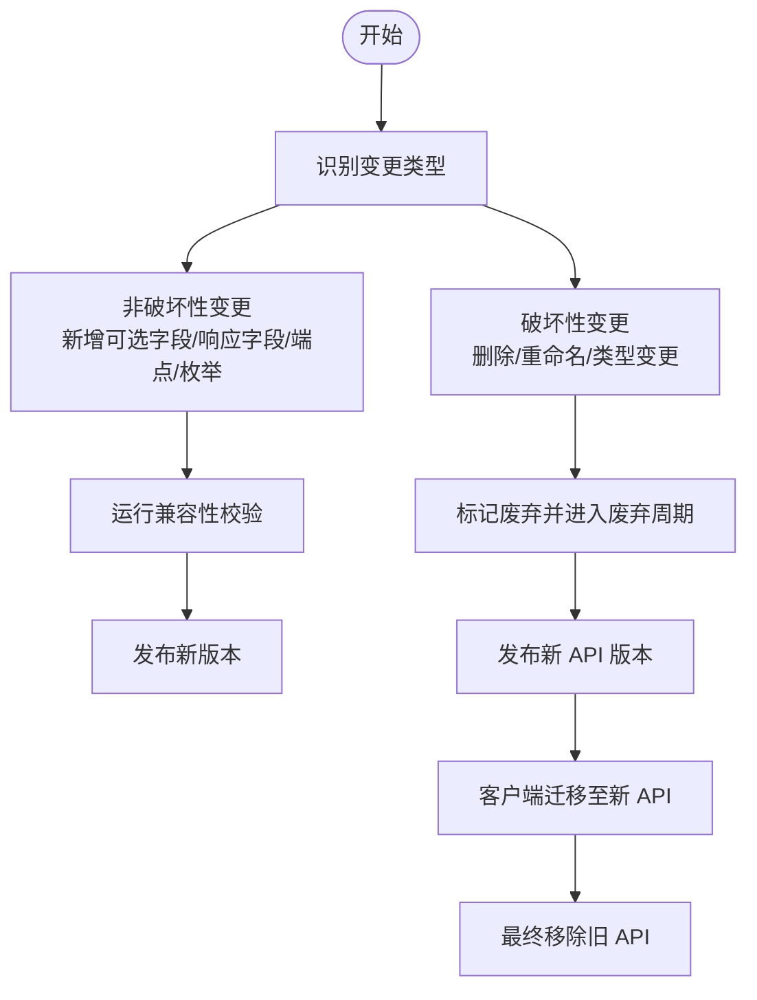
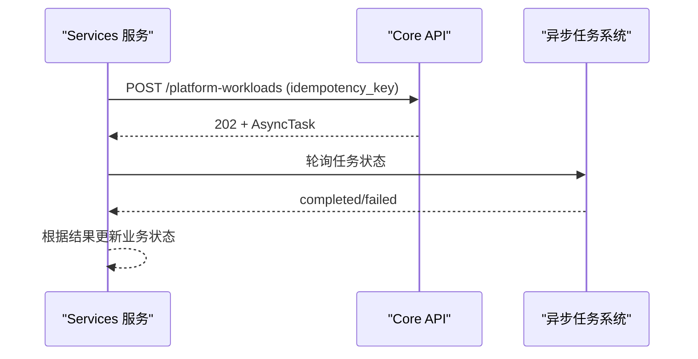
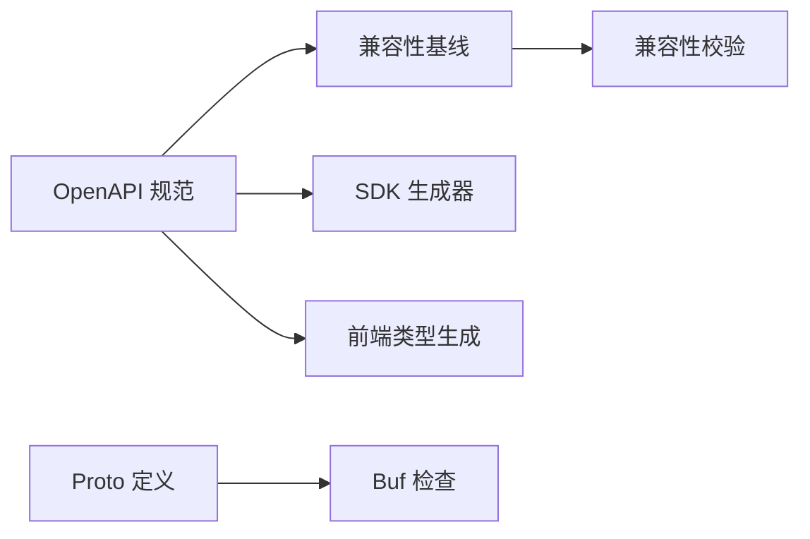

# API 版本管理

<cite>
**本文引用的文件**
- [repo/api/openapi/v1.yaml](file://repo/api/openapi/v1.yaml)
- [repo/api/openapi/services/v1.yaml](file://repo/api/openapi/services/v1.yaml)
- [repo/api/core-v1-compatibility-baseline.yaml](file://repo/api/core-v1-compatibility-baseline.yaml)
- [repo/api/core-alpha-freeze.yaml](file://repo/api/core-alpha-freeze.yaml)
- [repo/api/core-beta-readiness.yaml](file://repo/api/core-beta-readiness.yaml)
- [repo/api/proto/buf.yaml](file://repo/api/proto/buf.yaml)
- [repo/api/proto/auth/v1/auth_service.proto](file://repo/api/proto/auth/v1/auth_service.proto)
- [ANI-12-版本管理策略.md](file://ANI-12-版本管理策略.md)
- [ANI-14-API对齐与开发工作流.md](file://ANI-14-API对齐与开发工作流.md)
- [repo/scripts/validate_core_api_compatibility.py](file://repo/scripts/validate_core_api_compatibility.py)
- [repo/scripts/generate_core_api_compatibility_baseline.py](file://repo/scripts/generate_core_api_compatibility_baseline.py)
- [repo/scripts/gen_sdk_alpha.py](file://repo/scripts/gen_sdk_alpha.py)
- [repo/frontends/boss/scripts/gen-core-schema.mjs](file://repo/frontends/boss/scripts/gen-core-schema.mjs)
- [repo/development-records/sprint14-core-resilience-plan.md](file://repo/development-records/sprint14-core-resilience-plan.md)
- [repo/development-records/inference-platform-workload-contract-a.md](file://repo/development-records/inference-platform-workload-contract-a.md)
</cite>

## 目录
1. [简介](#简介)
2. [项目结构](#项目结构)
3. [核心组件](#核心组件)
4. [架构总览](#架构总览)
5. [详细组件分析](#详细组件分析)
6. [依赖关系分析](#依赖关系分析)
7. [性能与兼容性考量](#性能与兼容性考量)
8. [故障排查指南](#故障排查指南)
9. [结论](#结论)
10. [附录](#附录)

## 简介
本文件面向 ANI 平台的 API 版本治理，覆盖 OpenAPI 契约维护、gRPC 内部契约管理、SDK 多语言同步、兼容性保证机制（字段废弃周期、破坏性变更处理）、以及版本检测、降级与错误处理的最佳实践。目标是让产品团队、服务团队、前端与第三方调用方在 v1 稳定期前后都能以可预期、可回滚、可审计的方式演进 API。

## 项目结构
仓库将对外契约与内部实现契约分层管理：
- 对外 REST 契约：Core 与 Services 两个 OpenAPI 规范，分别位于 api/openapi/v1.yaml 与 api/openapi/services/v1.yaml。
- 内部 gRPC 契约：proto 目录按领域划分，使用 Buf 进行 lint 与 breaking 检查。
- 兼容性基线与门禁：通过脚本生成并校验兼容基线，确保 v1 的向后兼容。
- SDK 与前端类型：基于 OpenAPI 自动生成多语言 SDK Alpha 与前端 TypeScript 类型。

图表来源
- [repo/api/openapi/v1.yaml:1-40](file://repo/api/openapi/v1.yaml#L1-L40)
- [repo/api/openapi/services/v1.yaml:1-20](file://repo/api/openapi/services/v1.yaml#L1-L20)
- [repo/api/core-v1-compatibility-baseline.yaml:1-18](file://repo/api/core-v1-compatibility-baseline.yaml#L1-L18)
- [repo/api/proto/buf.yaml:1-11](file://repo/api/proto/buf.yaml#L1-L11)
- [repo/scripts/validate_core_api_compatibility.py:1-30](file://repo/scripts/validate_core_api_compatibility.py#L1-L30)
- [repo/scripts/gen_sdk_alpha.py:15-30](file://repo/scripts/gen_sdk_alpha.py#L15-L30)
- [repo/frontends/boss/scripts/gen-core-schema.mjs:1-32](file://repo/frontends/boss/scripts/gen-core-schema.mjs#L1-L32)

章节来源
- [repo/api/openapi/v1.yaml:1-40](file://repo/api/openapi/v1.yaml#L1-L40)
- [repo/api/openapi/services/v1.yaml:1-20](file://repo/api/openapi/services/v1.yaml#L1-L20)
- [repo/api/core-v1-compatibility-baseline.yaml:1-18](file://repo/api/core-v1-compatibility-baseline.yaml#L1-L18)
- [repo/api/proto/buf.yaml:1-11](file://repo/api/proto/buf.yaml#L1-L11)
- [ANI-12-版本管理策略.md:29-93](file://ANI-12-版本管理策略.md#L29-L93)
- [ANI-14-API对齐与开发工作流.md:62-103](file://ANI-14-API对齐与开发工作流.md#L62-L103)

## 核心组件
- OpenAPI 契约维护
  - Core 对外控制面：REST 路径统一前缀 /api/v1，版本升级新建 v2.yaml，v1.yaml 路径保持稳定。
  - Services 业务契约：REST 路径统一前缀 /api/v1/svc，由 Services 团队维护，不得回流 Core。
- 兼容性基线与门禁
  - 基线文件 core-v1-compatibility-baseline.yaml 锁定 operationId、参数、请求/响应 schema、RBAC scope。
  - 校验脚本 validate_core_api_compatibility.py 禁止删除路径/方法、修改 operationId、移除必需字段、改变字段签名等。
  - 允许的非破坏性变更包括：新增可选请求字段、新增响应字段、新增端点、新增枚举值。
- gRPC 内部契约
  - 使用 Buf 进行 STANDARD lint 与 FILE 级别 breaking 检查；包名带 v1 后缀，避免 PACKAGE_VERSION_SUFFIX 告警。
  - 内部 gRPC 仅用于 Core 内部通信或 Gateway 内部转发，不得替代 OpenAPI 成为外部产品契约。
- SDK 与前端类型
  - gen_sdk_alpha.py 从两个 OpenAPI 生成 Go/Python/TypeScript/Java SDK Alpha，内置幂等键、分页、错误码辅助。
  - 前端通过 gen-core-schema.mjs 将 Core OpenAPI 转为 TypeScript 类型，供 Console/BOSS 消费。

章节来源
- [repo/api/openapi/v1.yaml:1-40](file://repo/api/openapi/v1.yaml#L1-L40)
- [repo/api/openapi/services/v1.yaml:1-20](file://repo/api/openapi/services/v1.yaml#L1-L20)
- [repo/api/core-v1-compatibility-baseline.yaml:1-18](file://repo/api/core-v1-compatibility-baseline.yaml#L1-L18)
- [repo/scripts/validate_core_api_compatibility.py:70-105](file://repo/scripts/validate_core_api_compatibility.py#L70-L105)
- [repo/scripts/generate_core_api_compatibility_baseline.py:94-135](file://repo/scripts/generate_core_api_compatibility_baseline.py#L94-L135)
- [repo/api/proto/buf.yaml:1-11](file://repo/api/proto/buf.yaml#L1-L11)
- [repo/scripts/gen_sdk_alpha.py:15-30](file://repo/scripts/gen_sdk_alpha.py#L15-L30)
- [repo/frontends/boss/scripts/gen-core-schema.mjs:1-32](file://repo/frontends/boss/scripts/gen-core-schema.mjs#L1-L32)

## 架构总览
下图展示从 OpenAPI 到 SDK/前端类型的生成链路，以及兼容性基线的校验闭环。

图表来源
- [repo/api/openapi/v1.yaml:1-40](file://repo/api/openapi/v1.yaml#L1-L40)
- [repo/api/openapi/services/v1.yaml:1-20](file://repo/api/openapi/services/v1.yaml#L1-L20)
- [repo/scripts/generate_core_api_compatibility_baseline.py:94-135](file://repo/scripts/generate_core_api_compatibility_baseline.py#L94-L135)
- [repo/scripts/validate_core_api_compatibility.py:70-105](file://repo/scripts/validate_core_api_compatibility.py#L70-L105)
- [repo/scripts/gen_sdk_alpha.py:15-30](file://repo/scripts/gen_sdk_alpha.py#L15-L30)
- [repo/frontends/boss/scripts/gen-core-schema.mjs:1-32](file://repo/frontends/boss/scripts/gen-core-schema.mjs#L1-L32)

## 详细组件分析

### OpenAPI 契约与版本策略
- 版本定位
  - Core 对外控制面：/api/v1，版本升级新建 v2.yaml，保持 v1.yaml 路径稳定。
  - Services 业务契约：/api/v1/svc，由 Services 团队维护，不得回流 Core。
- 兼容性规则
  - 允许：新增可选请求字段、新增响应字段、新增端点、新增枚举值。
  - 禁止：删除路径/方法、修改 operationId、移除已有参数、移除必需请求字段、移除响应字段、改变字段签名。
- 冻结与就绪矩阵
  - alpha_freeze：限定 P0 路径与 schema，要求幂等键，明确成熟度与错误响应。
  - beta_readiness：列出 P0 资源、操作路径、guardrails（如 server_url_core_v1、rbac_scope_on_p0_paths、cursor_pagination_on_list_paths、standard_error_responses）。

图表来源
- [repo/api/core-v1-compatibility-baseline.yaml:1-18](file://repo/api/core-v1-compatibility-baseline.yaml#L1-L18)
- [repo/api/core-alpha-freeze.yaml:1-26](file://repo/api/core-alpha-freeze.yaml#L1-L26)
- [repo/api/core-beta-readiness.yaml:45-67](file://repo/api/core-beta-readiness.yaml#L45-L67)
- [ANI-12-版本管理策略.md:73-93](file://ANI-12-版本管理策略.md#L73-L93)

章节来源
- [repo/api/openapi/v1.yaml:1-40](file://repo/api/openapi/v1.yaml#L1-L40)
- [repo/api/openapi/services/v1.yaml:1-20](file://repo/api/openapi/services/v1.yaml#L1-L20)
- [repo/api/core-v1-compatibility-baseline.yaml:1-18](file://repo/api/core-v1-compatibility-baseline.yaml#L1-L18)
- [repo/api/core-alpha-freeze.yaml:1-26](file://repo/api/core-alpha-freeze.yaml#L1-L26)
- [repo/api/core-beta-readiness.yaml:45-67](file://repo/api/core-beta-readiness.yaml#L45-L67)
- [ANI-12-版本管理策略.md:73-93](file://ANI-12-版本管理策略.md#L73-L93)

### gRPC 内部契约管理
- 包与版本
  - proto 目录按领域划分，包名带 v1 后缀；Buf 启用 STANDARD lint 与 FILE 级别 breaking 检查。
- 契约边界
  - 内部 gRPC 仅用于 Core 内部通信或 Gateway 内部转发；不得替代 OpenAPI 成为 Services 绕过 Core 的产品契约。
- 示例服务
  - auth.v1.AuthService 提供登录、OIDC、令牌刷新、权限校验、API Key 管理等 RPC；ValidateToken 与 CheckPermission 被 Gateway 中间件内部调用。

图表来源
- [repo/api/proto/auth/v1/auth_service.proto:11-30](file://repo/api/proto/auth/v1/auth_service.proto#L11-L30)
- [repo/api/proto/buf.yaml:1-11](file://repo/api/proto/buf.yaml#L1-L11)

章节来源
- [repo/api/proto/auth/v1/auth_service.proto:11-30](file://repo/api/proto/auth/v1/auth_service.proto#L11-L30)
- [repo/api/proto/buf.yaml:1-11](file://repo/api/proto/buf.yaml#L1-L11)
- [ANI-12-版本管理策略.md:86-93](file://ANI-12-版本管理策略.md#L86-L93)

### SDK 版本同步策略
- 生成来源
  - gen_sdk_alpha.py 读取 Core 与 Services 的 OpenAPI 规范，生成 Go/Python/TypeScript/Java SDK Alpha。
  - 内置幂等键注入、游标分页、标准错误码辅助函数，确保客户端行为一致。
- 前端类型
  - frontends/boss 通过 gen-core-schema.mjs 将 Core OpenAPI 转换为 TypeScript 类型，供 BOSS/Console 消费。
- 同步原则
  - 任何 OpenAPI 变更需先通过兼容性校验，再触发 SDK 与前端类型生成，避免漂移。
  - 若引入破坏性变更，应遵循 SemVer 升级策略，并提供迁移指南。

图表来源
- [repo/scripts/gen_sdk_alpha.py:15-30](file://repo/scripts/gen_sdk_alpha.py#L15-L30)
- [repo/frontends/boss/scripts/gen-core-schema.mjs:1-32](file://repo/frontends/boss/scripts/gen-core-schema.mjs#L1-L32)
- [repo/scripts/validate_core_api_compatibility.py:70-105](file://repo/scripts/validate_core_api_compatibility.py#L70-L105)

章节来源
- [repo/scripts/gen_sdk_alpha.py:15-30](file://repo/scripts/gen_sdk_alpha.py#L15-L30)
- [repo/frontends/boss/scripts/gen-core-schema.mjs:1-32](file://repo/frontends/boss/scripts/gen-core-schema.mjs#L1-L32)
- [ANI-12-版本管理策略.md:73-93](file://ANI-12-版本管理策略.md#L73-L93)

### API 迁移指南
- 破坏性变更处理
  - 删除字段必须至少经历一个 MINOR 版本的 deprecated 周期。
  - 破坏性 API 变更必须升级 MAJOR，或新增 /api/v2 并保留 /api/v1。
- 平滑迁移方案
  - 新增可选字段与响应字段为非破坏性变更，可直接发布。
  - 对已废弃字段，服务端继续兼容返回，客户端逐步弃用旧字段。
  - 对于枚举扩展，新增枚举值需保证客户端可安全忽略未知值。
- 运行期可见语义变化
  - Sprint14 未修改 OpenAPI，但增强了 Gateway 限流、幂等重放与 /readyz 降级语义；客户端应按既有 ErrorResponse 处理新增错误码。

图表来源
- [repo/api/core-v1-compatibility-baseline.yaml:1-18](file://repo/api/core-v1-compatibility-baseline.yaml#L1-L18)
- [ANI-12-版本管理策略.md:73-93](file://ANI-12-版本管理策略.md#L73-L93)
- [repo/development-records/sprint14-core-resilience-plan.md:77-160](file://repo/development-records/sprint14-core-resilience-plan.md#L77-L160)

章节来源
- [ANI-12-版本管理策略.md:73-93](file://ANI-12-版本管理策略.md#L73-L93)
- [repo/development-records/sprint14-core-resilience-plan.md:77-160](file://repo/development-records/sprint14-core-resilience-plan.md#L77-L160)

### 平台工作负载契约（内部服务专用）
- 适用范围
  - PlatformWorkload* 为 Services 层创建 Core 托管工作负载的 provider-neutral 契约，避免 Services 直接操作 Kubernetes。
- 约束要点
  - 所有 mutation 使用 202 + AsyncTask；创建、PATCH、lifecycle 使用 body idempotency_key，DELETE 使用 Idempotency-Key header。
  - 认证限制：只接受 Bearer service JWT，要求 aud=ani-core、principal_kind=service、tenant_id 与相应 platform-workloads scope。
  - exposure 标记 internal，部署层不得通过租户或公网 Ingress 发布。

图表来源
- [repo/development-records/inference-platform-workload-contract-a.md:11-21](file://repo/development-records/inference-platform-workload-contract-a.md#L11-L21)

章节来源
- [repo/development-records/inference-platform-workload-contract-a.md:11-21](file://repo/development-records/inference-platform-workload-contract-a.md#L11-L21)

## 依赖关系分析
- 组件耦合
  - OpenAPI 规范是 SDK 生成与前端类型生成的唯一真实来源。
  - 兼容性基线由 OpenAPI 生成，并被校验脚本消费，形成“规范→基线→校验”的闭环。
  - gRPC 契约独立于 OpenAPI，仅用于内部通信，避免与服务契约混淆。
- 外部依赖
  - Buf 用于 Proto lint 与 breaking 检查。
  - 前端工具 openapi-typescript 用于生成 TypeScript 类型。

图表来源
- [repo/api/openapi/v1.yaml:1-40](file://repo/api/openapi/v1.yaml#L1-L40)
- [repo/api/openapi/services/v1.yaml:1-20](file://repo/api/openapi/services/v1.yaml#L1-L20)
- [repo/api/core-v1-compatibility-baseline.yaml:1-18](file://repo/api/core-v1-compatibility-baseline.yaml#L1-L18)
- [repo/api/proto/buf.yaml:1-11](file://repo/api/proto/buf.yaml#L1-L11)
- [repo/scripts/gen_sdk_alpha.py:15-30](file://repo/scripts/gen_sdk_alpha.py#L15-L30)
- [repo/frontends/boss/scripts/gen-core-schema.mjs:1-32](file://repo/frontends/boss/scripts/gen-core-schema.mjs#L1-L32)

章节来源
- [repo/api/openapi/v1.yaml:1-40](file://repo/api/openapi/v1.yaml#L1-L40)
- [repo/api/openapi/services/v1.yaml:1-20](file://repo/api/openapi/services/v1.yaml#L1-L20)
- [repo/api/core-v1-compatibility-baseline.yaml:1-18](file://repo/api/core-v1-compatibility-baseline.yaml#L1-L18)
- [repo/api/proto/buf.yaml:1-11](file://repo/api/proto/buf.yaml#L1-L11)
- [repo/scripts/gen_sdk_alpha.py:15-30](file://repo/scripts/gen_sdk_alpha.py#L15-L30)
- [repo/frontends/boss/scripts/gen-core-schema.mjs:1-32](file://repo/frontends/boss/scripts/gen-core-schema.mjs#L1-L32)

## 性能与兼容性考量
- 兼容性优先
  - 所有变更需通过兼容性校验，禁止破坏已发布字段、枚举值、HTTP 状态语义和错误码语义。
  - 删除字段需经历废弃周期，破坏性变更需升级 MAJOR 或新增 /api/v2。
- 运行期增强
  - Gateway 限流返回 429，客户端应退避重试。
  - Gateway 幂等重放返回 Idempotent-Replay header，重复请求不再进入 handler。
  - /readyz 支持 strong/weak dependency 降级，弱依赖失败返回 degraded 而非 fail。

章节来源
- [repo/scripts/validate_core_api_compatibility.py:70-105](file://repo/scripts/validate_core_api_compatibility.py#L70-L105)
- [repo/development-records/sprint14-core-resilience-plan.md:77-160](file://repo/development-records/sprint14-core-resilience-plan.md#L77-L160)

## 故障排查指南
- 兼容性校验失败
  - 检查是否删除了受保护的路径或方法、修改了 operationId、移除了必需参数或字段、改变了字段签名。
  - 参考兼容性基线中的 allowed/forbidden 规则，调整变更范围。
- SDK 与契约漂移
  - 重新运行 SDK 生成器，确保多语言 SDK 与 OpenAPI 一致。
  - 检查前端类型生成是否成功，确认 core-schema.d.ts 已更新。
- 运行期错误处理
  - 429 RATE_LIMIT_EXCEEDED：客户端应退避重试。
  - 409 IDEMPOTENCY_IN_PROGRESS：等待后重试同一 idempotency_key。
  - /readyz degraded：区分 degraded 与 ok/fail，运维 UI 应展示健康详情。

章节来源
- [repo/scripts/validate_core_api_compatibility.py:70-105](file://repo/scripts/validate_core_api_compatibility.py#L70-L105)
- [repo/development-records/sprint14-core-resilience-plan.md:77-160](file://repo/development-records/sprint14-core-resilience-plan.md#L77-L160)

## 结论
本项目通过 OpenAPI 与 gRPC 分层契约、兼容性基线与门禁、SDK 与前端类型自动化生成，构建了完整的 API 版本治理体系。建议在后续迭代中持续遵循 SemVer 与兼容性规则，结合运行期增强（限流、幂等、降级），确保 v1 稳定期的平滑演进与多语言客户端的一致性。

## 附录
- 版本策略参考：SemVer 2.0、首个正式版本 v1.0.0、预发布标识。
- 工作流参考：Phase 0-4 的 API 对齐与功能开发流程，确保 YAML 与 HTML 一致性。
- 契约影响说明：Sprint14 未修改 OpenAPI，但增强了运行期语义，客户端应按既有 ErrorResponse 处理新增错误码。

章节来源
- [ANI-12-版本管理策略.md:29-93](file://ANI-12-版本管理策略.md#L29-L93)
- [ANI-14-API对齐与开发工作流.md:13-103](file://ANI-14-API对齐与开发工作流.md#L13-L103)
- [repo/development-records/sprint14-core-resilience-plan.md:77-160](file://repo/development-records/sprint14-core-resilience-plan.md#L77-L160)