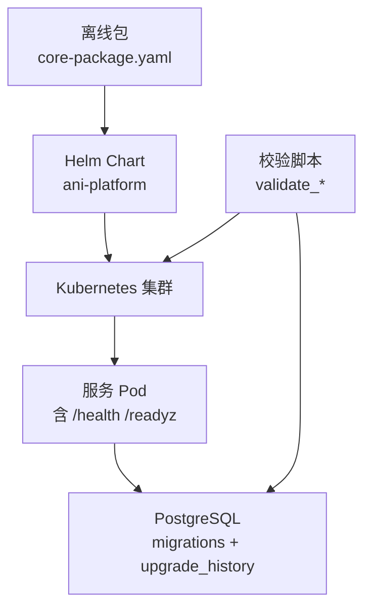
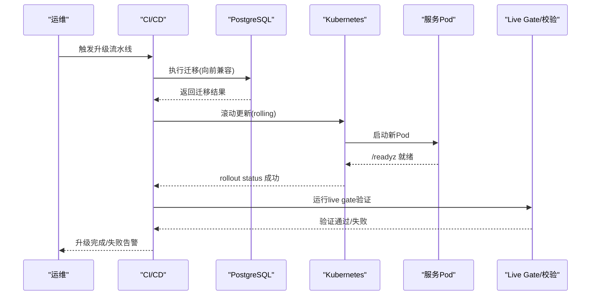
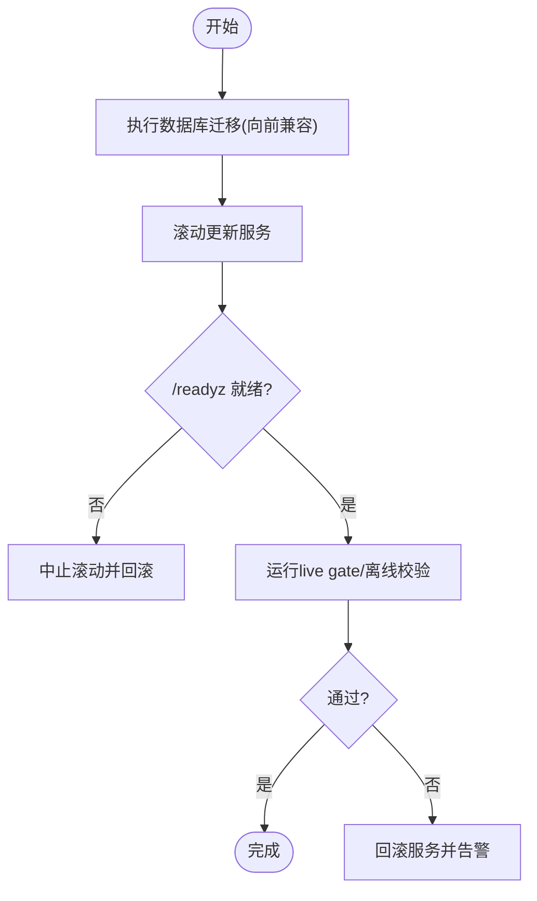
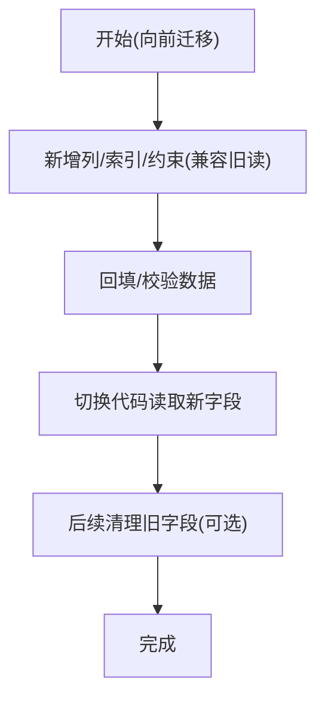
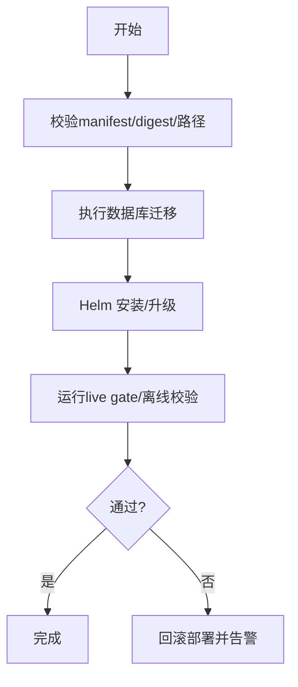
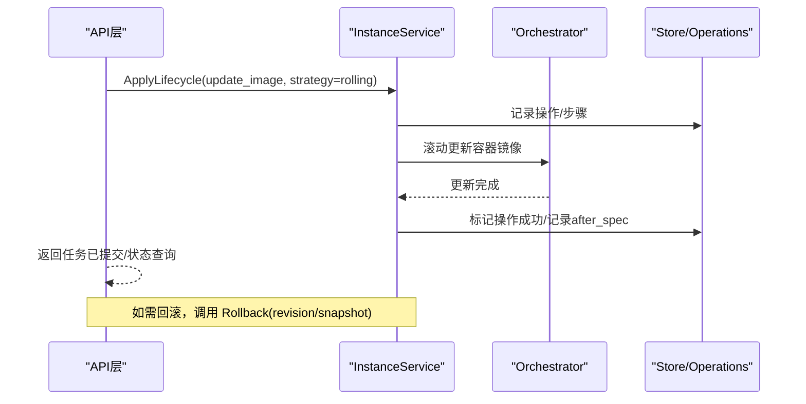
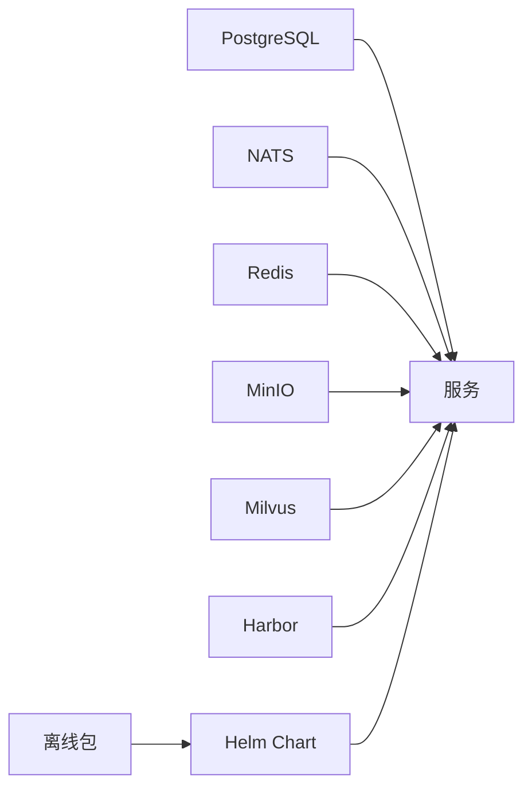

# 升级与回滚

<cite>
**本文引用的文件**
- [20260501_001_init_schema.sql](file://repo/deploy/migrations/20260501_001_init_schema.sql)
- [20260730_001_instance_management_lifecycle_ops.sql](file://repo/deploy/migrations/20260730_001_instance_management_lifecycle_ops.sql)
- [core-package.yaml](file://repo/deploy/offline/core-package.yaml)
- [Chart.yaml](file://repo/deploy/helm/ani-platform/Chart.yaml)
- [instance_service.go](file://repo/pkg/adapters/runtime/instance_service.go)
- [validate_storage_control_plane_state_live_gate.py](file://repo/scripts/validate_storage_control_plane_state_live_gate.py)
- [validate_core_offline.py](file://repo/scripts/validate_core_offline.py)
- [main.py](file://repo/services/kb-service/main.py)
- [schema.d.ts（控制台）](file://repo/frontends/console/src/api/schema.d.ts)
- [schema.d.ts（Boss）](file://repo/frontends/boss/src/api/schema.d.ts)
</cite>

## 目录
1. [简介](#简介)
2. [项目结构](#项目结构)
3. [核心组件](#核心组件)
4. [架构总览](#架构总览)
5. [详细组件分析](#详细组件分析)
6. [依赖关系分析](#依赖关系分析)
7. [性能考量](#性能考量)
8. [故障排查指南](#故障排查指南)
9. [结论](#结论)
10. [附录](#附录)

## 简介
本文件面向生产环境的平滑升级与回滚策略，覆盖滚动更新、蓝绿部署、灰度发布等升级方式；数据库迁移的向前/向后兼容策略；离线升级包 .anipatch 的管理（签名校验、依赖检查、安装流程）；紧急回滚方案（数据、配置、服务）；以及回滚演练与失败恢复预案。内容基于仓库中现有实现与门禁脚本进行归纳，确保可落地执行。

## 项目结构
与升级回滚直接相关的工程要素包括：
- 数据库迁移：集中存放于 deploy/migrations，包含初始建库与增量变更，并维护升级历史表。
- Helm Chart：deploy/helm/ani-platform 提供平台级应用编排与依赖声明。
- 离线包：deploy/offline/core-package.yaml 定义镜像清单、Helm 路径、校验脚本与边界信息。
- 运行时能力：实例生命周期与回滚逻辑在 pkg/adapters/runtime/instance_service.go 中实现。
- 健康探针：服务就绪性通过 /readyz 暴露，便于滚动/蓝绿切换时判断 Pod 是否就绪。
- 验证与门禁：scripts 下提供多种 live gate 与离线包校验脚本，用于升级前后一致性保障。

图表来源
- [Chart.yaml:1-16](file://repo/deploy/helm/ani-platform/Chart.yaml#L1-L16)
- [core-package.yaml:1-22](file://repo/deploy/offline/core-package.yaml#L1-L22)
- [20260501_001_init_schema.sql:476-489](file://repo/deploy/migrations/20260501_001_init_schema.sql#L476-L489)
- [main.py:213-232](file://repo/services/kb-service/main.py#L213-L232)

章节来源
- [Chart.yaml:1-16](file://repo/deploy/helm/ani-platform/Chart.yaml#L1-L16)
- [core-package.yaml:1-22](file://repo/deploy/offline/core-package.yaml#L1-L22)
- [20260501_001_init_schema.sql:476-489](file://repo/deploy/migrations/20260501_001_init_schema.sql#L476-L489)
- [main.py:213-232](file://repo/services/kb-service/main.py#L213-L232)

## 核心组件
- 数据库迁移与升级历史
  - 初始 schema 与 RLS 策略、审计与计量表、升级历史表等均在初始化迁移中定义。
  - 增量迁移以时间戳命名，按序执行；升级过程记录到 upgrade_history。
- 工作负载升级与回滚
  - 容器/GPU 容器支持 update_image 动作，当前仅允许 rolling 策略。
  - 支持按 revision 回滚或按快照回滚 VM，回滚操作会写入操作历史与步骤。
- 健康与就绪
  - 服务通过 /health 与 /readyz 暴露状态，/readyz 聚合 DB、Outbox、gRPC 等组件健康，作为滚动/蓝绿切换依据。
- 离线包与校验
  - core-package.yaml 固定镜像 digest、Helm 路径、校验脚本；validate_core_offline.py 强制镜像使用 digest 并校验路径存在。
- Live Gate 与滚动验证
  - validate_storage_control_plane_state_live_gate.py 演示了 rollout restart + rollout status 的滚动重启与就绪等待流程，可作为滚动/蓝绿验证参考。

章节来源
- [20260501_001_init_schema.sql:476-489](file://repo/deploy/migrations/20260501_001_init_schema.sql#L476-L489)
- [20260730_001_instance_management_lifecycle_ops.sql:54-84](file://repo/deploy/migrations/20260730_001_instance_management_lifecycle_ops.sql#L54-L84)
- [instance_service.go:1201-1210](file://repo/pkg/adapters/runtime/instance_service.go#L1201-L1210)
- [instance_service.go:1925-1954](file://repo/pkg/adapters/runtime/instance_service.go#L1925-L1954)
- [main.py:213-232](file://repo/services/kb-service/main.py#L213-L232)
- [validate_core_offline.py:29-50](file://repo/scripts/validate_core_offline.py#L29-L50)
- [validate_storage_control_plane_state_live_gate.py:495-521](file://repo/scripts/validate_storage_control_plane_state_live_gate.py#L495-L521)

## 架构总览
下图展示一次“滚动更新 + 数据库迁移”的典型流程：先迁移数据库（向前兼容），再分批滚动服务，期间通过 /readyz 判定 Pod 就绪；若失败则回滚服务并评估是否需要数据回滚。

图表来源
- [validate_storage_control_plane_state_live_gate.py:495-521](file://repo/scripts/validate_storage_control_plane_state_live_gate.py#L495-L521)
- [main.py:213-232](file://repo/services/kb-service/main.py#L213-L232)
- [20260501_001_init_schema.sql:476-489](file://repo/deploy/migrations/20260501_001_init_schema.sql#L476-L489)

## 详细组件分析

### 平滑升级策略
- 滚动更新（Rolling Update）
  - 适用场景：无停机要求的常规版本迭代。
  - 关键要点：
    - 数据库先行：所有向前兼容的迁移在滚动前完成。
    - 分批次滚动：利用 Kubernetes rollout restart/status 控制节奏。
    - 就绪判定：依赖 /readyz 聚合组件健康，避免将未就绪 Pod 纳入流量。
    - 验证门禁：升级后运行 live gate 与离线包校验，确保契约一致。
  - 参考实现：
    - 滚动重启与状态等待见 live gate 脚本。
    - 服务就绪端点见 kb-service main。

图表来源
- [validate_storage_control_plane_state_live_gate.py:495-521](file://repo/scripts/validate_storage_control_plane_state_live_gate.py#L495-L521)
- [main.py:213-232](file://repo/services/kb-service/main.py#L213-L232)

章节来源
- [validate_storage_control_plane_state_live_gate.py:495-521](file://repo/scripts/validate_storage_control_plane_state_live_gate.py#L495-L521)
- [main.py:213-232](file://repo/services/kb-service/main.py#L213-L232)

- 蓝绿部署（Blue/Green）
  - 适用场景：需要快速切换与一键回滚的关键版本。
  - 建议做法：
    - 并行部署两套环境（blue/green），通过 Ingress/Service 切换流量。
    - 数据库保持向前兼容，必要时新增列/索引而不删除旧字段。
    - 切换前运行完整 live gate 与离线校验。
  - 结合仓库：
    - Helm Chart 依赖声明利于构建一致的蓝绿基线。
    - 离线包锁定镜像 digest，保证蓝绿两侧一致。

章节来源
- [Chart.yaml:1-16](file://repo/deploy/helm/ani-platform/Chart.yaml#L1-L16)
- [core-package.yaml:1-22](file://repo/deploy/offline/core-package.yaml#L1-L22)

- 灰度发布（Canary）
  - 适用场景：逐步放量，降低风险。
  - 建议做法：
    - 先对少量租户/流量灰度，观察指标与错误率。
    - 结合幂等键与操作历史，确保重复请求不影响业务。
    - 灰度通过后全量滚动；失败则快速回滚灰度集。

[本节为概念性说明，不直接分析具体文件]

### 数据库迁移管理
- 向前迁移（Forward Migration）
  - 原则：只增不改（优先添加列/索引/约束），避免破坏既有读路径。
  - 实施：
    - 使用独立迁移文件，按时间顺序执行。
    - 通过 upgrade_history 记录每次升级的 from_version/to_version/status/patch_manifest。
  - 参考：
    - 初始化 schema 中包含 upgrade_history 表定义。

- 向后迁移（Backward Migration）
  - 原则：保留旧字段/索引，逐步废弃；回滚时能恢复到上一版本。
  - 实施：
    - 删除/重命名列需拆分为多步迁移，并在回滚脚本中恢复。
    - 对强约束变更（如 CHECK 枚举扩展）需配合数据回填与兼容性测试。
  - 参考：
    - 实例管理生命周期操作枚举扩展示例。

图表来源
- [20260501_001_init_schema.sql:476-489](file://repo/deploy/migrations/20260501_001_init_schema.sql#L476-L489)
- [20260730_001_instance_management_lifecycle_ops.sql:54-84](file://repo/deploy/migrations/20260730_001_instance_management_lifecycle_ops.sql#L54-L84)

章节来源
- [20260501_001_init_schema.sql:476-489](file://repo/deploy/migrations/20260501_001_init_schema.sql#L476-L489)
- [20260730_001_instance_management_lifecycle_ops.sql:54-84](file://repo/deploy/migrations/20260730_001_instance_management_lifecycle_ops.sql#L54-L84)

### .anipatch 升级包管理
- 包组成与锁定
  - core-package.yaml 指定 scope/package/version/images/charts/scripts/boundaries。
  - images 必须使用 digest 锁定，禁止 tag 漂移，确保可复现。
- 依赖检查
  - charts 指向 Helm Chart 路径；scripts 列出校验脚本。
  - validate_core_offline.py 强制镜像 digest 并校验路径存在。
- 安装流程建议
  - 预检：校验离线包 manifest、digest、脚本路径。
  - 迁移：执行数据库迁移（向前兼容）。
  - 部署：使用 Helm 安装/升级至目标版本。
  - 验证：运行 live gate 与离线校验，确认服务就绪与契约一致。
- 安全与签名
  - 建议在 CI 阶段生成并存储包的签名与摘要，安装前校验签名与摘要一致性。
  - 将签名与校验命令纳入 release evidence 流程。

图表来源
- [core-package.yaml:1-22](file://repo/deploy/offline/core-package.yaml#L1-L22)
- [validate_core_offline.py:29-50](file://repo/scripts/validate_core_offline.py#L29-L50)

章节来源
- [core-package.yaml:1-22](file://repo/deploy/offline/core-package.yaml#L1-L22)
- [validate_core_offline.py:29-50](file://repo/scripts/validate_core_offline.py#L29-L50)

### 工作负载升级与回滚
- 容器/GPU 容器升级
  - 仅支持 rolling 策略，确保零停机。
  - 通过 update_image 动作触发，记录操作历史与步骤。
- 容器回滚
  - 支持按 revision 回滚，回滚后记录 rolled_back 状态与历史。
- VM 回滚
  - 支持按快照回滚，回滚前校验快照有效性。

图表来源
- [instance_service.go:1201-1210](file://repo/pkg/adapters/runtime/instance_service.go#L1201-L1210)
- [instance_service.go:1925-1954](file://repo/pkg/adapters/runtime/instance_service.go#L1925-L1954)
- [20260730_001_instance_management_lifecycle_ops.sql:54-84](file://repo/deploy/migrations/20260730_001_instance_management_lifecycle_ops.sql#L54-L84)

章节来源
- [instance_service.go:1201-1210](file://repo/pkg/adapters/runtime/instance_service.go#L1201-L1210)
- [instance_service.go:1925-1954](file://repo/pkg/adapters/runtime/instance_service.go#L1925-L1954)
- [20260730_001_instance_management_lifecycle_ops.sql:54-84](file://repo/deploy/migrations/20260730_001_instance_management_lifecycle_ops.sql#L54-L84)

### 前端接口与回滚入口
- 控制台与 Boss 均暴露容器/GPU 容器回滚接口，参数包含 idempotency_key 与 version_id，返回 202 表示任务已提交。
- 该接口与服务端 Rollback 能力对应，形成端到端回滚链路。

章节来源
- [schema.d.ts（控制台）:3762-3793](file://repo/frontends/console/src/api/schema.d.ts#L3762-L3793)
- [schema.d.ts（Boss）:2276-2305](file://repo/frontends/boss/src/api/schema.d.ts#L2276-L2305)

## 依赖关系分析
- 组件耦合
  - 服务通过 /readyz 向编排层暴露健康，编排层据此推进滚动/蓝绿切换。
  - 数据库迁移与升级历史表构成升级可观测性的基础。
  - 离线包锁定镜像与 Helm 路径，确保部署产物一致。
- 外部依赖
  - PostgreSQL、NATS、Redis、MinIO、Milvus、Harbor 等由 Helm Chart 声明依赖。
- 潜在风险
  - 迁移与代码版本不一致导致读写异常。
  - 镜像未锁定 digest 引发不可复现部署。
  - 就绪探针不完善导致流量进入未就绪 Pod。

图表来源
- [Chart.yaml:1-16](file://repo/deploy/helm/ani-platform/Chart.yaml#L1-L16)
- [core-package.yaml:1-22](file://repo/deploy/offline/core-package.yaml#L1-L22)

章节来源
- [Chart.yaml:1-16](file://repo/deploy/helm/ani-platform/Chart.yaml#L1-L16)
- [core-package.yaml:1-22](file://repo/deploy/offline/core-package.yaml#L1-L22)

## 性能考量
- 滚动更新应设置合理的 maxUnavailable/maxSurge，避免资源抖动。
- 数据库迁移应避免长事务与大锁，拆分大表变更。
- /readyz 应尽快返回，避免阻塞滚动推进。
- 离线包校验应在 CI 阶段完成，减少线上延迟。

[本节为通用指导，不直接分析具体文件]

## 故障排查指南
- 升级失败常见原因
  - 数据库迁移失败：检查迁移日志与 upgrade_history 状态。
  - 服务未就绪：查看 /readyz 返回与组件健康（DB、Outbox、gRPC）。
  - 镜像拉取失败：核对 digest 与镜像仓库可达性。
  - 校验失败：根据 live gate 输出定位问题。
- 回滚步骤
  - 服务回滚：回滚到上一个稳定版本镜像。
  - 配置回滚：回滚 Helm values 与 ConfigMap/Secret。
  - 数据回滚：仅在必要时执行，优先通过向后兼容迁移规避。
- 恢复策略
  - 暂停流量：切流至蓝环境或降级。
  - 重试与幂等：利用 idempotency_key 与操作历史避免重复副作用。
  - 证据留存：保存 live gate 输出与事件日志，便于复盘。

章节来源
- [20260501_001_init_schema.sql:476-489](file://repo/deploy/migrations/20260501_001_init_schema.sql#L476-L489)
- [main.py:213-232](file://repo/services/kb-service/main.py#L213-L232)
- [validate_storage_control_plane_state_live_gate.py:495-521](file://repo/scripts/validate_storage_control_plane_state_live_gate.py#L495-L521)

## 结论
本策略以“数据库向前兼容 + 滚动/蓝绿/灰度升级 + 严格离线包锁定与校验 + 完备就绪与健康探测”为核心，确保升级过程可控、可观测、可回滚。通过 live gate 与离线包校验形成闭环，结合服务端的实例回滚能力，可在真实环境中快速恢复。建议在生产环境定期开展回滚演练，持续验证策略有效性。

[本节为总结性内容，不直接分析具体文件]

## 附录
- 回滚演练流程（建议）
  - 准备：冻结变更、备份关键配置与数据快照。
  - 执行：模拟升级失败，触发服务回滚与必要的数据回滚。
  - 验证：运行 live gate 与离线校验，确认系统恢复至预期状态。
  - 复盘：记录问题与改进项，完善预案。

[本节为概念性流程，不直接分析具体文件]