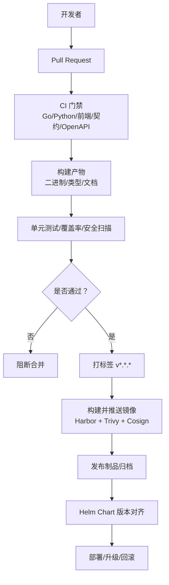
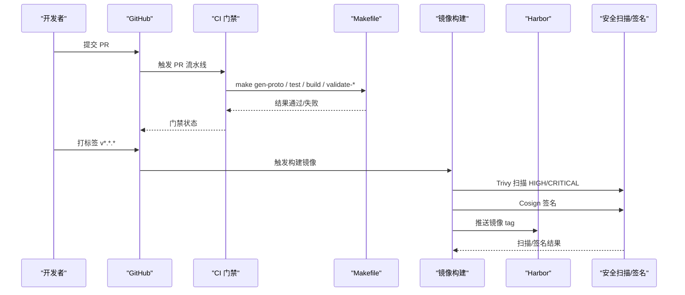
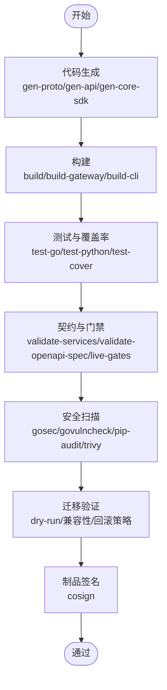
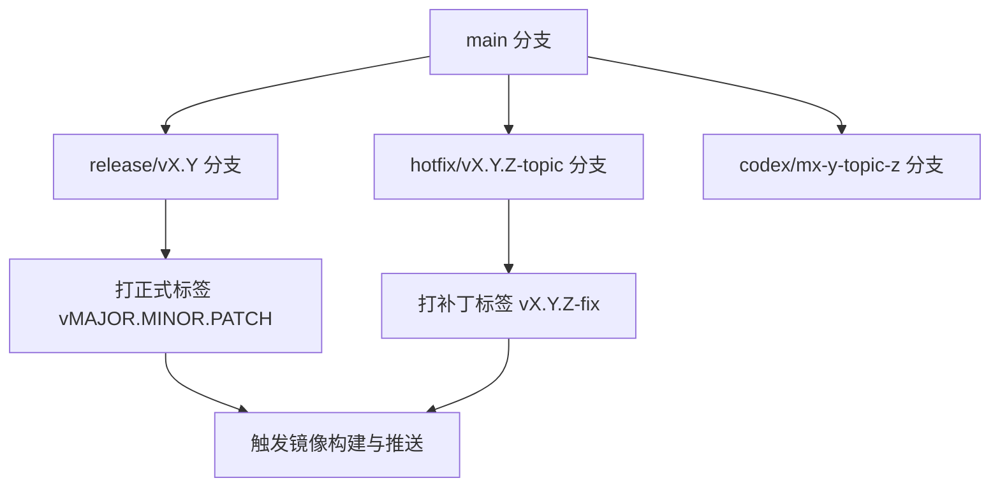
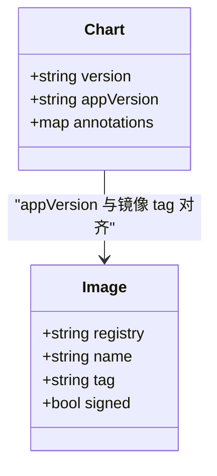
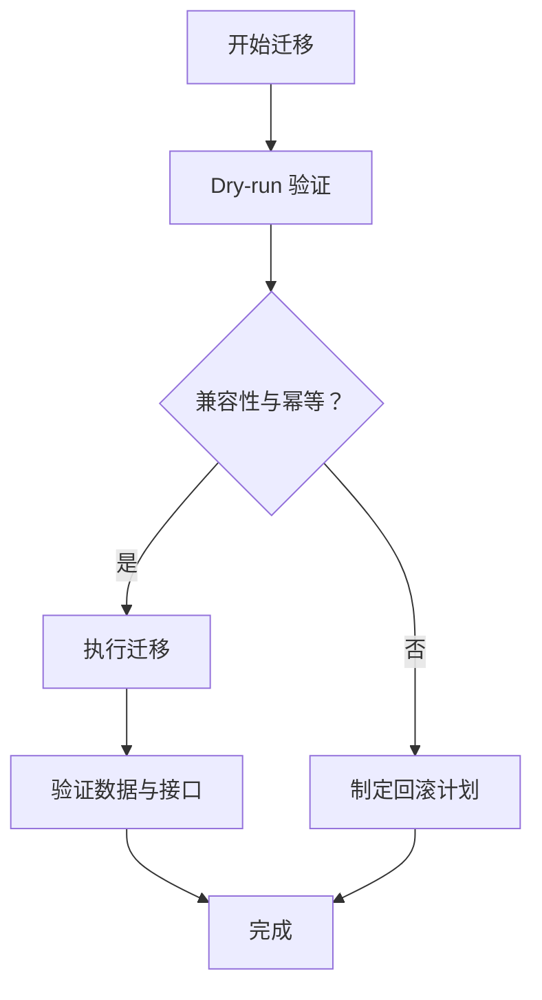
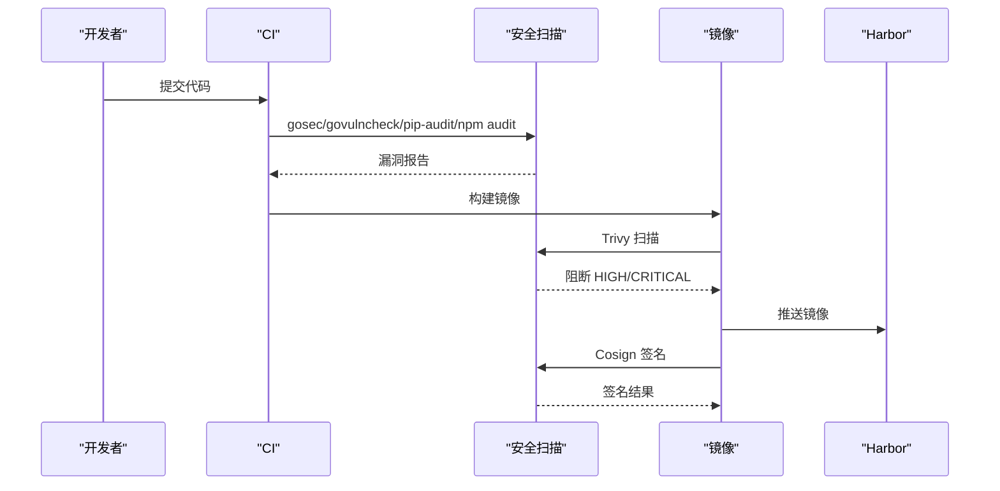
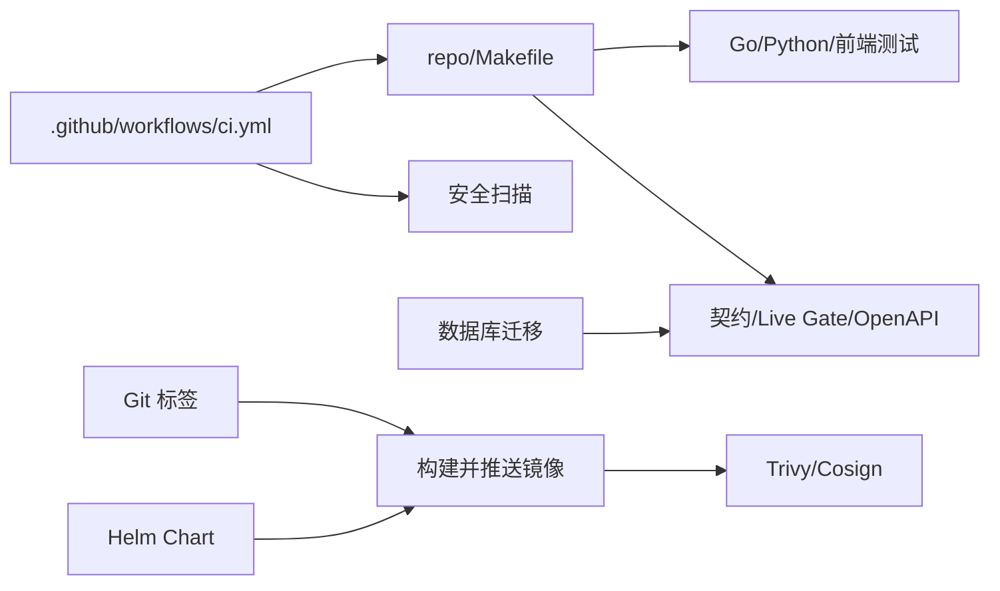

# 发布流程

<cite>
**本文引用的文件**
- [版本管理策略.md](file://ANI-12-版本管理策略.md)
- [CI 工作流](file://.github/workflows/ci.yml)
- [构建并推送镜像工作流](file://repo/.github/workflows/build-image.yml)
- [统一构建入口 Makefile](file://repo/Makefile)
- [Helm 平台 Chart 定义](file://repo/deploy/helm/ani-platform/Chart.yaml)
- [数据库初始迁移脚本](file://repo/deploy/migrations/20260501_001_init_schema.sql)
</cite>

## 目录
1. [简介](#简介)
2. [项目结构](#项目结构)
3. [核心组件](#核心组件)
4. [架构总览](#架构总览)
5. [详细组件分析](#详细组件分析)
6. [依赖关系分析](#依赖关系分析)
7. [性能与可观测性考虑](#性能与可观测性考虑)
8. [故障排查指南](#故障排查指南)
9. [结论](#结论)
10. [附录：发布检查清单](#附录发布检查清单)

## 简介
本文件面向 ANI 平台的发布负责人、运维与研发，系统化说明从代码到制品的完整发布流程。内容覆盖发布门禁要求（代码生成、测试、构建、迁移验证）、Git 标签与分支策略、容器镜像与 Helm Chart 版本管理、安全扫描与漏洞治理、回滚演练与发布检查清单。目标是确保每个可发布版本满足一致的质量基线，并在生产环境中具备可回滚、可审计、可追踪的能力。

## 项目结构
仓库采用多语言 Monorepo 组织，发布相关的关键位置如下：
- CI/CD 流水线：根级 GitHub Actions 负责 PR 门禁与质量门禁；`repo/.github/workflows/build-image.yml` 负责基于 Git 标签构建并推送镜像。
- 构建与校验：`repo/Makefile` 提供统一的代码生成、构建、测试、校验目标，涵盖 Go/Python/前端、OpenAPI/契约、基础设施 YAML、Live Gate 等。
- 制品与部署：容器镜像推送到 Harbor；Helm Chart 位于 `repo/deploy/helm/ani-platform`，用于平台级编排与依赖声明。
- 数据层：数据库迁移脚本位于 `repo/deploy/migrations`，由迁移工具链执行，需通过 dry-run 与兼容性校验。

**图示来源**
- [CI 工作流:1-311](file://.github/workflows/ci.yml#L1-L311)
- [构建并推送镜像工作流:1-82](file://repo/.github/workflows/build-image.yml#L1-L82)
- [统一构建入口 Makefile:188-232](file://repo/Makefile#L188-L232)
- [Helm 平台 Chart 定义:1-16](file://repo/deploy/helm/ani-platform/Chart.yaml#L1-L16)

**章节来源**
- [CI 工作流:1-311](file://.github/workflows/ci.yml#L1-L311)
- [构建并推送镜像工作流:1-82](file://repo/.github/workflows/build-image.yml#L1-L82)
- [统一构建入口 Makefile:188-232](file://repo/Makefile#L188-L232)
- [Helm 平台 Chart 定义:1-16](file://repo/deploy/helm/ani-platform/Chart.yaml#L1-L16)

## 核心组件
- 代码生成：Protobuf、OpenAPI、SDK、静态文档均由 Makefile 目标驱动，保证契约与实现一致性。
- 构建：Go 服务、CLI、前端均通过统一入口构建，注入版本与构建时间。
- 测试：Go/Python/前端测试、覆盖率、格式化、Lint、架构边界校验、OpenAPI 校验、Live Gate 校验。
- 安全：gosec/govulncheck/pip-audit/npm audit、Trivy 镜像扫描、Cosign 签名。
- 制品：Harbor 镜像仓库、Helm Chart 版本与 appVersion 对齐。
- 迁移：数据库迁移脚本需通过 dry-run 与兼容性校验，支持回滚策略记录。

**章节来源**
- [统一构建入口 Makefile:188-232](file://repo/Makefile#L188-L232)
- [统一构建入口 Makefile:234-280](file://repo/Makefile#L234-L280)
- [统一构建入口 Makefile:282-311](file://repo/Makefile#L282-L311)
- [CI 工作流:24-93](file://.github/workflows/ci.yml#L24-L93)
- [CI 工作流:95-138](file://.github/workflows/ci.yml#L95-L138)
- [CI 工作流:139-169](file://.github/workflows/ci.yml#L139-L169)
- [CI 工作流:216-255](file://.github/workflows/ci.yml#L216-L255)
- [构建并推送镜像工作流:65-82](file://repo/.github/workflows/build-image.yml#L65-L82)
- [版本管理策略.md:169-187](file://ANI-12-版本管理策略.md#L169-L187)

## 架构总览
发布流水线由“PR 门禁”和“标签触发制品构建”两部分组成。PR 阶段强制运行代码生成、构建、测试、安全扫描与契约校验；标签阶段触发镜像构建、安全扫描与签名，并输出制品。

**图示来源**
- [CI 工作流:1-311](file://.github/workflows/ci.yml#L1-L311)
- [构建并推送镜像工作流:1-82](file://repo/.github/workflows/build-image.yml#L1-L82)
- [统一构建入口 Makefile:188-232](file://repo/Makefile#L188-L232)

**章节来源**
- [CI 工作流:1-311](file://.github/workflows/ci.yml#L1-L311)
- [构建并推送镜像工作流:1-82](file://repo/.github/workflows/build-image.yml#L1-L82)
- [统一构建入口 Makefile:188-232](file://repo/Makefile#L188-L232)

## 详细组件分析

### 发布门禁与前置条件
- 代码生成：必须执行 Protobuf、OpenAPI、SDK、文档生成，确保契约与实现一致。
- 构建：所有 Go 服务与 CLI 必须成功构建，前端必须完成类型检查与构建。
- 测试：Go/Python/前端测试与覆盖率报告必须通过；架构边界、OpenAPI、Live Gate 校验必须通过。
- 迁移验证：数据库迁移需通过 dry-run 与兼容性校验；破坏性变更需走 MAJOR 流程。
- 安全扫描：依赖 CVE 扫描、源码安全扫描、镜像扫描必须通过；Critical/High 漏洞需处置或说明。
- 制品签名：镜像需使用 Cosign 签名，确保供应链安全。

**图示来源**
- [统一构建入口 Makefile:188-232](file://repo/Makefile#L188-L232)
- [统一构建入口 Makefile:234-280](file://repo/Makefile#L234-L280)
- [统一构建入口 Makefile:282-311](file://repo/Makefile#L282-L311)
- [CI 工作流:216-255](file://.github/workflows/ci.yml#L216-L255)
- [构建并推送镜像工作流:65-82](file://repo/.github/workflows/build-image.yml#L65-L82)
- [版本管理策略.md:169-187](file://ANI-12-版本管理策略.md#L169-L187)

**章节来源**
- [统一构建入口 Makefile:188-232](file://repo/Makefile#L188-L232)
- [统一构建入口 Makefile:234-280](file://repo/Makefile#L234-L280)
- [统一构建入口 Makefile:282-311](file://repo/Makefile#L282-L311)
- [CI 工作流:216-255](file://.github/workflows/ci.yml#L216-L255)
- [构建并推送镜像工作流:65-82](file://repo/.github/workflows/build-image.yml#L65-L82)
- [版本管理策略.md:169-187](file://ANI-12-版本管理策略.md#L169-L187)

### Git 标签与分支管理
- 标签规范：遵循 SemVer 2.0，正式标签为 `vMAJOR.MINOR.PATCH`，预发布标签为 `-alpha.N/-beta.N/-rc.N`。
- 分支策略：
  - `main`：主干分支，必须保持可构建、可测试。
  - `release/vX.Y`：维护某个 MINOR 发布线。
  - `codex/mx-y-topic-z`：代码生成任务分支。
  - `hotfix/vX.Y.Z-topic`：生产补丁修复分支。
- 标签触发：仅当存在 `v*.*.*` 标签时触发镜像构建与推送流水线。

**图示来源**
- [版本管理策略.md:122-167](file://ANI-12-版本管理策略.md#L122-L167)
- [构建并推送镜像工作流:1-12](file://repo/.github/workflows/build-image.yml#L1-L12)

**章节来源**
- [版本管理策略.md:122-167](file://ANI-12-版本管理策略.md#L122-L167)
- [构建并推送镜像工作流:1-12](file://repo/.github/workflows/build-image.yml#L1-L12)

### 容器镜像与 Helm Chart 版本管理
- 镜像命名：`harbor.ani.internal/ani/<service>:<tag>`，同时推送 `latest` 与缓存镜像。
- 镜像安全：Trivy 扫描 HIGH/CRITICAL 漏洞，阻断高危问题；Cosign 对镜像进行签名。
- Helm Chart：`Chart.yaml` 中 `version` 与 `appVersion` 需与 Git 标签保持一致；依赖组件通过注解声明。

**图示来源**
- [Helm 平台 Chart 定义:1-16](file://repo/deploy/helm/ani-platform/Chart.yaml#L1-L16)
- [构建并推送镜像工作流:13-82](file://repo/.github/workflows/build-image.yml#L13-L82)

**章节来源**
- [Helm 平台 Chart 定义:1-16](file://repo/deploy/helm/ani-platform/Chart.yaml#L1-L16)
- [构建并推送镜像工作流:13-82](file://repo/.github/workflows/build-image.yml#L13-L82)

### 数据库迁移验证与回滚
- 迁移脚本：位于 `repo/deploy/migrations`，包含初始化与增量迁移。
- 验证要求：迁移需通过 dry-run、幂等性、兼容性与回滚策略校验；破坏性变更需走 MAJOR 流程。
- 角色与权限：迁移账号与应用账号分离，应用账号受 RLS 约束，迁移账号仅在 CI/CD 使用。

**图示来源**
- [数据库初始迁移脚本:1-200](file://repo/deploy/migrations/20260501_001_init_schema.sql#L1-L200)
- [版本管理策略.md:95-119](file://ANI-12-版本管理策略.md#L95-L119)

**章节来源**
- [数据库初始迁移脚本:1-200](file://repo/deploy/migrations/20260501_001_init_schema.sql#L1-L200)
- [版本管理策略.md:95-119](file://ANI-12-版本管理策略.md#L95-L119)

### 安全扫描与漏洞治理
- 源码安全：gosec 扫描 Go 源码，govulncheck 扫描依赖漏洞。
- Python 依赖：pip-audit 扫描 Python 依赖。
- 前端依赖：npm audit 扫描前端依赖。
- 镜像安全：Trivy 扫描 HIGH/CRITICAL 漏洞，阻断高危问题。
- 制品签名：Cosign 对镜像签名，确保供应链安全。

**图示来源**
- [CI 工作流:24-93](file://.github/workflows/ci.yml#L24-L93)
- [CI 工作流:216-255](file://.github/workflows/ci.yml#L216-L255)
- [CI 工作流:139-169](file://.github/workflows/ci.yml#L139-L169)
- [构建并推送镜像工作流:65-82](file://repo/.github/workflows/build-image.yml#L65-L82)

**章节来源**
- [CI 工作流:24-93](file://.github/workflows/ci.yml#L24-L93)
- [CI 工作流:216-255](file://.github/workflows/ci.yml#L216-L255)
- [CI 工作流:139-169](file://.github/workflows/ci.yml#L139-L169)
- [构建并推送镜像工作流:65-82](file://repo/.github/workflows/build-image.yml#L65-L82)

### 回滚演练与发布检查
- 回滚演练：每次 RC 与正式版本需完成回滚演练，确保可快速恢复。
- 发布检查：RC 与正式版本需额外完成 Helm lint、离线包验签、多租户隔离测试、安全扫描无 Critical、文档更新。
- 证据归档：发布证据需归档至 development-records，便于审计与回溯。

**章节来源**
- [版本管理策略.md:169-187](file://ANI-12-版本管理策略.md#L169-L187)

## 依赖关系分析
- CI 门禁依赖 Makefile 提供的统一目标，确保代码生成、构建、测试、校验的一致性。
- 镜像构建依赖 Git 标签，确保制品与代码版本一一对应。
- Helm Chart 依赖镜像版本与 appVersion 对齐，确保部署一致性。
- 数据库迁移依赖迁移脚本与工具链，确保数据层变更的可控与可回滚。

**图示来源**
- [CI 工作流:1-311](file://.github/workflows/ci.yml#L1-L311)
- [统一构建入口 Makefile:188-232](file://repo/Makefile#L188-L232)
- [构建并推送镜像工作流:1-82](file://repo/.github/workflows/build-image.yml#L1-L82)
- [Helm 平台 Chart 定义:1-16](file://repo/deploy/helm/ani-platform/Chart.yaml#L1-L16)
- [数据库初始迁移脚本:1-200](file://repo/deploy/migrations/20260501_001_init_schema.sql#L1-L200)

**章节来源**
- [CI 工作流:1-311](file://.github/workflows/ci.yml#L1-L311)
- [统一构建入口 Makefile:188-232](file://repo/Makefile#L188-L232)
- [构建并推送镜像工作流:1-82](file://repo/.github/workflows/build-image.yml#L1-L82)
- [Helm 平台 Chart 定义:1-16](file://repo/deploy/helm/ani-platform/Chart.yaml#L1-L16)
- [数据库初始迁移脚本:1-200](file://repo/deploy/migrations/20260501_001_init_schema.sql#L1-L200)

## 性能与可观测性考虑
- 构建缓存：Go/Python/NPM 依赖缓存加速构建；镜像构建缓存推送到 Registry。
- 并发控制：CI 使用 concurrency 避免重复执行；超时限制防止长时间阻塞。
- 可观测性：健康检查与 readyz 探针在适配层与服务层实现，保障滚动升级安全。

[本节为通用指导，不直接分析具体文件]

## 故障排查指南
- 构建失败：检查 Makefile 目标输出与错误日志，确认依赖安装与缓存状态。
- 测试失败：定位具体模块与用例，复跑单测并检查环境依赖。
- 安全扫描失败：根据漏洞报告评估风险，必要时升级依赖或调整配置。
- 迁移失败：回滚迁移并检查幂等性与兼容性，必要时拆分迁移步骤。
- 镜像签名失败：检查 Cosign 密钥与密码配置，确保证书有效。

**章节来源**
- [统一构建入口 Makefile:188-232](file://repo/Makefile#L188-L232)
- [CI 工作流:24-93](file://.github/workflows/ci.yml#L24-L93)
- [构建并推送镜像工作流:65-82](file://repo/.github/workflows/build-image.yml#L65-L82)
- [数据库初始迁移脚本:1-200](file://repo/deploy/migrations/20260501_001_init_schema.sql#L1-L200)

## 结论
ANI 平台的发布流程以“契约先行、门禁严格、制品可信、回滚可控”为核心原则。通过统一的 Makefile 目标、严格的 CI 门禁、安全的镜像构建与签名、以及完善的迁移验证与回滚策略，确保每个版本达到可发布标准。建议持续完善 Live Gate 与真实环境验证，强化回滚演练与发布证据归档，提升整体交付质量与稳定性。

[本节为总结性内容，不直接分析具体文件]

## 附录：发布检查清单
- 代码生成：`make gen-proto`、`make gen-api`、`make gen-core-sdk`、`make gen-api-docs` 全部通过。
- 构建：`make build`、`make build-gateway`、`make build-cli` 全部通过。
- 测试：`make test`、`make test-go`、`make test-python`、`make test-cover` 全部通过。
- 契约与门禁：`make validate-services`、`make validate-openapi-spec`、Live Gate 校验全部通过。
- 安全扫描：gosec、govulncheck、pip-audit、npm audit、Trivy 全部通过，无 Critical/High 未处置漏洞。
- 迁移验证：数据库迁移 dry-run 通过，兼容性与幂等性验证通过，回滚策略已记录。
- 制品签名：镜像已通过 Cosign 签名，Harbor 可验证。
- Helm Chart：`version` 与 `appVersion` 与 Git 标签一致，Helm lint 通过。
- 回滚演练：RC 与正式版本已完成回滚演练，具备快速恢复能力。
- 文档更新：`repo/development-records/README.md` 已更新至对应版本。

**章节来源**
- [版本管理策略.md:169-187](file://ANI-12-版本管理策略.md#L169-L187)
- [统一构建入口 Makefile:188-232](file://repo/Makefile#L188-L232)
- [统一构建入口 Makefile:234-280](file://repo/Makefile#L234-L280)
- [统一构建入口 Makefile:282-311](file://repo/Makefile#L282-L311)
- [构建并推送镜像工作流:65-82](file://repo/.github/workflows/build-image.yml#L65-L82)
- [Helm 平台 Chart 定义:1-16](file://repo/deploy/helm/ani-platform/Chart.yaml#L1-L16)