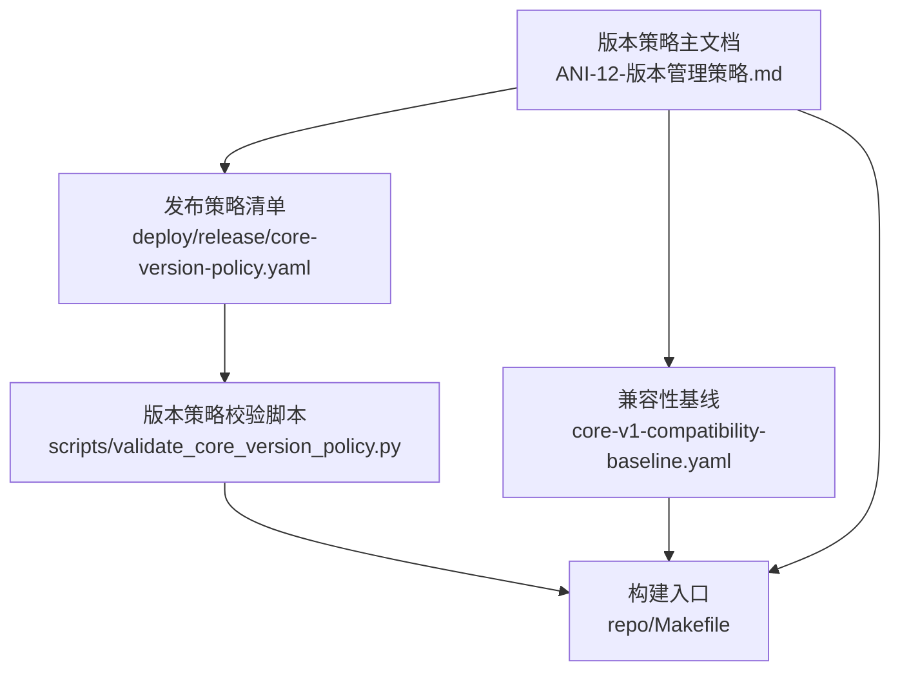
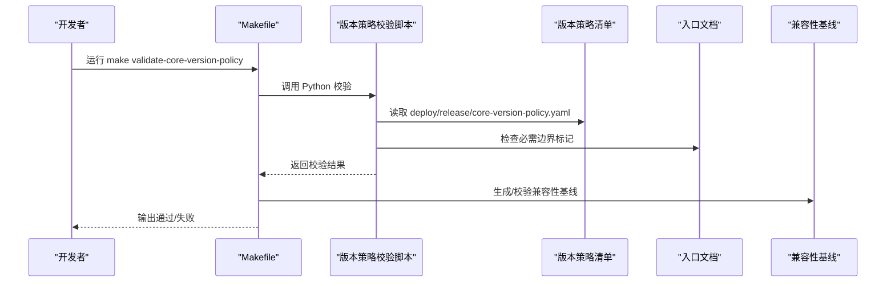
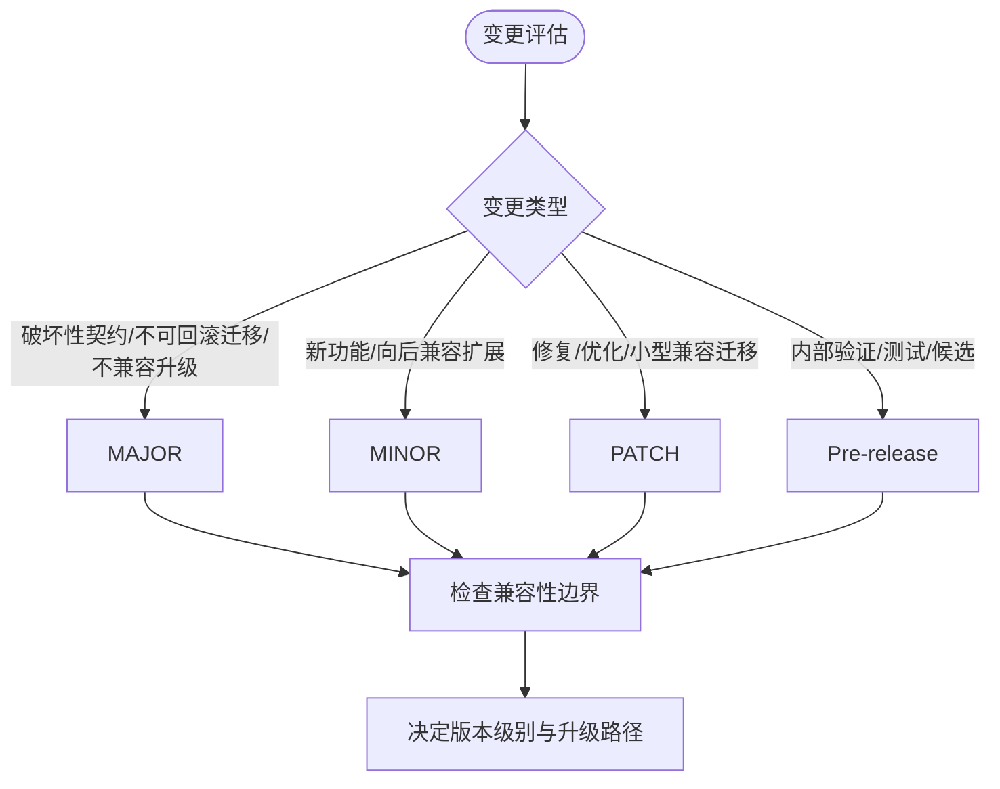
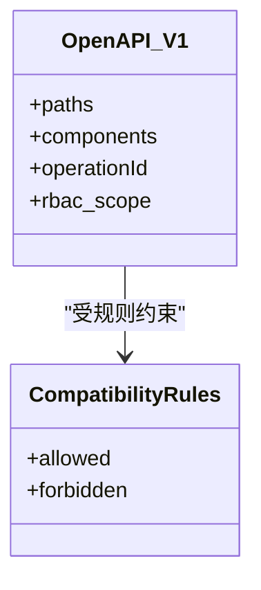
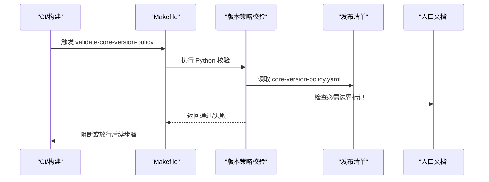
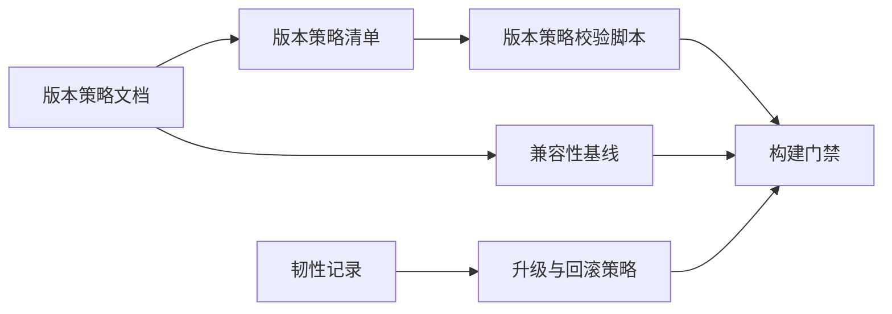

# 版本策略

<cite>
**本文引用的文件**
- [ANI-12-版本管理策略.md](file://ANI-12-版本管理策略.md)
- [core-version-policy.yaml](file://repo/deploy/release/core-version-policy.yaml)
- [validate_core_version_policy.py](file://repo/scripts/validate_core_version_policy.py)
- [Makefile](file://repo/Makefile)
- [core-v1-compatibility-baseline.yaml](file://repo/api/core-v1-compatibility-baseline.yaml)
- [sprint14-core-resilience-plan.md](file://repo/development-records/sprint14-core-resilience-plan.md)
</cite>

## 目录
1. [引言](#引言)
2. [项目结构](#项目结构)
3. [核心组件](#核心组件)
4. [架构总览](#架构总览)
5. [详细组件分析](#详细组件分析)
6. [依赖关系分析](#依赖关系分析)
7. [性能与发布成本考量](#性能与发布成本考量)
8. [故障排查指南](#故障排查指南)
9. [结论](#结论)
10. [附录：版本变更决策指南](#附录：版本变更决策指南)

## 引言
本文件基于仓库中的版本策略文档、兼容性基线、发布门禁脚本与开发记录，系统化说明 ANI 项目的语义化版本控制规范、兼容性边界、版本号命名规则、首个正式版本 v1.0.0 的目标与含义，以及面向开发者的版本变更决策指南。目标是帮助开发者在新增功能、修复缺陷或调整契约时，准确判断应升级 MAJOR、MINOR 还是 PATCH 级别，并理解对 API/SDK、数据库、CRD/Operator、部署与升级包的影响。

## 项目结构
与版本策略直接相关的工程要素包括：
- 版本策略主文档：定义 SemVer 规范、首个正式版本目标、变更触发条件、兼容性边界、Git/镜像/Chart 命名、发布门禁等。
- 版本策略校验器与清单：通过 YAML 清单与 Python 校验脚本，防止在未批准前标记实际 v1.0.0、RC 或生产发布。
- 兼容性基线：以 OpenAPI 为唯一来源的 v1 兼容性规则，约束 MINOR/PATCH 不得破坏已发布字段、枚举、HTTP 状态与错误码语义。
- 构建与门禁：Makefile 集成版本策略校验、兼容性基线生成与多类验证任务。
- 韧性/稳定性记录：体现数据面健康、降级与回滚能力，影响升级与回滚策略设计。

**图示来源**
- [ANI-12-版本管理策略.md:29-119](file://ANI-12-版本管理策略.md#L29-L119)
- [core-v1-compatibility-baseline.yaml:1-18](file://repo/api/core-v1-compatibility-baseline.yaml#L1-L18)
- [core-version-policy.yaml:1-15](file://repo/deploy/release/core-version-policy.yaml#L1-L15)
- [validate_core_version_policy.py:24-65](file://repo/scripts/validate_core_version_policy.py#L24-L65)
- [Makefile:782-786](file://repo/Makefile#L782-L786)

**章节来源**
- [ANI-12-版本管理策略.md:9-20](file://ANI-12-版本管理策略.md#L9-L20)
- [ANI-12-版本管理策略.md:29-119](file://ANI-12-版本管理策略.md#L29-L119)
- [core-version-policy.yaml:1-15](file://repo/deploy/release/core-version-policy.yaml#L1-L15)
- [validate_core_version_policy.py:24-65](file://repo/scripts/validate_core_version_policy.py#L24-L65)
- [Makefile:782-786](file://repo/Makefile#L782-L786)

## 核心组件
- 语义化版本与首个正式版本
  - 采用 SemVer 2.0：vMAJOR.MINOR.PATCH[-pre.N]。
  - 首个正式版本为 v1.0.0，目标日期为 2026-09-30，含义是 Phase 1 POC 交付就绪，可在客户现场完成安装、部署、基础运维和回滚，核心 P0 功能达到验收标准；不是功能全集，不包含 Phase 2/3 延后项。
- 版本变更触发条件
  - MAJOR：API 契约破坏性变更、Protobuf 不兼容变更、数据库不可自动回滚迁移、CRD apiVersion 不兼容、Helm values 结构不兼容、移除已有认证方式、安全模型破坏性调整、NATS subject/payload 不兼容、MinIO bucket/object layout 不兼容。
  - MINOR：新功能模块、新增向后兼容 API/Proto 方法、新增认证方式、新增 CRD 字段且默认兼容、新增 Installer 部署目标、新增 SDK 能力、数据库只做向后兼容加法迁移。
  - PATCH：Bug 修复、安全补丁、性能优化、非破坏性 UI 改进、文档修正、CI/构建修复、向后兼容的小型迁移。
  - Pre-release：alpha（内部验证）、beta（功能基本完成待测试）、rc（仅允许修复阻断问题）。
- 兼容性边界
  - API/SDK：OpenAPI 3.1 YAML 为唯一来源；Core/Services 跨层控制面契约以 Core OpenAPI REST API 与 Core SDK 为准；内部 gRPC 仅为实现契约，不得替代 OpenAPI 成为绕过 Core API 的产品契约；MINOR/PATCH 不允许破坏已发布字段、枚举值、HTTP 状态语义和错误码语义；删除字段需至少一个 MINOR 的 deprecated 周期；破坏性变更必须升级 MAJOR 或新增 /api/v2 并保留 /api/v1。
  - 数据库：PATCH/MINOR 默认只允许兼容迁移；删除列、改列类型、重建大表、强制停机迁移属于 MAJOR 风险；所有迁移必须可审计、可重复执行，并记录回滚策略；大表变更必须给出在线迁移方案。
  - CRD/Operator：新增字段需提供默认值或向后兼容行为；删除字段、语义变更、apiVersion 不兼容升级属于 MAJOR；Operator 必须支持至少从上一个 MINOR 版本滚动升级。
  - 部署与升级包：.anipatch 包名必须包含目标版本；manifest.yaml 必须声明 version、from_versions、min_supported_version、components、migrations、rollback_supported；Patch 包必须签名，安装前强制验签。
- Git 与制品命名
  - 正式 tag：v1.0.0、v1.1.0、v1.1.1。
  - 预发布 tag：v1.0.0-alpha.1、v1.0.0-beta.1、v1.0.0-rc.1。
  - 分支：main（主干可构建可测试）、release/vX.Y（维护某 MINOR 发布线）、codex/mx-y-topic-z（代码生成任务分支）、hotfix/vX.Y.Z-topic（生产补丁修复）。
  - 镜像与 Chart：容器镜像 tag 使用 SemVer；Helm Chart 中 version 与 appVersion 对齐。
- 发布门禁
  - 每个可发布版本至少满足 gen-proto、test、build。
  - RC 与正式版本还需满足：数据库迁移 dry-run 通过、Helm lint 通过、离线安装包验签流程通过、回滚演练通过、多租户隔离测试通过、安全扫描无 Critical 漏洞（High 需处置说明）、开发记录更新到对应版本。

**章节来源**
- [ANI-12-版本管理策略.md:29-119](file://ANI-12-版本管理策略.md#L29-L119)
- [ANI-12-版本管理策略.md:122-187](file://ANI-12-版本管理策略.md#L122-L187)

## 架构总览
版本策略在工程中由“文档 + 基线 + 清单 + 校验脚本 + 构建门禁”共同保障：
- 文档定义规则与目标。
- 基线固化 v1 兼容性规则，禁止 MINOR/PATCH 破坏契约。
- 清单限制未批准前不得标记实际 v1.0.0、RC 或生产发布。
- 校验脚本强制执行清单约束，并在关键入口文档中要求声明边界。
- Makefile 将版本策略校验纳入构建与发布流程。

**图示来源**
- [Makefile:782-786](file://repo/Makefile#L782-L786)
- [validate_core_version_policy.py:24-65](file://repo/scripts/validate_core_version_policy.py#L24-L65)
- [core-version-policy.yaml:1-15](file://repo/deploy/release/core-version-policy.yaml#L1-L15)
- [core-v1-compatibility-baseline.yaml:1-18](file://repo/api/core-v1-compatibility-baseline.yaml#L1-L18)

## 详细组件分析

### 语义化版本与首个正式版本
- 版本格式：vMAJOR.MINOR.PATCH[-pre.N]。
- 首个正式版本 v1.0.0：目标日期 2026-09-30，含义为 Phase 1 POC 交付就绪，可在客户现场完成安装、部署、基础运维和回滚，核心 P0 功能达到验收标准；不是功能全集，不包含 Phase 2/3 延后项；在此之前统一使用 v0.x.y 或预发布标识。

**章节来源**
- [ANI-12-版本管理策略.md:29-69](file://ANI-12-版本管理策略.md#L29-L69)

### 版本变更触发条件与兼容性边界
- 变更触发条件明确区分 MAJOR/MINOR/PATCH/Pre-release 的适用场景。
- 兼容性边界覆盖 API/SDK、数据库、CRD/Operator、部署与升级包四个维度，确保升级路径可控、可回滚、可审计。

**图示来源**
- [ANI-12-版本管理策略.md:73-119](file://ANI-12-版本管理策略.md#L73-L119)

**章节来源**
- [ANI-12-版本管理策略.md:73-119](file://ANI-12-版本管理策略.md#L73-L119)

### 兼容性基线与 API/SDK 约束
- 以 OpenAPI 3.1 YAML 为唯一来源，v1 兼容性规则明确允许与禁止的变更项。
- MINOR/PATCH 不得破坏已发布字段、枚举值、HTTP 状态语义和错误码语义；删除字段需经历 deprecated 周期；破坏性变更需升级 MAJOR 或新增 /api/v2 并保留 /api/v1。

**图示来源**
- [core-v1-compatibility-baseline.yaml:1-18](file://repo/api/core-v1-compatibility-baseline.yaml#L1-L18)

**章节来源**
- [ANI-12-版本管理策略.md:84-94](file://ANI-12-版本管理策略.md#L84-L94)
- [core-v1-compatibility-baseline.yaml:1-18](file://repo/api/core-v1-compatibility-baseline.yaml#L1-L18)

### 发布门禁与版本策略校验
- 构建门禁要求 gen-proto、test、build。
- RC 与正式版本额外要求：数据库迁移 dry-run、Helm lint、离线安装包验签、回滚演练、多租户隔离测试、安全扫描、开发记录更新。
- 版本策略清单与校验脚本防止在未批准前标记实际 v1.0.0、RC 或生产发布，并要求入口文档声明边界。

**图示来源**
- [Makefile:782-786](file://repo/Makefile#L782-L786)
- [validate_core_version_policy.py:24-65](file://repo/scripts/validate_core_version_policy.py#L24-L65)
- [core-version-policy.yaml:1-15](file://repo/deploy/release/core-version-policy.yaml#L1-L15)

**章节来源**
- [ANI-12-版本管理策略.md:169-187](file://ANI-12-版本管理策略.md#L169-L187)
- [validate_core_version_policy.py:24-65](file://repo/scripts/validate_core_version_policy.py#L24-L65)

### 数据库与回滚策略
- PATCH/MINOR 默认只允许兼容迁移；删除列、改列类型、重建大表、强制停机迁移属于 MAJOR 风险。
- 所有迁移必须可审计、可重复执行，并记录回滚策略；大表变更必须给出在线迁移方案。
- 结合韧性记录中的 readyz/降级/重试/超时能力，升级与回滚需考虑强/弱依赖降级与故障注入场景。

**章节来源**
- [ANI-12-版本管理策略.md:95-100](file://ANI-12-版本管理策略.md#L95-L100)
- [sprint14-core-resilience-plan.md:51-94](file://repo/development-records/sprint14-core-resilience-plan.md#L51-L94)

### 部署与升级包
- .anipatch 包名必须包含目标版本；manifest.yaml 必须声明 version、from_versions、min_supported_version、components、migrations、rollback_supported。
- Patch 包必须签名，安装前强制验签。

**章节来源**
- [ANI-12-版本管理策略.md:108-118](file://ANI-12-版本管理策略.md#L108-L118)

## 依赖关系分析
- 版本策略主文档依赖兼容性基线与发布清单，作为规则来源。
- 校验脚本依赖清单与入口文档，确保未批准前不标记实际发布。
- Makefile 集成校验与基线生成，形成构建门禁闭环。
- 韧性记录影响升级与回滚策略的设计与验证。

**图示来源**
- [ANI-12-版本管理策略.md:29-119](file://ANI-12-版本管理策略.md#L29-L119)
- [core-v1-compatibility-baseline.yaml:1-18](file://repo/api/core-v1-compatibility-baseline.yaml#L1-L18)
- [core-version-policy.yaml:1-15](file://repo/deploy/release/core-version-policy.yaml#L1-L15)
- [validate_core_version_policy.py:24-65](file://repo/scripts/validate_core_version_policy.py#L24-L65)
- [Makefile:782-786](file://repo/Makefile#L782-L786)
- [sprint14-core-resilience-plan.md:51-94](file://repo/development-records/sprint14-core-resilience-plan.md#L51-L94)

**章节来源**
- [ANI-12-版本管理策略.md:29-119](file://ANI-12-版本管理策略.md#L29-L119)
- [core-v1-compatibility-baseline.yaml:1-18](file://repo/api/core-v1-compatibility-baseline.yaml#L1-L18)
- [core-version-policy.yaml:1-15](file://repo/deploy/release/core-version-policy.yaml#L1-L15)
- [validate_core_version_policy.py:24-65](file://repo/scripts/validate_core_version_policy.py#L24-L65)
- [Makefile:782-786](file://repo/Makefile#L782-L786)
- [sprint14-core-resilience-plan.md:51-94](file://repo/development-records/sprint14-core-resilience-plan.md#L51-L94)

## 性能与发布成本考量
- 兼容性基线减少下游适配成本，避免频繁破坏性变更导致的 SDK/前端/自动化系统重构。
- 韧性能力（readyz/降级/重试/超时）提升升级过程中的可观测性与恢复能力，降低回滚风险。
- 发布门禁确保构建质量与安全扫描达标，减少上线后故障与回滚成本。

[本节提供通用指导，不直接分析具体文件]

## 故障排查指南
- 若版本策略校验失败：
  - 检查 deploy/release/core-version-policy.yaml 是否设置 forbidden flags 为 true。
  - 检查入口文档是否包含必需的边界标记。
  - 确认 Makefile 触发的校验任务是否正确执行。
- 若兼容性基线校验失败：
  - 检查 OpenAPI 变更是否符合 allowed/forbidden 规则。
  - 确认 MINOR/PATCH 未破坏已发布字段、枚举、HTTP 状态与错误码语义。
- 若发布门禁失败：
  - 逐项检查数据库迁移 dry-run、Helm lint、离线安装包验签、回滚演练、多租户隔离测试、安全扫描与开发记录更新。

**章节来源**
- [validate_core_version_policy.py:24-65](file://repo/scripts/validate_core_version_policy.py#L24-L65)
- [core-v1-compatibility-baseline.yaml:1-18](file://repo/api/core-v1-compatibility-baseline.yaml#L1-L18)
- [ANI-12-版本管理策略.md:169-187](file://ANI-12-版本管理策略.md#L169-L187)

## 结论
ANI 的版本策略以 SemVer 为核心，围绕兼容性边界与发布门禁构建完整治理体系。首个正式版本 v1.0.0 明确为 Phase 1 POC 交付就绪，强调可安装、可部署、可运维、可回滚与核心 P0 验收。开发者在进行任何契约或基础设施变更时，应严格依据 MAJOR/MINOR/PATCH 触发条件与兼容性规则进行决策，并通过构建门禁与校验脚本确保合规。

[本节总结性内容，不直接分析具体文件]

## 附录：版本变更决策指南
- 何时升级 MAJOR：
  - API/SDK 破坏性变更（删除路径、修改 operationId、删除必填字段、改变字段签名、改变 HTTP 状态或错误码语义）。
  - Protobuf 字段删除/重编号/语义不兼容。
  - 数据库不可自动回滚迁移、删除列、改列类型、重建大表、强制停机迁移。
  - CRD apiVersion 不兼容升级、删除字段或语义变更。
  - Helm values 结构不兼容、移除已有认证方式、安全模型破坏性调整。
  - NATS subject/payload 不兼容、MinIO bucket/object layout 不兼容。
- 何时升级 MINOR：
  - 新增功能模块、新增向后兼容 API/Proto 方法、新增认证方式、新增模型导入源。
  - 新增 CRD 字段且默认兼容、新增 Installer 部署目标、新增 SDK 能力。
  - 数据库只做向后兼容加法迁移。
- 何时升级 PATCH：
  - Bug 修复、安全补丁、性能优化、非破坏性 UI 改进、文档修正、CI/构建修复、向后兼容的小型迁移。
- 何时使用 Pre-release：
  - alpha：内部开发验证。
  - beta：功能基本完成、待测试。
  - rc：发布候选，只允许修复阻断问题。
- 升级路径建议：
  - 优先保持 MINOR/PATCH 兼容，避免破坏性变更。
  - 如需破坏性变更，规划 MAJOR 或新增 /api/v2 并保留 /api/v1。
  - 数据库与大表变更需在线迁移方案与回滚策略。
  - Operator 升级需支持从上一个 MINOR 版本滚动升级。
  - 升级包需签名与验签，manifest 声明完整元数据。

**章节来源**
- [ANI-12-版本管理策略.md:73-119](file://ANI-12-版本管理策略.md#L73-L119)
- [ANI-12-版本管理策略.md:122-187](file://ANI-12-版本管理策略.md#L122-L187)
- [core-v1-compatibility-baseline.yaml:1-18](file://repo/api/core-v1-compatibility-baseline.yaml#L1-L18)