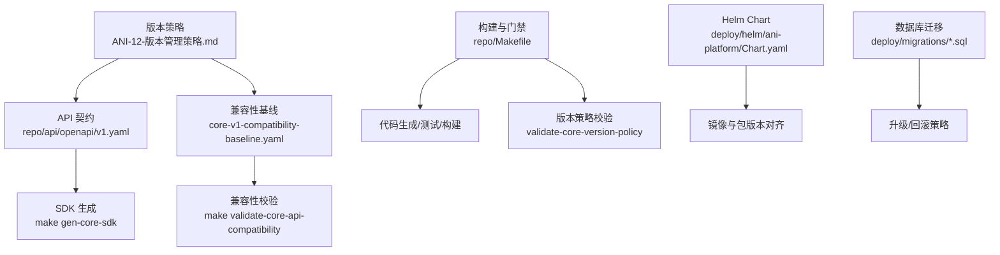
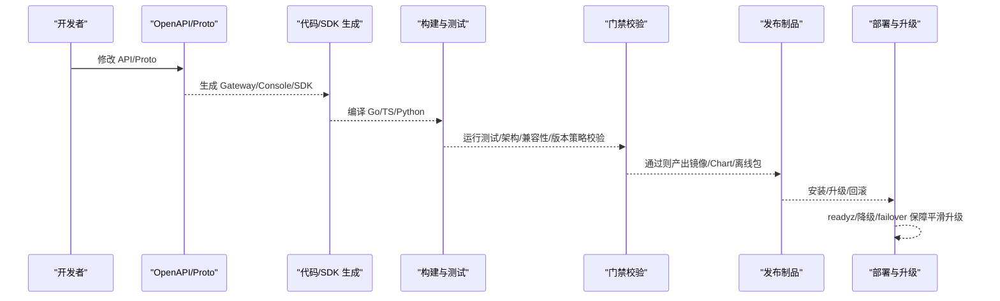
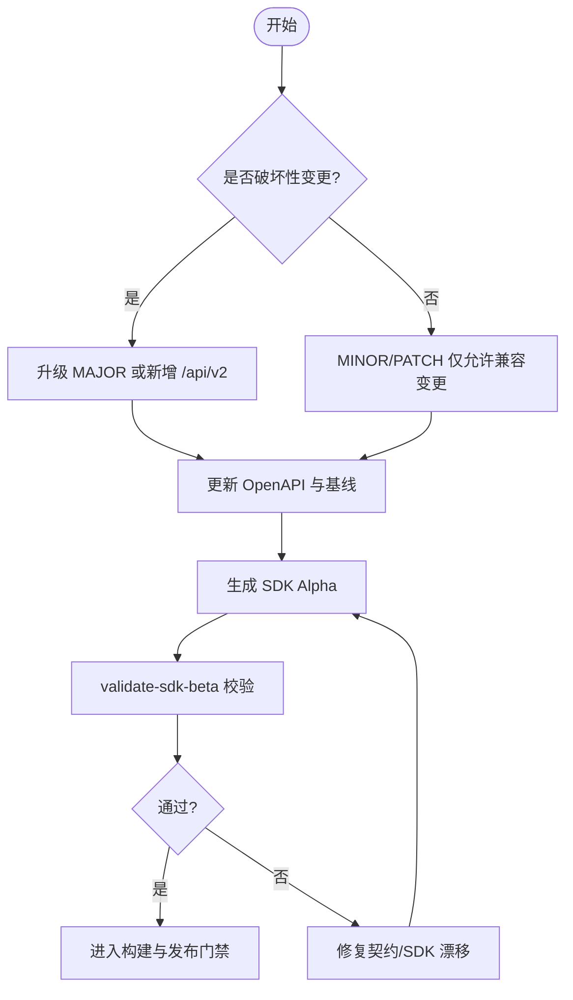
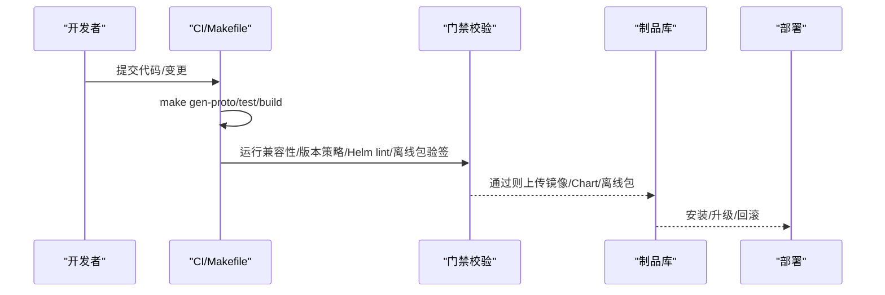
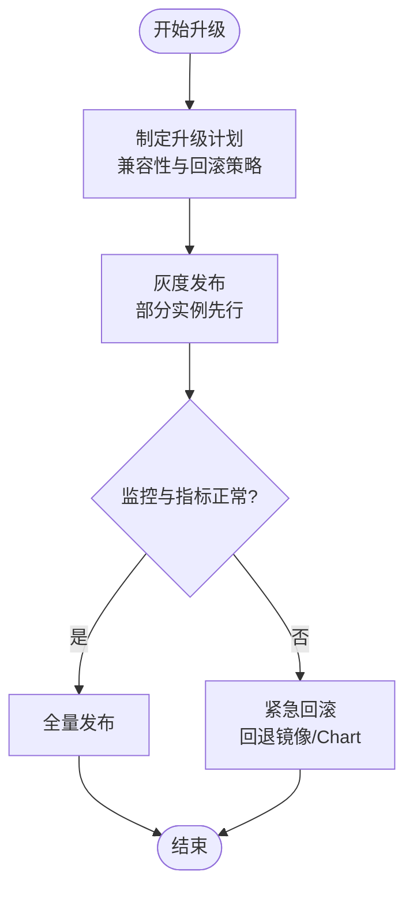
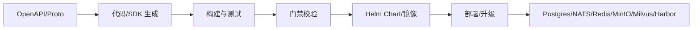

# 版本管理

<cite>
**本文引用的文件**
- [ANI-12-版本管理策略.md](file://ANI-12-版本管理策略.md)
- [repo/api/openapi/v1.yaml](file://repo/api/openapi/v1.yaml)
- [repo/api/core-v1-compatibility-baseline.yaml](file://repo/api/core-v1-compatibility-baseline.yaml)
- [repo/Makefile](file://repo/Makefile)
- [repo/scripts/validate_core_version_policy.py](file://repo/scripts/validate_core_version_policy.py)
- [repo/deploy/helm/ani-platform/Chart.yaml](file://repo/deploy/helm/ani-platform/Chart.yaml)
- [repo/services/tasks/modules/spec/boss/ops/spec-boss-platform-resource-pool.md](file://repo/services/tasks/modules/spec/boss/ops/spec-boss-platform-resource-pool.md)
- [repo/development-records/sprint14-core-resilience-plan.md](file://repo/development-records/sprint14-core-resilience-plan.md)
</cite>

## 目录
1. [简介](#简介)
2. [项目结构](#项目结构)
3. [核心组件](#核心组件)
4. [架构总览](#架构总览)
5. [详细组件分析](#详细组件分析)
6. [依赖关系分析](#依赖关系分析)
7. [性能与发布稳定性考量](#性能与发布稳定性考量)
8. [故障排查指南](#故障排查指南)
9. [结论](#结论)
10. [附录](#附录)

## 简介
本文件面向 ANI 平台，系统化说明版本管理策略、发布流程、API 版本管理与 SDK 同步机制，以及升级与回滚策略。内容基于仓库中的版本策略文档、OpenAPI 契约、兼容性基线、构建与验证脚本、Helm Chart 元数据与韧性/降级实现记录进行整理，确保读者既能把握全局，也能定位到具体实现位置。

## 项目结构
与版本管理直接相关的代码与配置集中在以下位置：
- 版本策略与规则：根级策略文档与 Sprint 阶段约束
- API 契约与基线：Core OpenAPI v1、Services OpenAPI v1、v1 兼容性基线
- 构建与门禁：Makefile 统一入口，包含代码生成、测试、校验目标
- Helm Chart：平台 umbrella chart 的 version/appVersion
- 迁移脚本：数据库迁移 SQL 按时间戳命名，支持可审计、可重复执行
- 韧性/降级：Sprint 14 韧性计划中关于健康探测、降级、多端点 failover 的实现与验证

图表来源
- [ANI-12-版本管理策略.md:29-119](file://ANI-12-版本管理策略.md#L29-L119)
- [repo/api/openapi/v1.yaml:1-40](file://repo/api/openapi/v1.yaml#L1-L40)
- [repo/api/core-v1-compatibility-baseline.yaml:1-18](file://repo/api/core-v1-compatibility-baseline.yaml#L1-L18)
- [repo/Makefile:188-232](file://repo/Makefile#L188-L232)
- [repo/Makefile:782-786](file://repo/Makefile#L782-L786)
- [repo/deploy/helm/ani-platform/Chart.yaml:1-16](file://repo/deploy/helm/ani-platform/Chart.yaml#L1-L16)

章节来源
- [ANI-12-版本管理策略.md:29-119](file://ANI-12-版本管理策略.md#L29-L119)
- [repo/api/openapi/v1.yaml:1-40](file://repo/api/openapi/v1.yaml#L1-L40)
- [repo/api/core-v1-compatibility-baseline.yaml:1-18](file://repo/api/core-v1-compatibility-baseline.yaml#L1-L18)
- [repo/Makefile:188-232](file://repo/Makefile#L188-L232)
- [repo/Makefile:782-786](file://repo/Makefile#L782-L786)
- [repo/deploy/helm/ani-platform/Chart.yaml:1-16](file://repo/deploy/helm/ani-platform/Chart.yaml#L1-L16)

## 核心组件
- 语义化版本控制（SemVer）与变更触发条件：定义 MAJOR/MINOR/PATCH 与预发布标识的适用场景，明确破坏性变更边界。
- API 版本与兼容性基线：以 Core OpenAPI v1 为唯一真实来源；通过兼容性基线锁定允许/禁止的变更集合。
- 构建与发布门禁：统一的 Makefile 目标覆盖代码生成、测试、构建、校验；RC 与正式版本附加更多门禁。
- Helm Chart 与制品版本：Chart version 与 appVersion 需与镜像 tag 保持一致，便于追踪与回滚。
- 数据库迁移：按时间戳命名的迁移脚本，要求可审计、可重复执行，并记录回滚策略。
- 韧性/降级与多端点容错：readyz 健康探测、强/弱依赖降级、endpoint 列表与 failover 能力，支撑平滑升级与灰度。

章节来源
- [ANI-12-版本管理策略.md:73-119](file://ANI-12-版本管理策略.md#L73-L119)
- [repo/api/openapi/v1.yaml:1-40](file://repo/api/openapi/v1.yaml#L1-L40)
- [repo/api/core-v1-compatibility-baseline.yaml:1-18](file://repo/api/core-v1-compatibility-baseline.yaml#L1-L18)
- [repo/Makefile:169-187](file://repo/Makefile#L169-L187)
- [repo/Makefile:234-280](file://repo/Makefile#L234-L280)
- [repo/Makefile:782-786](file://repo/Makefile#L782-L786)
- [repo/deploy/helm/ani-platform/Chart.yaml:1-16](file://repo/deploy/helm/ani-platform/Chart.yaml#L1-L16)

## 架构总览
版本管理贯穿“契约 → 生成 → 构建 → 校验 → 发布”的全链路，关键节点如下：
- 契约层：Core OpenAPI v1 与 Services OpenAPI v1 作为对外契约；兼容性基线保障 MINOR/PATCH 不破坏已发布字段与行为。
- 生成层：从 OpenAPI/Proto 生成 Gateway 代码、Console 类型、四语言 SDK Alpha，保证 SDK 与契约一致。
- 构建与校验层：Makefile 提供统一入口，运行测试、架构校验、兼容性校验、版本策略校验等。
- 发布层：Helm Chart 与镜像 tag 对齐；离线包与迁移脚本纳入发布物；RC 与正式版附加额外门禁。
- 运维层：readyz 健康探测、降级策略、多端点 failover 支撑平滑升级与灰度发布。

图表来源
- [repo/api/openapi/v1.yaml:1-40](file://repo/api/openapi/v1.yaml#L1-L40)
- [repo/Makefile:188-232](file://repo/Makefile#L188-L232)
- [repo/Makefile:782-786](file://repo/Makefile#L782-L786)
- [repo/deploy/helm/ani-platform/Chart.yaml:1-16](file://repo/deploy/helm/ani-platform/Chart.yaml#L1-L16)
- [repo/development-records/sprint14-core-resilience-plan.md:237-260](file://repo/development-records/sprint14-core-resilience-plan.md#L237-L260)

## 详细组件分析

### 语义化版本控制与兼容性保证
- 版本号规范：采用 SemVer 2.0，格式为 vMAJOR.MINOR.PATCH[-pre.N]；首个正式版本为 v1.0.0，目标日期在策略文档中声明。
- 变更触发条件：
  - MAJOR：API 契约破坏性变更、Protobuf 字段删除/重编号/语义不兼容、数据库不可自动回滚迁移、CRD apiVersion 不兼容升级、Helm values 结构不兼容、移除已有认证方式、NATS subject/payload 不兼容、MinIO bucket/object layout 不兼容。
  - MINOR：新增功能模块、新增向后兼容 API/Proto 方法、新增认证方式、新增 CRD 字段且默认兼容、新增 Installer 部署目标、新增 SDK 能力、数据库只做向后兼容加法迁移。
  - PATCH：Bug 修复、安全补丁、性能优化、非破坏性 UI 改进、文档修正、CI/构建修复、向后兼容的小型迁移。
  - Pre-release：alpha/beta/rc 用于内部验证、功能基本完成待测试、发布候选只允许修复阻断问题。
- 兼容性边界：
  - API/SDK：REST API 以 OpenAPI 3.1 YAML 为唯一来源；MINOR/PATCH 不允许破坏已发布字段、枚举值、HTTP 状态语义和错误码语义；删除字段需至少一个 MINOR 的 deprecated 周期；破坏性变更必须升级 MAJOR 或新增 /api/v2 并保留 /api/v1。
  - 数据库：PATCH/MINOR 默认仅允许兼容迁移；删除列、改列类型、重建大表、强制停机迁移属于 MAJOR 风险；所有迁移必须可审计、可重复执行，并记录回滚策略；大表变更需在线迁移方案。
  - CRD/Operator：新增字段需提供默认值或向后兼容行为；删除字段、语义变更、apiVersion 不兼容升级属于 MAJOR；Operator 需支持至少从上一个 MINOR 滚动升级。
  - 部署与升级包：.anipatch 包名需包含目标版本；manifest.yaml 需声明 version/from_versions/min_supported_version/components/migrations/rollback_supported；Patch 包必须签名，安装前强制验签。

章节来源
- [ANI-12-版本管理策略.md:29-119](file://ANI-12-版本管理策略.md#L29-L119)

### API 版本管理与 SDK 同步
- OpenAPI 维护：
  - Core API v1 位于 repo/api/openapi/v1.yaml，URL 前缀为 /api/v1；版本升级时新建 v2 并保持路径稳定。
  - Services API v1 位于 repo/api/openapi/services/v1.yaml，与 Core 分层清晰。
  - 兼容性基线 core-v1-compatibility-baseline.yaml 由脚本生成，锁定允许/禁止的变更集合。
- SDK 生成与同步：
  - 使用 make gen-core-sdk 从 Core/Services 契约生成四语言 SDK Alpha；SDK 版本与契约保持同步。
  - 通过 make validate-sdk-beta 校验 SDK 与契约一致性，避免漂移。
- 客户端迁移指南：
  - 破坏性变更需升级 MAJOR 或新增 /api/v2；旧版 /api/v1 继续保留，提供迁移窗口。
  - 删除字段需经历 deprecated 周期；客户端应逐步适配新字段并弃用旧字段。
  - 错误码与 HTTP 状态语义不得在 MINOR/PATCH 中破坏；客户端不应依赖未公开的内部 gRPC 契约。

图表来源
- [repo/api/openapi/v1.yaml:1-40](file://repo/api/openapi/v1.yaml#L1-L40)
- [repo/api/core-v1-compatibility-baseline.yaml:1-18](file://repo/api/core-v1-compatibility-baseline.yaml#L1-L18)
- [repo/Makefile:219-232](file://repo/Makefile#L219-L232)
- [repo/Makefile:134-141](file://repo/Makefile#L134-L141)

章节来源
- [repo/api/openapi/v1.yaml:1-40](file://repo/api/openapi/v1.yaml#L1-L40)
- [repo/api/core-v1-compatibility-baseline.yaml:1-18](file://repo/api/core-v1-compatibility-baseline.yaml#L1-L18)
- [repo/Makefile:219-232](file://repo/Makefile#L219-L232)
- [repo/Makefile:134-141](file://repo/Makefile#L134-L141)

### 发布流程与门禁
- 代码冻结与构建：
  - 每个可发布版本需满足：make gen-proto、make test、make build。
  - RC 与正式版本还需：数据库迁移 dry-run 通过、Helm lint 通过、离线安装包验签流程通过、回滚演练通过、多租户隔离测试通过、安全扫描无 Critical 漏洞、High 漏洞有处置说明、开发记录更新到对应版本。
- 构建与产物：
  - 构建目标包括 gateway/auth-service/model-service/task-service/reconcile-worker/cli。
  - 产物包含二进制、镜像、Helm Chart、离线包；Chart version 与 appVersion 需与镜像 tag 对齐。
- 版本策略校验：
  - 通过 validate-core-version-policy 检查版本策略 manifest 与相关文档标记，防止误发正式版本。

图表来源
- [ANI-12-版本管理策略.md:169-187](file://ANI-12-版本管理策略.md#L169-L187)
- [repo/Makefile:234-280](file://repo/Makefile#L234-L280)
- [repo/Makefile:782-786](file://repo/Makefile#L782-L786)
- [repo/deploy/helm/ani-platform/Chart.yaml:1-16](file://repo/deploy/helm/ani-platform/Chart.yaml#L1-L16)

章节来源
- [ANI-12-版本管理策略.md:169-187](file://ANI-12-版本管理策略.md#L169-L187)
- [repo/Makefile:234-280](file://repo/Makefile#L234-L280)
- [repo/Makefile:782-786](file://repo/Makefile#L782-L786)
- [repo/deploy/helm/ani-platform/Chart.yaml:1-16](file://repo/deploy/helm/ani-platform/Chart.yaml#L1-L16)

### 升级与回滚策略
- 平滑升级：
  - 通过兼容性基线与 MINOR/PATCH 的向后兼容原则，确保新版本可无缝替换旧版本。
  - 使用 Helm 滚动升级，配合 readyz 健康探测，确保后端依赖就绪后再切换流量。
- 灰度发布：
  - 借助多端点配置与 endpoint 列表 fallback，可在部分实例先升级并观察指标；结合降级策略（弱依赖 down → degraded）降低风险。
  - 通过限流中间件与幂等响应重放，减少并发与重试带来的副作用。
- 紧急回滚：
  - 数据库迁移需具备回滚策略；大表变更需在线迁移方案。
  - .anipatch 包需签名并支持 rollback_supported；安装前强制验签。
  - 若出现严重问题，可通过回退镜像 tag 与 Chart version 快速恢复。

图表来源
- [ANI-12-版本管理策略.md:95-119](file://ANI-12-版本管理策略.md#L95-L119)
- [repo/development-records/sprint14-core-resilience-plan.md:423-471](file://repo/development-records/sprint14-core-resilience-plan.md#L423-L471)

章节来源
- [ANI-12-版本管理策略.md:95-119](file://ANI-12-版本管理策略.md#L95-L119)
- [repo/development-records/sprint14-core-resilience-plan.md:423-471](file://repo/development-records/sprint14-core-resilience-plan.md#L423-L471)

## 依赖关系分析
- 契约与生成：OpenAPI/Proto 驱动 Gateway/Console/SDK 生成，确保多语言 SDK 与契约一致。
- 构建与校验：Makefile 串联代码生成、测试、架构校验、兼容性校验、版本策略校验，形成闭环。
- 部署与运维：Helm Chart 与镜像 tag 对齐；迁移脚本与离线包纳入发布物；readyz/降级/failover 支撑生产稳定性。
- 外部依赖：PostgreSQL、NATS、Redis、MinIO、Milvus、Harbor 等基础设施通过 installer/profiles 管理，版本升级时需考虑依赖兼容性。

图表来源
- [repo/api/openapi/v1.yaml:1-40](file://repo/api/openapi/v1.yaml#L1-L40)
- [repo/Makefile:188-232](file://repo/Makefile#L188-L232)
- [repo/deploy/helm/ani-platform/Chart.yaml:1-16](file://repo/deploy/helm/ani-platform/Chart.yaml#L1-L16)

章节来源
- [repo/api/openapi/v1.yaml:1-40](file://repo/api/openapi/v1.yaml#L1-L40)
- [repo/Makefile:188-232](file://repo/Makefile#L188-L232)
- [repo/deploy/helm/ani-platform/Chart.yaml:1-16](file://repo/deploy/helm/ani-platform/Chart.yaml#L1-L16)

## 性能与发布稳定性考量
- 限流与背压：Gateway 中间件实现 per-tenant + route-class 限流，超限返回 429，保护后端不被打爆。
- 幂等与重放：对 mutating 请求实现幂等响应重放，避免重复副作用；处理中并发重复请求返回 409。
- 超时与重试：Adapter 每调用超时可配；Kubernetes REST 幂等读/观察/dry-run 可配置重试策略；写路径不重试。
- 健康探测与降级：readyz 接入数据面健康；强依赖失败 → 503，弱依赖失败 → degraded；避免单点故障影响整体可用性。
- 多端点与 Failover：Redis Sentinel/Cluster、MinIO/Milvus endpoint list 支持多端点配置与 fallback；failover 期间复用断路器，避免持续打挂掉端点。

章节来源
- [repo/development-records/sprint14-core-resilience-plan.md:268-471](file://repo/development-records/sprint14-core-resilience-plan.md#L268-L471)

## 故障排查指南
- 版本策略校验失败：检查 deploy/release/core-version-policy.yaml 与相关文档标记，确保未误设实际发布标志。
- 兼容性基线校验失败：核对 OpenAPI 变更是否在 allowed 集合内；必要时调整变更或更新基线。
- SDK 漂移：运行 make validate-sdk-beta 检查 SDK 与契约一致性；修复 operationId/paths/schemas 差异。
- 构建失败：确认依赖服务可用（PG/MinIO/NATS/Redis/Milvus），运行 make deps 启动本地依赖。
- 发布门禁失败：逐项检查 Helm lint、离线包验签、回滚演练、多租户隔离测试、安全扫描结果。
- 运行时降级/故障：查看 readyz 状态与降级日志；确认强/弱依赖健康；必要时启用 endpoint 列表 fallback 或回滚。

章节来源
- [repo/scripts/validate_core_version_policy.py:1-82](file://repo/scripts/validate_core_version_policy.py#L1-L82)
- [repo/Makefile:782-786](file://repo/Makefile#L782-L786)
- [repo/Makefile:169-187](file://repo/Makefile#L169-L187)
- [repo/development-records/sprint14-core-resilience-plan.md:423-471](file://repo/development-records/sprint14-core-resilience-plan.md#L423-L471)

## 结论
ANI 平台的版本管理以 SemVer 为核心，围绕 OpenAPI 契约与兼容性基线构建“契约 → 生成 → 构建 → 校验 → 发布”的闭环。通过严格的变更触发条件、完善的发布门禁、健壮的韧性/降级与多端点容错能力，平台能够在保证向后兼容的前提下，实现平滑升级、灰度发布与紧急回滚。建议团队在每次变更中严格遵循版本策略，充分利用 Makefile 提供的门禁与验证工具，确保发布质量与系统稳定性。

## 附录
- 参考文档：
  - 版本策略：ANI-12-版本管理策略.md
  - API 契约：repo/api/openapi/v1.yaml、repo/api/openapi/services/v1.yaml
  - 兼容性基线：repo/api/core-v1-compatibility-baseline.yaml
  - 构建与门禁：repo/Makefile
  - 版本策略校验：repo/scripts/validate_core_version_policy.py
  - Helm Chart：repo/deploy/helm/ani-platform/Chart.yaml
  - 韧性/降级：repo/development-records/sprint14-core-resilience-plan.md