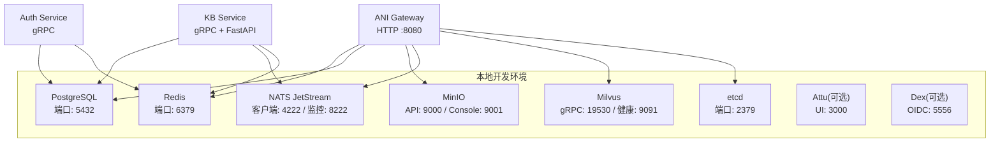
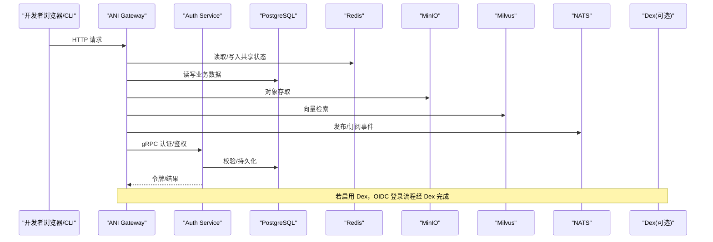
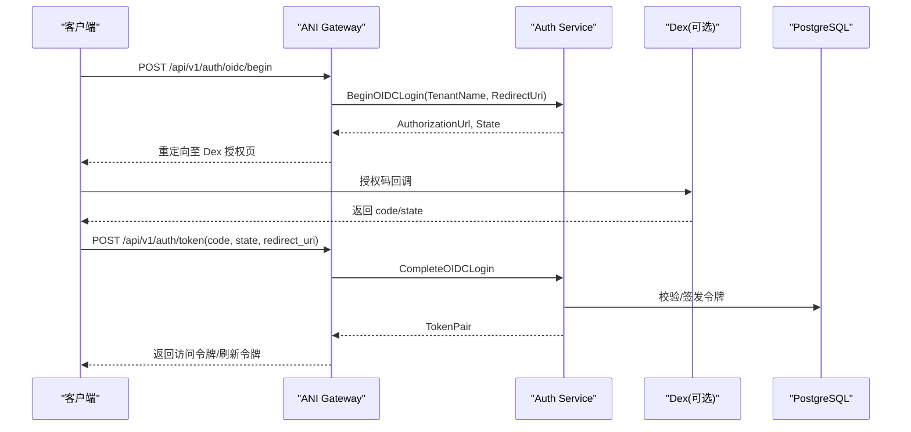
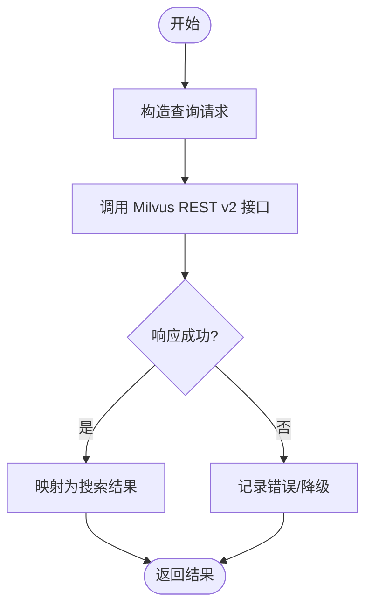
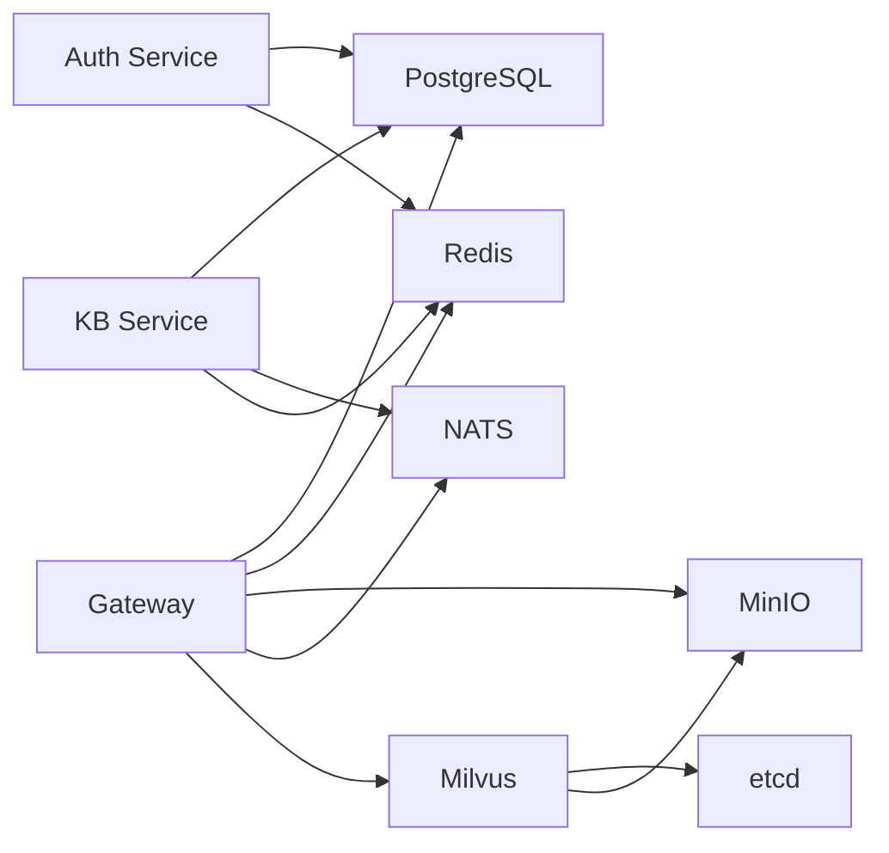

# Docker 开发环境

<cite>
**本文引用的文件**
- [docker-compose.yml](file://repo/deploy/docker/docker-compose.yml)
- [README.md](file://repo/deploy/docker/README.md)
- [dex-dev.yaml](file://repo/deploy/docker/config/dex-dev.yaml)
- [Makefile](file://repo/Makefile)
- [ani-gateway main.go](file://repo/services/ani-gateway/main.go)
- [auth-service main.go](file://repo/services/auth-service/main.go)
- [kb-service main.py](file://repo/services/kb-service/main.py)
</cite>

## 目录
1. [简介](#简介)
2. [项目结构](#项目结构)
3. [核心组件](#核心组件)
4. [架构总览](#架构总览)
5. [详细组件分析](#详细组件分析)
6. [依赖关系分析](#依赖关系分析)
7. [性能与容量建议](#性能与容量建议)
8. [故障排查指南](#故障排查指南)
9. [结论](#结论)
10. [附录：常用命令与工作流](#附录：常用命令与工作流)

## 简介
本指南面向本地开发者，说明如何使用仓库中的 Docker Compose 配置一键拉起 Core API、认证服务以及数据库、缓存、对象存储、消息总线、向量数据库等外部依赖，并给出环境变量配置、启动步骤、常见问题排查、调试方法与性能优化建议。

## 项目结构
仓库在 `repo/deploy/docker` 下提供本地开发环境的编排定义与说明文档；根目录的 `Makefile` 封装了依赖服务的启停、状态检查与清理等常用操作；各服务（Gateway、Auth Service、KB Service）通过环境变量与共享基础设施进行通信。

图表来源
- [docker-compose.yml:16-163](file://repo/deploy/docker/docker-compose.yml#L16-L163)
- [ani-gateway main.go:20-221](file://repo/services/ani-gateway/main.go#L20-L221)
- [auth-service main.go:9-31](file://repo/services/auth-service/main.go#L9-L31)
- [kb-service main.py:1-201](file://repo/services/kb-service/main.py#L1-L201)

章节来源
- [docker-compose.yml:1-184](file://repo/deploy/docker/docker-compose.yml#L1-L184)
- [README.md:1-77](file://repo/deploy/docker/README.md#L1-L77)
- [Makefile:160-186](file://repo/Makefile#L160-L186)

## 核心组件
- PostgreSQL（TimescaleDB）：控制面持久化存储，默认用户 ani，数据库 ani。
- MinIO：对象存储，初始化脚本会创建多个 Bucket。
- NATS JetStream：异步任务与事件总线。
- Redis：会话/限流/幂等共享存储，默认密码已设置。
- etcd + Milvus：向量检索后端，支持 Attu Web UI（可选）。
- Dex（可选）：OIDC 身份提供方，用于完整认证流程测试。
- ANI Gateway：对外 HTTP API 网关，连接上述所有依赖。
- Auth Service：gRPC 认证服务，负责 OIDC/JWT 相关能力。
- KB Service：gRPC + FastAPI 的知识库服务，使用 PG/NATS/Redis。

章节来源
- [docker-compose.yml:16-163](file://repo/deploy/docker/docker-compose.yml#L16-L163)
- [ani-gateway main.go:20-221](file://repo/services/ani-gateway/main.go#L20-L221)
- [auth-service main.go:9-31](file://repo/services/auth-service/main.go#L9-L31)
- [kb-service main.py:1-201](file://repo/services/kb-service/main.py#L1-L201)

## 架构总览
下图展示了本地开发环境中各服务之间的调用关系与数据流向。Gateway 作为统一入口，将请求路由到内部服务或直接访问外部依赖；认证链路通过 Auth Service 与可选的 Dex 完成；知识库处理走 KB Service。

图表来源
- [docker-compose.yml:16-163](file://repo/deploy/docker/docker-compose.yml#L16-L163)
- [ani-gateway main.go:20-221](file://repo/services/ani-gateway/main.go#L20-L221)
- [auth-service main.go:9-31](file://repo/services/auth-service/main.go#L9-L31)
- [kb-service main.py:1-201](file://repo/services/kb-service/main.py#L1-L201)

## 详细组件分析

### 依赖服务与端口
- PostgreSQL：容器名 ani-postgres，端口 127.0.0.1:5432，健康检查基于 pg_isready。
- MinIO：容器名 ani-minio，API 9000、Console 9001，附带 minio-init 任务创建 Bucket。
- NATS：容器名 ani-nats，启用 JetStream，客户端 4222、监控 8222。
- Redis：容器名 ani-redis，启用密码与内存策略，端口 6379。
- etcd：容器名 ani-milvus-etcd，为 Milvus 提供元数据。
- Milvus：容器名 ani-milvus，Standalone 模式，gRPC 19530、健康 9091。
- Attu（可选）：容器名 ani-attu，Web UI 3000，需 tools profile。
- Dex（可选）：容器名 ani-dex，OIDC 5556，需 auth profile。

章节来源
- [docker-compose.yml:16-163](file://repo/deploy/docker/docker-compose.yml#L16-L163)
- [README.md:19-38](file://repo/deploy/docker/README.md#L19-L38)

### 启动与停止
- 启动依赖：make deps
- 查看状态：make deps-status
- 停止保留数据：make deps-down
- 清理数据卷：make deps-clean

章节来源
- [Makefile:160-186](file://repo/Makefile#L160-L186)
- [README.md:9-17](file://repo/deploy/docker/README.md#L9-L17)

### 环境变量与配置要点
- Gateway
  - 监听地址：GATEWAY_LISTEN_ADDR（默认 :8080）
  - Redis 连接：优先 GATEWAY_REDIS_URL，其次 REDIS_URL；也支持集群/Sentinel 参数（MODE/ADDRS/MASTER_NAME/USERNAME/PASSWORD/SENTINEL_* 等）
- Auth Service
  - JWT/OIDC：JWTPublicKeyPEM/FILE、JWTPrivateKeyPEM/FILE、JWTIssuer、OIDCIssuerURL、OIDCClientID、OIDCClientSecret、OIDCAuthURL/TOKEN_URL/JWKS_URL、OIDCPublicKeyPEM/FILE、OIDCGroupRoleMapJSON
- KB Service
  - 数据库：database_url
  - 消息：nats_url、nats_parse_subject
  - 缓存：Redis（由 settings 注入）
- Dex（可选）
  - Issuer、静态客户端、回调地址、静态密码账号等，详见 dex-dev.yaml

章节来源
- [ani-gateway main.go:223-271](file://repo/services/ani-gateway/main.go#L223-L271)
- [auth-service main.go:14-29](file://repo/services/auth-service/main.go#L14-L29)
- [kb-service main.py:63-99](file://repo/services/kb-service/main.py#L63-L99)
- [dex-dev.yaml:1-31](file://repo/deploy/docker/config/dex-dev.yaml#L1-L31)

### 认证流程（含 Dex）

图表来源
- [ani-gateway main.go:20-221](file://repo/services/ani-gateway/main.go#L20-L221)
- [auth-service main.go:9-31](file://repo/services/auth-service/main.go#L9-L31)
- [dex-dev.yaml:1-31](file://repo/deploy/docker/config/dex-dev.yaml#L1-L31)

### 向量检索流程（Milvus）

图表来源
- [docker-compose.yml:110-163](file://repo/deploy/docker/docker-compose.yml#L110-L163)

章节来源
- [docker-compose.yml:110-163](file://repo/deploy/docker/docker-compose.yml#L110-L163)

## 依赖关系分析
- Gateway 强依赖：PostgreSQL、Redis、MinIO、NATS、Milvus（可选）、Kubernetes（运行时扩展）。
- Auth Service 强依赖：PostgreSQL、Redis（缓存与会话）。
- KB Service 强依赖：PostgreSQL、NATS（outbox）、Redis（会话缓存）。
- Milvus 依赖：etcd、MinIO。
- Dex（可选）独立运行，供 OIDC 流程使用。

图表来源
- [docker-compose.yml:16-163](file://repo/deploy/docker/docker-compose.yml#L16-L163)
- [ani-gateway main.go:20-221](file://repo/services/ani-gateway/main.go#L20-L221)
- [auth-service main.go:9-31](file://repo/services/auth-service/main.go#L9-L31)
- [kb-service main.py:1-201](file://repo/services/kb-service/main.py#L1-L201)

章节来源
- [docker-compose.yml:16-163](file://repo/deploy/docker/docker-compose.yml#L16-L163)

## 性能与容量建议
- 资源分配
  - 建议主机内存 ≥ 8GB，磁盘 ≥ 20GB（Milvus 较吃内存）。
  - 合理限制 Redis 最大内存与淘汰策略（Compose 已配置 allkeys-lru）。
- 网络与端口
  - 所有端口绑定 127.0.0.1，避免意外暴露到局域网。
- 可观测性
  - NATS 监控 8222、Milvus 健康 9091、Attu 3000（tools profile）便于定位问题。
- 启动顺序与健康检查
  - Compose 已通过 healthcheck 与 depends_on 保证关键依赖就绪后再启动上层服务。

章节来源
- [README.md:3-7](file://repo/deploy/docker/README.md#L3-L7)
- [docker-compose.yml:30-163](file://repo/deploy/docker/docker-compose.yml#L30-L163)

## 故障排查指南
- 无法连接数据库
  - 确认 PG 容器健康：pg_isready -U ani
  - 检查端口是否被占用（127.0.0.1:5432）
- MinIO 不可用
  - 使用 mc ready local 或访问 Console 9001 验证
  - 确认 minio-init 已完成 Bucket 创建
- NATS 无响应
  - 访问 http://localhost:8222/healthz 检查监控端点
- Redis 认证失败
  - 确认密码 ani_dev_password，或使用 GATEWAY_REDIS_* 覆盖
- Milvus 未就绪
  - 等待 etcd 与 MinIO 就绪后，再检查 9091 健康端点
- Dex 登录异常
  - 核对 dex-dev.yaml 中 issuer、client、redirectURIs
  - 确保 AUTH_OIDC_ISSUER_URL 等环境变量与 Dex 一致

章节来源
- [docker-compose.yml:30-163](file://repo/deploy/docker/docker-compose.yml#L30-L163)
- [README.md:19-51](file://repo/deploy/docker/README.md#L19-L51)

## 结论
通过 Compose 与 Makefile 的配合，开发者可在本地快速拉起完整的 Core API 运行栈，包括认证、存储、缓存、消息与向量检索等关键依赖。配合可选的 Dex 与工具面板，能够高效完成端到端联调与问题定位。建议遵循本文的环境变量约定与排障步骤，以获得稳定的开发体验。

## 附录：常用命令与工作流
- 启动依赖：make deps
- 查看状态：make deps-status
- 停止服务：make deps-down
- 清理数据：make deps-clean
- 启动可选工具
  - Attu：docker compose -f deploy/docker/docker-compose.yml --profile tools up -d attu
  - Dex：docker compose -f deploy/docker/docker-compose.yml --profile auth up -d dex
- 构建与生成
  - 构建 Gateway/Auth/Task/Model/Reconcile/CLI：make build-*
  - 代码生成：make gen-api / make gen-proto / make gen-core-sdk / make gen-api-docs
- 测试与门禁
  - 运行测试：make test / make test-cover
  - 各类契约与 live gate：make validate-*（见 Makefile help）

章节来源
- [Makefile:160-186](file://repo/Makefile#L160-L186)
- [Makefile:188-227](file://repo/Makefile#L188-L227)
- [Makefile:234-280](file://repo/Makefile#L234-L280)
- [Makefile:282-297](file://repo/Makefile#L282-L297)
- [README.md:30-59](file://repo/deploy/docker/README.md#L30-L59)