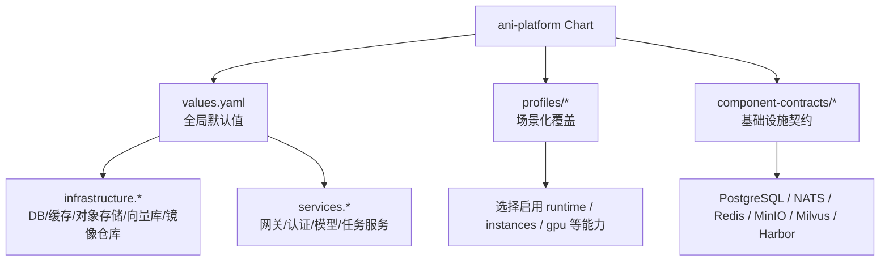
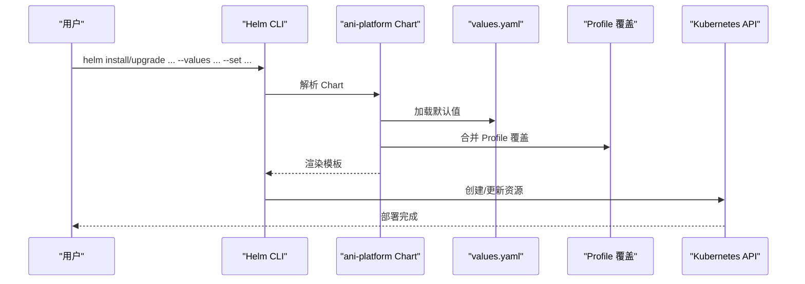
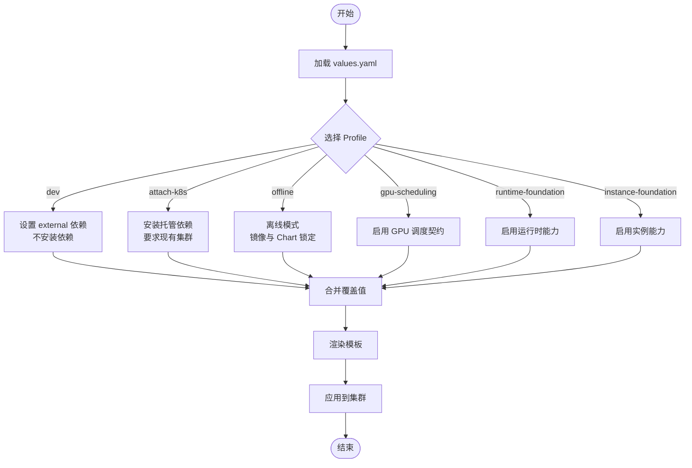
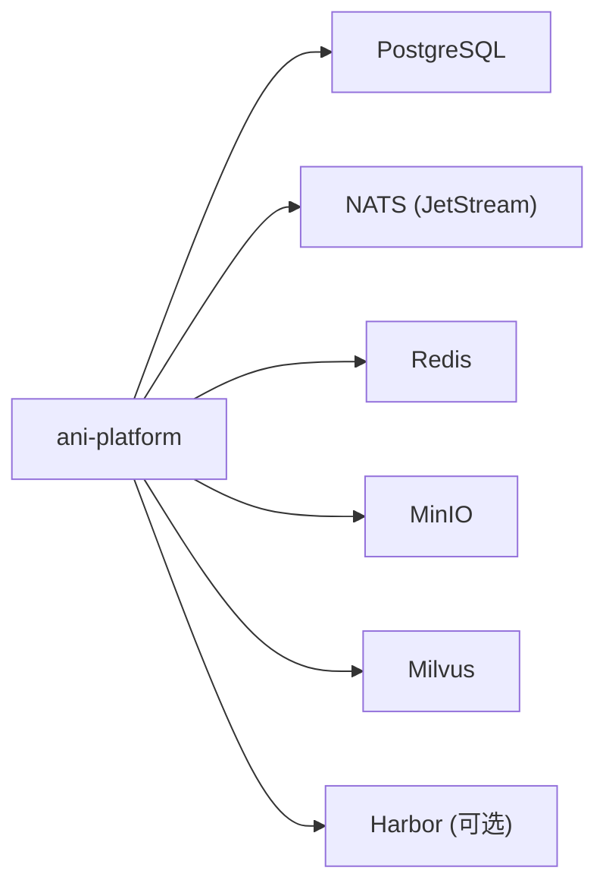

# Helm 部署

<cite>
**本文引用的文件**
- [Chart.yaml](file://repo/deploy/helm/ani-platform/Chart.yaml)
- [values.yaml](file://repo/deploy/helm/ani-platform/values.yaml)
- [dev.yaml](file://repo/deploy/helm/ani-platform/profiles/dev.yaml)
- [runtime-foundation.yaml](file://repo/deploy/helm/ani-platform/profiles/runtime-foundation.yaml)
- [instance-foundation.yaml](file://repo/deploy/helm/ani-platform/profiles/instance-foundation.yaml)
- [gpu-scheduling.yaml](file://repo/deploy/helm/ani-platform/profiles/gpu-scheduling.yaml)
- [attach-k8s.yaml](file://repo/deploy/helm/ani-platform/profiles/attach-k8s.yaml)
- [offline.yaml](file://repo/deploy/helm/ani-platform/profiles/offline.yaml)
- [postgresql.yaml](file://repo/deploy/helm/ani-platform/component-contracts/postgresql.yaml)
- [nats.yaml](file://repo/deploy/helm/ani-platform/component-contracts/nats.yaml)
- [redis.yaml](file://repo/deploy/helm/ani-platform/component-contracts/redis.yaml)
- [minio.yaml](file://repo/deploy/helm/ani-platform/component-contracts/minio.yaml)
- [milvus.yaml](file://repo/deploy/helm/ani-platform/component-contracts/milvus.yaml)
- [harbor.yaml](file://repo/deploy/helm/ani-platform/component-contracts/harbor.yaml)
</cite>

## 目录
1. [简介](#简介)
2. [项目结构](#项目结构)
3. [核心组件](#核心组件)
4. [架构总览](#架构总览)
5. [详细组件分析](#详细组件分析)
6. [依赖关系分析](#依赖关系分析)
7. [性能与容量建议](#性能与容量建议)
8. [故障排查指南](#故障排查指南)
9. [结论](#结论)
10. [附录：部署命令与操作手册](#附录：部署命令与操作手册)

## 简介
本章节面向使用 Helm 部署 ani-platform 的运维与平台工程师，系统说明 Chart 的结构、配置项、不同 profile 的用途与差异、基础设施组件契约（数据库、存储、消息队列等）的配置方法，并提供完整的部署、升级、回滚与卸载操作指引。

## 项目结构
ani-platform 是一个 umbrella chart，用于编排 ANI 平台及其依赖的基础设施组件与服务。其关键目录与职责如下：
- Chart.yaml：定义 Chart 元信息、应用版本、维护者与注解（包含组件契约与依赖声明）。
- values.yaml：全局默认值，包括命名空间、镜像仓库、网络策略、基础设施模式、运行时能力、实例能力、服务开关与端口等。
- profiles/*：按场景裁剪能力的 Profile 覆盖文件，如 dev、runtime-foundation、instance-foundation、gpu-scheduling、attach-k8s、offline 等。
- component-contracts/*：基础设施组件契约，描述每个组件的职责、提供者、模式选项、密钥、校验规则等。

图表来源
- [Chart.yaml:1-16](file://repo/deploy/helm/ani-platform/Chart.yaml#L1-L16)
- [values.yaml:1-262](file://repo/deploy/helm/ani-platform/values.yaml#L1-L262)

章节来源
- [Chart.yaml:1-16](file://repo/deploy/helm/ani-platform/Chart.yaml#L1-L16)
- [values.yaml:1-262](file://repo/deploy/helm/ani-platform/values.yaml#L1-L262)

## 核心组件
- 平台服务
  - gateway：API 网关，对外暴露 HTTP/GRPC 入口。
  - auth：身份认证服务。
  - model：模型管理服务。
  - task：任务调度与执行服务。
- 基础设施组件（通过契约管理）
  - PostgreSQL：平台元数据与行级安全（RLS）强制。
  - NATS：基于 JetStream 的异步任务队列与生命周期事件总线。
  - Redis：限流、JWT 黑名单与短期协调状态。
  - MinIO：S3 兼容对象存储，存放模型、数据集与知识库文档。
  - Milvus：向量数据库，支撑 RAG 检索。
  - Harbor：外部镜像仓库（可选），用于离线与客户现场部署。

章节来源
- [values.yaml:237-262](file://repo/deploy/helm/ani-platform/values.yaml#L237-L262)
- [postgresql.yaml:1-33](file://repo/deploy/helm/ani-platform/component-contracts/postgresql.yaml#L1-L33)
- [nats.yaml:1-26](file://repo/deploy/helm/ani-platform/component-contracts/nats.yaml#L1-L26)
- [redis.yaml:1-21](file://repo/deploy/helm/ani-platform/component-contracts/redis.yaml#L1-L21)
- [minio.yaml:1-25](file://repo/deploy/helm/ani-platform/component-contracts/minio.yaml#L1-L25)
- [milvus.yaml:1-24](file://repo/deploy/helm/ani-platform/component-contracts/milvus.yaml#L1-L24)
- [harbor.yaml:1-17](file://repo/deploy/helm/ani-platform/component-contracts/harbor.yaml#L1-L17)

## 架构总览
Helm 渲染流程将 values.yaml 作为基线，再叠加所选 profile 的覆盖值，最终生成 Kubernetes 资源并安装到集群。基础设施组件可通过 external 或 managed 两种模式接入；服务层通过 values 中的开关控制启用与否。

图表来源
- [Chart.yaml:1-16](file://repo/deploy/helm/ani-platform/Chart.yaml#L1-L16)
- [values.yaml:1-262](file://repo/deploy/helm/ani-platform/values.yaml#L1-L262)

## 详细组件分析

### 组件契约与配置方法
- PostgreSQL
  - 角色与约束：应用角色需禁用 superuser、禁止 bypass rls、强制启用 rls；迁移角色仅用于迁移且不被应用服务直接使用。
  - 模式：external 或 managed。
  - 密钥：数据库连接串通过 Secret 注入。
  - 验证：离线 YAML 解析、迁移 dry-run、RLS 租户隔离测试。
- NATS
  - 用途：JetStream 支持的异步任务队列与生命周期事件。
  - 模式：external 或 managed；必须启用 JetStream。
  - 主题：预定义若干任务与事件主题。
  - 密钥：NATS 连接串通过 Secret 注入。
  - 验证：流创建 dry-run、发布订阅冒烟测试。
- Redis
  - 用途：限流、JWT 黑名单、短期协调状态。
  - 模式：external 或 managed。
  - Key 前缀：jwtBlocklistPrefix、rateLimitPrefix。
  - 密钥：Redis 连接串通过 Secret 注入。
  - 验证：ping、TTL 读写测试。
- MinIO
  - 用途：S3 兼容对象存储，存放模型、数据集、知识库文档。
  - 模式：external 或 managed。
  - Bucket：预置多个业务 bucket。
  - 密钥：MinIO endpoint 等通过 Secret 注入。
  - 验证：bucket 存在性或创建、对象 put/get 冒烟测试。
- Milvus
  - 用途：向量数据库，支撑 RAG 检索。
  - 模式：external 或 managed；不同 profile 可指定 standalone/cluster。
  - 集合：默认维度与度量类型。
  - 验证：集合创建 dry-run、向量插入搜索冒烟测试。
- Harbor
  - 用途：外部容器镜像仓库，用于离线与客户现场部署。
  - 模式：external；非必需。
  - 设计约束：Harbor 独立部署，ANI 不应强依赖其可用性；Gateway harbor-proxy 为后续集成模块。
  - 验证：注册表可达、Trivy 启用检查。

章节来源
- [postgresql.yaml:1-33](file://repo/deploy/helm/ani-platform/component-contracts/postgresql.yaml#L1-L33)
- [nats.yaml:1-26](file://repo/deploy/helm/ani-platform/component-contracts/nats.yaml#L1-L26)
- [redis.yaml:1-21](file://repo/deploy/helm/ani-platform/component-contracts/redis.yaml#L1-L21)
- [minio.yaml:1-25](file://repo/deploy/helm/ani-platform/component-contracts/minio.yaml#L1-L25)
- [milvus.yaml:1-24](file://repo/deploy/helm/ani-platform/component-contracts/milvus.yaml#L1-L24)
- [harbor.yaml:1-17](file://repo/deploy/helm/ani-platform/component-contracts/harbor.yaml#1-L17)

### Profile 对比与用途
- dev
  - 适用：本地开发，依赖外部可达或通过 docker-compose 提供。
  - 关键点：不安装依赖、不要求现有 StorageClass；所有基础设施以 external 模式接入。
- attach-k8s
  - 适用：附加到已有 Kubernetes 集群，仅安装 ANI 平台组件。
  - 关键点：需要现有集群；基础设施以 managed 模式安装（PostgreSQL/NATS/Redis/MinIO/Milvus）。
- offline
  - 适用：离线客户现场部署，使用预镜像镜像与打包 Chart。
  - 关键点：强制镜像与 Chart 锁定；基础设施以 managed 模式安装，需替换 StorageClass。
- cluster-validation
  - 适用：在安装或升级前运行集群侧预检。
  - 关键点：不安装依赖；要求现有 StorageClass。
- gpu-scheduling
  - 适用：启用 GPU 调度契约（GPU Operator、HAMi、Volcano、DCGM）。
  - 关键点：需要 GPU 节点标签；各组件以 external 模式接入。
- gpu-scheduling-e2e
  - 适用：在 GPU 依赖安装后运行预检/e2e 检查。
  - 关键点：不安装依赖；需要 GPU 节点标签。
- runtime-foundation
  - 适用：启用工作负载运行时契约（VM、容器、GPU 容器、推理、笔记本、沙箱、批处理）。
  - 关键点：按需启用各 provider；默认隔离策略（租户网络策略、经网关入站、出站互联网关闭）。
- instance-foundation
  - 适用：启用一等实例对象、生命周期、网络平面与存储挂载契约。
  - 关键点：启用多网络平面（租户 VPC、基础 Mesh、存储、管理、公网 Ingress）；配置根盘/数据盘/共享 PVC/ObjectFuse/Ephemeral 存储类与保留策略。

章节来源
- [values.yaml:10-47](file://repo/deploy/helm/ani-platform/values.yaml#L10-L47)
- [dev.yaml:1-24](file://repo/deploy/helm/ani-platform/profiles/dev.yaml#L1-L24)
- [attach-k8s.yaml:1-39](file://repo/deploy/helm/ani-platform/profiles/attach-k8s.yaml#L1-L39)
- [offline.yaml:1-44](file://repo/deploy/helm/ani-platform/profiles/offline.yaml#L1-L44)
- [gpu-scheduling.yaml:1-35](file://repo/deploy/helm/ani-platform/profiles/gpu-scheduling.yaml#L1-L35)
- [runtime-foundation.yaml:1-26](file://repo/deploy/helm/ani-platform/profiles/runtime-foundation.yaml#L1-L26)
- [instance-foundation.yaml:1-55](file://repo/deploy/helm/ani-platform/profiles/instance-foundation.yaml#L1-L55)

### 运行时与实例能力
- 运行时（runtime）
  - 支持 VM、容器、GPU 容器、推理、笔记本、Agent 沙箱、批处理作业等 provider。
  - 默认隔离：租户网络策略、入站经网关、出站互联网关闭。
- 实例（instances）
  - 生命周期动作：create/start/stop/restart/resize/delete。
  - 网络平面：租户 VPC、基础 Mesh、存储、管理、公网 Ingress。
  - 存储挂载：根盘/数据盘/共享 PVC/ObjectFuse/Ephemeral，支持默认存储类与保留策略。

章节来源
- [values.yaml:158-235](file://repo/deploy/helm/ani-platform/values.yaml#L158-L235)
- [runtime-foundation.yaml:1-26](file://repo/deploy/helm/ani-platform/profiles/runtime-foundation.yaml#L1-L26)
- [instance-foundation.yaml:1-55](file://repo/deploy/helm/ani-platform/profiles/instance-foundation.yaml#L1-L55)

### 关键流程图：Profile 合并与能力生效

图表来源
- [values.yaml:1-262](file://repo/deploy/helm/ani-platform/values.yaml#L1-L262)
- [dev.yaml:1-24](file://repo/deploy/helm/ani-platform/profiles/dev.yaml#L1-L24)
- [attach-k8s.yaml:1-39](file://repo/deploy/helm/ani-platform/profiles/attach-k8s.yaml#L1-L39)
- [offline.yaml:1-44](file://repo/deploy/helm/ani-platform/profiles/offline.yaml#L1-L44)
- [gpu-scheduling.yaml:1-35](file://repo/deploy/helm/ani-platform/profiles/gpu-scheduling.yaml#L1-L35)
- [runtime-foundation.yaml:1-26](file://repo/deploy/helm/ani-platform/profiles/runtime-foundation.yaml#L1-L26)
- [instance-foundation.yaml:1-55](file://repo/deploy/helm/ani-platform/profiles/instance-foundation.yaml#L1-L55)

## 依赖关系分析
- Chart 级别依赖声明：PostgreSQL、NATS、Redis、MinIO、Milvus、Harbor。
- 组件契约定义了各组件的模式选项、密钥注入点与验证规则，确保在不同环境（external/managed）下行为一致。
- Profile 决定哪些能力被启用以及依赖是否由 Chart 安装。

图表来源
- [Chart.yaml:11-15](file://repo/deploy/helm/ani-platform/Chart.yaml#L11-L15)
- [postgresql.yaml:1-33](file://repo/deploy/helm/ani-platform/component-contracts/postgresql.yaml#L1-L33)
- [nats.yaml:1-26](file://repo/deploy/helm/ani-platform/component-contracts/nats.yaml#L1-L26)
- [redis.yaml:1-21](file://repo/deploy/helm/ani-platform/component-contracts/redis.yaml#L1-L21)
- [minio.yaml:1-25](file://repo/deploy/helm/ani-platform/component-contracts/minio.yaml#L1-L25)
- [milvus.yaml:1-24](file://repo/deploy/helm/ani-platform/component-contracts/milvus.yaml#L1-L24)
- [harbor.yaml:1-17](file://repo/deploy/helm/ani-platform/component-contracts/harbor.yaml#L1-L17)

章节来源
- [Chart.yaml:11-15](file://repo/deploy/helm/ani-platform/Chart.yaml#L11-L15)

## 性能与容量建议
- PostgreSQL
  - 生产建议使用 managed 模式并配置多副本与合适的存储类；开启 RLS 保障租户隔离。
- NATS
  - 必须启用 JetStream；根据任务量调整副本与持久化存储大小。
- Redis
  - 根据限流与并发需求评估内存与持久化策略；合理设置 TTL。
- MinIO
  - 根据模型与数据集规模规划桶与分片；考虑多副本与纠删码。
- Milvus
  - 根据向量维度与查询延迟目标选择 standalone/cluster；预留足够 CPU/内存与磁盘。
- Harbor
  - 作为外部依赖时，确保可达性与扫描能力（Trivy）；避免成为单点瓶颈。

[本节为通用指导，不直接分析具体文件]

## 故障排查指南
- 前置校验
  - 使用 cluster-validation profile 进行预检，检查 CRD、命名空间、Secret、StorageClass 等。
- 常见错误定位
  - 数据库连接失败：检查 Secret 中 database-url 是否正确，PostgreSQL 是否可用。
  - 消息队列不可用：确认 NATS JetStream 已启用，主题是否存在。
  - 对象存储异常：验证 MinIO endpoint 与桶是否存在，权限是否正确。
  - 向量库问题：检查 Milvus 集合创建与写入能力。
  - Harbor 不可达：确认网络连通与 Trivy 启用。
- 日志与事件
  - 查看相关 Pod 事件与日志；必要时启用 validation 与 preflightJob。

章节来源
- [values.yaml:94-108](file://repo/deploy/helm/ani-platform/values.yaml#L94-L108)
- [postgresql.yaml:27-33](file://repo/deploy/helm/ani-platform/component-contracts/postgresql.yaml#L27-L33)
- [nats.yaml:20-26](file://repo/deploy/helm/ani-platform/component-contracts/nats.yaml#L20-L26)
- [redis.yaml:15-21](file://repo/deploy/helm/ani-platform/component-contracts/redis.yaml#L15-L21)
- [minio.yaml:19-25](file://repo/deploy/helm/ani-platform/component-contracts/minio.yaml#L19-L25)
- [milvus.yaml:18-24](file://repo/deploy/helm/ani-platform/component-contracts/milvus.yaml#L18-L24)
- [harbor.yaml:11-17](file://repo/deploy/helm/ani-platform/component-contracts/harbor.yaml#L11-L17)

## 结论
ani-platform 通过 values.yaml 与 Profile 的组合，提供了从开发到生产的多种部署形态。组件契约确保了基础设施的一致性与可验证性。结合预检、验证与合理的容量规划，可在不同环境中稳定交付平台能力。

[本节为总结性内容，不直接分析具体文件]

## 附录：部署命令与操作手册

- 基本安装
  - 使用 dev profile 快速启动（依赖外部可达）：
    - helm install ani ./repo/deploy/helm/ani-platform --namespace ani-system --values repo/deploy/helm/ani-platform/profiles/dev.yaml
  - 附加到现有集群并安装托管依赖：
    - helm install ani ./repo/deploy/helm/ani-platform --namespace ani-system --values repo/deploy/helm/ani-platform/profiles/attach-k8s.yaml
  - 离线部署（需准备镜像与 Chart 锁文件，并替换 StorageClass）：
    - helm install ani ./repo/deploy/helm/ani-platform --namespace ani-system --values repo/deploy/helm/ani-platform/profiles/offline.yaml

- 启用特定能力
  - 启用运行时能力：
    - helm upgrade ani ./repo/deploy/helm/ani-platform --namespace ani-system --values repo/deploy/helm/ani-platform/profiles/runtime-foundation.yaml
  - 启用实例能力：
    - helm upgrade ani ./repo/deploy/helm/ani-platform --namespace ani-system --values repo/deploy/helm/ani-platform/profiles/instance-foundation.yaml
  - 启用 GPU 调度：
    - helm upgrade ani ./repo/deploy/helm/ani-platform --namespace ani-system --values repo/deploy/helm/ani-platform/profiles/gpu-scheduling.yaml

- 自定义配置
  - 通过 --set 覆盖单个值（例如镜像仓库、端口、开关等）：
    - helm install ani ./repo/deploy/helm/ani-platform --namespace ani-system --values repo/deploy/helm/ani-platform/profiles/dev.yaml --set global.imageRegistry=your.registry/ani
  - 通过额外 values 文件合并覆盖：
    - helm install ani ./repo/deploy/helm/ani-platform --namespace ani-system -f custom-values.yaml

- 升级与回滚
  - 升级：
    - helm upgrade ani ./repo/deploy/helm/ani-platform --namespace ani-system --values repo/deploy/helm/ani-platform/profiles/<profile>.yaml
  - 回滚：
    - helm rollback ani <release-revision> --namespace ani-system

- 卸载
  - helm uninstall ani --namespace ani-system

- 预检与验证
  - 使用 cluster-validation profile 进行集群预检：
    - helm install ani-preflight ./repo/deploy/helm/ani-platform --namespace ani-system --values repo/deploy/helm/ani-platform/profiles/cluster-validation.yaml

章节来源
- [values.yaml:1-262](file://repo/deploy/helm/ani-platform/values.yaml#L1-L262)
- [dev.yaml:1-24](file://repo/deploy/helm/ani-platform/profiles/dev.yaml#L1-L24)
- [attach-k8s.yaml:1-39](file://repo/deploy/helm/ani-platform/profiles/attach-k8s.yaml#L1-L39)
- [offline.yaml:1-44](file://repo/deploy/helm/ani-platform/profiles/offline.yaml#L1-L44)
- [runtime-foundation.yaml:1-26](file://repo/deploy/helm/ani-platform/profiles/runtime-foundation.yaml#L1-L26)
- [instance-foundation.yaml:1-55](file://repo/deploy/helm/ani-platform/profiles/instance-foundation.yaml#L1-L55)
- [gpu-scheduling.yaml:1-35](file://repo/deploy/helm/ani-platform/profiles/gpu-scheduling.yaml#L1-L35)