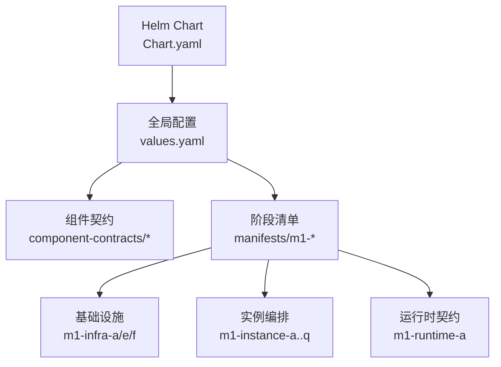
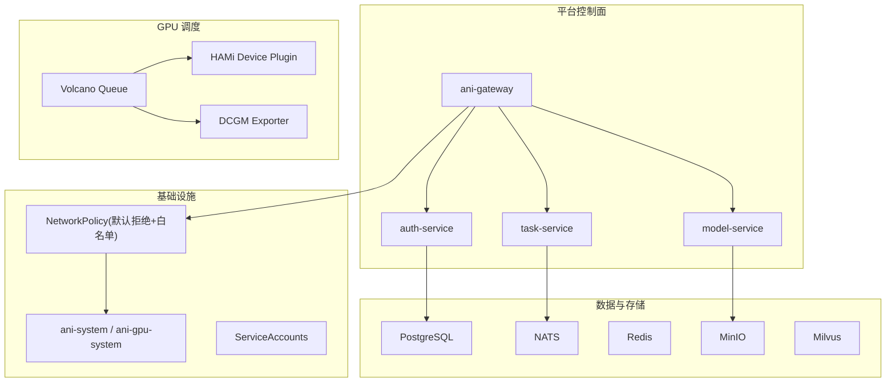
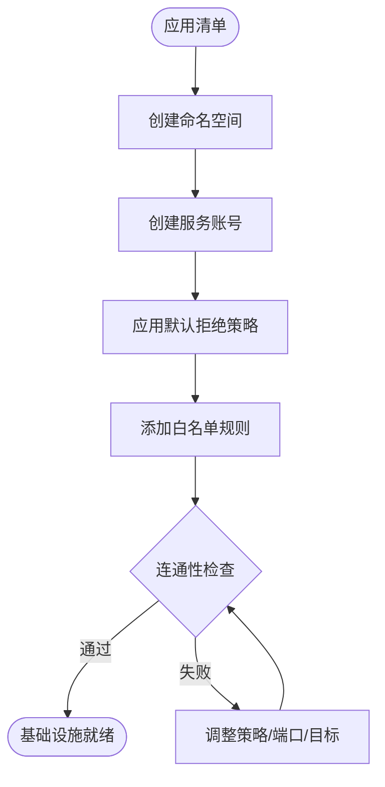
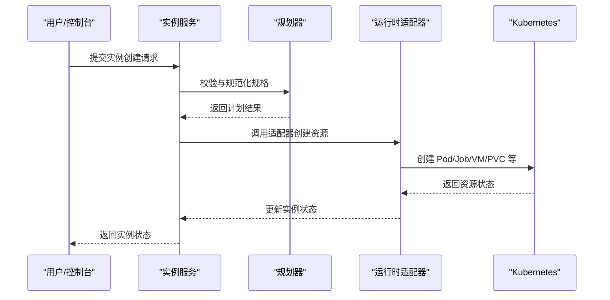
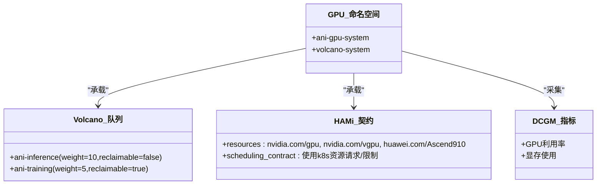
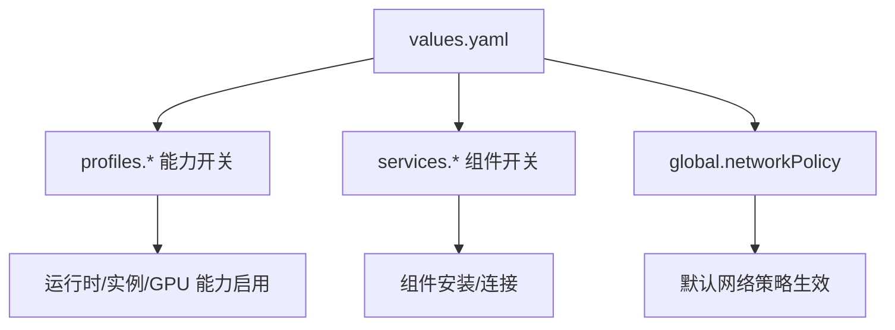
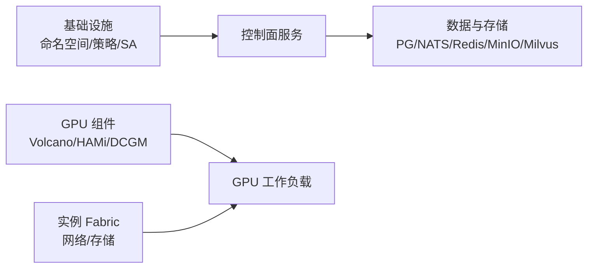

# Kubernetes 清单

<cite>
**本文引用的文件**
- [Chart.yaml](file://repo/deploy/helm/ani-platform/Chart.yaml)
- [values.yaml](file://repo/deploy/helm/ani-platform/values.yaml)
- [gpu-scheduling.yaml](file://repo/deploy/helm/ani-platform/component-contracts/gpu-scheduling.yaml)
- [instance-fabric.yaml](file://repo/deploy/helm/ani-platform/component-contracts/instance-fabric.yaml)
- [00-namespace.yaml](file://repo/deploy/manifests/m1-infra-a/00-namespace.yaml)
- [20-networkpolicy.yaml](file://repo/deploy/manifests/m1-infra-a/20-networkpolicy.yaml)
- [30-serviceaccounts.yaml](file://repo/deploy/manifests/m1-infra-a/30-serviceaccounts.yaml)
- [00-gpu-namespaces.yaml](file://repo/deploy/manifests/m1-infra-e/00-gpu-namespaces.yaml)
- [20-volcano-queue-template.yaml](file://repo/deploy/manifests/m1-infra-e/20-volcano-queue-template.yaml)
- [30-hami-device-plugin-contract.yaml](file://repo/deploy/manifests/m1-infra-e/30-hami-device-plugin-contract.yaml)
- [00-instance-object-contract.yaml](file://repo/deploy/manifests/m1-instance-a/00-instance-object-contract.yaml)
- [10-instance-network-plan.yaml](file://repo/deploy/manifests/m1-instance-a/10-instance-network-plan.yaml)
- [20-instance-storage-plan.yaml](file://repo/deploy/manifests/m1-instance-a/20-instance-storage-plan.yaml)
- [00-workload-runtime-contract.yaml](file://repo/deploy/manifests/m1-runtime-a/00-workload-runtime-contract.yaml)
</cite>

## 目录
1. [简介](#简介)
2. [项目结构](#项目结构)
3. [核心组件](#核心组件)
4. [架构总览](#架构总览)
5. [详细组件分析](#详细组件分析)
6. [依赖关系分析](#依赖关系分析)
7. [性能考虑](#性能考虑)
8. [故障排查指南](#故障排查指南)
9. [结论](#结论)
10. [附录](#附录)

## 简介
本文件面向 ANI 平台的 Kubernetes 清单与 Helm 配置，系统性说明各阶段清单的作用、配置要求与部署流程。内容覆盖：
- 基础设施准备：命名空间、RBAC（ServiceAccount）、网络策略
- 实例管理：实例对象契约、网络平面、存储挂载、生命周期
- GPU 调度：GPU 命名空间、Volcano 队列、HAMi 设备插件契约、DCGM 可观测性
- 生产环境安全加固与最佳实践
- 分阶段部署指导与验证步骤

## 项目结构
仓库将“平台能力契约”和“阶段化清单”分离：
- Helm Chart 定义全局配置与组件开关，并通过 values.yaml 控制是否启用 GPU、运行时、实例等能力
- component-contracts 描述组件间能力边界与依赖（如 GPU 调度、实例 Fabric）
- manifests 按阶段组织清单，例如 m1-infra-a（基础命名空间、网络策略、服务账号）、m1-infra-e（GPU 相关命名空间、队列、设备插件契约）、m1-instance-*（实例契约、计划器、渲染器、执行器等）、m1-runtime-a（工作负载运行时契约）

图表来源
- [Chart.yaml:1-16](file://repo/deploy/helm/ani-platform/Chart.yaml#L1-L16)
- [values.yaml:1-262](file://repo/deploy/helm/ani-platform/values.yaml#L1-L262)

章节来源
- [Chart.yaml:1-16](file://repo/deploy/helm/ani-platform/Chart.yaml#L1-L16)
- [values.yaml:1-262](file://repo/deploy/helm/ani-platform/values.yaml#L1-L262)

## 核心组件
- 平台命名空间与隔离：创建 ani-system 命名空间并标注平台范围
- 默认拒绝与最小权限网络策略：在 ani-system 内默认拒绝入站/出站，仅放行必要流量（DNS、数据库、消息总线、对象存储、向量库、网关入口）
- 服务账号：为网关、认证、任务、模型等服务提供独立身份
- GPU 系统命名空间与队列：为 GPU 调度与可观测性建立专用命名空间与 Volcano 队列
- 设备插件契约：声明支持的 GPU 资源类型与调度边界
- 实例 Fabric：统一实例种类、网络平面、存储挂载与访问面
- 运行时契约：明确各类工作负载的运行时适配器与必需字段

章节来源
- [00-namespace.yaml:1-9](file://repo/deploy/manifests/m1-infra-a/00-namespace.yaml#L1-L9)
- [20-networkpolicy.yaml:1-76](file://repo/deploy/manifests/m1-infra-a/20-networkpolicy.yaml#L1-L76)
- [30-serviceaccounts.yaml:1-36](file://repo/deploy/manifests/m1-infra-a/30-serviceaccounts.yaml#L1-L36)
- [00-gpu-namespaces.yaml:1-16](file://repo/deploy/manifests/m1-infra-e/00-gpu-namespaces.yaml#L1-L16)
- [20-volcano-queue-template.yaml:1-24](file://repo/deploy/manifests/m1-infra-e/20-volcano-queue-template.yaml#L1-L24)
- [30-hami-device-plugin-contract.yaml:1-18](file://repo/deploy/manifests/m1-infra-e/30-hami-device-plugin-contract.yaml#L1-L18)
- [instance-fabric.yaml:1-36](file://repo/deploy/helm/ani-platform/component-contracts/instance-fabric.yaml#L1-L36)
- [00-workload-runtime-contract.yaml:1-31](file://repo/deploy/manifests/m1-runtime-a/00-workload-runtime-contract.yaml#L1-L31)

## 架构总览
ANI 平台通过 Helm 统一管理组件开关与依赖，使用阶段化清单逐步构建基础设施、实例能力与运行时契约。GPU 能力通过外部组件（GPU Operator/HAMi/Volcano/DCGM）集成，并以资源请求/限制作为调度边界。

图表来源
- [values.yaml:237-262](file://repo/deploy/helm/ani-platform/values.yaml#L237-L262)
- [20-networkpolicy.yaml:1-76](file://repo/deploy/manifests/m1-infra-a/20-networkpolicy.yaml#L1-L76)
- [00-gpu-namespaces.yaml:1-16](file://repo/deploy/manifests/m1-infra-e/00-gpu-namespaces.yaml#L1-L16)
- [20-volcano-queue-template.yaml:1-24](file://repo/deploy/manifests/m1-infra-e/20-volcano-queue-template.yaml#L1-L24)
- [30-hami-device-plugin-contract.yaml:1-18](file://repo/deploy/manifests/m1-infra-e/30-hami-device-plugin-contract.yaml#L1-L18)

## 详细组件分析

### 基础设施准备：命名空间、RBAC、网络策略
- 命名空间
  - 创建 ani-system 并标记平台范围，用于承载平台控制面与共享资源
  - 创建 ani-gpu-system 与 volcano-system 用于 GPU 调度与可观测性
- RBAC（ServiceAccount）
  - 为网关、认证、任务、模型服务分别创建 ServiceAccount，便于后续绑定 Role/ClusterRole 实现最小权限
- 网络策略
  - 默认拒绝所有入站/出站
  - 允许 DNS 解析（kube-system 53/TCP+UDP）
  - 允许平台组件访问后端（PostgreSQL 5432、NATS 4222、Redis 6379、MinIO 9000、Milvus 19530）
  - 允许外部流量进入 ani-gateway 8080

图表来源
- [00-namespace.yaml:1-9](file://repo/deploy/manifests/m1-infra-a/00-namespace.yaml#L1-L9)
- [30-serviceaccounts.yaml:1-36](file://repo/deploy/manifests/m1-infra-a/30-serviceaccounts.yaml#L1-L36)
- [20-networkpolicy.yaml:1-76](file://repo/deploy/manifests/m1-infra-a/20-networkpolicy.yaml#L1-L76)
- [00-gpu-namespaces.yaml:1-16](file://repo/deploy/manifests/m1-infra-e/00-gpu-namespaces.yaml#L1-L16)

章节来源
- [00-namespace.yaml:1-9](file://repo/deploy/manifests/m1-infra-a/00-namespace.yaml#L1-L9)
- [20-networkpolicy.yaml:1-76](file://repo/deploy/manifests/m1-infra-a/20-networkpolicy.yaml#L1-L76)
- [30-serviceaccounts.yaml:1-36](file://repo/deploy/manifests/m1-infra-a/30-serviceaccounts.yaml#L1-L36)
- [00-gpu-namespaces.yaml:1-16](file://repo/deploy/manifests/m1-infra-e/00-gpu-namespaces.yaml#L1-L16)

### 实例管理：对象契约、网络平面、存储挂载
- 实例对象契约
  - 定义支持的实例种类（vm、container、gpu_container、inference、notebook、agent_sandbox、batch_job）
  - 定义生命周期动作与状态机（create/start/stop/restart/resize/delete；pending/provisioning/starting/running/stopping/stopped/failed/deleting/deleted）
  - 规定必填字段（tenantID、instanceID、kind、providerID、state、lifecyclePolicy、networkAttachments、storageAttachments）
  - 强调业务层必须维护 ANI 实例模型，底层由运行时适配器映射到具体资源
- 网络平面
  - tenant_vpc：租户业务流量与 VM/容器互通
  - foundation_mesh：平台控制的东向服务连通
  - storage：存储后端访问（MinIO、PVC 预配器、镜像导入、模型文件）
  - management：控制面操作、健康检查、日志、指标、SSH/VNC 代理
  - public_ingress：显式通过网关或 Ingress 暴露
  - 不同实例种类的默认附件与隔离规则
- 存储挂载
  - 支持 root_disk、data_disk、shared_pvc、object_fuse、ephemeral
  - 不同实例种类的默认存储策略与生命周期策略
  - 预分配策略：调度前必须解析存储类、桶类、PVC 名称与挂载模式，否则提前失败

图表来源
- [00-instance-object-contract.yaml:1-51](file://repo/deploy/manifests/m1-instance-a/00-instance-object-contract.yaml#L1-L51)
- [10-instance-network-plan.yaml:1-35](file://repo/deploy/manifests/m1-instance-a/10-instance-network-plan.yaml#L1-L35)
- [20-instance-storage-plan.yaml:1-34](file://repo/deploy/manifests/m1-instance-a/20-instance-storage-plan.yaml#L1-L34)
- [00-workload-runtime-contract.yaml:1-31](file://repo/deploy/manifests/m1-runtime-a/00-workload-runtime-contract.yaml#L1-L31)

章节来源
- [00-instance-object-contract.yaml:1-51](file://repo/deploy/manifests/m1-instance-a/00-instance-object-contract.yaml#L1-L51)
- [10-instance-network-plan.yaml:1-35](file://repo/deploy/manifests/m1-instance-a/10-instance-network-plan.yaml#L1-L35)
- [20-instance-storage-plan.yaml:1-34](file://repo/deploy/manifests/m1-instance-a/20-instance-storage-plan.yaml#L1-L34)
- [00-workload-runtime-contract.yaml:1-31](file://repo/deploy/manifests/m1-runtime-a/00-workload-runtime-contract.yaml#L1-L31)

### GPU 调度：命名空间、队列、设备插件契约、可观测性
- 命名空间
  - ani-gpu-system：承载 GPU 相关组件与配置
  - volcano-system：Volcano 调度器系统命名空间
- Volcano 队列
  - ani-inference：推理队列，权重较高且不可回收
  - ani-training：训练队列，权重较低且可回收
- 设备插件契约
  - 声明支持的 GPU 资源类型（nvidia.com/gpu、nvidia.com/vgpu、huawei.com/Ascend910）
  - 明确调度边界：ANI 服务通过 Kubernetes 资源请求/限制申请 GPU，HAMi 是默认虚拟化提供者而非业务 API 边界
- 可观测性
  - 通过 DCGM Exporter 采集 GPU 指标（如 GPU 利用率、显存使用）

图表来源
- [00-gpu-namespaces.yaml:1-16](file://repo/deploy/manifests/m1-infra-e/00-gpu-namespaces.yaml#L1-L16)
- [20-volcano-queue-template.yaml:1-24](file://repo/deploy/manifests/m1-infra-e/20-volcano-queue-template.yaml#L1-L24)
- [30-hami-device-plugin-contract.yaml:1-18](file://repo/deploy/manifests/m1-infra-e/30-hami-device-plugin-contract.yaml#L1-L18)

章节来源
- [00-gpu-namespaces.yaml:1-16](file://repo/deploy/manifests/m1-infra-e/00-gpu-namespaces.yaml#L1-L16)
- [20-volcano-queue-template.yaml:1-24](file://repo/deploy/manifests/m1-infra-e/20-volcano-queue-template.yaml#L1-L24)
- [30-hami-device-plugin-contract.yaml:1-18](file://repo/deploy/manifests/m1-infra-e/30-hami-device-plugin-contract.yaml#L1-L18)

### Helm 配置与组件契约
- 全局配置
  - 命名空间、镜像仓库、拉取策略、默认网络策略（默认拒绝）
  - 依赖项：PostgreSQL、NATS、Redis、MinIO、Milvus、Harbor
  - 版本约束：Kubernetes 最低版本与目标版本
- 能力开关
  - gpuScheduling：启用 GPU 调度契约，要求节点标签与外部组件
  - runtimeFoundation：启用工作负载运行时契约
  - instanceFoundation：启用实例对象、生命周期、网络平面与存储挂载契约
- 组件契约
  - GPU 调度契约：指定 GPU Operator、虚拟化（HAMi）、批调度（Volcano）、遥测（DCGM）及节点标签、队列、指标
  - 实例 Fabric 契约：定义实例种类、网络平面、存储挂载与访问面

图表来源
- [values.yaml:1-262](file://repo/deploy/helm/ani-platform/values.yaml#L1-L262)
- [gpu-scheduling.yaml:1-34](file://repo/deploy/helm/ani-platform/component-contracts/gpu-scheduling.yaml#L1-L34)
- [instance-fabric.yaml:1-36](file://repo/deploy/helm/ani-platform/component-contracts/instance-fabric.yaml#L1-L36)

章节来源
- [values.yaml:1-262](file://repo/deploy/helm/ani-platform/values.yaml#L1-L262)
- [gpu-scheduling.yaml:1-34](file://repo/deploy/helm/ani-platform/component-contracts/gpu-scheduling.yaml#L1-L34)
- [instance-fabric.yaml:1-36](file://repo/deploy/helm/ani-platform/component-contracts/instance-fabric.yaml#L1-L36)

## 依赖关系分析
- 组件耦合
  - 平台控制面（网关、认证、任务、模型）依赖基础设施（命名空间、网络策略、服务账号）
  - GPU 能力依赖外部组件（GPU Operator/HAMi/Volcano/DCGM），并通过节点标签与队列进行调度约束
  - 实例 Fabric 依赖网络平面与存储挂载策略，确保不同实例类型的网络与存储隔离
- 直接/间接依赖
  - 网络策略直接影响所有 Pod 的入站/出站行为
  - 服务账号是后续 RBAC 绑定的基础
  - Volcano 队列影响 GPU 工作负载的调度与资源配额
- 外部依赖
  - PostgreSQL、NATS、Redis、MinIO、Milvus、Harbor 通过 values.yaml 配置为外部组件，需预先存在并可通过 Secret 注入连接信息

图表来源
- [20-networkpolicy.yaml:1-76](file://repo/deploy/manifests/m1-infra-a/20-networkpolicy.yaml#L1-L76)
- [30-serviceaccounts.yaml:1-36](file://repo/deploy/manifests/m1-infra-a/30-serviceaccounts.yaml#L1-L36)
- [20-volcano-queue-template.yaml:1-24](file://repo/deploy/manifests/m1-infra-e/20-volcano-queue-template.yaml#L1-L24)
- [instance-fabric.yaml:1-36](file://repo/deploy/helm/ani-platform/component-contracts/instance-fabric.yaml#L1-L36)
- [values.yaml:53-93](file://repo/deploy/helm/ani-platform/values.yaml#L53-L93)

章节来源
- [20-networkpolicy.yaml:1-76](file://repo/deploy/manifests/m1-infra-a/20-networkpolicy.yaml#L1-L76)
- [30-serviceaccounts.yaml:1-36](file://repo/deploy/manifests/m1-infra-a/30-serviceaccounts.yaml#L1-L36)
- [20-volcano-queue-template.yaml:1-24](file://repo/deploy/manifests/m1-infra-e/20-volcano-queue-template.yaml#L1-L24)
- [instance-fabric.yaml:1-36](file://repo/deploy/helm/ani-platform/component-contracts/instance-fabric.yaml#L1-L36)
- [values.yaml:53-93](file://repo/deploy/helm/ani-platform/values.yaml#L53-L93)

## 性能考虑
- 网络策略粒度
  - 默认拒绝后仅开放必要端口，减少不必要流量与攻击面
  - 建议按命名空间与服务标签细化策略，避免过宽泛的 namespaceSelector
- GPU 调度
  - 合理设置 Volcano 队列权重与 reclaimable 策略，平衡推理与训练资源占用
  - 通过节点标签与资源请求/限制精确匹配 GPU 型号与数量
- 存储预分配
  - 在调度前完成存储类、桶类、PVC 名称与挂载模式的解析，避免运行时阻塞
- 可观测性
  - 启用 DCGM 指标采集，结合 Prometheus/Grafana 监控 GPU 利用率与显存使用，及时扩容或优化

[本节为通用性能建议，不直接分析具体文件]

## 故障排查指南
- 网络连通性问题
  - 检查 ani-system 的默认拒绝策略是否正确应用
  - 确认 DNS、数据库、消息总线、对象存储、向量库端口是否在白名单中
  - 若外部无法访问网关，检查 ani-gateway 的 Ingress 策略是否开放 8080
- GPU 调度失败
  - 确认节点已打上所需 GPU 标签（如 ani.kubercloud.io/gpu-node 等）
  - 检查 Volcano 队列是否存在且名称正确
  - 确认 HAMi 设备插件契约中的资源类型与实际节点一致
- 实例创建失败
  - 核对实例对象的必填字段与生命周期状态
  - 检查网络平面与存储挂载是否符合实例种类默认策略
  - 查看运行时适配器日志，确认底层资源创建是否成功

章节来源
- [20-networkpolicy.yaml:1-76](file://repo/deploy/manifests/m1-infra-a/20-networkpolicy.yaml#L1-L76)
- [00-gpu-namespaces.yaml:1-16](file://repo/deploy/manifests/m1-infra-e/00-gpu-namespaces.yaml#L1-L16)
- [20-volcano-queue-template.yaml:1-24](file://repo/deploy/manifests/m1-infra-e/20-volcano-queue-template.yaml#L1-L24)
- [30-hami-device-plugin-contract.yaml:1-18](file://repo/deploy/manifests/m1-infra-e/30-hami-device-plugin-contract.yaml#L1-L18)
- [00-instance-object-contract.yaml:1-51](file://repo/deploy/manifests/m1-instance-a/00-instance-object-contract.yaml#L1-L51)

## 结论
本仓库通过 Helm 与阶段化清单实现了 ANI 平台的基础设施、实例管理与 GPU 调度的解耦与标准化。建议在生产环境中：
- 严格遵循默认拒绝的网络策略，按需放开最小权限
- 使用独立的 ServiceAccount 并绑定最小权限角色
- 通过节点标签与队列精细控制 GPU 资源分配
- 在调度前完成存储与网络的预分配与校验
- 启用可观测性并持续监控关键指标

[本节为总结性内容，不直接分析具体文件]

## 附录

### 分阶段部署流程与验证步骤
- 阶段一：基础设施准备
  - 应用 m1-infra-a：创建命名空间、网络策略、服务账号
  - 验证：kubectl get ns/pods/services 确认 ani-system 可用；测试 DNS 与后端连通性
- 阶段二：GPU 能力准备
  - 应用 m1-infra-e：创建 GPU 命名空间、Volcano 队列、HAMi 契约
  - 验证：检查节点标签、队列存在、设备插件就绪；运行 GPU 冒烟任务
- 阶段三：实例 Fabric 与运行时
  - 应用 m1-instance-a：实例对象契约、网络与存储计划
  - 应用 m1-runtime-a：工作负载运行时契约
  - 验证：创建不同类型实例，观察状态迁移与网络/存储挂载
- 阶段四：组件启用与集成
  - 通过 values.yaml 启用 services（gateway/auth/task/model）与依赖（PG/NATS/Redis/MinIO/Milvus/Harbor）
  - 验证：网关可达、认证登录、任务执行、模型加载

章节来源
- [00-namespace.yaml:1-9](file://repo/deploy/manifests/m1-infra-a/00-namespace.yaml#L1-L9)
- [20-networkpolicy.yaml:1-76](file://repo/deploy/manifests/m1-infra-a/20-networkpolicy.yaml#L1-L76)
- [30-serviceaccounts.yaml:1-36](file://repo/deploy/manifests/m1-infra-a/30-serviceaccounts.yaml#L1-L36)
- [00-gpu-namespaces.yaml:1-16](file://repo/deploy/manifests/m1-infra-e/00-gpu-namespaces.yaml#L1-L16)
- [20-volcano-queue-template.yaml:1-24](file://repo/deploy/manifests/m1-infra-e/20-volcano-queue-template.yaml#L1-L24)
- [30-hami-device-plugin-contract.yaml:1-18](file://repo/deploy/manifests/m1-infra-e/30-hami-device-plugin-contract.yaml#L1-L18)
- [00-instance-object-contract.yaml:1-51](file://repo/deploy/manifests/m1-instance-a/00-instance-object-contract.yaml#L1-L51)
- [10-instance-network-plan.yaml:1-35](file://repo/deploy/manifests/m1-instance-a/10-instance-network-plan.yaml#L1-L35)
- [20-instance-storage-plan.yaml:1-34](file://repo/deploy/manifests/m1-instance-a/20-instance-storage-plan.yaml#L1-L34)
- [00-workload-runtime-contract.yaml:1-31](file://repo/deploy/manifests/m1-runtime-a/00-workload-runtime-contract.yaml#L1-L31)
- [values.yaml:237-262](file://repo/deploy/helm/ani-platform/values.yaml#L237-L262)

### 生产环境安全加固与最佳实践
- 网络安全
  - 保持默认拒绝策略，仅对必要服务与端口放行
  - 将管理面与租户面隔离，避免跨租户横向移动
- 身份与权限
  - 为每个服务使用独立 ServiceAccount，并绑定最小权限角色
  - 敏感配置通过 Secret 注入，避免明文
- GPU 安全
  - 通过节点标签与队列限制 GPU 资源可见性与调度范围
  - 使用资源请求/限制作为调度边界，避免绕过虚拟化层
- 存储安全
  - 明确存储挂载策略与生命周期，防止数据泄露或误删
  - 对对象存储与 PVC 访问进行策略限制
- 可观测性
  - 启用 DCGM 指标采集，结合告警阈值及时发现异常

[本节为通用安全建议，不直接分析具体文件]