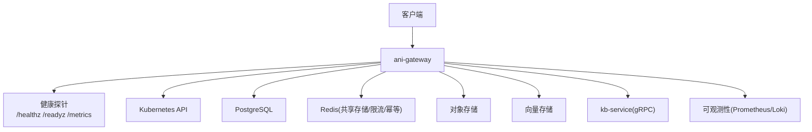
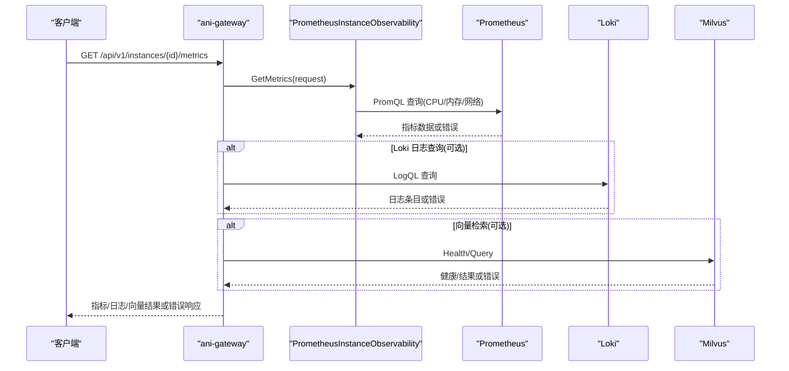
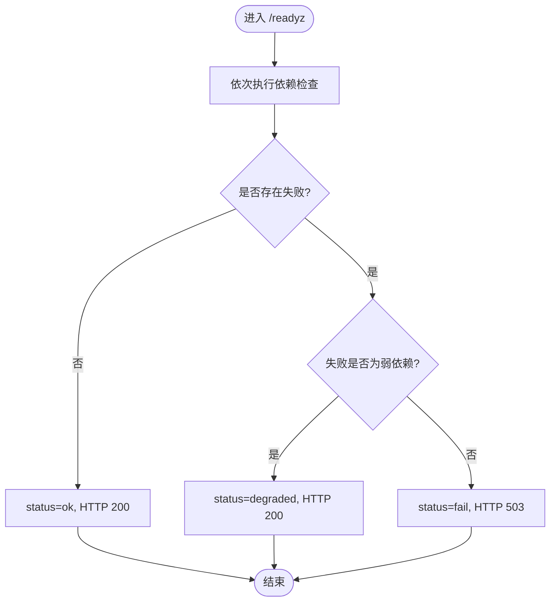
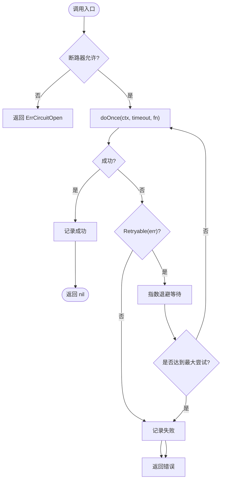
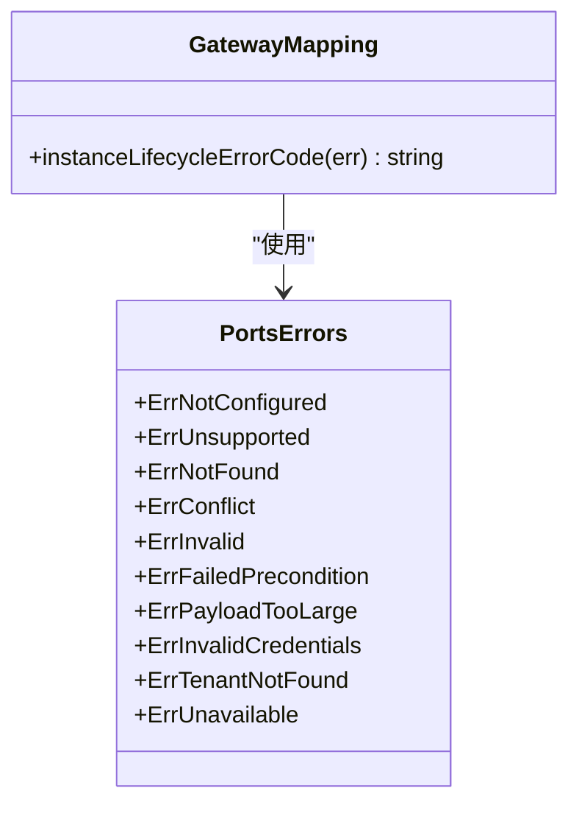
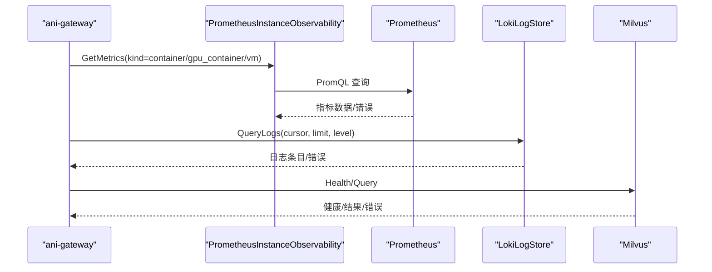
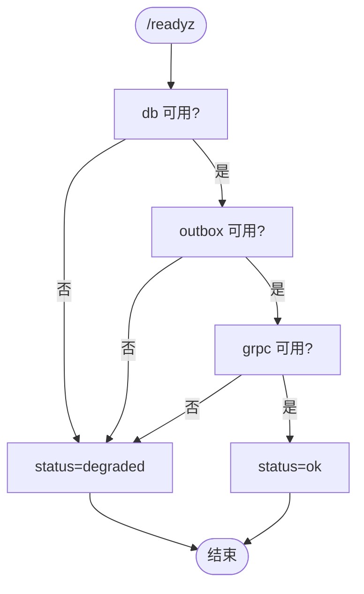
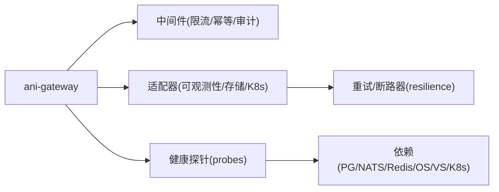

# 故障排查

<cite>
**本文引用的文件**
- [probes.go](file://repo/pkg/bootstrap/probes.go)
- [main.go](file://repo/services/ani-gateway/main.go)
- [resilience.go](file://repo/pkg/adapters/resilience/resilience.go)
- [errors.go](file://repo/pkg/ports/errors.go)
- [instances.go](file://repo/services/ani-gateway/internal/router/instances.go)
- [kb_grpc_client.go](file://repo/services/ani-gateway/internal/router/kb_grpc_client.go)
- [prometheus_instance_observability.go](file://repo/pkg/adapters/runtime/prometheus_instance_observability.go)
- [loki_log_store.go](file://repo/pkg/adapters/runtime/loki_log_store.go)
- [milvus_store_test.go](file://repo/pkg/adapters/vectorstore/milvus_store_test.go)
- [main.py](file://repo/services/kb-service/main.py)
- [sprint14-core-resilience-plan.md](file://repo/development-records/sprint14-core-resilience-plan.md)
</cite>

## 目录
1. [简介](#简介)
2. [项目结构](#项目结构)
3. [核心组件](#核心组件)
4. [架构总览](#架构总览)
5. [详细组件分析](#详细组件分析)
6. [依赖关系分析](#依赖关系分析)
7. [性能注意事项](#性能注意事项)
8. [故障排查指南](#故障排查指南)
9. [结论](#结论)
10. [附录](#附录)

## 简介
本指南面向平台运维与研发人员，聚焦服务启动失败、网络连接问题、数据库连接异常等常见故障的诊断与修复；提供日志分析与调试技巧（日志级别、关键日志识别、错误堆栈分析）；说明健康检查端点的使用与状态监控；给出性能问题的定位与优化方法（资源使用分析、慢查询优化、内存泄漏检测）；并包含应急处理流程与回滚策略。内容基于仓库中网关、适配器、健康探针、可观测性、重试与断路器、降级策略等实现进行梳理。

## 项目结构
本项目采用多服务架构：
- ani-gateway：对外 HTTP 网关，负责路由、限流、幂等、审计、中间件链与运行时装配。
- pkg/bootstrap：统一健康探针与健康检查聚合（/healthz、/readyz、/metrics）。
- pkg/adapters：各类后端适配（Kubernetes REST、对象存储、向量存储、Prometheus/Loki 可观测性等），内置重试、超时、断路器与降级语义。
- services/kb-service：知识库 gRPC 服务，提供 /health 与 /readyz 就绪检查。
- development-records：Sprint14 韧性计划文档，记录 readyz 强/弱依赖降级、重试与断路器基础能力。

图表来源
- [main.go:20-220](file://repo/services/ani-gateway/main.go#L20-L220)
- [probes.go:37-57](file://repo/pkg/bootstrap/probes.go#L37-L57)

章节来源
- [main.go:20-220](file://repo/services/ani-gateway/main.go#L20-L220)
- [probes.go:37-57](file://repo/pkg/bootstrap/probes.go#L37-L57)

## 核心组件
- 健康探针与就绪检查：/healthz 返回进程级 ok；/readyz 聚合 postgres/nats/redis/object-store/vector-store/kubernetes-api 等依赖的健康检查，按强/弱依赖决定整体 status 为 ok/degraded/fail，并映射 HTTP 200/503。
- 重试与断路器：Policy 支持 Timeout、MaxAttempts、Backoff、BreakerName、FailureRatio、MinRequests、CooldownPeriod；Retryable(err) 对 429/5xx、网络错误、DeadlineExceeded 判定可重试；Do() 封装指数退避与断路器开关。
- 端口错误分类：ErrNotConfigured/ErrUnavailable/ErrNotFound/ErrConflict/ErrInvalid/ErrFailedPrecondition 等用于上层统一错误映射。
- 网关中间件：RateLimit 基于共享 store 做租户维度窗口限流；Idempotency 中间件在 mutating 请求上实现幂等重放（由 Sprint14 计划落地）。
- 可观测性：PrometheusInstanceObservability 查询容器/GPU/VM 指标；LokiLogStore 通过 LogQL 查询持久化日志；Milvus 支持 Endpoints 列表与 Health 探测。
- kb-service：/health 与 /readyz 暴露 DB/outbox/grpc 就绪情况，session cache 为 best-effort 不阻塞就绪。

章节来源
- [probes.go:102-136](file://repo/pkg/bootstrap/probes.go#L102-L136)
- [resilience.go:13-22](file://repo/pkg/adapters/resilience/resilience.go#L13-L22)
- [resilience.go:56-87](file://repo/pkg/adapters/resilience/resilience.go#L56-L87)
- [resilience.go:89-133](file://repo/pkg/adapters/resilience/resilience.go#L89-L133)
- [errors.go:5-15](file://repo/pkg/ports/errors.go#L5-L15)
- [prometheus_instance_observability.go:142-153](file://repo/pkg/adapters/runtime/prometheus_instance_observability.go#L142-L153)
- [milvus_store_test.go:126-154](file://repo/pkg/adapters/vectorstore/milvus_store_test.go#L126-L154)
- [main.py:213-232](file://repo/services/kb-service/main.py#L213-L232)

## 架构总览
下图展示一次实例指标查询从网关到可观测性后端的调用链，以及错误传播路径。

图表来源
- [prometheus_instance_observability.go:155-269](file://repo/pkg/adapters/runtime/prometheus_instance_observability.go#L155-L269)
- [loki_log_store.go](file://repo/pkg/adapters/runtime/loki_log_store.go)
- [milvus_store_test.go:126-154](file://repo/pkg/adapters/vectorstore/milvus_store_test.go#L126-L154)

## 详细组件分析

### 健康检查与就绪探针
- /healthz：进程存活，固定返回 ok。
- /readyz：执行一组依赖检查（postgres/nats/redis/object-store/vector-store/kubernetes-api），按强/弱依赖设置整体 status 与 HTTP 状态码。
- /metrics：输出 reconcile 控制器相关计数器。

图表来源
- [probes.go:37-57](file://repo/pkg/bootstrap/probes.go#L37-L57)
- [probes.go:102-136](file://repo/pkg/bootstrap/probes.go#L102-L136)
- [probes.go:144-218](file://repo/pkg/bootstrap/probes.go#L144-L218)

章节来源
- [probes.go:37-57](file://repo/pkg/bootstrap/probes.go#L37-L57)
- [probes.go:102-136](file://repo/pkg/bootstrap/probes.go#L102-L136)
- [probes.go:144-218](file://repo/pkg/bootstrap/probes.go#L144-L218)

### 重试、超时与断路器
- Policy 定义：Timeout、MaxAttempts、BaseBackoff、MaxBackoff、BreakerName、FailureRatio、MinRequests、CooldownPeriod。
- Retryable(err)：将 DeadlineExceeded、429/5xx、网络错误归类为可重试；Canceled 不可重试。
- Do()：封装带超时的单次调用、指数退避重试、断路器允许/记录逻辑。
- 断路器：滚动窗口统计失败率，超过阈值打开，冷却期后 half-open 探测恢复。

图表来源
- [resilience.go:13-22](file://repo/pkg/adapters/resilience/resilience.go#L13-L22)
- [resilience.go:56-87](file://repo/pkg/adapters/resilience/resilience.go#L56-L87)
- [resilience.go:89-133](file://repo/pkg/adapters/resilience/resilience.go#L89-L133)
- [resilience.go:166-223](file://repo/pkg/adapters/resilience/resilience.go#L166-L223)

章节来源
- [resilience.go:13-22](file://repo/pkg/adapters/resilience/resilience.go#L13-L22)
- [resilience.go:56-87](file://repo/pkg/adapters/resilience/resilience.go#L56-L87)
- [resilience.go:89-133](file://repo/pkg/adapters/resilience/resilience.go#L89-L133)
- [resilience.go:166-223](file://repo/pkg/adapters/resilience/resilience.go#L166-L223)

### 错误分类与网关映射
- 端口层错误：ErrNotFound、ErrConflict、ErrInvalid、ErrFailedPrecondition、ErrUnavailable 等。
- 网关层映射：例如实例生命周期错误映射为 INSTANCE_NOT_FOUND、CONFLICT 等业务错误码。

图表来源
- [errors.go:5-15](file://repo/pkg/ports/errors.go#L5-L15)
- [instances.go:3593-3601](file://repo/services/ani-gateway/internal/router/instances.go#L3593-L3601)

章节来源
- [errors.go:5-15](file://repo/pkg/ports/errors.go#L5-L15)
- [instances.go:3593-3601](file://repo/services/ani-gateway/internal/router/instances.go#L3593-L3601)

### 可观测性：指标与日志
- PrometheusInstanceObservability：按 kind(container/gpu_container/vm) 查询不同指标集，支持 label 重写与租户隔离。
- LokiLogStore：通过 LogQL 查询持久化日志，支持 cursor 分页与 level 过滤。
- Milvus：支持 Endpoints 列表与健康检查，便于多端点容错。

图表来源
- [prometheus_instance_observability.go:142-269](file://repo/pkg/adapters/runtime/prometheus_instance_observability.go#L142-L269)
- [loki_log_store.go](file://repo/pkg/adapters/runtime/loki_log_store.go)
- [milvus_store_test.go:126-154](file://repo/pkg/adapters/vectorstore/milvus_store_test.go#L126-L154)

章节来源
- [prometheus_instance_observability.go:142-269](file://repo/pkg/adapters/runtime/prometheus_instance_observability.go#L142-L269)
- [milvus_store_test.go:126-154](file://repo/pkg/adapters/vectorstore/milvus_store_test.go#L126-L154)

### kb-service 就绪检查
- /health：简单返回 ok。
- /readyz：检查 db、outbox_db、outbox_dispatcher、session_cache、grpc；仅 db/outbox/grpc 为 ok 的必要条件，session_cache 为 best-effort。

图表来源
- [main.py:213-232](file://repo/services/kb-service/main.py#L213-L232)

章节来源
- [main.py:213-232](file://repo/services/kb-service/main.py#L213-L232)

## 依赖关系分析
- ani-gateway 启动时装配各运行时（K8s、加密、密钥、GPU、网络、存储、镜像仓库、实例运行时、向量存储、可观测性、kb-service gRPC、审计、配额等），并通过中间件注册限流与幂等。
- 健康探针聚合底层依赖（PG/NATS/Redis/对象存储/向量存储/K8s API），按强/弱依赖决定就绪状态。
- 重试与断路器为跨适配器的通用能力，被 K8s REST、对象存储、向量存储等复用。

图表来源
- [main.go:20-220](file://repo/services/ani-gateway/main.go#L20-L220)
- [probes.go:144-218](file://repo/pkg/bootstrap/probes.go#L144-L218)
- [resilience.go:89-133](file://repo/pkg/adapters/resilience/resilience.go#L89-L133)

章节来源
- [main.go:20-220](file://repo/services/ani-gateway/main.go#L20-L220)
- [probes.go:144-218](file://repo/pkg/bootstrap/probes.go#L144-L218)
- [resilience.go:89-133](file://repo/pkg/adapters/resilience/resilience.go#L89-L133)

## 性能注意事项
- 每调用超时：通过 Policy.Timeout 注入 deadline，避免慢/挂起调用占用 goroutine。
- 重试与退避：对可重试错误（429/5xx、网络错误、DeadlineExceeded）进行指数退避，限制 MaxAttempts/MaxBackoff。
- 断路器：持续失败时快速失败，降低雪崩风险；冷却期后半开探测恢复。
- 指标查询：PromQL 需合理选择时间窗口与标签，避免全表扫描；VM 指标使用 name 精确匹配减少误查。
- 日志查询：Loki 使用 cursor 分页与 limit 上限，避免大查询；必要时 fallback 到 K8s API。
- 多端点容错：MinIO/Milvus 支持 Endpoints 列表，在网络错误/429/5xx 时尝试下一个端点。

[本节为通用指导，不直接分析具体文件]

## 故障排查指南

### 一、服务启动失败
- 现象：ani-gateway 启动时报错退出；kb-service 无法提供服务。
- 诊断步骤：
  - 检查 ani-gateway 启动日志，关注配置加载阶段（K8s 集群代理、加密、密钥、GPU、网络、存储、镜像仓库、实例运行时、向量存储、可观测性、kb-service gRPC、共享存储等）的错误信息。
  - 检查 kb-service 的 /health 与 /readyz，确认 DB、outbox、grpc 是否就绪。
  - 若涉及外部依赖（如 Milvus/RAG Engine），确认连接初始化是否超时或失败，并查看降级日志。
- 常见原因：
  - 环境变量缺失或格式错误（如 Redis URL、地址模式、Sentinel 配置）。
  - 外部服务不可达（K8s API、PG、NATS、Redis、对象存储、向量存储、gRPC 目标）。
  - 证书/权限不足导致连接失败。
- 处理建议：
  - 修正环境变量与凭据，确保网络可达。
  - 对非关键依赖（如 session cache）允许降级，不影响 /readyz 的 ok。
  - 对关键依赖（PG/NATS/Redis/对象存储/向量存储/K8s API）根据强/弱依赖策略判断是否阻断服务。

章节来源
- [main.go:20-220](file://repo/services/ani-gateway/main.go#L20-L220)
- [main.py:213-232](file://repo/services/kb-service/main.py#L213-L232)
- [milvus_store_test.go:126-154](file://repo/pkg/adapters/vectorstore/milvus_store_test.go#L126-L154)

### 二、网络连接问题
- 现象：HTTP 504/502/503；gRPC UNAVAILABLE；Prometheus/Loki 查询失败。
- 诊断步骤：
  - 检查重试与超时：确认 Policy.Timeout 是否设置；观察 Retryable(err) 是否将错误归类为可重试。
  - 检查断路器：是否因持续失败进入 open 状态，导致快速失败。
  - 检查多端点容错：MinIO/Milvus 是否尝试下一个 endpoint。
  - 检查 kb-service gRPC 超时与延迟：每个 RPC 应用 per-call timeout，避免长时间占用。
- 常见原因：
  - 网络分区、DNS 解析失败、TLS 握手失败、远端服务过载（429/5xx）。
  - Prometheus/Loki 不可用或查询超时。
- 处理建议：
  - 调整 MaxAttempts/BaseBackoff/MaxBackoff 以平衡恢复速度与背压。
  - 启用断路器名称与冷却期，避免雪崩。
  - 对弱依赖（对象存储/向量存储）在 /readyz 中体现 degraded，保持服务可用。

章节来源
- [resilience.go:56-87](file://repo/pkg/adapters/resilience/resilience.go#L56-L87)
- [resilience.go:89-133](file://repo/pkg/adapters/resilience/resilience.go#L89-L133)
- [resilience.go:166-223](file://repo/pkg/adapters/resilience/resilience.go#L166-L223)
- [kb_grpc_client.go:58-86](file://repo/services/ani-gateway/internal/router/kb_grpc_client.go#L58-L86)

### 三、数据库连接异常
- 现象：/readyz 中 postgres 检查失败；kb-service /readyz 显示 db 不可用。
- 诊断步骤：
  - 检查 PG 连接字符串、认证、网络可达性与防火墙规则。
  - 检查 pgxpool 是否已关闭或连接池耗尽。
  - 结合 /readyz 的 checks 明细，定位具体错误信息。
- 常见原因：
  - 连接串错误、密码过期、IP/端口变更、连接池耗尽。
  - 迁移脚本执行失败或锁竞争。
- 处理建议：
  - 优先恢复 PG 连接，确保 /readyz 返回 ok。
  - 对迁移操作进行幂等与回滚验证，避免长时间持锁。
  - 在业务侧对数据库不可用进行降级（只读或提示重试）。

章节来源
- [probes.go:144-157](file://repo/pkg/bootstrap/probes.go#L144-L157)
- [main.py:213-232](file://repo/services/kb-service/main.py#L213-L232)

### 四、日志分析与调试技巧
- 日志级别：
  - ani-gateway 使用 slog JSON handler，默认输出结构化日志；可通过环境变量或构建参数调整级别。
  - kb-service 使用 uvicorn 运行，log_level 可在 main 中配置。
- 关键日志识别：
  - 启动阶段：各运行时配置成功/失败日志（K8s、加密、密钥、GPU、网络、存储、镜像仓库、实例运行时、向量存储、可观测性、kb-service gRPC、共享存储）。
  - 健康检查：/readyz 的 checks 明细中包含每个依赖的状态与错误信息。
  - 可观测性：Prometheus/Loki 查询错误、Milvus 连接失败、gRPC 超时与 UNAVAILABLE。
- 错误堆栈分析：
  - 关注 StatusError（系统、方法、路径、状态码、响应体）与 Retryable 分类。
  - 结合断路器状态（open/half-open/closed）判断是否处于快速失败保护。
- 调试建议：
  - 使用 /metrics 获取 reconcile 控制器计数，辅助定位重复失败与跳过。
  - 对慢查询与超时，增加 per-call timeout 与重试策略，避免 goroutine 泄漏。
  - 对日志查询，使用 cursor 分页与 limit 上限，避免大查询。

章节来源
- [main.go:20-220](file://repo/services/ani-gateway/main.go#L20-L220)
- [main.py:235-238](file://repo/services/kb-service/main.py#L235-L238)
- [probes.go:69-87](file://repo/pkg/bootstrap/probes.go#L69-L87)
- [resilience.go:26-54](file://repo/pkg/adapters/resilience/resilience.go#L26-L54)

### 五、健康检查端点与状态监控
- 端点：
  - /healthz：进程存活。
  - /readyz：依赖就绪检查，返回 status 与 checks 明细。
  - /metrics：reconcile 控制器指标。
- 使用方法：
  - 定期轮询 /readyz，若 status=fail 则触发告警与自动重启/切换。
  - 若 status=degraded，记录弱依赖故障，但不阻断服务。
  - 通过 /metrics 观察 ticks/successes/failures/backoff_skips，评估控制器健康。
- 监控建议：
  - 对 postgres/nats/redis 等强依赖设置高优先级告警。
  - 对 object-store/vector-store/kubernetes-api 等弱依赖设置降级告警。
  - 对 kb-service 的 /readyz 单独监控，确保 gRPC 接口可用。

章节来源
- [probes.go:37-57](file://repo/pkg/bootstrap/probes.go#L37-L57)
- [probes.go:69-87](file://repo/pkg/bootstrap/probes.go#L69-L87)
- [main.py:213-232](file://repo/services/kb-service/main.py#L213-L232)

### 六、性能问题定位与优化
- 资源使用分析：
  - 通过 /metrics 观察 reconcile 控制器指标，定位频繁失败与退避跳过的目标。
  - 对 Prometheus/Loki 查询，检查 PromQL/LogQL 复杂度与时间范围，避免全量扫描。
- 慢查询优化：
  - 为 PromQL 添加合适的 label 过滤（namespace/pod/name），减少结果集。
  - 对 Loki 查询使用 cursor 分页与 limit 上限，避免大响应。
  - 对向量存储查询，使用 Endpoints 列表与 Health 探测，提升可用性。
- 内存泄漏检测：
  - 关注 goroutine 数量与堆内存增长，排查未释放的连接与定时器。
  - 对重试与断路器，确保 ctx 正确取消与 timer.Stop。
- 优化建议：
  - 调整 Policy.Timeout/MaxAttempts/Backoff，平衡恢复速度与资源占用。
  - 启用断路器名称与冷却期，避免雪崩。
  - 对弱依赖实施降级，保持服务可用。

[本节为通用指导，不直接分析具体文件]

### 七、应急处理流程
- 快速止血：
  - 若 /readyz 返回 fail，优先恢复强依赖（PG/NATS/Redis/K8s API）。
  - 若 /readyz 返回 degraded，记录弱依赖故障，继续提供服务。
- 限流与熔断：
  - 临时提高 RateLimit 阈值或关闭限流（仅在紧急情况下），避免雪崩。
  - 启用断路器名称与冷却期，防止持续故障放大。
- 回滚策略：
  - 对最近变更的配置或代码，立即回滚至稳定版本。
  - 对数据库迁移，执行回滚 SQL 并验证数据一致性。
- 恢复验证：
  - 重新轮询 /readyz，确认 status=ok。
  - 通过 /metrics 观察指标恢复正常，无大量失败与退避。

[本节为通用指导，不直接分析具体文件]

### 八、回滚策略
- 代码回滚：
  - 回滚到上一个稳定版本，确保中间件链与运行时装配一致。
- 配置回滚：
  - 回滚环境变量（如 Redis URL、地址模式、Sentinel 配置、超时与重试策略）。
- 数据库回滚：
  - 执行迁移文件的 Rollback 段，验证数据一致性与约束。
- 服务回滚：
  - 对 kb-service、ani-gateway 分别回滚，确保 gRPC 与 HTTP 接口兼容。
- 验证：
  - 重新执行 /readyz 与 /metrics 检查，确认服务健康与指标正常。

章节来源
- [sprint14-core-resilience-plan.md:51-64](file://repo/development-records/sprint14-core-resilience-plan.md#L51-L64)

## 结论
本指南基于仓库中的健康探针、重试与断路器、错误分类、可观测性适配与就绪检查，提供了从启动失败、网络与数据库异常到性能优化与应急回滚的系统化故障排查方法。建议在日常运维中持续监控 /readyz 与 /metrics，结合重试、超时与断路器策略，确保服务在高可用与弹性方面的稳定性。

[本节为总结，不直接分析具体文件]

## 附录
- 常用命令：
  - 健康检查：curl http://localhost:8080/healthz、/readyz、/metrics。
  - kb-service：curl http://localhost:8002/health、/readyz。
  - 可观测性：PromQL/LogQL 查询示例与 cursor 分页。
- 参考文档：
  - Sprint14 韧性计划：readyz 强/弱依赖降级、重试与断路器基础能力。

[本节为补充信息，不直接分析具体文件]