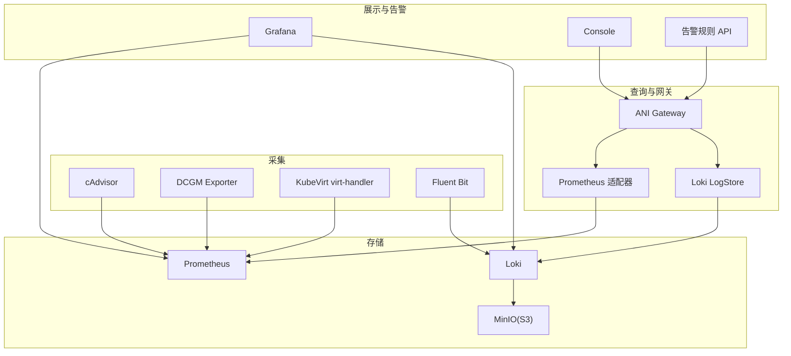
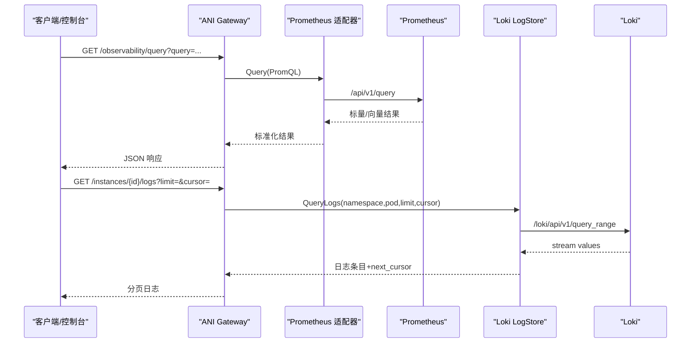
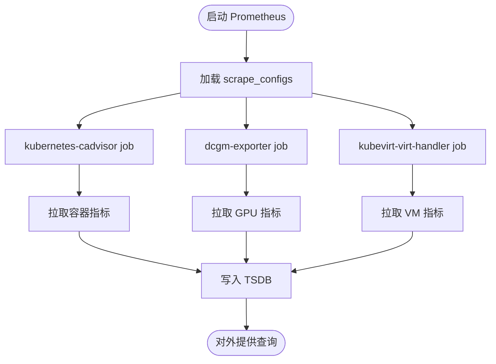
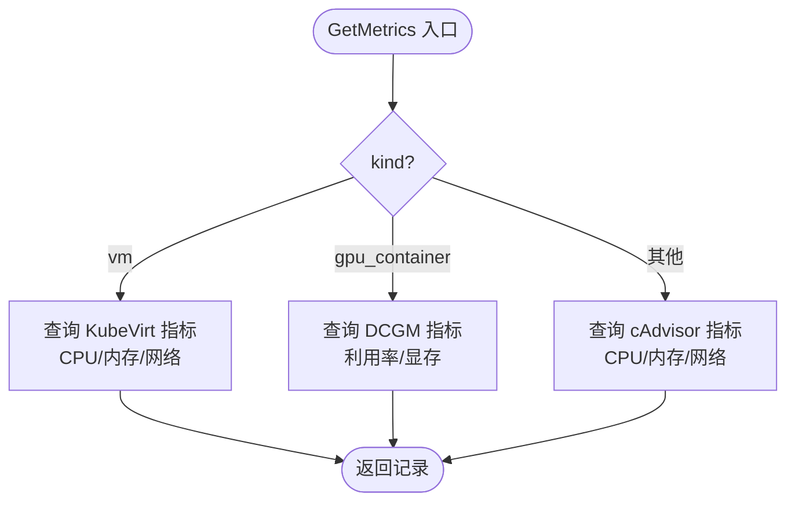
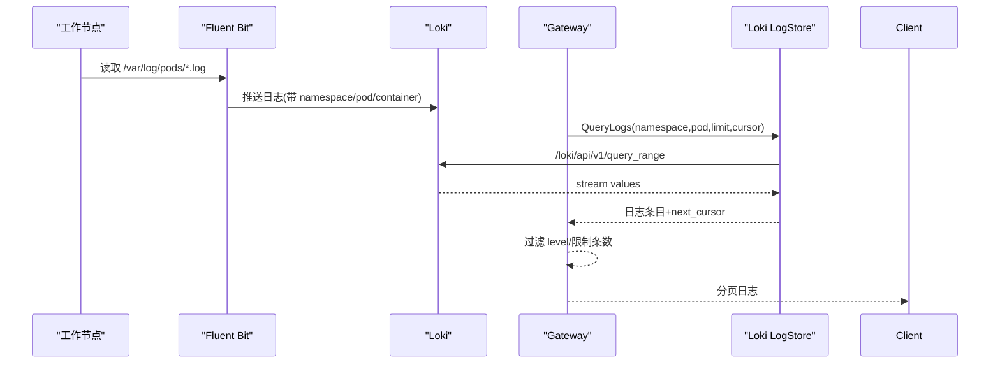
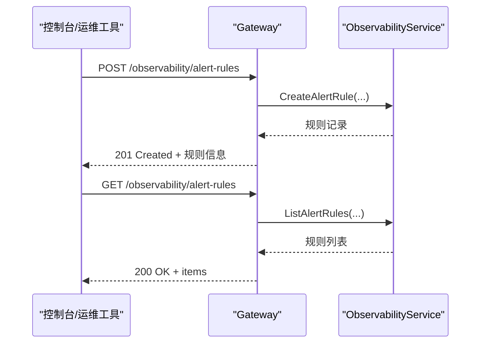
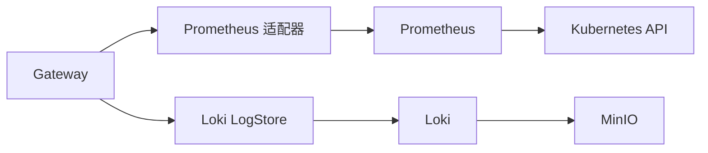

# 监控告警

<cite>
**本文引用的文件**
- [sprint13-instance-observability-prometheus-live.yaml](file://repo/deploy/real-k8s-lab/sprint13-instance-observability-prometheus-live.yaml)
- [prometheus_instance_observability.go](file://repo/pkg/adapters/runtime/prometheus_instance_observability.go)
- [loki_log_store.go](file://repo/pkg/adapters/runtime/loki_log_store.go)
- [sprint13-instance-observability-loki-live.yaml](file://repo/deploy/real-k8s-lab/sprint13-instance-observability-loki-live.yaml)
- [observability.go](file://repo/services/ani-gateway/internal/router/observability.go)
</cite>

## 目录
1. [简介](#简介)
2. [项目结构](#项目结构)
3. [核心组件](#核心组件)
4. [架构总览](#架构总览)
5. [详细组件分析](#详细组件分析)
6. [依赖关系分析](#依赖关系分析)
7. [性能与容量规划](#性能与容量规划)
8. [故障排查指南](#故障排查指南)
9. [结论](#结论)
10. [附录](#附录)

## 简介
本文件面向平台运维与开发者，系统化说明 ANI 平台的监控、日志与告警能力：包括 Prometheus 指标采集（应用、系统、业务）、Grafana 仪表板使用建议、基于 Loki + Fluent Bit 的日志收集与分析、告警规则配置与管理接口，以及性能监控、错误追踪与容量规划的实践指南。内容严格基于仓库中已实现的代码与部署清单，确保可落地、可验证。

## 项目结构
ANI 的可观测性由“采集—存储—查询—展示—告警”五层构成：
- 采集层：Prometheus 通过 cAdvisor、DCGM Exporter、KubeVirt virt-handler 抓取容器/GPU/VM 指标；Fluent Bit 采集 Pod 日志并写入 Loki。
- 存储层：Prometheus 时序数据本地 TSDB；Loki 将日志落盘至 MinIO（S3 兼容）。
- 查询层：Gateway 暴露 /observability/query 与 /observability/query_range 统一转发 PromQL；实例级指标与日志通过适配器聚合。
- 展示层：Grafana 直接对接 Prometheus/Loki；Console 通过 Gateway API 渲染指标与日志。
- 告警层：Gateway 提供告警规则的增删改查接口，便于集成外部 Alertmanager 或自研通知通道。

图表来源
- [sprint13-instance-observability-prometheus-live.yaml:57-103](file://repo/deploy/real-k8s-lab/sprint13-instance-observability-prometheus-live.yaml#L57-L103)
- [sprint13-instance-observability-loki-live.yaml:90-155](file://repo/deploy/real-k8s-lab/sprint13-instance-observability-loki-live.yaml#L90-L155)
- [prometheus_instance_observability.go:155-324](file://repo/pkg/adapters/runtime/prometheus_instance_observability.go#L155-L324)
- [loki_log_store.go:77-137](file://repo/pkg/adapters/runtime/loki_log_store.go#L77-L137)
- [observability.go:95-104](file://repo/services/ani-gateway/internal/router/observability.go#L95-L104)

章节来源
- [sprint13-instance-observability-prometheus-live.yaml:57-103](file://repo/deploy/real-k8s-lab/sprint13-instance-observability-prometheus-live.yaml#L57-L103)
- [sprint13-instance-observability-loki-live.yaml:90-155](file://repo/deploy/real-k8s-lab/sprint13-instance-observability-loki-live.yaml#L90-L155)
- [prometheus_instance_observability.go:155-324](file://repo/pkg/adapters/runtime/prometheus_instance_observability.go#L155-L324)
- [loki_log_store.go:77-137](file://repo/pkg/adapters/runtime/loki_log_store.go#L77-L137)
- [observability.go:95-104](file://repo/services/ani-gateway/internal/router/observability.go#L95-L104)

## 核心组件
- Prometheus 采集器
  - 通过 ConfigMap 注入 scrape_configs，支持 kubernetes-cadvisor、dcgm-exporter、kubevirt-virt-handler 三类 job，覆盖容器、GPU、虚拟机指标。
  - RBAC 仅授予 nodes/pods/metrics/cadvisor 读取权限，最小化权限。
- 指标适配器（PrometheusInstanceObservability）
  - 按 workload kind 分流：container/gpu_container/vm，分别查询不同指标集，并对缺失 exporter 做降级（字段为 nil，不伪造 0）。
  - 对 VM 使用 KubeVirt 指标计算内存使用率（domain_bytes - usable_bytes），避免直接使用 resident_bytes。
- 日志适配器（LokiLogStore）
  - 通过 LogQL 按 namespace+pod 过滤，实现多租户隔离；cursor 采用 RFC3339 时间戳，内部转换为 Unix 纳秒。
  - 默认最近 24 小时窗口，limit 限制条数，direction=backward 对齐 kubectl logs --tail 语义。
- 日志采集器（Fluent Bit）
  - 以 DaemonSet 方式每节点采集 /var/log/pods/*，提取 namespace/pod/container 作为 label，输出到 Loki。
  - 持久化扫描位置到 emptyDir，降低 inotify 压力。
- 网关与告警 API
  - 暴露 /observability/query、/observability/query_range 用于 PromQL 查询；提供告警规则 CRUD 接口，便于集成外部通知。

章节来源
- [sprint13-instance-observability-prometheus-live.yaml:18-46](file://repo/deploy/real-k8s-lab/sprint13-instance-observability-prometheus-live.yaml#L18-L46)
- [sprint13-instance-observability-prometheus-live.yaml:57-103](file://repo/deploy/real-k8s-lab/sprint13-instance-observability-prometheus-live.yaml#L57-L103)
- [prometheus_instance_observability.go:155-324](file://repo/pkg/adapters/runtime/prometheus_instance_observability.go#L155-L324)
- [loki_log_store.go:77-137](file://repo/pkg/adapters/runtime/loki_log_store.go#L77-L137)
- [sprint13-instance-observability-loki-live.yaml:325-486](file://repo/deploy/real-k8s-lab/sprint13-instance-observability-loki-live.yaml#L325-L486)
- [observability.go:95-104](file://repo/services/ani-gateway/internal/router/observability.go#L95-L104)

## 架构总览
下图展示了从采集到查询、再到展示与告警的端到端流程，以及关键组件之间的调用关系。

图表来源
- [observability.go:106-154](file://repo/services/ani-gateway/internal/router/observability.go#L106-L154)
- [prometheus_instance_observability.go:459-490](file://repo/pkg/adapters/runtime/prometheus_instance_observability.go#L459-L490)
- [loki_log_store.go:77-137](file://repo/pkg/adapters/runtime/loki_log_store.go#L77-L137)

## 详细组件分析

### Prometheus 指标采集配置
- 采集目标
  - kubernetes-cadvisor：容器 CPU/内存/网络等指标。
  - dcgm-exporter：GPU 利用率与显存 used/free（通过 sum 聚合多 GPU series）。
  - kubevirt-virt-handler：VM guest OS 指标（CPU/内存/网络），label 用 name 精确匹配 VMI。
- 权限与安全
  - ClusterRole 仅授权 nodes/pods/metrics/cadvisor 读取，避免过度权限。
  - TLS 跳过校验用于内网环境，生产建议启用证书校验。
- 采集间隔
  - global scrape_interval 与 evaluation_interval 均为 5s，适合高频快照场景。

图表来源
- [sprint13-instance-observability-prometheus-live.yaml:57-103](file://repo/deploy/real-k8s-lab/sprint13-instance-observability-prometheus-live.yaml#L57-L103)

章节来源
- [sprint13-instance-observability-prometheus-live.yaml:57-103](file://repo/deploy/real-k8s-lab/sprint13-instance-observability-prometheus-live.yaml#L57-L103)

### 指标适配器与 VM/GPU 分支逻辑
- 分支优先级
  - 先判断 kind=vm，再判断 gpu_container，最后走 container 分支，避免误匹配。
- 指标映射
  - 容器：CPU 利用率、内存 working_set、内存 limit、网络收发字节。
  - GPU：DCGM_FI_DEV_GPU_UTIL、FB_USED、FB_FREE+FB_USED 推导总量。
  - VM：CPU rate(kubevirt_vmi_cpu_usage_seconds_total[5m])，内存 domain_bytes - usable_bytes，网络 rate 转换瞬时速率。
- 健壮性
  - 单个 exporter 不可用时对应字段为 nil，不伪造 0；NaN/Inf 被过滤并返回错误以便上层降级。

图表来源
- [prometheus_instance_observability.go:155-324](file://repo/pkg/adapters/runtime/prometheus_instance_observability.go#L155-L324)

章节来源
- [prometheus_instance_observability.go:155-324](file://repo/pkg/adapters/runtime/prometheus_instance_observability.go#L155-L324)

### 日志收集与分析（Loki + Fluent Bit）
- 采集策略
  - Fluent Bit DaemonSet 每节点采集 /var/log/pods/*，解析 CRI 日志，提取 namespace/pod/container 作为 label。
  - 使用 Lua 脚本从 Tag 中提取标签，输出到 Loki，Line_Format=json。
- 存储与保留
  - Loki 单租户模式，schema v13，TSDB + S3（MinIO）后端，retention_period=30d。
  - 索引前缀 loki_index_，周期 24h；compactor 开启删除延迟 2h。
- 查询与分页
  - LogQL：{namespace="<ns>",pod=~"^<instance>(-.*)?$"} | json。
  - cursor 为 RFC3339 时间戳，内部转 Unix 纳秒；direction=backward 对齐 kubectl logs --tail。
  - next_cursor 为最早一条 timestamp（达到 limit 时），供前端加载更多。

图表来源
- [sprint13-instance-observability-loki-live.yaml:325-486](file://repo/deploy/real-k8s-lab/sprint13-instance-observability-loki-live.yaml#L325-L486)
- [loki_log_store.go:77-137](file://repo/pkg/adapters/runtime/loki_log_store.go#L77-L137)

章节来源
- [sprint13-instance-observability-loki-live.yaml:90-155](file://repo/deploy/real-k8s-lab/sprint13-instance-observability-loki-live.yaml#L90-L155)
- [sprint13-instance-observability-loki-live.yaml:325-486](file://repo/deploy/real-k8s-lab/sprint13-instance-observability-loki-live.yaml#L325-L486)
- [loki_log_store.go:77-137](file://repo/pkg/adapters/runtime/loki_log_store.go#L77-L137)

### Grafana 仪表板配置与自定义
- 数据源
  - 添加 Prometheus 数据源指向集群内 Prometheus Service。
  - 添加 Loki 数据源指向 ani-loki Service。
- 推荐面板
  - 容器资源：CPU/内存/网络（来自 cAdvisor）。
  - GPU 资源：DCGM_FI_DEV_GPU_UTIL、DCGM_FI_DEV_FB_USED/FREE。
  - VM 资源：kubevirt_vmi_* 系列指标。
  - 日志：Loki 浏览器按 namespace/pod 过滤查看。
- 自定义面板步骤
  - 新建面板 → 选择数据源 → 编写 PromQL/LogQL → 设置图例/阈值 → 保存并共享。
  - 使用变量（如 namespace、pod）提升复用性。

（本节为通用实践指导，不直接引用具体文件）

### 告警规则配置与管理
- 管理接口
  - Gateway 暴露告警规则 CRUD：/observability/alert-rules。
  - 请求体包含 name、promql、duration、severity、labels、annotations、enabled 等字段。
- 规则生命周期
  - 创建：POST /observability/alert-rules，返回规则 ID 与状态。
  - 查询：GET /observability/alert-rules，支持分页。
  - 更新：PATCH /observability/alert-rules/:rule_id。
  - 删除：DELETE /observability/alert-rules/:rule_id。
- 集成建议
  - 可将规则同步至 Alertmanager 或通过 Webhook 通知。
  - 结合 Console 展示告警列表与详情。

图表来源
- [observability.go:156-254](file://repo/services/ani-gateway/internal/router/observability.go#L156-L254)

章节来源
- [observability.go:156-254](file://repo/services/ani-gateway/internal/router/observability.go#L156-L254)

## 依赖关系分析
- 组件耦合
  - Gateway 与适配器松耦合：通过 ports 接口抽象，便于替换实现（如 ES LogStore 后补）。
  - 适配器与存储解耦：Prometheus/Loki 通过 HTTP API 访问，失败时降级为 nil 字段或错误。
- 外部依赖
  - Kubernetes API：事件、Pod 日志、节点指标。
  - MinIO：Loki 对象存储后端。
  - DCGM/KubeVirt：GPU/VM 指标来源。
- 潜在风险
  - 跨 namespace 访问需 RBAC 授权（当前 Prometheus 仅访问本机 metrics/cadvisor）。
  - Loki 单副本 + emptyDir 非持久化，生产需 PVC 与高可用方案。

图表来源
- [prometheus_instance_observability.go:459-490](file://repo/pkg/adapters/runtime/prometheus_instance_observability.go#L459-L490)
- [loki_log_store.go:77-137](file://repo/pkg/adapters/runtime/loki_log_store.go#L77-L137)
- [sprint13-instance-observability-loki-live.yaml:90-155](file://repo/deploy/real-k8s-lab/sprint13-instance-observability-loki-live.yaml#L90-L155)

章节来源
- [prometheus_instance_observability.go:459-490](file://repo/pkg/adapters/runtime/prometheus_instance_observability.go#L459-L490)
- [loki_log_store.go:77-137](file://repo/pkg/adapters/runtime/loki_log_store.go#L77-L137)
- [sprint13-instance-observability-loki-live.yaml:90-155](file://repo/deploy/real-k8s-lab/sprint13-instance-observability-loki-live.yaml#L90-L155)

## 性能与容量规划
- 采集频率
  - Prometheus scrape_interval=5s，适合高频快照；评估 interval 同值，注意查询负载。
- 存储容量
  - Prometheus：根据指标基数与保留期估算 TSDB 大小；建议启用压缩与分片。
  - Loki：retention_period=30d，对象存储复用 MinIO；生产建议 PVC 与多副本。
- 资源配额
  - Loki 单体 requests cpu 100m/memory 256Mi，limits cpu 1/memory 1Gi；Fluent Bit 每节点 50m/64Mi。
- 查询优化
  - 使用 label 过滤与正则匹配减少扫描范围；避免全表扫描。
  - 对 Counter 使用 rate() 计算瞬时速率，对 Gauge 直接取值。

（本节为通用实践指导，不直接引用具体文件）

## 故障排查指南
- Prometheus 无法采集
  - 检查 scrape_configs 是否生效；确认 target 可达与端口正确。
  - 验证 RBAC 权限（nodes/pods/metrics/cadvisor）。
- GPU 指标为空
  - 确认 dcgm-exporter 服务存在且暴露 /metrics；PromQL 使用 sum() 聚合多 GPU。
- VM 指标为空
  - 确认 kubevirt-virt-handler 被发现；label name 精确匹配 VMI。
- 日志查询失败
  - 检查 Loki 健康检查 /ready；确认 LogQL 中 namespace/pod 标签正确。
  - 若 Loki 不可达，适配器返回错误而非空结果，便于上层重试或降级。
- 告警规则无效
  - 校验 PromQL 语法与 duration；检查 severity/labels/annotations 是否完整。

章节来源
- [prometheus_instance_observability.go:459-490](file://repo/pkg/adapters/runtime/prometheus_instance_observability.go#L459-L490)
- [loki_log_store.go:77-137](file://repo/pkg/adapters/runtime/loki_log_store.go#L77-L137)
- [sprint13-instance-observability-prometheus-live.yaml:18-46](file://repo/deploy/real-k8s-lab/sprint13-instance-observability-prometheus-live.yaml#L18-L46)

## 结论
ANI 平台已实现完整的监控、日志与告警基础能力：Prometheus 覆盖容器/GPU/VM 指标，Loki + Fluent Bit 提供结构化日志检索，Gateway 统一查询与告警规则管理。通过适配器与端口抽象，系统具备良好的可扩展性与可替换性。生产环境建议完善存储持久化、RBAC 最小权限与高可用部署，并结合 Grafana 构建可视化与告警闭环。

## 附录
- 常用 PromQL 示例路径
  - 容器 CPU 利用率：参考 [prometheus_instance_observability.go:182-191](file://repo/pkg/adapters/runtime/prometheus_instance_observability.go#L182-L191)
  - GPU 利用率：参考 [prometheus_instance_observability.go:223-248](file://repo/pkg/adapters/runtime/prometheus_instance_observability.go#L223-L248)
  - VM 内存使用率：参考 [prometheus_instance_observability.go:279-302](file://repo/pkg/adapters/runtime/prometheus_instance_observability.go#L279-L302)
- 日志查询 LogQL 示例路径
  - 构造 LogQL 与分页：参考 [loki_log_store.go:85-105](file://repo/pkg/adapters/runtime/loki_log_store.go#L85-L105)
- 告警规则 API 示例路径
  - 创建/查询/更新/删除：参考 [observability.go:156-254](file://repo/services/ani-gateway/internal/router/observability.go#L156-L254)