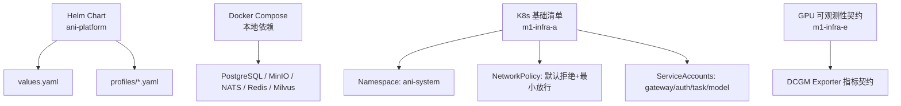
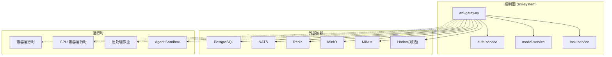
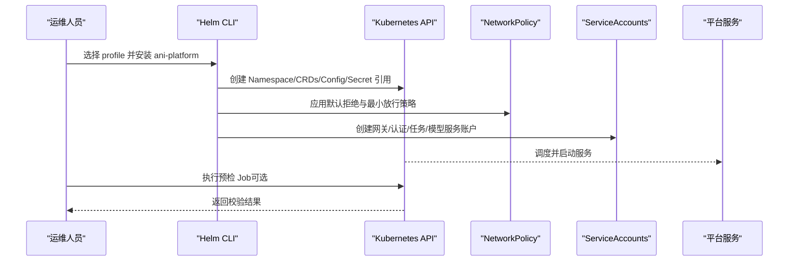
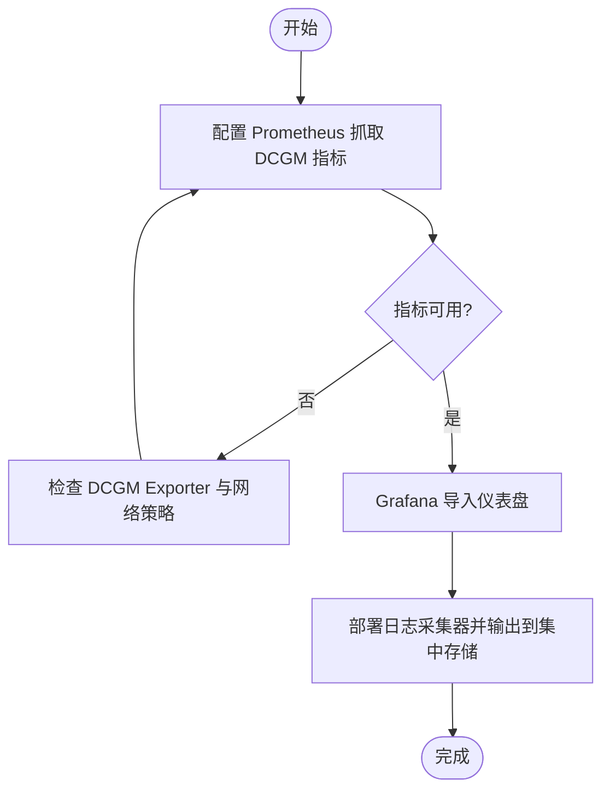
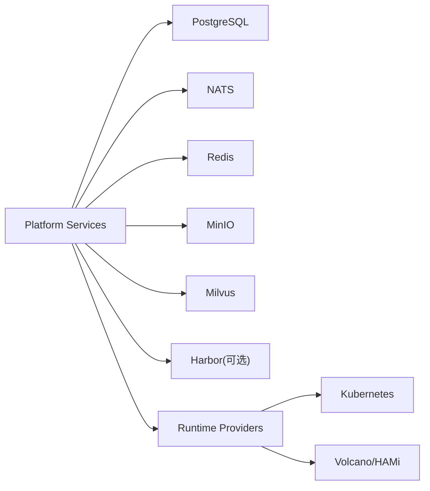

# 部署运维

<cite>
**本文引用的文件**
- [Chart.yaml](file://repo/deploy/helm/ani-platform/Chart.yaml)
- [values.yaml](file://repo/deploy/helm/ani-platform/values.yaml)
- [dev.yaml](file://repo/deploy/helm/ani-platform/profiles/dev.yaml)
- [docker-compose.yml](file://repo/deploy/docker/docker-compose.yml)
- [README.md（本地开发环境）](file://repo/deploy/docker/README.md)
- [00-namespace.yaml](file://repo/deploy/manifests/m1-infra-a/00-namespace.yaml)
- [20-networkpolicy.yaml](file://repo/deploy/manifests/m1-infra-a/20-networkpolicy.yaml)
- [30-serviceaccounts.yaml](file://repo/deploy/manifests/m1-infra-a/30-serviceaccounts.yaml)
- [40-dcgm-observability-contract.yaml](file://repo/deploy/manifests/m1-infra-e/40-dcgm-observability-contract.yaml)
- [milvus.yaml（组件契约）](file://repo/deploy/helm/ani-platform/component-contracts/milvus.yaml)
- [harbor.yaml（组件契约）](file://repo/deploy/helm/ani-platform/component-contracts/harbor.yaml)
</cite>

## 目录
1. [简介](#简介)
2. [项目结构](#项目结构)
3. [核心组件](#核心组件)
4. [架构总览](#架构总览)
5. [详细组件分析](#详细组件分析)
6. [依赖关系分析](#依赖关系分析)
7. [性能与容量规划](#性能与容量规划)
8. [监控与告警](#监控与告警)
9. [故障排查指南](#故障排查指南)
10. [结论](#结论)
11. [附录：常用命令与清单](#附录常用命令与清单)

## 简介
本指南面向生产与本地环境的部署运维，覆盖 Helm Charts 配置、环境变量与资源限制、Docker Compose 本地开发、Kubernetes 生产部署（命名空间、RBAC、网络策略）、监控告警（Prometheus/Grafana/日志）、以及故障排查、性能调优、扩缩容等最佳实践。内容基于仓库内现有 Helm Chart、Compose 编排与基础设施清单进行说明，确保可落地、可验证。

## 项目结构
- Helm 平台 Chart：位于 repo/deploy/helm/ani-platform，提供 umbrella chart 与多 profile（dev、attach-k8s、offline、gpuScheduling 等），通过 values.yaml 与 profiles/*.yaml 组合控制安装范围与依赖模式。
- Docker Compose 本地环境：位于 repo/deploy/docker，提供 PostgreSQL、MinIO、NATS、Redis、Milvus、可选 Dex 的本地一键启动能力。
- Kubernetes 基础清单：位于 repo/deploy/manifests，包含命名空间、默认拒绝的网络策略、服务账户等基线资源；GPU 可观测性契约在 m1-infra-e。

图表来源
- [Chart.yaml:1-16](file://repo/deploy/helm/ani-platform/Chart.yaml#L1-L16)
- [values.yaml:1-262](file://repo/deploy/helm/ani-platform/values.yaml#L1-L262)
- [docker-compose.yml:1-184](file://repo/deploy/docker/docker-compose.yml#L1-L184)
- [00-namespace.yaml:1-9](file://repo/deploy/manifests/m1-infra-a/00-namespace.yaml#L1-L9)
- [20-networkpolicy.yaml:1-76](file://repo/deploy/manifests/m1-infra-a/20-networkpolicy.yaml#L1-L76)
- [30-serviceaccounts.yaml:1-36](file://repo/deploy/manifests/m1-infra-a/30-serviceaccounts.yaml#L1-L36)
- [40-dcgm-observability-contract.yaml:1-19](file://repo/deploy/manifests/m1-infra-e/40-dcgm-observability-contract.yaml#L1-L19)

章节来源
- [Chart.yaml:1-16](file://repo/deploy/helm/ani-platform/Chart.yaml#L1-L16)
- [values.yaml:1-262](file://repo/deploy/helm/ani-platform/values.yaml#L1-L262)
- [docker-compose.yml:1-184](file://repo/deploy/docker/docker-compose.yml#L1-L184)
- [00-namespace.yaml:1-9](file://repo/deploy/manifests/m1-infra-a/00-namespace.yaml#L1-L9)
- [20-networkpolicy.yaml:1-76](file://repo/deploy/manifests/m1-infra-a/20-networkpolicy.yaml#L1-L76)
- [30-serviceaccounts.yaml:1-36](file://repo/deploy/manifests/m1-infra-a/30-serviceaccounts.yaml#L1-L36)
- [40-dcgm-observability-contract.yaml:1-19](file://repo/deploy/manifests/m1-infra-e/40-dcgm-observability-contract.yaml#L1-L19)

## 核心组件
- 平台服务（Helm services 段）：gateway、auth-service、model-service、task-service，均支持镜像仓库与端口配置。
- 基础设施依赖：PostgreSQL、NATS、Redis、MinIO、Milvus、Harbor，支持 external/managed 模式并通过 Secret 注入连接信息。
- 运行时与实例：容器、GPU 容器、Agent Sandbox、Batch Job 等运行时提供者；实例网络平面（VPC/Mesh/Storage/Management/Public Ingress）与存储挂载（根盘/数据盘/共享PVC/ObjectFuse/Ephemeral）。
- GPU 调度与可观测性：Volcano 队列、HAMi/NVIDIA Operator、DCGM Exporter 指标采集契约。

章节来源
- [values.yaml:237-262](file://repo/deploy/helm/ani-platform/values.yaml#L237-L262)
- [values.yaml:10-236](file://repo/deploy/helm/ani-platform/values.yaml#L10-L236)
- [values.yaml:109-158](file://repo/deploy/helm/ani-platform/values.yaml#L109-L158)

## 架构总览
平台以 Helm umbrella chart 为中心，通过 values 与 profiles 切换不同安装形态（开发、离线、附加到已有集群、GPU 调度、运行时基座、实例基座）。外部依赖（数据库、消息、缓存、对象存储、向量库、镜像仓库）以 external 模式接入，通过 Secret 注入连接串。控制面服务（Gateway/Auth/Model/Task）运行于 ani-system 命名空间，受默认拒绝的网络策略保护，仅开放必要入出方向。

图表来源
- [values.yaml:237-262](file://repo/deploy/helm/ani-platform/values.yaml#L237-L262)
- [values.yaml:51-93](file://repo/deploy/helm/ani-platform/values.yaml#L51-L93)
- [values.yaml:158-236](file://repo/deploy/helm/ani-platform/values.yaml#L158-L236)

## 详细组件分析

### Helm Chart 配置与环境变量
- 全局与 Profile
  - global.namespace、imageRegistry、imagePullPolicy、profile 用于统一控制命名空间、镜像源与拉取策略。
  - infrastructure.profiles.selected 决定安装形态（dev、attach-k8s、offline、gpuScheduling、runtimeFoundation、instanceFoundation 等）。
- 基础设施依赖
  - PostgreSQL/NATS/Redis/MinIO/Milvus/Harbor 支持 external 模式，通过 secretName/secretKey 读取连接信息（如 database-url、nats-url、redis-url）。
  - validation.preflightJob 可用于升级前检查 CRDs、命名空间、Secret、StorageClass。
- GPU 与运行时
  - gpu.* 控制 GPU Operator/HAMi/Volcano/DCGM 的启用与版本；queues 定义 Volcano 队列权重。
  - runtime.providers 选择各运行时提供者（kubernetes、kubernetes-volcano-hami、kubernetes-job、kubernetes-networkpolicy）。
  - instances.networkPlanes 与 storageAttachments 定义租户网络与存储挂载策略。
- 服务暴露
  - services.gateway.port、services.auth.grpcPort、services.model.grpcPort、services.task.grpcPort 控制服务端口。
- 环境变量建议
  - 将数据库、NATS、Redis、MinIO、Milvus、Harbor 的连接信息放入 Secret，并在 values 中引用，避免明文硬编码。
  - 若使用 OIDC（如 Dex），按 README 说明设置 AUTH_OIDC_ISSUER_URL、AUTH_OIDC_CLIENT_ID、AUTH_OIDC_CLIENT_SECRET。

章节来源
- [values.yaml:1-108](file://repo/deploy/helm/ani-platform/values.yaml#L1-L108)
- [values.yaml:109-236](file://repo/deploy/helm/ani-platform/values.yaml#L109-L236)
- [values.yaml:237-262](file://repo/deploy/helm/ani-platform/values.yaml#L237-L262)
- [README.md（本地开发环境）:40-51](file://repo/deploy/docker/README.md#L40-L51)

### Docker Compose 本地开发环境
- 启动方式
  - 从仓库根目录执行 make deps 或 docker compose up -d 启动依赖服务；make deps-down 停止；make deps-clean 清理数据卷。
- 服务与端口
  - PostgreSQL: 5432；MinIO API: 9000/Console: 9001；NATS: 4222/Monitor: 8222；Redis: 6379；Milvus: 19530/Attu: 3000（tools profile）。
- 健康检查
  - 各服务定义了 healthcheck，便于编排就绪判断。
- 可选组件
  - tools profile 启动 Attu；auth profile 启动 Dex 完成 OIDC 流程测试。
- 环境变量
  - 复制 .env.example 为 .env 并按需修改，服务自动加载。

章节来源
- [README.md（本地开发环境）:1-77](file://repo/deploy/docker/README.md#L1-L77)
- [docker-compose.yml:1-184](file://repo/deploy/docker/docker-compose.yml#L1-L184)

### Kubernetes 生产部署流程
- 命名空间规划
  - 平台控制面使用 ani-system 命名空间，并打上平台级标签以便策略管理。
- RBAC 与服务账户
  - 为 gateway、auth-service、task-service、model-service 创建 ServiceAccount，后续结合 Role/ClusterRole 授予最小权限。
- 网络策略
  - 默认拒绝所有入站与出站；仅允许 DNS（kube-system:53）、平台内部服务间通信（Postgres/NATS/Redis/MinIO/Milvus 端口）以及 Gateway 入站 8080。
- 前置校验
  - 可通过 validation.preflightJob 检查 CRDs、命名空间、Secret、StorageClass 是否满足要求。
- 安装步骤（概念流程）
  - 准备 Secret（数据库、NATS、Redis、MinIO 等连接信息）→ 选择 profile（dev/attach-k8s/offline/gpuScheduling/runtimeFoundation/instanceFoundation）→ 应用 Helm Chart → 验证预检与就绪探针 → 逐步开启实例与运行时能力。

图表来源
- [00-namespace.yaml:1-9](file://repo/deploy/manifests/m1-infra-a/00-namespace.yaml#L1-L9)
- [20-networkpolicy.yaml:1-76](file://repo/deploy/manifests/m1-infra-a/20-networkpolicy.yaml#L1-L76)
- [30-serviceaccounts.yaml:1-36](file://repo/deploy/manifests/m1-infra-a/30-serviceaccounts.yaml#L1-L36)
- [values.yaml:94-108](file://repo/deploy/helm/ani-platform/values.yaml#L94-L108)

章节来源
- [00-namespace.yaml:1-9](file://repo/deploy/manifests/m1-infra-a/00-namespace.yaml#L1-L9)
- [20-networkpolicy.yaml:1-76](file://repo/deploy/manifests/m1-infra-a/20-networkpolicy.yaml#L1-L76)
- [30-serviceaccounts.yaml:1-36](file://repo/deploy/manifests/m1-infra-a/30-serviceaccounts.yaml#L1-L36)
- [values.yaml:94-108](file://repo/deploy/helm/ani-platform/values.yaml#L94-L108)

### 监控与告警（Prometheus/Grafana/日志）
- 指标来源
  - DCGM Exporter 指标契约定义了必须采集的关键指标（GPU 利用率、显存占用、功耗等），平台可观测性 profile 应负责抓取这些指标。
- 集成建议
  - 使用 Prometheus 抓取 DCGM Exporter 与平台服务暴露的指标端点；Grafana 导入 GPU/系统仪表盘；日志收集可使用 DaemonSet（如 Vector/Fluent Bit）聚合各 Pod 日志至集中存储。
- 租户与工作负载归属
  - 通过平台元数据关联租户与工作负载，使指标具备可追溯性。

图表来源
- [40-dcgm-observability-contract.yaml:1-19](file://repo/deploy/manifests/m1-infra-e/40-dcgm-observability-contract.yaml#L1-L19)

章节来源
- [40-dcgm-observability-contract.yaml:1-19](file://repo/deploy/manifests/m1-infra-e/40-dcgm-observability-contract.yaml#L1-L19)

## 依赖关系分析
- 组件契约
  - Milvus：RAG 检索向量数据库，支持 standalone/cluster 模式，提供集合维度与度量类型约定及离线/集群校验项。
  - Harbor：镜像仓库，非强依赖，设计约束要求 ANI 不硬依赖其可用性，离线与客户现场部署时推荐使用。
- 运行时与实例
  - 运行时提供者包括容器、GPU 容器、批处理作业、Agent Sandbox 等；实例网络平面与存储附件策略由 values 控制。
- 外部依赖
  - PostgreSQL/NATS/Redis/MinIO/Milvus/Harbor 均以 external 模式接入，通过 Secret 注入连接信息。

图表来源
- [values.yaml:51-93](file://repo/deploy/helm/ani-platform/values.yaml#L51-L93)
- [values.yaml:158-236](file://repo/deploy/helm/ani-platform/values.yaml#L158-L236)
- [milvus.yaml:1-24](file://repo/deploy/helm/ani-platform/component-contracts/milvus.yaml#L1-L24)
- [harbor.yaml:1-17](file://repo/deploy/helm/ani-platform/component-contracts/harbor.yaml#L1-L17)

章节来源
- [milvus.yaml:1-24](file://repo/deploy/helm/ani-platform/component-contracts/milvus.yaml#L1-L24)
- [harbor.yaml:1-17](file://repo/deploy/helm/ani-platform/component-contracts/harbor.yaml#L1-L17)
- [values.yaml:51-93](file://repo/deploy/helm/ani-platform/values.yaml#L51-L93)
- [values.yaml:158-236](file://repo/deploy/helm/ani-platform/values.yaml#L158-L236)

## 性能与容量规划
- 计算与内存
  - 本地开发需 ≥8GB 内存与 ≥20GB 磁盘；生产环境根据并发请求、向量检索规模、批处理作业峰值评估 CPU/内存配额。
- 存储
  - 对象存储（MinIO）与向量库（Milvus）需预留足够容量；数据库与缓存建议独立节点与 SSD。
- 网络
  - 通过 NetworkPolicy 限制不必要的流量，减少跨命名空间广播与扫描开销。
- 扩缩容
  - 依据业务 QPS/延迟目标调整 Deployment Replicas 与 HorizontalPodAutoscaler；GPU 工作负载结合 Volcano 队列权重与 HAMi 分配策略弹性伸缩。
- 资源限制
  - 为每个服务设置 requests/limits，避免邻居干扰；对长耗时任务（批处理）使用 Job 并设置重试与超时。

[本节为通用指导，不直接分析具体文件]

## 监控与告警
- 指标采集
  - 确保 DCGM Exporter 指标被 Prometheus 抓取，并验证关键指标存在。
- 仪表盘与告警
  - Grafana 导入 GPU/系统仪表盘；配置阈值告警（如 GPU 利用率、显存占用、错误率、延迟）。
- 日志收集
  - 使用日志采集器聚合各组件日志，集中存储并建立检索索引；对异常日志设置告警规则。
- 可观测性闭环
  - 指标 + 日志 + 链路追踪（可选）形成完整可观测性闭环，支撑快速定位问题。

[本节为通用指导，不直接分析具体文件]

## 故障排查指南
- 依赖连通性
  - 检查数据库、NATS、Redis、MinIO、Milvus 的连接 Secret 是否正确；确认 NetworkPolicy 是否放行了必要端口。
- 服务就绪
  - 查看 Pod 状态与探针；必要时进入容器执行健康检查命令（如 pg_isready、mc ready、wget /healthz）。
- 网络策略
  - 若出现 DNS 解析失败或服务间不可达，检查 kube-system 的 DNS 出口与平台内部服务端口放行。
- GPU 可观测性
  - 若 DCGM 指标缺失，检查 Exporter 是否运行、端口可达、Prometheus scrape 配置正确。
- 认证与 OIDC
  - 使用 Dex 进行端到端登录验收；核对 Issuer、Client ID/Secret、回调地址与 JWKS 端点。

章节来源
- [docker-compose.yml:16-163](file://repo/deploy/docker/docker-compose.yml#L16-L163)
- [20-networkpolicy.yaml:1-76](file://repo/deploy/manifests/m1-infra-a/20-networkpolicy.yaml#L1-L76)
- [40-dcgm-observability-contract.yaml:1-19](file://repo/deploy/manifests/m1-infra-e/40-dcgm-observability-contract.yaml#L1-L19)
- [README.md（本地开发环境）:40-61](file://repo/deploy/docker/README.md#L40-L61)

## 结论
本指南基于仓库内的 Helm Chart、Compose 编排与 K8s 清单，提供了从本地开发到生产部署的完整路径。通过 profile 化配置与最小权限网络策略，平台可在多种环境下安全、可控地交付。配合 DCGM 指标契约与统一的监控告警体系，可实现稳定的运行保障与高效的故障定位。

[本节为总结性内容，不直接分析具体文件]

## 附录：常用命令与清单
- 本地开发
  - 启动依赖：make deps 或 docker compose -f deploy/docker/docker-compose.yml up -d
  - 停止/清理：make deps-down / make deps-clean
  - 工具与认证：--profile tools 启动 Attu；--profile auth 启动 Dex
- 生产部署
  - 准备 Secret（数据库、NATS、Redis、MinIO 等）→ 选择 profile → 安装 Helm Chart → 执行预检 → 验证服务就绪
- 监控
  - 配置 Prometheus 抓取 DCGM 指标；Grafana 导入仪表盘；部署日志采集器

章节来源
- [README.md（本地开发环境）:1-77](file://repo/deploy/docker/README.md#L1-L77)
- [values.yaml:94-108](file://repo/deploy/helm/ani-platform/values.yaml#L94-L108)
- [40-dcgm-observability-contract.yaml:1-19](file://repo/deploy/manifests/m1-infra-e/40-dcgm-observability-contract.yaml#L1-L19)