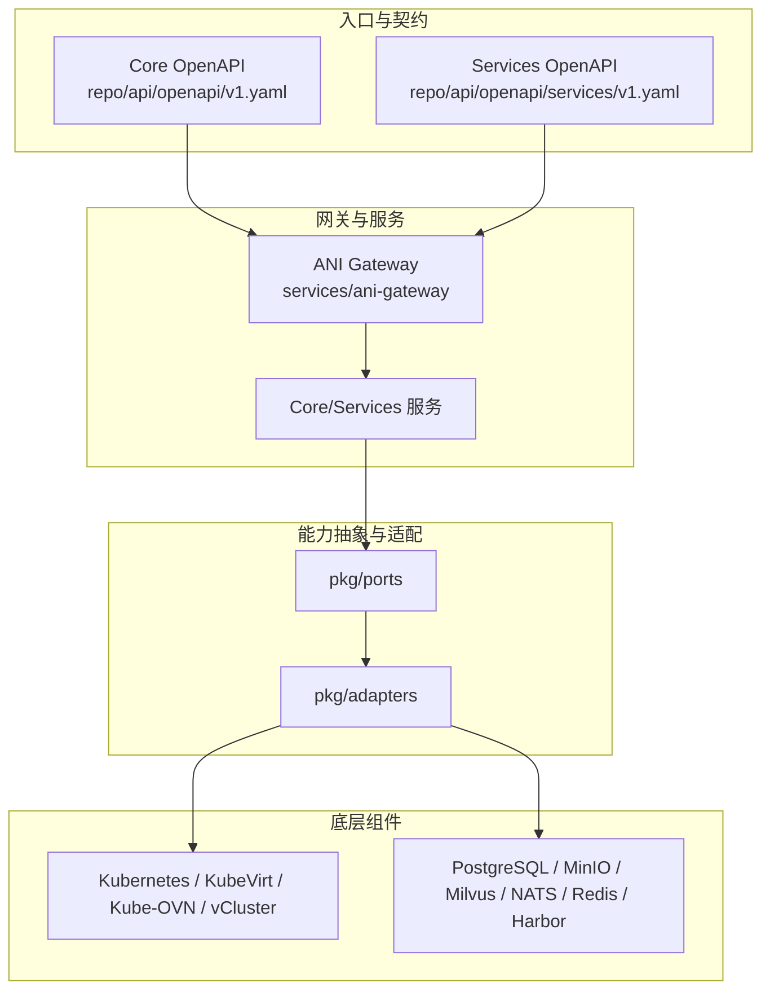
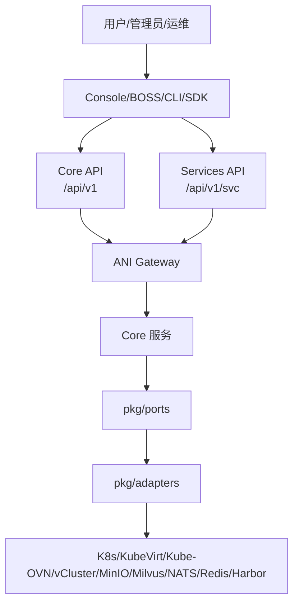
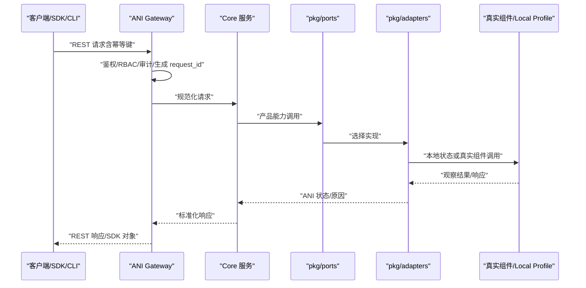
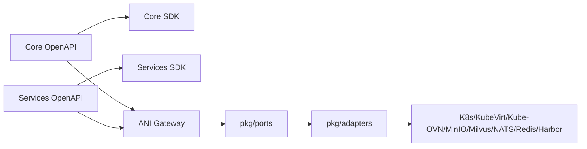

# 项目概述

<cite>
**本文引用的文件**
- [ANI-02-产品功能设计.md](file://ANI-02-产品功能设计.md)
- [ANI-05-系统架构设计.md](file://ANI-05-系统架构设计.md)
- [repo/README.md](file://repo/README.md)
- [repo/services/README.md](file://repo/services/README.md)
- [repo/api/openapi/v1.yaml](file://repo/api/openapi/v1.yaml)
- [repo/deploy/docker/README.md](file://repo/deploy/docker/README.md)
- [repo/deploy/helm/ani-platform/README.md](file://repo/deploy/helm/ani-platform/README.md)
- [repo/services/ani-gateway/main.go](file://repo/services/ani-gateway/main.go)
- [repo/cli/ani/main.go](file://repo/cli/ani/main.go)
</cite>

## 目录
1. [简介](#简介)
2. [项目结构](#项目结构)
3. [核心组件](#核心组件)
4. [架构总览](#架构总览)
5. [详细组件分析](#详细组件分析)
6. [依赖关系分析](#依赖关系分析)
7. [性能与可靠性考量](#性能与可靠性考量)
8. [故障排查指南](#故障排查指南)
9. [结论](#结论)
10. [附录：快速开始](#附录快速开始)

## 简介
KuberCloud ANI 是面向企业级 AI 专有云的平台，提供“基础设施平台层（ANI Core）+ 云服务与编排层（ANI Services）”的两层架构。Core 通过稳定的 OpenAPI REST 契约、SDK 和 CLI 暴露计算、存储、网络、身份安全、可观测等基础设施能力；Services 基于这些能力构建 IaaS、PaaS、AI 全生命周期与 AI-Native 应用服务，并通过统一的 Gateway 对外暴露 API。

核心价值主张
- 以原生 Kubernetes 为底座，慎重封装开源组件，强调编排而非重造。
- API-First 的跨层契约，确保 Core 与 Services 解耦、可演进。
- 多租户隔离与安全合规（RBAC、RLS、审计、国密加解密）。
- 面向 AI 的全栈能力：模型仓库、训练/微调/评估、推理部署、知识库 RAG、Agent/MCP 等。
- 开发者友好工具链：CLI、SDK（Go/Python/TypeScript/Java）、Console/BOSS、Helm/Docker 本地开发。

目标用户与场景
- 开发者：通过 SDK/CLI/Console 创建实例、管理资源、调用推理 API、使用知识库问答。
- 运维人员：安装部署、集群与节点池管理、网络/存储/镜像仓库配置、监控告警与审计。
- 平台管理员：租户配额、计量计费、平台健康大盘、白牌化运营。

## 项目结构
仓库采用 monorepo 组织，核心目录职责如下：
- services：Go 服务（Gateway、认证、任务、模型/知识库等 Services 暂存实现）
- ai：Services 早期原型与未来方向（RAG、文档解析、语音转写）
- operators：K8s Operator（推理服务 CRD 控制器等）
- frontends：前端（Console/BOSS）
- cli：命令行工具 ani
- installer：安装程序
- api：OpenAPI 契约与内部 gRPC proto
- pkg：产品能力抽象（ports）与默认适配器（adapters）
- sdks：Core/Services 四语言 SDK
- deploy：Helm Chart 与 Docker 本地环境

图表来源
- [repo/api/openapi/v1.yaml:1-20](file://repo/api/openapi/v1.yaml#L1-L20)
- [repo/services/ani-gateway/main.go:20-200](file://repo/services/ani-gateway/main.go#L20-L200)

章节来源
- [repo/README.md:18-67](file://repo/README.md#L18-L67)
- [repo/services/README.md:1-20](file://repo/services/README.md#L1-L20)

## 核心组件
- ANI Gateway：统一 HTTP 入口，承载认证、RBAC、审计、路由、错误标准化，并装配各运行时能力（实例、网络、存储、向量库、加密、密钥、GPU 库存、可观测等）。
- Core 服务：实现基础设施控制面（实例、网络、存储、K8s 集群、加密、Secret、Auth、计量等），通过 ports/adapters 对接真实组件或 local profile。
- Services：IaaS/PaaS/AI 全生命周期/AI-Native 应用服务，通过 Core OpenAPI/SDK 组合能力，不直接操作底层组件。
- CLI/SDK：从 Core OpenAPI 生成的多语言 SDK 与 CLI，覆盖 Core 资源的核心操作。
- 安装与部署：Helm Chart 与 Docker Compose 支持本地开发与生产部署。

章节来源
- [ANI-05-系统架构设计.md:79-151](file://ANI-05-系统架构设计.md#L79-L151)
- [repo/services/ani-gateway/main.go:20-200](file://repo/services/ani-gateway/main.go#L20-L200)
- [repo/cli/ani/main.go:17-157](file://repo/cli/ani/main.go#L17-L157)

## 架构总览
ANI 采用两层架构与严格的边界约束：
- 跨层控制面契约：Core OpenAPI REST + Core SDK；Services 只能通过该契约使用 Core 能力。
- 分层职责：Core 负责基础设施能力；Services 负责云服务、人机交互与编排。
- 真实底座：原生 Kubernetes 及谨慎选择的开源组件，通过 adapter/controller/provider 封装。

图表来源
- [ANI-05-系统架构设计.md:79-151](file://ANI-05-系统架构设计.md#L79-L151)

章节来源
- [ANI-02-产品功能设计.md:10-83](file://ANI-02-产品功能设计.md#L10-L83)
- [ANI-05-系统架构设计.md:154-203](file://ANI-05-系统架构设计.md#L154-L203)

## 详细组件分析

### ANI Gateway（统一入口与路由）
- 启动时装配各类运行时能力：K8s 集群代理、加密、密钥、GPU 库存、网络、存储、镜像仓库、向量库、实例可观测性等。
- 注册中间件与路由，将请求分发到 Core/Services handler。
- 通过环境变量驱动 provider 选择与连接参数。

图表来源
- [ANI-05-系统架构设计.md:305-326](file://ANI-05-系统架构设计.md#L305-L326)
- [repo/services/ani-gateway/main.go:20-200](file://repo/services/ani-gateway/main.go#L20-L200)

章节来源
- [repo/services/ani-gateway/main.go:20-200](file://repo/services/ani-gateway/main.go#L20-L200)

### Core OpenAPI 契约（唯一真实来源）
- 定义 Core 基础设施资源的 REST API、Schema、认证方式、错误格式、分页与异步操作语义。
- 明确 URL 前缀、版本策略与 SDK 生成规则。
- 当前范围包含实例、网络、存储、向量库、加密、密钥、GPU 库存、计量、可观测、审计等。

章节来源
- [repo/api/openapi/v1.yaml:1-39](file://repo/api/openapi/v1.yaml#L1-L39)

### CLI（ani 命令行）
- 默认基础地址与 Token 注入，支持版本输出。
- 解析命令并映射到 Core 资源路径（instances、networks、volumes、objects、vector-stores、k8s-clusters、secrets、registry、observability、metering 等）。
- 对 Services 资源进行限制，避免误用。

章节来源
- [repo/cli/ani/main.go:17-157](file://repo/cli/ani/main.go#L17-L157)

### Services 工作区与边界
- Services 文档与规划位于 repo/services，OpenAPI 是唯一权威源。
- 当前首批 Services API 切片包括模型、推理、知识库等，后续按 Phase3 扩展。
- 严格禁止 Services 直接 import Core 内部包或直接调用底层组件 SDK。

章节来源
- [repo/services/README.md:1-20](file://repo/services/README.md#L1-L20)
- [ANI-05-系统架构设计.md:176-203](file://ANI-05-系统架构设计.md#L176-L203)

### 安装与部署（Helm 与 Docker）
- Helm Chart 作为控制面入口，声明共享基础设施依赖与服务镜像端口，支持 dev/attach-k8s/offline 等 profile。
- Docker Compose 提供本地开发环境（PostgreSQL、MinIO、NATS、Redis、Milvus 等），并提供 Dex OIDC 测试与验证脚本。

章节来源
- [repo/deploy/helm/ani-platform/README.md:1-19](file://repo/deploy/helm/ani-platform/README.md#L1-L19)
- [repo/deploy/docker/README.md:1-77](file://repo/deploy/docker/README.md#L1-L77)

## 依赖关系分析
- 契约依赖：Core OpenAPI 与 Services OpenAPI 分别维护，SDK/文档/Gateway 路由均来源于对应 spec。
- 运行时依赖：Gateway 在启动时根据环境变量装配各 provider（实例、网络、存储、向量库、加密、密钥、GPU 库存、可观测等）。
- 组件解耦：通过 ports/adapters 将产品能力与具体实现分离，便于替换与演进。

图表来源
- [repo/api/openapi/v1.yaml:1-39](file://repo/api/openapi/v1.yaml#L1-L39)
- [repo/services/ani-gateway/main.go:20-200](file://repo/services/ani-gateway/main.go#L20-L200)

章节来源
- [ANI-05-系统架构设计.md:207-279](file://ANI-05-系统架构设计.md#L207-L279)

## 性能与可靠性考量
- 幂等性：所有创建与有副作用操作需支持 idempotency_key，避免重复提交导致的状态不一致。
- 审计与追踪：关键变更具备 request_id、operation_id 或 timeline，便于问题定位与合规审计。
- 可观测性：real-provider 阶段必须补指标、事件、日志与失败原因，支撑容量与稳定性验证。
- 兼容性：Core API v1 使用兼容性基线阻止破坏性变更，保障上下游稳定集成。
- 真实验证：涉及底座组件的能力需通过真实环境门禁，确保端到端可用。

章节来源
- [ANI-05-系统架构设计.md:372-383](file://ANI-05-系统架构设计.md#L372-L383)

## 故障排查指南
- 本地依赖就绪检查：使用 make deps-status 确认 PostgreSQL、MinIO、NATS、Redis、Milvus 等服务是否就绪。
- OIDC 登录验收：执行 make validate-auth-dex-smoke 验证 discovery、JWKS、用户名密码登录、授权码回调与 token endpoint。
- 环境变量配置：复制 .env.example 为 .env 并按注释修改后重启服务；Gateway 与各服务的运行参数由环境变量驱动。
- 停止与清理：make deps-down 停止服务保留数据卷；make deps-clean 停止并删除所有数据（危险）。

章节来源
- [repo/deploy/docker/README.md:1-77](file://repo/deploy/docker/README.md#L1-L77)

## 结论
ANI 通过清晰的 Core/Services 分层、API-First 契约与 ports/adapters 解耦，构建了可扩展、可演进的企业级 AI 专有云平台。它以原生 Kubernetes 为基础，结合成熟的开源组件，提供 IaaS、PaaS、AI 全生命周期与 AI-Native 应用服务能力，并通过 CLI/SDK/Console 提升开发者体验。配合 Helm/Docker 的安装部署与完善的门禁验证，满足生产级可用性、可观测性与安全性要求。

## 附录：快速开始
- 环境要求
  - Docker Desktop 4.x+ 或 Docker Engine 24+（含 Compose V2）
  - 内存 ≥ 8GB（Milvus 占用较高）
  - 磁盘空间 ≥ 20GB

- 安装步骤
  - 进入仓库根目录，执行 make deps 启动所有依赖服务
  - 使用 make deps-status 验证服务就绪
  - 可选：启动 Milvus Attu（Web UI）与 Dex（OIDC 认证）

- 基本使用示例
  - CLI：设置 ANI_BASE_URL 与 ANI_TOKEN，调用 ani instances list 等资源命令
  - SDK：从 Core OpenAPI 生成 Go/Python/TypeScript/Java SDK，调用 /api/v1 资源接口
  - Console/BOSS：通过浏览器访问控制台，完成实例、网络、存储等资源的管理

章节来源
- [repo/deploy/docker/README.md:1-77](file://repo/deploy/docker/README.md#L1-L77)
- [repo/cli/ani/main.go:17-157](file://repo/cli/ani/main.go#L17-L157)
- [repo/api/openapi/v1.yaml:1-39](file://repo/api/openapi/v1.yaml#L1-L39)